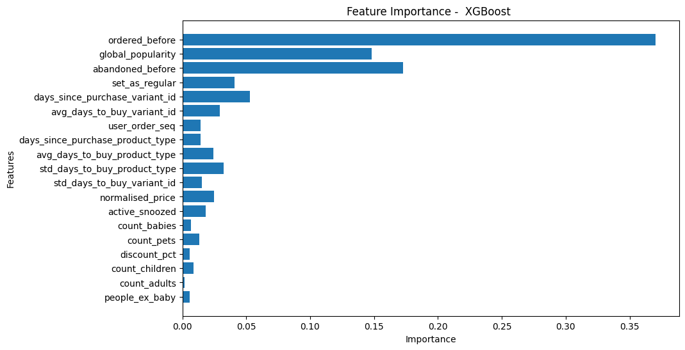

```python
!brew install libomp
!poetry add xgboost
```

    ==> Auto-updating Homebrew...
    Adjust how often this is run with HOMEBREW_AUTO_UPDATE_SECS or disable with
    HOMEBREW_NO_AUTO_UPDATE. Hide these hints with HOMEBREW_NO_ENV_HINTS (see `man brew`).
    ==> Homebrew collects anonymous analytics.
    Read the analytics documentation (and how to opt-out) here:
      https://docs.brew.sh/Analytics
    No analytics have been recorded yet (nor will be during this `brew` run).
    
    ==> Homebrew is run entirely by unpaid volunteers. Please consider donating:
      https://github.com/Homebrew/brew#donations
    
    ==> Auto-updated Homebrew!
    Updated 2 taps (homebrew/core and homebrew/cask).
    ==> New Formulae
    ad                  ggh                 libpostal-rest      sql-formatter
    adapterremoval      git-mob             mac                 symfony-cli
    arelo               go@1.23             md2pdf              threatcl
    bacon-ls            gomi                mummer              vfkit
    bagels              hcledit             nping               yamlfix
    bazel@7             identme             ramalama            yices2
    cfnctl              jupytext            ratarmount          yor
    code2prompt         keeper-commander    reuse               zimfw
    comrak              koji                rink
    feluda              lazyjj              rustywind
    gauth               libpostal           sby
    ==> New Casks
    autogram                                 mitti
    badgeify                                 open-eid
    browser-actions                          oracle-jdk-javadoc@21
    font-big-shoulders                       pinwheel
    font-big-shoulders-inline                precize
    font-big-shoulders-stencil               structuredlogviewer
    font-comic-relief                        thumbhost3mf
    kunkun                                   ui-tars
    losslessswitcher                         vezer
    luanti
    
    You have 4 outdated formulae installed.
    
    ==> Downloading https://ghcr.io/v2/homebrew/core/libomp/manifests/19.1.7
    ######################################################################### 100.0%
    ==> Fetching libomp
    ==> Downloading https://ghcr.io/v2/homebrew/core/libomp/blobs/sha256:f80484105bc
    ######################################################################### 100.0%
    ==> Pouring libomp--19.1.7.arm64_sequoia.bottle.tar.gz
    ==> Caveats
    libomp is keg-only, which means it was not symlinked into /opt/homebrew,
    because it can override GCC headers and result in broken builds.
    
    For compilers to find libomp you may need to set:
      export LDFLAGS="-L/opt/homebrew/opt/libomp/lib"
      export CPPFLAGS="-I/opt/homebrew/opt/libomp/include"
    ==> Summary
    🍺  /opt/homebrew/Cellar/libomp/19.1.7: 9 files, 1.7MB
    ==> Running `brew cleanup libomp`...
    Disable this behaviour by setting HOMEBREW_NO_INSTALL_CLEANUP.
    Hide these hints with HOMEBREW_NO_ENV_HINTS (see `man brew`).
    Using version ^2.1.4 for xgboost
    
    Updating dependencies
    Resolving dependencies... (0.3s)
    
    Package operations: 1 install, 0 updates, 0 removals
    
      - Installing xgboost (2.1.4): Pending...
      - Installing xgboost (2.1.4): Installing...
      - Installing xgboost (2.1.4)
    
    Writing lock file


```python
import pandas as pd
import numpy as np
import matplotlib.pyplot as plt
import seaborn as sns
import matplotlib
from typing import Tuple

from sklearn.pipeline import make_pipeline
from sklearn.metrics import precision_recall_curve, roc_curve, roc_auc_score, auc
from sklearn.preprocessing import StandardScaler
from sklearn.linear_model import LogisticRegression
from sklearn.tree import DecisionTreeClassifier
from sklearn.ensemble import RandomForestClassifier, GradientBoostingClassifier
from sklearn.model_selection import GridSearchCV, RandomizedSearchCV
from sklearn.compose import ColumnTransformer
from sklearn.preprocessing import OneHotEncoder, OrdinalEncoder, TargetEncoder
import xgboost as xgb
from sklearn.calibration import calibration_curve
```

```python
data_path = '../../aws/data/feature_frame.csv'
df = pd.read_csv(data_path)
```

```python
df.head()
```


<div>
<style scoped>
    .dataframe tbody tr th:only-of-type {
        vertical-align: middle;
    }

    .dataframe tbody tr th {
        vertical-align: top;
    }

    .dataframe thead th {
        text-align: right;
    }
</style>
<table border="1" class="dataframe">
  <thead>
    <tr style="text-align: right;">
      <th></th>
      <th>variant_id</th>
      <th>product_type</th>
      <th>order_id</th>
      <th>user_id</th>
      <th>created_at</th>
      <th>order_date</th>
      <th>user_order_seq</th>
      <th>outcome</th>
      <th>ordered_before</th>
      <th>abandoned_before</th>
      <th>...</th>
      <th>count_children</th>
      <th>count_babies</th>
      <th>count_pets</th>
      <th>people_ex_baby</th>
      <th>days_since_purchase_variant_id</th>
      <th>avg_days_to_buy_variant_id</th>
      <th>std_days_to_buy_variant_id</th>
      <th>days_since_purchase_product_type</th>
      <th>avg_days_to_buy_product_type</th>
      <th>std_days_to_buy_product_type</th>
    </tr>
  </thead>
  <tbody>
    <tr>
      <th>0</th>
      <td>33826472919172</td>
      <td>ricepastapulses</td>
      <td>2807985930372</td>
      <td>3482464092292</td>
      <td>2020-10-05 16:46:19</td>
      <td>2020-10-05 00:00:00</td>
      <td>3</td>
      <td>0.0</td>
      <td>0.0</td>
      <td>0.0</td>
      <td>...</td>
      <td>0.0</td>
      <td>0.0</td>
      <td>0.0</td>
      <td>2.0</td>
      <td>33.0</td>
      <td>42.0</td>
      <td>31.134053</td>
      <td>30.0</td>
      <td>30.0</td>
      <td>24.27618</td>
    </tr>
    <tr>
      <th>1</th>
      <td>33826472919172</td>
      <td>ricepastapulses</td>
      <td>2808027644036</td>
      <td>3466586718340</td>
      <td>2020-10-05 17:59:51</td>
      <td>2020-10-05 00:00:00</td>
      <td>2</td>
      <td>0.0</td>
      <td>0.0</td>
      <td>0.0</td>
      <td>...</td>
      <td>0.0</td>
      <td>0.0</td>
      <td>0.0</td>
      <td>2.0</td>
      <td>33.0</td>
      <td>42.0</td>
      <td>31.134053</td>
      <td>30.0</td>
      <td>30.0</td>
      <td>24.27618</td>
    </tr>
    <tr>
      <th>2</th>
      <td>33826472919172</td>
      <td>ricepastapulses</td>
      <td>2808099078276</td>
      <td>3481384026244</td>
      <td>2020-10-05 20:08:53</td>
      <td>2020-10-05 00:00:00</td>
      <td>4</td>
      <td>0.0</td>
      <td>0.0</td>
      <td>0.0</td>
      <td>...</td>
      <td>0.0</td>
      <td>0.0</td>
      <td>0.0</td>
      <td>2.0</td>
      <td>33.0</td>
      <td>42.0</td>
      <td>31.134053</td>
      <td>30.0</td>
      <td>30.0</td>
      <td>24.27618</td>
    </tr>
    <tr>
      <th>3</th>
      <td>33826472919172</td>
      <td>ricepastapulses</td>
      <td>2808393957508</td>
      <td>3291363377284</td>
      <td>2020-10-06 08:57:59</td>
      <td>2020-10-06 00:00:00</td>
      <td>2</td>
      <td>0.0</td>
      <td>0.0</td>
      <td>0.0</td>
      <td>...</td>
      <td>0.0</td>
      <td>0.0</td>
      <td>0.0</td>
      <td>2.0</td>
      <td>33.0</td>
      <td>42.0</td>
      <td>31.134053</td>
      <td>30.0</td>
      <td>30.0</td>
      <td>24.27618</td>
    </tr>
    <tr>
      <th>4</th>
      <td>33826472919172</td>
      <td>ricepastapulses</td>
      <td>2808429314180</td>
      <td>3537167515780</td>
      <td>2020-10-06 10:37:05</td>
      <td>2020-10-06 00:00:00</td>
      <td>3</td>
      <td>0.0</td>
      <td>0.0</td>
      <td>0.0</td>
      <td>...</td>
      <td>0.0</td>
      <td>0.0</td>
      <td>0.0</td>
      <td>2.0</td>
      <td>33.0</td>
      <td>42.0</td>
      <td>31.134053</td>
      <td>30.0</td>
      <td>30.0</td>
      <td>24.27618</td>
    </tr>
  </tbody>
</table>
<p>5 rows × 27 columns</p>
</div>


```python
df.info()
```

    <class 'pandas.core.frame.DataFrame'>
    RangeIndex: 2880549 entries, 0 to 2880548
    Data columns (total 27 columns):
     #   Column                            Dtype  
    ---  ------                            -----  
     0   variant_id                        int64  
     1   product_type                      object 
     2   order_id                          int64  
     3   user_id                           int64  
     4   created_at                        object 
     5   order_date                        object 
     6   user_order_seq                    int64  
     7   outcome                           float64
     8   ordered_before                    float64
     9   abandoned_before                  float64
     10  active_snoozed                    float64
     11  set_as_regular                    float64
     12  normalised_price                  float64
     13  discount_pct                      float64
     14  vendor                            object 
     15  global_popularity                 float64
     16  count_adults                      float64
     17  count_children                    float64
     18  count_babies                      float64
     19  count_pets                        float64
     20  people_ex_baby                    float64
     21  days_since_purchase_variant_id    float64
     22  avg_days_to_buy_variant_id        float64
     23  std_days_to_buy_variant_id        float64
     24  days_since_purchase_product_type  float64
     25  avg_days_to_buy_product_type      float64
     26  std_days_to_buy_product_type      float64
    dtypes: float64(19), int64(4), object(4)
    memory usage: 593.4+ MB


```python
info_cols = ['variant_id', 'order_id', 'user_id', 'created_at', 'order_date']
label_col = 'outcome'
feature_cols = [col for col in df.columns if col not in info_cols + [label_col]]

categorical_cols = ['product_type', 'vendor']
binary_cols = ['ordered_before', 'abandoned_before', 'active_snoozed', 'set_as_regular']
numerical_cols = [col for col in feature_cols if col not in categorical_cols + binary_cols]
```

```python
#quedarnos solo con 5 ordenes de 5 o mas productos
def push_relevant_dataframe(df: pd.DataFrame, min_products: int = 5 ) -> pd.DataFrame:
    """We are only interested in big enough orders that are profitable"""
    order_size = df.groupby("order_id").outcome.sum()
    orders_of_min_size = order_size[order_size >= min_products].index
    return df.loc[lambda x: x.order_id.isin(orders_of_min_size)]


df_selected = (
    df.pipe(push_relevant_dataframe)
    .assign(created_at=lambda x: pd.to_datetime(x.created_at))
    .assign(order_date=lambda x: pd.to_datetime(x.order_date).dt.date)
)
```

```python
df_selected.head()
```


<div>
<style scoped>
    .dataframe tbody tr th:only-of-type {
        vertical-align: middle;
    }

    .dataframe tbody tr th {
        vertical-align: top;
    }

    .dataframe thead th {
        text-align: right;
    }
</style>
<table border="1" class="dataframe">
  <thead>
    <tr style="text-align: right;">
      <th></th>
      <th>variant_id</th>
      <th>product_type</th>
      <th>order_id</th>
      <th>user_id</th>
      <th>created_at</th>
      <th>order_date</th>
      <th>user_order_seq</th>
      <th>outcome</th>
      <th>ordered_before</th>
      <th>abandoned_before</th>
      <th>...</th>
      <th>count_children</th>
      <th>count_babies</th>
      <th>count_pets</th>
      <th>people_ex_baby</th>
      <th>days_since_purchase_variant_id</th>
      <th>avg_days_to_buy_variant_id</th>
      <th>std_days_to_buy_variant_id</th>
      <th>days_since_purchase_product_type</th>
      <th>avg_days_to_buy_product_type</th>
      <th>std_days_to_buy_product_type</th>
    </tr>
  </thead>
  <tbody>
    <tr>
      <th>0</th>
      <td>33826472919172</td>
      <td>ricepastapulses</td>
      <td>2807985930372</td>
      <td>3482464092292</td>
      <td>2020-10-05 16:46:19</td>
      <td>2020-10-05</td>
      <td>3</td>
      <td>0.0</td>
      <td>0.0</td>
      <td>0.0</td>
      <td>...</td>
      <td>0.0</td>
      <td>0.0</td>
      <td>0.0</td>
      <td>2.0</td>
      <td>33.0</td>
      <td>42.0</td>
      <td>31.134053</td>
      <td>30.0</td>
      <td>30.0</td>
      <td>24.27618</td>
    </tr>
    <tr>
      <th>1</th>
      <td>33826472919172</td>
      <td>ricepastapulses</td>
      <td>2808027644036</td>
      <td>3466586718340</td>
      <td>2020-10-05 17:59:51</td>
      <td>2020-10-05</td>
      <td>2</td>
      <td>0.0</td>
      <td>0.0</td>
      <td>0.0</td>
      <td>...</td>
      <td>0.0</td>
      <td>0.0</td>
      <td>0.0</td>
      <td>2.0</td>
      <td>33.0</td>
      <td>42.0</td>
      <td>31.134053</td>
      <td>30.0</td>
      <td>30.0</td>
      <td>24.27618</td>
    </tr>
    <tr>
      <th>2</th>
      <td>33826472919172</td>
      <td>ricepastapulses</td>
      <td>2808099078276</td>
      <td>3481384026244</td>
      <td>2020-10-05 20:08:53</td>
      <td>2020-10-05</td>
      <td>4</td>
      <td>0.0</td>
      <td>0.0</td>
      <td>0.0</td>
      <td>...</td>
      <td>0.0</td>
      <td>0.0</td>
      <td>0.0</td>
      <td>2.0</td>
      <td>33.0</td>
      <td>42.0</td>
      <td>31.134053</td>
      <td>30.0</td>
      <td>30.0</td>
      <td>24.27618</td>
    </tr>
    <tr>
      <th>3</th>
      <td>33826472919172</td>
      <td>ricepastapulses</td>
      <td>2808393957508</td>
      <td>3291363377284</td>
      <td>2020-10-06 08:57:59</td>
      <td>2020-10-06</td>
      <td>2</td>
      <td>0.0</td>
      <td>0.0</td>
      <td>0.0</td>
      <td>...</td>
      <td>0.0</td>
      <td>0.0</td>
      <td>0.0</td>
      <td>2.0</td>
      <td>33.0</td>
      <td>42.0</td>
      <td>31.134053</td>
      <td>30.0</td>
      <td>30.0</td>
      <td>24.27618</td>
    </tr>
    <tr>
      <th>5</th>
      <td>33826472919172</td>
      <td>ricepastapulses</td>
      <td>2808434524292</td>
      <td>3479090790532</td>
      <td>2020-10-06 10:50:23</td>
      <td>2020-10-06</td>
      <td>3</td>
      <td>0.0</td>
      <td>0.0</td>
      <td>0.0</td>
      <td>...</td>
      <td>0.0</td>
      <td>0.0</td>
      <td>0.0</td>
      <td>2.0</td>
      <td>33.0</td>
      <td>42.0</td>
      <td>31.134053</td>
      <td>30.0</td>
      <td>30.0</td>
      <td>24.27618</td>
    </tr>
  </tbody>
</table>
<p>5 rows × 27 columns</p>
</div>


```python
df.order_id.nunique() > df_selected.order_id.nunique()
```


    True


Vamos a asegurarnos de que las ordenes no estan divididas en train y validación (la orden entera tiene que estar o en train o validación). 

Además, vamos a hacer temporal split.

```python
daily_orders = df_selected.groupby('order_date').order_id.nunique()
```

```python
daily_orders.head()
```


    order_date
    2020-10-05     3
    2020-10-06     7
    2020-10-07     6
    2020-10-08    12
    2020-10-09     4
    Name: order_id, dtype: int64


```python
cumsum_daily_orders = daily_orders.cumsum() / daily_orders.sum()

train_val_cutoff = cumsum_daily_orders[cumsum_daily_orders <= 0.7].idxmax()
val_test_cutoff = cumsum_daily_orders[cumsum_daily_orders <= 0.9].idxmax()

print("Train since:", cumsum_daily_orders.index.min())
print("Train until:", train_val_cutoff)
print("Val until:", val_test_cutoff)
print("Test until:", cumsum_daily_orders.index.max())
```

    Train since: 2020-10-05
    Train until: 2021-02-04
    Val until: 2021-02-22
    Test until: 2021-03-03


```python
train_df = df_selected[df_selected.order_date <= train_val_cutoff]
val_df = df_selected[
    (df_selected.order_date >= train_val_cutoff)
    & (df_selected.order_date <= val_test_cutoff)
]
test_df = df_selected[df_selected.order_date > val_test_cutoff]
```

## Baseline

Como ya hemos entrenado un modelo lineal en el anterior modulo que mejora el baseline inicial, vamos a definir el modelo lineal con 4 features como baseline 

```python
def plot_metrics(
        model_name: str,
        y_pred: pd.Series,
        y_test: pd.Series,
        figure: Tuple[matplotlib.figure.Figure, np.array] = None
):
    precision_, recall_, _ = precision_recall_curve(y_test, y_pred)
    pr_auc = auc(recall_, precision_)

    fpr, tpr, _ = roc_curve(y_test, y_pred)
    roc_auc = roc_auc_score(y_test, y_pred)

    if figure is None:
        fig, ax = plt.subplots(1, 2, figsize=(14, 7))
    else:
        fig, ax = figure
        
        
    ax[0].plot(recall_, precision_, label=f"{model_name}; AUC: {pr_auc:.2f}")
    ax[0].set_xlabel("recall")
    ax[0].set_ylabel("precision")
    ax[0].set_title(f"Precision-recall curve")
    ax[0].legend()

    ax[1].plot(fpr, tpr, label=f"AUC: {roc_auc:.2f}")
    ax[1].set_xlabel("FPR")
    ax[1].set_ylabel("TPR")
    ax[1].set_title(f"ROC curve")
    ax[1].legend()
    
```

```python
def feature_label_split(df: pd.DataFrame, label_col: str) -> Tuple[pd.DataFrame, pd.Series]:
    return df.drop(label_col, axis=1), df[label_col]

X_train, y_train = feature_label_split(train_df, label_col)
X_val, y_val = feature_label_split(val_df, label_col)
X_test, y_test = feature_label_split(test_df, label_col)
```

```python
reduced_cols = ["ordered_before", "abandoned_before", "global_popularity"]

fig1, ax1 = plt.subplots(1,2, figsize=(14,7))
fig1.suptitle("Baseline")

lr =make_pipeline(StandardScaler(), LogisticRegression(penalty="l2", C=1e-6))

lr.fit(X_train[reduced_cols], y_train)
lr_train_proba = lr.predict_proba(X_train[reduced_cols])[:, 1]

lr.fit(X_val[reduced_cols], y_val)
lr_val_proba = lr.predict_proba(X_val[reduced_cols])[:, 1]

plot_metrics(
    "Baseline train", y_pred=lr_train_proba, y_test= train_df[label_col], figure=(fig1, ax1)
)
```


    

    


# Decision trees

Una vez definido el baseline, voy a empezar con decision trees con todas las features (menos categoricas).

```python
train_cols = numerical_cols + binary_cols
```

```python
fig1, ax1 = plt.subplots(1, 2, figsize=(14,7))
fig1.suptitle("Train metrics")

fig2, ax2, = plt.subplots(1, 2, figsize=(14,7))
fig2.suptitle("Validation metrics")


max_depth = [3, 5, 6, 7, 8, 12]
for m_d in max_depth:
    dt = make_pipeline(
        DecisionTreeClassifier(max_depth=m_d)
    )
    dt.fit(X_train[train_cols], y_train)
    dt_train_proba = dt.predict_proba(X_train[train_cols])[:, 1]
    plot_metrics(
        f"Decision tree; max depth={m_d}", y_pred=dt_train_proba, y_test=train_df[label_col], figure=(fig1,ax1)
    )

    dt_val_proba = dt.predict_proba(X_val[train_cols])[:, 1]
    plot_metrics(
        f"Decision tree; max depth={m_d}", y_pred=dt_val_proba, y_test=val_df[label_col], figure=(fig2,ax2)
    )


plot_metrics(
    "Baseline train", y_pred=lr_train_proba, y_test= train_df[label_col], figure=(fig1, ax1)
)

plot_metrics(
    "Baseline val", y_pred=lr_val_proba, y_test= val_df[label_col], figure=(fig2, ax2)
)


```


    

    


    

    


Arboles con poca profundidad en vez de presentar una curva presentan "segmentos rectos", esto se debe a la naturaleza de los arboles de decisión, ya que generan predicciones discretas en vez de continuas, al cambiar el umbral para calcular las curvas, muchos puntos se actualizan a la vez, lo que genera estos segmentos (?)

Arboles con mucha profundidad hacen mucho overfit.

Un punto medio es lo recomendado en este caso, profundidad 6

```python
fig1, ax1 = plt.subplots(1, 2, figsize=(14,7))
fig1.suptitle("Train metrics")

fig2, ax2, = plt.subplots(1, 2, figsize=(14,7))
fig2.suptitle("Validation metrics")

selected_max_depth = 6

selected_dt = make_pipeline(
    DecisionTreeClassifier(max_depth=selected_max_depth)
)
selected_dt.fit(X_train[train_cols], y_train)
dt_train_proba = selected_dt.predict_proba(X_train[train_cols])[:, 1]
plot_metrics(
    f"Decision tree; max depth={selected_max_depth}", y_pred=dt_train_proba, y_test=train_df[label_col], figure=(fig1,ax1)
)

dt_val_proba = selected_dt.predict_proba(X_val[train_cols])[:, 1]
plot_metrics(
    f"Decision tree; max depth={selected_max_depth}", y_pred=dt_val_proba, y_test=val_df[label_col], figure=(fig2,ax2)
)

plot_metrics(
    "Baseline train", y_pred=lr_train_proba, y_test= train_df[label_col], figure=(fig1, ax1)
)
plot_metrics(
    "Baseline val", y_pred=lr_val_proba, y_test= val_df[label_col], figure=(fig2, ax2)
)
```


    

    


    

    


Vamos a incluir ahora las variables categoricas

```python
extended_cols = train_cols + categorical_cols

categorical_preprocessors = [
    ("drop", "drop"),
    ("ordinal", OrdinalEncoder(handle_unknown="use_encoded_value", unknown_value=-1)),
    ("one_hot", OneHotEncoder(handle_unknown="ignore", max_categories=20, sparse_output=False),),
    ("target", TargetEncoder(target_type="continuous"))
]

fig1, ax1 = plt.subplots(1, 2, figsize=(14,7))
fig1.suptitle("Train metrics")

fig2, ax2 = plt.subplots(1, 2, figsize=(14,7))
fig2.suptitle("Validation metrics")


for name, categorical_preprocessor in categorical_preprocessors:
    preprocessor = ColumnTransformer(
        [
            ("numerical", "passthrough", train_cols),
            ("categorical", categorical_preprocessor, categorical_cols)
        ]
    )
    extended_dt = make_pipeline(
        preprocessor, DecisionTreeClassifier(max_depth=selected_max_depth)
    )

    extended_dt.fit(X_train[extended_cols], y_train)
    extended_dt_train_proba = extended_dt.predict_proba(X_train[extended_cols])[:, 1]
    plot_metrics(
        name, y_pred=extended_dt_train_proba, y_test=train_df[label_col], figure=(fig1, ax1)
    )

    extended_dt_val_proba = extended_dt.predict_proba(X_val[extended_cols])[:, 1]
    plot_metrics(name, y_pred=extended_dt_val_proba, y_test=val_df[label_col], figure=(fig2, ax2))
```


    

    


    

    


Me parece muy raro que los 4 metodos funcionen exactamente igual, fallo en codigo (?), creo que no.

Otra opción es que aporten tan poco valor que no afectan y por eso son iguales

# Random Forest

Primero quiero ver lo que comentabamos en clase de que debido a la naturaleza de Random Forest, el error en train puede ser 0 ya que construimos hasta el final cada arbol, y como cada muestra esta en aprox un 66% de los arboles, minimo un 66% de los arboles predicen bien cada muestra (error=0) y como es mayoria , el error del Ensemble va a ser 0.

Cada arbol se construya con profundidad máxima, ya que reduce el sesgo. Añadiendo arboles, reducimos la varianza, lo cual da lugar a un error con poco sesgo y poca varianza.


***Tengo una duda a la que he dado muchas vueltas y no consigo encontrar la respuesta***; Respecto a los threshold con los que calculamos las curvas:

¿Los threshold aplican a cada arbol individual o al ensemble? Me explico

Una forma que tengo de ver el threshold es a nivel de arbol, es decir que aplico el threshold para decidir cual es la decisión de mi arbol en cada hoja (en este caso, como construyo arboles hasta el final, da igual el threshold, ya que solo vamos a tener una muestra y la proporción va a ser o 100% o 0% y va a clasificar como 0 o 1 indiferentemente del umbral) 

Esto tiene sentido en mi cabeza, lo que pasa es que, lo que comentaba antes de que el error de entrenamiento puede ser 0 cuando entrenamos con profundidad maxima, lo que entendi en clase es que como minimo un 66% de los arboles predicen bien cada muestra, esto es mayoria y el Ensemble lo va a clasificar bien y el error es 0. Cuando decimos que es mayoria, es porque establecemos un threshold a 0.5 y por eso 0.66>0.5 . Ahi viene mi duda, este threshold del ensemble existe? En mi cabeza si deberia de existir, ya que si el resultado de un ensemble es que 6 arboles predicen clase 1 y 4 arboles predicen clase 0, tengo P(1)=0.6 y p(0)=0.4 y si mi threshold del ensemble es 0.5 estoy clasificando esa muestra como 1 y si es 0.7 la clasifico como 0. De la misma forma, ese threshold del ensemble afetaria al 66%. En caso de que 66% de mis arboles clasifiquen bien y 34% restante clasifiquen mal y ponga mi threshold en 0.7, el ensemble no lo clasificaria bien y el error ya no seria 0?

¿Existe ese threshold del ensemble? En caso de existir, cuando calculamos curvas ROC, los threshold aplican tanto para cada arbol como para el ensemble? 

Es algo que me lia mucho, igual me estoy complicando pero me gustaria que me quedara claro, me dices con lo que opines!

```python
rf = RandomForestClassifier()

param_grid = {
    'n_estimators': [25, 50, 100, 200]
}

grid_search = GridSearchCV(
    estimator=rf,
    param_grid=param_grid,
    scoring='roc_auc',
    cv=3,
    verbose=2
)

grid_search.fit(X_train[train_cols], train_df[label_col])
```

```python
print("Mejores hiperparámetros:", grid_search.best_params_)
print("Mejor puntuación (AUC-ROC):", grid_search.best_score_)
```

    Mejores hiperparámetros: {'n_estimators': 50}
    Mejor puntuación (AUC-ROC): 0.41285675580268394


```python
from sklearn.metrics import roc_auc_score, average_precision_score


fig1, ax1 = plt.subplots(1, 2, figsize=(14,7))
fig1.suptitle("Train metrics")

fig2, ax2, = plt.subplots(1, 2, figsize=(14,7))
fig2.suptitle("Validation metrics")


n_est = 50

rf = make_pipeline(
    RandomForestClassifier(n_estimators= n_est)
)
rf.fit(X_train[train_cols], y_train)
rf_train_proba = rf.predict_proba(X_train[train_cols])[:, 1]
plot_metrics(
    f"Random Forest; estimators={n_est}", y_pred=rf_train_proba, y_test=train_df[label_col], figure=(fig1,ax1)
)

rf_val_proba = rf.predict_proba(X_val[train_cols])[:, 1]
plot_metrics(
    f"Random Forest; estimators={n_est}", y_pred=rf_val_proba, y_test=val_df[label_col], figure=(fig2,ax2)
)


plot_metrics(
    "Baseline train", y_pred=lr_train_proba, y_test= train_df[label_col], figure=(fig1, ax1)
)

plot_metrics(
    "Baseline val", y_pred=lr_val_proba, y_test= val_df[label_col], figure=(fig2, ax2)
)


roc_auc_train = roc_auc_score(train_df[label_col], rf_train_proba)
pr_auc_train = average_precision_score(train_df[label_col], rf_train_proba)
print(f"[Train] Random Forest (n_estimators={n_est}) -> ROC AUC: {roc_auc_train:.4f}, PR AUC: {pr_auc_train:.4f}")

roc_auc_val = roc_auc_score(val_df[label_col], rf_val_proba)
pr_auc_val = average_precision_score(val_df[label_col], rf_val_proba)
print(f"[Validation] Random Forest (n_estimators={n_est}) -> ROC AUC: {roc_auc_val:.4f}, PR AUC: {pr_auc_val:.4f}")
```

    [Train] Random Forest (n_estimators=50) -> ROC AUC: 0.9955, PR AUC: 0.8593
    [Validation] Random Forest (n_estimators=50) -> ROC AUC: 0.7490, PR AUC: 0.1507


    

    


    

    


Claramente es un modelo muy malo, pero que el baseline, pero sirve para entender como funciona Random Forest


La curva precision-recall si se ve ese threshold del ensemble que comentaba antes (?)

Y en la curva ROC se veria muy a la izquierda del eje x ( por eso en problemas desbalanceados decimos que la curva ROC no es tan util, porque aunque crezcan los FP, al haber tantisimas etiquetas =0, no nos vamos a desplazar a lo largo del eje x) (?)


-------------------

Voy a probar otro Random Forest, ahora controlando profundidad.

```python
rf = RandomForestClassifier()

param_grid = {
    'n_estimators': [50, 100, 300],
    'max_depth': [4, 7, None],
    'min_samples_split': [4, 8],
    'min_samples_leaf': [2, 4]
}

grid_search = GridSearchCV(
    estimator=rf,
    param_grid=param_grid,
    scoring='roc_auc',
    cv=3,
    verbose=2
)

grid_search.fit(X_train[train_cols], train_df[label_col])
```

    Fitting 3 folds for each of 36 candidates, totalling 108 fits
    [CV] END max_depth=4, min_samples_leaf=2, min_samples_split=4, n_estimators=50; total time=   8.0s
    [CV] END max_depth=4, min_samples_leaf=2, min_samples_split=4, n_estimators=50; total time=   8.5s
    [CV] END max_depth=4, min_samples_leaf=2, min_samples_split=4, n_estimators=50; total time=   8.4s
    [CV] END max_depth=4, min_samples_leaf=2, min_samples_split=4, n_estimators=100; total time=  15.6s
    [CV] END max_depth=4, min_samples_leaf=2, min_samples_split=4, n_estimators=100; total time=  16.1s
    [CV] END max_depth=4, min_samples_leaf=2, min_samples_split=4, n_estimators=100; total time=  16.9s
    [CV] END max_depth=4, min_samples_leaf=2, min_samples_split=4, n_estimators=300; total time=  47.3s
    [CV] END max_depth=4, min_samples_leaf=2, min_samples_split=4, n_estimators=300; total time=  48.3s
    [CV] END max_depth=4, min_samples_leaf=2, min_samples_split=4, n_estimators=300; total time=  50.0s
    [CV] END max_depth=4, min_samples_leaf=2, min_samples_split=8, n_estimators=50; total time=   8.3s
    [CV] END max_depth=4, min_samples_leaf=2, min_samples_split=8, n_estimators=50; total time=   7.8s
    [CV] END max_depth=4, min_samples_leaf=2, min_samples_split=8, n_estimators=50; total time=   8.3s
    [CV] END max_depth=4, min_samples_leaf=2, min_samples_split=8, n_estimators=100; total time=  15.4s
    [CV] END max_depth=4, min_samples_leaf=2, min_samples_split=8, n_estimators=100; total time=  15.9s
    [CV] END max_depth=4, min_samples_leaf=2, min_samples_split=8, n_estimators=100; total time=  18.1s
    [CV] END max_depth=4, min_samples_leaf=2, min_samples_split=8, n_estimators=300; total time=  47.8s
    [CV] END max_depth=4, min_samples_leaf=2, min_samples_split=8, n_estimators=300; total time=  48.2s
    [CV] END max_depth=4, min_samples_leaf=2, min_samples_split=8, n_estimators=300; total time=  50.0s
    [CV] END max_depth=4, min_samples_leaf=4, min_samples_split=4, n_estimators=50; total time=   8.3s
    [CV] END max_depth=4, min_samples_leaf=4, min_samples_split=4, n_estimators=50; total time=   8.3s
    [CV] END max_depth=4, min_samples_leaf=4, min_samples_split=4, n_estimators=50; total time=   8.6s
    [CV] END max_depth=4, min_samples_leaf=4, min_samples_split=4, n_estimators=100; total time=  15.9s
    [CV] END max_depth=4, min_samples_leaf=4, min_samples_split=4, n_estimators=100; total time=  15.8s
    [CV] END max_depth=4, min_samples_leaf=4, min_samples_split=4, n_estimators=100; total time=  16.7s
    [CV] END max_depth=4, min_samples_leaf=4, min_samples_split=4, n_estimators=300; total time=  48.7s
    [CV] END max_depth=4, min_samples_leaf=4, min_samples_split=4, n_estimators=300; total time=  49.7s
    [CV] END max_depth=4, min_samples_leaf=4, min_samples_split=4, n_estimators=300; total time=  49.4s
    [CV] END max_depth=4, min_samples_leaf=4, min_samples_split=8, n_estimators=50; total time=   8.4s
    [CV] END max_depth=4, min_samples_leaf=4, min_samples_split=8, n_estimators=50; total time=   8.6s
    [CV] END max_depth=4, min_samples_leaf=4, min_samples_split=8, n_estimators=50; total time=   9.2s
    [CV] END max_depth=4, min_samples_leaf=4, min_samples_split=8, n_estimators=100; total time=  17.4s
    [CV] END max_depth=4, min_samples_leaf=4, min_samples_split=8, n_estimators=100; total time=  16.8s
    [CV] END max_depth=4, min_samples_leaf=4, min_samples_split=8, n_estimators=100; total time=  17.2s
    [CV] END max_depth=4, min_samples_leaf=4, min_samples_split=8, n_estimators=300; total time=  47.5s
    [CV] END max_depth=4, min_samples_leaf=4, min_samples_split=8, n_estimators=300; total time=  49.4s
    [CV] END max_depth=4, min_samples_leaf=4, min_samples_split=8, n_estimators=300; total time=  51.3s
    [CV] END max_depth=7, min_samples_leaf=2, min_samples_split=4, n_estimators=50; total time=  12.4s
    [CV] END max_depth=7, min_samples_leaf=2, min_samples_split=4, n_estimators=50; total time=  13.0s
    [CV] END max_depth=7, min_samples_leaf=2, min_samples_split=4, n_estimators=50; total time=  13.9s
    [CV] END max_depth=7, min_samples_leaf=2, min_samples_split=4, n_estimators=100; total time=  25.4s
    [CV] END max_depth=7, min_samples_leaf=2, min_samples_split=4, n_estimators=100; total time=  25.1s
    [CV] END max_depth=7, min_samples_leaf=2, min_samples_split=4, n_estimators=100; total time=  25.8s
    [CV] END max_depth=7, min_samples_leaf=2, min_samples_split=4, n_estimators=300; total time= 1.2min
    [CV] END max_depth=7, min_samples_leaf=2, min_samples_split=4, n_estimators=300; total time= 1.3min
    [CV] END max_depth=7, min_samples_leaf=2, min_samples_split=4, n_estimators=300; total time= 1.3min
    [CV] END max_depth=7, min_samples_leaf=2, min_samples_split=8, n_estimators=50; total time=  12.8s
    [CV] END max_depth=7, min_samples_leaf=2, min_samples_split=8, n_estimators=50; total time=  12.9s
    [CV] END max_depth=7, min_samples_leaf=2, min_samples_split=8, n_estimators=50; total time=  13.3s
    [CV] END max_depth=7, min_samples_leaf=2, min_samples_split=8, n_estimators=100; total time=  24.2s
    [CV] END max_depth=7, min_samples_leaf=2, min_samples_split=8, n_estimators=100; total time=  25.3s
    [CV] END max_depth=7, min_samples_leaf=2, min_samples_split=8, n_estimators=100; total time=  26.1s
    [CV] END max_depth=7, min_samples_leaf=2, min_samples_split=8, n_estimators=300; total time= 1.2min
    [CV] END max_depth=7, min_samples_leaf=2, min_samples_split=8, n_estimators=300; total time= 1.3min
    [CV] END max_depth=7, min_samples_leaf=2, min_samples_split=8, n_estimators=300; total time= 1.3min
    [CV] END max_depth=7, min_samples_leaf=4, min_samples_split=4, n_estimators=50; total time=  12.3s
    [CV] END max_depth=7, min_samples_leaf=4, min_samples_split=4, n_estimators=50; total time=  13.0s
    [CV] END max_depth=7, min_samples_leaf=4, min_samples_split=4, n_estimators=50; total time=  12.7s
    [CV] END max_depth=7, min_samples_leaf=4, min_samples_split=4, n_estimators=100; total time=  25.2s
    [CV] END max_depth=7, min_samples_leaf=4, min_samples_split=4, n_estimators=100; total time=  25.5s
    [CV] END max_depth=7, min_samples_leaf=4, min_samples_split=4, n_estimators=100; total time=  25.9s
    [CV] END max_depth=7, min_samples_leaf=4, min_samples_split=4, n_estimators=300; total time= 1.2min
    [CV] END max_depth=7, min_samples_leaf=4, min_samples_split=4, n_estimators=300; total time= 1.3min
    [CV] END max_depth=7, min_samples_leaf=4, min_samples_split=4, n_estimators=300; total time= 1.3min
    [CV] END max_depth=7, min_samples_leaf=4, min_samples_split=8, n_estimators=50; total time=  12.7s
    [CV] END max_depth=7, min_samples_leaf=4, min_samples_split=8, n_estimators=50; total time=  12.8s
    [CV] END max_depth=7, min_samples_leaf=4, min_samples_split=8, n_estimators=50; total time=  12.9s
    [CV] END max_depth=7, min_samples_leaf=4, min_samples_split=8, n_estimators=100; total time=  24.8s
    [CV] END max_depth=7, min_samples_leaf=4, min_samples_split=8, n_estimators=100; total time=  25.2s
    [CV] END max_depth=7, min_samples_leaf=4, min_samples_split=8, n_estimators=100; total time=  25.7s
    [CV] END max_depth=7, min_samples_leaf=4, min_samples_split=8, n_estimators=300; total time= 1.2min
    [CV] END max_depth=7, min_samples_leaf=4, min_samples_split=8, n_estimators=300; total time= 1.3min
    [CV] END max_depth=7, min_samples_leaf=4, min_samples_split=8, n_estimators=300; total time= 1.3min
    [CV] END max_depth=None, min_samples_leaf=2, min_samples_split=4, n_estimators=50; total time=  32.3s
    [CV] END max_depth=None, min_samples_leaf=2, min_samples_split=4, n_estimators=50; total time=  32.4s
    [CV] END max_depth=None, min_samples_leaf=2, min_samples_split=4, n_estimators=50; total time=  33.3s
    [CV] END max_depth=None, min_samples_leaf=2, min_samples_split=4, n_estimators=100; total time= 1.1min
    [CV] END max_depth=None, min_samples_leaf=2, min_samples_split=4, n_estimators=100; total time= 1.1min
    [CV] END max_depth=None, min_samples_leaf=2, min_samples_split=4, n_estimators=100; total time= 1.1min
    [CV] END max_depth=None, min_samples_leaf=2, min_samples_split=4, n_estimators=300; total time= 3.2min
    [CV] END max_depth=None, min_samples_leaf=2, min_samples_split=4, n_estimators=300; total time= 3.2min
    [CV] END max_depth=None, min_samples_leaf=2, min_samples_split=4, n_estimators=300; total time= 3.2min
    [CV] END max_depth=None, min_samples_leaf=2, min_samples_split=8, n_estimators=50; total time=  32.2s
    [CV] END max_depth=None, min_samples_leaf=2, min_samples_split=8, n_estimators=50; total time=  31.9s
    [CV] END max_depth=None, min_samples_leaf=2, min_samples_split=8, n_estimators=50; total time=  31.9s
    [CV] END max_depth=None, min_samples_leaf=2, min_samples_split=8, n_estimators=100; total time= 1.1min
    [CV] END max_depth=None, min_samples_leaf=2, min_samples_split=8, n_estimators=100; total time= 1.0min
    [CV] END max_depth=None, min_samples_leaf=2, min_samples_split=8, n_estimators=100; total time= 1.1min
    [CV] END max_depth=None, min_samples_leaf=2, min_samples_split=8, n_estimators=300; total time= 3.2min
    [CV] END max_depth=None, min_samples_leaf=2, min_samples_split=8, n_estimators=300; total time= 3.2min
    [CV] END max_depth=None, min_samples_leaf=2, min_samples_split=8, n_estimators=300; total time= 3.2min
    [CV] END max_depth=None, min_samples_leaf=4, min_samples_split=4, n_estimators=50; total time=  31.2s
    [CV] END max_depth=None, min_samples_leaf=4, min_samples_split=4, n_estimators=50; total time=  30.8s
    [CV] END max_depth=None, min_samples_leaf=4, min_samples_split=4, n_estimators=50; total time=  32.6s
    [CV] END max_depth=None, min_samples_leaf=4, min_samples_split=4, n_estimators=100; total time= 1.0min
    [CV] END max_depth=None, min_samples_leaf=4, min_samples_split=4, n_estimators=100; total time= 1.0min
    [CV] END max_depth=None, min_samples_leaf=4, min_samples_split=4, n_estimators=100; total time= 1.1min
    [CV] END max_depth=None, min_samples_leaf=4, min_samples_split=4, n_estimators=300; total time= 3.1min
    [CV] END max_depth=None, min_samples_leaf=4, min_samples_split=4, n_estimators=300; total time= 3.0min
    [CV] END max_depth=None, min_samples_leaf=4, min_samples_split=4, n_estimators=300; total time= 3.2min
    [CV] END max_depth=None, min_samples_leaf=4, min_samples_split=8, n_estimators=50; total time=  31.7s
    [CV] END max_depth=None, min_samples_leaf=4, min_samples_split=8, n_estimators=50; total time=  30.6s
    [CV] END max_depth=None, min_samples_leaf=4, min_samples_split=8, n_estimators=50; total time=  31.9s
    [CV] END max_depth=None, min_samples_leaf=4, min_samples_split=8, n_estimators=100; total time= 1.0min
    [CV] END max_depth=None, min_samples_leaf=4, min_samples_split=8, n_estimators=100; total time= 1.0min
    [CV] END max_depth=None, min_samples_leaf=4, min_samples_split=8, n_estimators=100; total time= 1.1min
    [CV] END max_depth=None, min_samples_leaf=4, min_samples_split=8, n_estimators=300; total time= 3.1min
    [CV] END max_depth=None, min_samples_leaf=4, min_samples_split=8, n_estimators=300; total time= 3.1min
    [CV] END max_depth=None, min_samples_leaf=4, min_samples_split=8, n_estimators=300; total time= 3.4min


```python
train_cols = numerical_cols + binary_cols
```

```python
print("Mejores hiperparámetros:", grid_search.best_params_)
print("Mejor puntuación (AUC-ROC):", grid_search.best_score_)

```

    Mejores hiperparámetros: {'max_depth': 4, 'min_samples_leaf': 4, 'min_samples_split': 4, 'n_estimators': 50}
    Mejor puntuación (AUC-ROC): 0.8302371774059504


```python
fig1, ax1 = plt.subplots(1, 2, figsize=(14,7))
fig1.suptitle("Train metrics")

fig2, ax2, = plt.subplots(1, 2, figsize=(14,7))
fig2.suptitle("Validation metrics")


n_estimators = [50, 100]
max_depth_ = 4
min_samples_split_ = 4
min_samples_leaf_ = 4
for n_esti in n_estimators:
    rf = make_pipeline(
        RandomForestClassifier(n_estimators= n_esti, max_depth=max_depth_, min_samples_split=min_samples_split_, min_samples_leaf=min_samples_leaf_)
    )
    rf.fit(X_train[train_cols], y_train)
    rf_train_proba = rf.predict_proba(X_train[train_cols])[:, 1]
    plot_metrics(
        f"Random Forest; estimators={n_esti}", y_pred=rf_train_proba, y_test=train_df[label_col], figure=(fig1,ax1)
    )

    rf_val_proba = rf.predict_proba(X_val[train_cols])[:, 1]
    plot_metrics(
        f"Random Forest; estimators={n_esti}", y_pred=rf_val_proba, y_test=val_df[label_col], figure=(fig2,ax2)
    )


plot_metrics(
    "Baseline train", y_pred=lr_train_proba, y_test= train_df[label_col], figure=(fig1, ax1)
)

plot_metrics(
    "Baseline val", y_pred=lr_val_proba, y_test= val_df[label_col], figure=(fig2, ax2)
)
```


    

    


    

    


Este modelo funciona algo mejor

Vamos a comprobar ahora feature importance

```python
importances = rf.named_steps['randomforestclassifier'].feature_importances_
feature_names = X_train[train_cols].columns
indices = np.argsort(importances)


plt.figure(figsize=(10, 6))
plt.title("Feature Importance - Random Forest")
plt.barh(range(len(importances)), importances[indices], align="center")
plt.yticks(range(len(importances)), feature_names[indices])

plt.xlabel("Importance")
plt.ylabel("Features")
plt.show()
```


    

    


Al haber tantas features de poca calidad, puede dar lugar a arboles malos. Como cada arbol recibe un subconjunto de features, va a haber arboles con features malas y van a ser malos arboles. Voy a probar a entrenar con el top 13 de features.

```python
top_13_features = feature_names[indices][:13]
```

```python
fig1, ax1 = plt.subplots(1, 2, figsize=(14,7))
fig1.suptitle("Train metrics")

fig2, ax2, = plt.subplots(1, 2, figsize=(14,7))
fig2.suptitle("Validation metrics")


n_estimators = [50, 100]
max_depth_ = 4
min_samples_split_ = 4
min_samples_leaf_ = 4
for n_esti in n_estimators:
    rf = make_pipeline(
        RandomForestClassifier(n_estimators= n_esti, max_depth=max_depth_, min_samples_split=min_samples_split_, min_samples_leaf=min_samples_leaf_)
    )
    rf.fit(X_train[top_13_features], y_train)
    rf_train_proba = rf.predict_proba(X_train[top_13_features])[:, 1]
    plot_metrics(
        f"Random Forest; estimators={n_esti}", y_pred=rf_train_proba, y_test=train_df[label_col], figure=(fig1,ax1)
    )

    rf_val_proba = rf.predict_proba(X_val[top_13_features])[:, 1]
    plot_metrics(
        f"Random Forest; estimators={n_esti}", y_pred=rf_val_proba, y_test=val_df[label_col], figure=(fig2,ax2)
    )


plot_metrics(
    "Baseline train", y_pred=lr_train_proba, y_test= train_df[label_col], figure=(fig1, ax1)
)

plot_metrics(
    "Baseline val", y_pred=lr_val_proba, y_test= val_df[label_col], figure=(fig2, ax2)
)
```


    

    


    

    


En este caso los resultados son los mismos que con todas las features, un motivo puede ser que Random Forest ya estaba "regularizando" mediante profundidad y por eso esta "regularización" extra de features no aporte.

Si el rendimiento es el mismo, es deseable quedarnos con el de menos features: entrena más rapido, menos consultas a base de datos (más barato), hace inferencia más rapido

Random Forest mejora el baseline de modelo lineal. Vamos a probar ahora otro modelo no lineal, en este caso de Boosting en vez de Bagging.

# Gradient Boosting trees

Los hiperparametros afectan mucho

```python
train_cols = numerical_cols + binary_cols
```

```python
fig1, ax1 = plt.subplots(1, 2, figsize=(14,7))
fig1.suptitle("Train metrics")

fig2, ax2, = plt.subplots(1, 2, figsize=(14,7))
fig2.suptitle("Validation metrics")


xg = make_pipeline(
    xgb.XGBClassifier(
    objective='binary:logistic',  
    n_estimators=100,            
    max_depth=3,                 
    learning_rate=0.1,         
    subsample=0.8,            
    colsample_bytree=0.8         
)
)

xg.fit(X_train[train_cols], y_train)
xg_train_proba = xg.predict_proba(X_train[train_cols])[:, 1]
plot_metrics(
    f"XGB", y_pred=xg_train_proba, y_test=train_df[label_col], figure=(fig1,ax1)
)

xg_val_proba = xg.predict_proba(X_val[train_cols])[:, 1]
plot_metrics(
    f"XGB", y_pred=xg_val_proba, y_test=val_df[label_col], figure=(fig2,ax2)
)


plot_metrics(
    "Baseline train", y_pred=lr_train_proba, y_test= train_df[label_col], figure=(fig1, ax1)
)

plot_metrics(
    "Baseline val", y_pred=lr_val_proba, y_test= val_df[label_col], figure=(fig2, ax2)
)
```


    

    


    

    


```python
print(xg.named_steps)

```

    {'xgbclassifier': XGBClassifier(base_score=None, booster=None, callbacks=None,
                  colsample_bylevel=None, colsample_bynode=None,
                  colsample_bytree=0.8, device=None, early_stopping_rounds=None,
                  enable_categorical=False, eval_metric=None, feature_types=None,
                  gamma=None, grow_policy=None, importance_type=None,
                  interaction_constraints=None, learning_rate=0.1, max_bin=None,
                  max_cat_threshold=None, max_cat_to_onehot=None,
                  max_delta_step=None, max_depth=3, max_leaves=None,
                  min_child_weight=None, missing=nan, monotone_constraints=None,
                  multi_strategy=None, n_estimators=100, n_jobs=None,
                  num_parallel_tree=None, random_state=None, ...)}


```python
importances_xg = xg.named_steps['xgbclassifier'].feature_importances_
feature_names_xg = X_train[train_cols].columns
indices_xg = np.argsort(importances)


plt.figure(figsize=(10, 6))
plt.title("Feature Importance -  XGBoost ")
plt.barh(range(len(importances_xg)), importances_xg[indices_xg], align="center")
plt.yticks(range(len(importances_xg)), feature_names_xg[indices_xg])
plt.xlabel("Importance")
plt.ylabel("Features")
plt.show()
```


    

    


```python
top_20_features_xg = feature_names_xg[indices_xg][:20]
```

```python
fig1, ax1 = plt.subplots(1, 2, figsize=(14,7))
fig1.suptitle("Train metrics")

fig2, ax2, = plt.subplots(1, 2, figsize=(14,7))
fig2.suptitle("Validation metrics")


xg2 = make_pipeline(
    xgb.XGBClassifier(
    objective='binary:logistic',  
    n_estimators=100,            
    max_depth=3,                 
    learning_rate=0.1,         
    subsample=0.8,            
    colsample_bytree=0.8         
)
)

xg2.fit(X_train[top_20_features_xg], y_train)
xg_train_proba2 = xg2.predict_proba(X_train[top_20_features_xg])[:, 1]
plot_metrics(
    f"XGB", y_pred=xg_train_proba2, y_test=train_df[label_col], figure=(fig1,ax1)
)

xg_val_proba2 = xg2.predict_proba(X_val[top_20_features_xg])[:, 1]
plot_metrics(
    f"XGB", y_pred=xg_val_proba2, y_test=val_df[label_col], figure=(fig2,ax2)
)


plot_metrics(
    "Baseline train", y_pred=lr_train_proba, y_test= train_df[label_col], figure=(fig1, ax1)
)

plot_metrics(
    "Baseline val", y_pred=lr_val_proba, y_test= val_df[label_col], figure=(fig2, ax2)
)
```


    

    


    

    


Si el rendimiento es el mismo, nos interesa tener cuantas menos features mejor, lo que comentaba antes de computacion.

```python
param_dist = {
    'n_estimators': [50, 100, 200, 300],  
    'max_depth': [3, 5, 7, 9],            
    'learning_rate': [0.01, 0.1, 0.2],   
    'subsample': [0.6, 0.8, 1.0],        
    'colsample_bytree': [0.6, 0.8, 1.0],  
    'reg_alpha': [0, 0.1, 1],             # Regularización L1 (alpha)
    'reg_lambda': [0, 0.1, 1],            # Regularización L2 (lambda)
    'gamma': [0, 0.1, 0.2],               # Reducción mínima de pérdida para dividir un nodo
}
```

Voy a probar RandomizedSeacrch

```python
xgb_model = xgb.XGBClassifier(objective='binary:logistic', random_state=42)

random_search = RandomizedSearchCV(
    estimator=xgb_model,
    param_distributions=param_dist,
    n_iter=50,  
    scoring='roc_auc',  
    cv=3,               
    n_jobs=-1,       
    verbose=2,        
    random_state=42      
)
```

```python
random_search.fit(X_train[train_cols], y_train)


print("Mejores hiperparámetros:", random_search.best_params_)
print("Mejor puntuación (AUC-ROC):", random_search.best_score_)
```

    Fitting 3 folds for each of 50 candidates, totalling 150 fits
    [CV] END colsample_bytree=0.8, gamma=0.2, learning_rate=0.1, max_depth=9, n_estimators=100, reg_alpha=0, reg_lambda=1, subsample=0.8; total time=  13.4s
    [CV] END colsample_bytree=0.8, gamma=0.2, learning_rate=0.1, max_depth=9, n_estimators=100, reg_alpha=0, reg_lambda=1, subsample=0.8; total time=  13.6s
    [CV] END colsample_bytree=0.8, gamma=0.2, learning_rate=0.1, max_depth=9, n_estimators=100, reg_alpha=0, reg_lambda=1, subsample=0.8; total time=  13.6s
    [CV] END colsample_bytree=0.8, gamma=0.1, learning_rate=0.01, max_depth=3, n_estimators=50, reg_alpha=0, reg_lambda=1, subsample=0.8; total time=   3.9s
    [CV] END colsample_bytree=0.8, gamma=0.1, learning_rate=0.01, max_depth=3, n_estimators=50, reg_alpha=0, reg_lambda=1, subsample=0.8; total time=   4.1s
    [CV] END colsample_bytree=0.8, gamma=0.1, learning_rate=0.01, max_depth=3, n_estimators=50, reg_alpha=0, reg_lambda=1, subsample=0.8; total time=   4.0s
    [CV] END colsample_bytree=0.8, gamma=0.1, learning_rate=0.01, max_depth=5, n_estimators=300, reg_alpha=0.1, reg_lambda=1, subsample=1.0; total time=  24.3s
    [CV] END colsample_bytree=0.8, gamma=0.1, learning_rate=0.01, max_depth=5, n_estimators=300, reg_alpha=0.1, reg_lambda=1, subsample=1.0; total time=  24.4s
    [CV] END colsample_bytree=1.0, gamma=0.2, learning_rate=0.2, max_depth=3, n_estimators=100, reg_alpha=1, reg_lambda=1, subsample=0.8; total time=   7.1s
    [CV] END colsample_bytree=1.0, gamma=0.2, learning_rate=0.2, max_depth=3, n_estimators=100, reg_alpha=1, reg_lambda=1, subsample=0.8; total time=   7.2s
    [CV] END colsample_bytree=0.8, gamma=0.1, learning_rate=0.1, max_depth=5, n_estimators=50, reg_alpha=0.1, reg_lambda=0, subsample=0.8; total time=   5.5s
    [CV] END colsample_bytree=0.8, gamma=0.1, learning_rate=0.1, max_depth=5, n_estimators=50, reg_alpha=0.1, reg_lambda=0, subsample=0.8; total time=   5.3s
    [CV] END colsample_bytree=1.0, gamma=0.2, learning_rate=0.2, max_depth=3, n_estimators=100, reg_alpha=1, reg_lambda=1, subsample=0.8; total time=   6.8s
    [CV] END colsample_bytree=0.6, gamma=0, learning_rate=0.1, max_depth=9, n_estimators=300, reg_alpha=1, reg_lambda=0.1, subsample=1.0; total time=  33.4s
    [CV] END colsample_bytree=0.8, gamma=0.1, learning_rate=0.1, max_depth=5, n_estimators=50, reg_alpha=0.1, reg_lambda=0, subsample=0.8; total time=   5.3s
    [CV] END colsample_bytree=0.6, gamma=0, learning_rate=0.1, max_depth=9, n_estimators=300, reg_alpha=1, reg_lambda=0.1, subsample=1.0; total time=  34.7s
    [CV] END colsample_bytree=0.6, gamma=0, learning_rate=0.1, max_depth=9, n_estimators=300, reg_alpha=1, reg_lambda=0.1, subsample=1.0; total time=  35.0s
    [CV] END colsample_bytree=0.8, gamma=0.1, learning_rate=0.2, max_depth=7, n_estimators=50, reg_alpha=0, reg_lambda=0, subsample=0.8; total time=   5.8s
    [CV] END colsample_bytree=0.8, gamma=0.1, learning_rate=0.2, max_depth=7, n_estimators=50, reg_alpha=0, reg_lambda=0, subsample=0.8; total time=   5.8s
    [CV] END colsample_bytree=0.8, gamma=0.1, learning_rate=0.01, max_depth=5, n_estimators=300, reg_alpha=0.1, reg_lambda=1, subsample=1.0; total time=  23.1s
    [CV] END colsample_bytree=0.8, gamma=0.1, learning_rate=0.2, max_depth=7, n_estimators=50, reg_alpha=0, reg_lambda=0, subsample=0.8; total time=   5.8s
    [CV] END colsample_bytree=0.6, gamma=0, learning_rate=0.1, max_depth=3, n_estimators=100, reg_alpha=0, reg_lambda=1, subsample=0.8; total time=   7.1s
    [CV] END colsample_bytree=0.6, gamma=0, learning_rate=0.1, max_depth=3, n_estimators=100, reg_alpha=0, reg_lambda=1, subsample=0.8; total time=   6.8s
    [CV] END colsample_bytree=0.6, gamma=0, learning_rate=0.1, max_depth=3, n_estimators=100, reg_alpha=0, reg_lambda=1, subsample=0.8; total time=   7.0s
    [CV] END colsample_bytree=0.8, gamma=0, learning_rate=0.1, max_depth=3, n_estimators=300, reg_alpha=1, reg_lambda=1, subsample=0.8; total time=  19.4s
    [CV] END colsample_bytree=0.8, gamma=0, learning_rate=0.1, max_depth=3, n_estimators=300, reg_alpha=1, reg_lambda=1, subsample=0.8; total time=  18.7s
    [CV] END colsample_bytree=0.8, gamma=0, learning_rate=0.1, max_depth=3, n_estimators=300, reg_alpha=1, reg_lambda=1, subsample=0.8; total time=  18.5s
    [CV] END colsample_bytree=1.0, gamma=0.2, learning_rate=0.2, max_depth=9, n_estimators=200, reg_alpha=1, reg_lambda=1, subsample=1.0; total time=  17.3s
    [CV] END colsample_bytree=1.0, gamma=0.2, learning_rate=0.2, max_depth=5, n_estimators=50, reg_alpha=1, reg_lambda=0.1, subsample=1.0; total time=   5.1s
    [CV] END colsample_bytree=1.0, gamma=0.2, learning_rate=0.2, max_depth=5, n_estimators=50, reg_alpha=1, reg_lambda=0.1, subsample=1.0; total time=   5.0s
    [CV] END colsample_bytree=1.0, gamma=0.2, learning_rate=0.2, max_depth=9, n_estimators=200, reg_alpha=1, reg_lambda=1, subsample=1.0; total time=  18.0s
    [CV] END colsample_bytree=0.8, gamma=0.1, learning_rate=0.01, max_depth=9, n_estimators=200, reg_alpha=0.1, reg_lambda=1, subsample=0.8; total time=  26.2s
    [CV] END colsample_bytree=0.8, gamma=0.1, learning_rate=0.01, max_depth=9, n_estimators=200, reg_alpha=0.1, reg_lambda=1, subsample=0.8; total time=  25.9s
    [CV] END colsample_bytree=1.0, gamma=0.2, learning_rate=0.2, max_depth=5, n_estimators=50, reg_alpha=1, reg_lambda=0.1, subsample=1.0; total time=   5.0s
    [CV] END colsample_bytree=0.8, gamma=0.1, learning_rate=0.01, max_depth=9, n_estimators=200, reg_alpha=0.1, reg_lambda=1, subsample=0.8; total time=  26.7s
    [CV] END colsample_bytree=1.0, gamma=0, learning_rate=0.1, max_depth=5, n_estimators=50, reg_alpha=0, reg_lambda=1, subsample=0.6; total time=   6.1s
    [CV] END colsample_bytree=1.0, gamma=0, learning_rate=0.1, max_depth=5, n_estimators=50, reg_alpha=0, reg_lambda=1, subsample=0.6; total time=   5.8s
    [CV] END colsample_bytree=1.0, gamma=0.2, learning_rate=0.2, max_depth=9, n_estimators=200, reg_alpha=1, reg_lambda=1, subsample=1.0; total time=  15.0s
    [CV] END colsample_bytree=1.0, gamma=0, learning_rate=0.1, max_depth=5, n_estimators=50, reg_alpha=0, reg_lambda=1, subsample=0.6; total time=   5.8s
    [CV] END colsample_bytree=0.6, gamma=0, learning_rate=0.1, max_depth=9, n_estimators=50, reg_alpha=0.1, reg_lambda=0.1, subsample=0.8; total time=   8.4s
    [CV] END colsample_bytree=0.6, gamma=0, learning_rate=0.1, max_depth=9, n_estimators=50, reg_alpha=0.1, reg_lambda=0.1, subsample=0.8; total time=   8.5s
    [CV] END colsample_bytree=0.6, gamma=0, learning_rate=0.1, max_depth=9, n_estimators=50, reg_alpha=0.1, reg_lambda=0.1, subsample=0.8; total time=   7.8s
    [CV] END colsample_bytree=1.0, gamma=0.2, learning_rate=0.1, max_depth=7, n_estimators=300, reg_alpha=0.1, reg_lambda=0.1, subsample=1.0; total time=  27.7s
    [CV] END colsample_bytree=1.0, gamma=0.2, learning_rate=0.1, max_depth=7, n_estimators=300, reg_alpha=0.1, reg_lambda=0.1, subsample=1.0; total time=  28.0s
    [CV] END colsample_bytree=1.0, gamma=0.2, learning_rate=0.1, max_depth=7, n_estimators=300, reg_alpha=0.1, reg_lambda=0.1, subsample=1.0; total time=  28.6s
    [CV] END colsample_bytree=0.6, gamma=0.1, learning_rate=0.01, max_depth=9, n_estimators=200, reg_alpha=0.1, reg_lambda=0, subsample=1.0; total time=  25.0s
    [CV] END colsample_bytree=0.6, gamma=0.1, learning_rate=0.01, max_depth=9, n_estimators=200, reg_alpha=0.1, reg_lambda=0, subsample=1.0; total time=  27.0s
    [CV] END colsample_bytree=0.8, gamma=0.2, learning_rate=0.1, max_depth=3, n_estimators=100, reg_alpha=0.1, reg_lambda=0, subsample=0.8; total time=   7.1s
    [CV] END colsample_bytree=0.8, gamma=0.2, learning_rate=0.1, max_depth=3, n_estimators=100, reg_alpha=0.1, reg_lambda=0, subsample=0.8; total time=   7.0s
    [CV] END colsample_bytree=0.6, gamma=0.1, learning_rate=0.01, max_depth=9, n_estimators=200, reg_alpha=0.1, reg_lambda=0, subsample=1.0; total time=  26.5s
    [CV] END colsample_bytree=0.8, gamma=0.1, learning_rate=0.01, max_depth=5, n_estimators=50, reg_alpha=1, reg_lambda=0, subsample=0.8; total time=   5.5s
    [CV] END colsample_bytree=0.8, gamma=0.2, learning_rate=0.1, max_depth=3, n_estimators=100, reg_alpha=0.1, reg_lambda=0, subsample=0.8; total time=   7.4s
    [CV] END colsample_bytree=1.0, gamma=0.2, learning_rate=0.01, max_depth=5, n_estimators=300, reg_alpha=1, reg_lambda=1, subsample=1.0; total time=  24.7s
    [CV] END colsample_bytree=0.8, gamma=0.1, learning_rate=0.01, max_depth=5, n_estimators=50, reg_alpha=1, reg_lambda=0, subsample=0.8; total time=   5.3s
    [CV] END colsample_bytree=0.8, gamma=0.1, learning_rate=0.01, max_depth=5, n_estimators=50, reg_alpha=1, reg_lambda=0, subsample=0.8; total time=   5.2s
    [CV] END colsample_bytree=1.0, gamma=0.2, learning_rate=0.01, max_depth=5, n_estimators=300, reg_alpha=1, reg_lambda=1, subsample=1.0; total time=  24.9s
    [CV] END colsample_bytree=1.0, gamma=0.2, learning_rate=0.01, max_depth=5, n_estimators=300, reg_alpha=1, reg_lambda=1, subsample=1.0; total time=  24.3s
    [CV] END colsample_bytree=0.6, gamma=0.1, learning_rate=0.2, max_depth=7, n_estimators=200, reg_alpha=0, reg_lambda=0.1, subsample=0.6; total time=  20.9s
    [CV] END colsample_bytree=0.6, gamma=0.1, learning_rate=0.2, max_depth=7, n_estimators=200, reg_alpha=0, reg_lambda=0.1, subsample=0.6; total time=  20.6s
    [CV] END colsample_bytree=0.6, gamma=0.1, learning_rate=0.2, max_depth=7, n_estimators=200, reg_alpha=0, reg_lambda=0.1, subsample=0.6; total time=  20.7s
    [CV] END colsample_bytree=0.8, gamma=0.1, learning_rate=0.2, max_depth=9, n_estimators=100, reg_alpha=1, reg_lambda=0.1, subsample=0.6; total time=  14.0s
    [CV] END colsample_bytree=0.8, gamma=0.1, learning_rate=0.2, max_depth=9, n_estimators=100, reg_alpha=1, reg_lambda=0.1, subsample=0.6; total time=  13.4s
    [CV] END colsample_bytree=0.8, gamma=0.1, learning_rate=0.2, max_depth=9, n_estimators=100, reg_alpha=1, reg_lambda=0.1, subsample=0.6; total time=  13.9s
    [CV] END colsample_bytree=0.8, gamma=0, learning_rate=0.2, max_depth=7, n_estimators=300, reg_alpha=0, reg_lambda=0, subsample=1.0; total time=  26.9s
    [CV] END colsample_bytree=0.8, gamma=0, learning_rate=0.1, max_depth=7, n_estimators=50, reg_alpha=1, reg_lambda=0, subsample=0.8; total time=   6.0s
    [CV] END colsample_bytree=0.8, gamma=0, learning_rate=0.2, max_depth=7, n_estimators=300, reg_alpha=0, reg_lambda=0, subsample=1.0; total time=  25.8s
    [CV] END colsample_bytree=0.8, gamma=0, learning_rate=0.2, max_depth=7, n_estimators=300, reg_alpha=0, reg_lambda=0, subsample=1.0; total time=  26.2s
    [CV] END colsample_bytree=0.8, gamma=0, learning_rate=0.1, max_depth=7, n_estimators=50, reg_alpha=1, reg_lambda=0, subsample=0.8; total time=   6.0s
    [CV] END colsample_bytree=0.8, gamma=0, learning_rate=0.1, max_depth=7, n_estimators=50, reg_alpha=1, reg_lambda=0, subsample=0.8; total time=   6.6s
    [CV] END colsample_bytree=0.8, gamma=0.1, learning_rate=0.2, max_depth=9, n_estimators=50, reg_alpha=1, reg_lambda=1, subsample=0.6; total time=   7.7s
    [CV] END colsample_bytree=0.6, gamma=0, learning_rate=0.2, max_depth=7, n_estimators=300, reg_alpha=1, reg_lambda=0.1, subsample=1.0; total time=  27.4s
    [CV] END colsample_bytree=0.6, gamma=0, learning_rate=0.2, max_depth=7, n_estimators=300, reg_alpha=1, reg_lambda=0.1, subsample=1.0; total time=  27.9s
    [CV] END colsample_bytree=0.8, gamma=0.1, learning_rate=0.2, max_depth=9, n_estimators=50, reg_alpha=1, reg_lambda=1, subsample=0.6; total time=   7.4s
    [CV] END colsample_bytree=0.6, gamma=0.2, learning_rate=0.1, max_depth=9, n_estimators=100, reg_alpha=0.1, reg_lambda=0, subsample=0.8; total time=  13.2s
    [CV] END colsample_bytree=0.6, gamma=0.2, learning_rate=0.1, max_depth=9, n_estimators=100, reg_alpha=0.1, reg_lambda=0, subsample=0.8; total time=  12.7s
    [CV] END colsample_bytree=0.6, gamma=0.2, learning_rate=0.1, max_depth=9, n_estimators=100, reg_alpha=0.1, reg_lambda=0, subsample=0.8; total time=  12.9s
    [CV] END colsample_bytree=1.0, gamma=0, learning_rate=0.2, max_depth=3, n_estimators=50, reg_alpha=1, reg_lambda=1, subsample=1.0; total time=   3.9s
    [CV] END colsample_bytree=1.0, gamma=0, learning_rate=0.2, max_depth=3, n_estimators=50, reg_alpha=1, reg_lambda=1, subsample=1.0; total time=   3.8s
    [CV] END colsample_bytree=1.0, gamma=0, learning_rate=0.2, max_depth=3, n_estimators=50, reg_alpha=1, reg_lambda=1, subsample=1.0; total time=   3.8s
    [CV] END colsample_bytree=0.8, gamma=0.1, learning_rate=0.2, max_depth=9, n_estimators=50, reg_alpha=1, reg_lambda=1, subsample=0.6; total time=   6.7s
    [CV] END colsample_bytree=0.6, gamma=0, learning_rate=0.2, max_depth=7, n_estimators=300, reg_alpha=1, reg_lambda=0.1, subsample=1.0; total time=  25.7s
    [CV] END colsample_bytree=1.0, gamma=0.2, learning_rate=0.1, max_depth=7, n_estimators=200, reg_alpha=1, reg_lambda=1, subsample=1.0; total time=  18.7s
    [CV] END colsample_bytree=1.0, gamma=0.2, learning_rate=0.1, max_depth=7, n_estimators=200, reg_alpha=1, reg_lambda=1, subsample=1.0; total time=  18.5s
    [CV] END colsample_bytree=1.0, gamma=0.2, learning_rate=0.1, max_depth=7, n_estimators=200, reg_alpha=1, reg_lambda=1, subsample=1.0; total time=  18.8s
    [CV] END colsample_bytree=0.6, gamma=0.1, learning_rate=0.2, max_depth=9, n_estimators=200, reg_alpha=1, reg_lambda=0, subsample=1.0; total time=  20.6s
    [CV] END colsample_bytree=0.6, gamma=0.1, learning_rate=0.2, max_depth=9, n_estimators=200, reg_alpha=1, reg_lambda=0, subsample=1.0; total time=  21.0s
    [CV] END colsample_bytree=1.0, gamma=0.1, learning_rate=0.01, max_depth=5, n_estimators=300, reg_alpha=0.1, reg_lambda=0.1, subsample=0.8; total time=  26.0s
    [CV] END colsample_bytree=1.0, gamma=0, learning_rate=0.01, max_depth=3, n_estimators=200, reg_alpha=1, reg_lambda=0, subsample=0.8; total time=  12.6s
    [CV] END colsample_bytree=1.0, gamma=0.1, learning_rate=0.01, max_depth=5, n_estimators=300, reg_alpha=0.1, reg_lambda=0.1, subsample=0.8; total time=  26.2s
    [CV] END colsample_bytree=1.0, gamma=0.1, learning_rate=0.01, max_depth=5, n_estimators=300, reg_alpha=0.1, reg_lambda=0.1, subsample=0.8; total time=  26.5s
    [CV] END colsample_bytree=1.0, gamma=0, learning_rate=0.01, max_depth=3, n_estimators=200, reg_alpha=1, reg_lambda=0, subsample=0.8; total time=  13.5s
    [CV] END colsample_bytree=0.6, gamma=0.1, learning_rate=0.2, max_depth=9, n_estimators=200, reg_alpha=1, reg_lambda=0, subsample=1.0; total time=  20.2s
    [CV] END colsample_bytree=1.0, gamma=0, learning_rate=0.01, max_depth=3, n_estimators=200, reg_alpha=1, reg_lambda=0, subsample=0.8; total time=  13.0s
    [CV] END colsample_bytree=0.6, gamma=0.2, learning_rate=0.01, max_depth=5, n_estimators=100, reg_alpha=1, reg_lambda=0, subsample=1.0; total time=   8.7s
    [CV] END colsample_bytree=0.6, gamma=0.2, learning_rate=0.01, max_depth=5, n_estimators=100, reg_alpha=1, reg_lambda=0, subsample=1.0; total time=   8.9s
    [CV] END colsample_bytree=0.6, gamma=0.2, learning_rate=0.01, max_depth=5, n_estimators=100, reg_alpha=1, reg_lambda=0, subsample=1.0; total time=   8.7s
    [CV] END colsample_bytree=1.0, gamma=0.1, learning_rate=0.2, max_depth=3, n_estimators=200, reg_alpha=0, reg_lambda=1, subsample=1.0; total time=  12.1s
    [CV] END colsample_bytree=1.0, gamma=0.1, learning_rate=0.2, max_depth=3, n_estimators=200, reg_alpha=0, reg_lambda=1, subsample=1.0; total time=  12.4s
    [CV] END colsample_bytree=1.0, gamma=0.1, learning_rate=0.01, max_depth=3, n_estimators=300, reg_alpha=0.1, reg_lambda=0.1, subsample=1.0; total time=  18.5s
    [CV] END colsample_bytree=0.6, gamma=0.1, learning_rate=0.1, max_depth=7, n_estimators=300, reg_alpha=1, reg_lambda=0.1, subsample=0.8; total time=  29.9s
    [CV] END colsample_bytree=1.0, gamma=0.1, learning_rate=0.01, max_depth=3, n_estimators=300, reg_alpha=0.1, reg_lambda=0.1, subsample=1.0; total time=  18.3s
    [CV] END colsample_bytree=1.0, gamma=0.1, learning_rate=0.01, max_depth=3, n_estimators=300, reg_alpha=0.1, reg_lambda=0.1, subsample=1.0; total time=  18.0s
    [CV] END colsample_bytree=0.6, gamma=0.1, learning_rate=0.1, max_depth=7, n_estimators=300, reg_alpha=1, reg_lambda=0.1, subsample=0.8; total time=  29.2s
    [CV] END colsample_bytree=0.6, gamma=0.1, learning_rate=0.1, max_depth=7, n_estimators=300, reg_alpha=1, reg_lambda=0.1, subsample=0.8; total time=  29.8s
    [CV] END colsample_bytree=1.0, gamma=0.1, learning_rate=0.2, max_depth=3, n_estimators=200, reg_alpha=0, reg_lambda=1, subsample=1.0; total time=  10.8s
    [CV] END colsample_bytree=0.6, gamma=0.2, learning_rate=0.01, max_depth=5, n_estimators=100, reg_alpha=0, reg_lambda=1, subsample=0.8; total time=   8.6s
    [CV] END colsample_bytree=0.6, gamma=0.2, learning_rate=0.01, max_depth=5, n_estimators=100, reg_alpha=0, reg_lambda=1, subsample=0.8; total time=   8.8s
    [CV] END colsample_bytree=0.6, gamma=0.2, learning_rate=0.01, max_depth=5, n_estimators=100, reg_alpha=0, reg_lambda=1, subsample=0.8; total time=   8.9s
    [CV] END colsample_bytree=0.8, gamma=0, learning_rate=0.1, max_depth=9, n_estimators=50, reg_alpha=0.1, reg_lambda=0.1, subsample=1.0; total time=   7.3s
    [CV] END colsample_bytree=0.8, gamma=0, learning_rate=0.1, max_depth=9, n_estimators=50, reg_alpha=0.1, reg_lambda=0.1, subsample=1.0; total time=   7.2s
    [CV] END colsample_bytree=0.6, gamma=0, learning_rate=0.01, max_depth=5, n_estimators=300, reg_alpha=0, reg_lambda=0, subsample=0.6; total time=  26.0s
    [CV] END colsample_bytree=0.8, gamma=0, learning_rate=0.1, max_depth=9, n_estimators=50, reg_alpha=0.1, reg_lambda=0.1, subsample=1.0; total time=   7.9s
    [CV] END colsample_bytree=0.6, gamma=0, learning_rate=0.01, max_depth=5, n_estimators=300, reg_alpha=0, reg_lambda=0, subsample=0.6; total time=  25.4s
    [CV] END colsample_bytree=0.6, gamma=0, learning_rate=0.01, max_depth=5, n_estimators=300, reg_alpha=0, reg_lambda=0, subsample=0.6; total time=  26.3s
    [CV] END colsample_bytree=0.6, gamma=0.1, learning_rate=0.1, max_depth=5, n_estimators=200, reg_alpha=0.1, reg_lambda=0, subsample=0.6; total time=  18.1s
    [CV] END colsample_bytree=0.6, gamma=0.1, learning_rate=0.1, max_depth=5, n_estimators=200, reg_alpha=0.1, reg_lambda=0, subsample=0.6; total time=  17.8s
    [CV] END colsample_bytree=0.6, gamma=0.2, learning_rate=0.01, max_depth=9, n_estimators=300, reg_alpha=0, reg_lambda=1, subsample=1.0; total time=  37.7s
    [CV] END colsample_bytree=0.6, gamma=0.1, learning_rate=0.1, max_depth=5, n_estimators=200, reg_alpha=0.1, reg_lambda=0, subsample=0.6; total time=  16.9s
    [CV] END colsample_bytree=0.6, gamma=0.2, learning_rate=0.01, max_depth=9, n_estimators=300, reg_alpha=0, reg_lambda=1, subsample=1.0; total time=  36.4s
    [CV] END colsample_bytree=0.6, gamma=0.2, learning_rate=0.01, max_depth=9, n_estimators=300, reg_alpha=0, reg_lambda=1, subsample=1.0; total time=  36.6s
    [CV] END colsample_bytree=0.6, gamma=0.1, learning_rate=0.01, max_depth=7, n_estimators=50, reg_alpha=0.1, reg_lambda=1, subsample=0.8; total time=   6.0s
    [CV] END colsample_bytree=0.8, gamma=0.2, learning_rate=0.2, max_depth=9, n_estimators=200, reg_alpha=0.1, reg_lambda=0.1, subsample=0.6; total time=  25.5s
    [CV] END colsample_bytree=0.8, gamma=0.2, learning_rate=0.2, max_depth=9, n_estimators=200, reg_alpha=0.1, reg_lambda=0.1, subsample=0.6; total time=  25.7s
    [CV] END colsample_bytree=0.6, gamma=0.1, learning_rate=0.01, max_depth=7, n_estimators=50, reg_alpha=0.1, reg_lambda=1, subsample=0.8; total time=   6.1s
    [CV] END colsample_bytree=0.6, gamma=0.1, learning_rate=0.01, max_depth=7, n_estimators=50, reg_alpha=0.1, reg_lambda=1, subsample=0.8; total time=   6.3s
    [CV] END colsample_bytree=0.8, gamma=0.2, learning_rate=0.2, max_depth=9, n_estimators=200, reg_alpha=0.1, reg_lambda=0.1, subsample=0.6; total time=  25.0s
    [CV] END colsample_bytree=0.6, gamma=0, learning_rate=0.2, max_depth=9, n_estimators=200, reg_alpha=1, reg_lambda=1, subsample=0.8; total time=  25.2s
    [CV] END colsample_bytree=0.6, gamma=0, learning_rate=0.2, max_depth=9, n_estimators=200, reg_alpha=1, reg_lambda=1, subsample=0.8; total time=  25.1s
    [CV] END colsample_bytree=0.6, gamma=0, learning_rate=0.2, max_depth=9, n_estimators=200, reg_alpha=1, reg_lambda=1, subsample=0.8; total time=  24.8s
    [CV] END colsample_bytree=1.0, gamma=0.2, learning_rate=0.2, max_depth=5, n_estimators=200, reg_alpha=0, reg_lambda=0, subsample=0.6; total time=  16.6s
    [CV] END colsample_bytree=1.0, gamma=0.2, learning_rate=0.2, max_depth=5, n_estimators=200, reg_alpha=0, reg_lambda=0, subsample=0.6; total time=  16.7s
    [CV] END colsample_bytree=1.0, gamma=0.2, learning_rate=0.2, max_depth=5, n_estimators=200, reg_alpha=0, reg_lambda=0, subsample=0.6; total time=  16.6s
    [CV] END colsample_bytree=0.8, gamma=0, learning_rate=0.01, max_depth=3, n_estimators=50, reg_alpha=0, reg_lambda=0, subsample=1.0; total time=   3.8s
    [CV] END colsample_bytree=0.8, gamma=0, learning_rate=0.01, max_depth=3, n_estimators=50, reg_alpha=0, reg_lambda=0, subsample=1.0; total time=   3.8s
    [CV] END colsample_bytree=0.8, gamma=0, learning_rate=0.01, max_depth=3, n_estimators=50, reg_alpha=0, reg_lambda=0, subsample=1.0; total time=   3.8s
    [CV] END colsample_bytree=0.6, gamma=0.2, learning_rate=0.2, max_depth=3, n_estimators=300, reg_alpha=1, reg_lambda=0, subsample=0.8; total time=  18.1s
    [CV] END colsample_bytree=0.6, gamma=0.2, learning_rate=0.2, max_depth=3, n_estimators=300, reg_alpha=1, reg_lambda=0, subsample=0.8; total time=  18.5s
    [CV] END colsample_bytree=0.6, gamma=0.2, learning_rate=0.2, max_depth=3, n_estimators=300, reg_alpha=1, reg_lambda=0, subsample=0.8; total time=  18.4s
    [CV] END colsample_bytree=1.0, gamma=0.2, learning_rate=0.1, max_depth=7, n_estimators=200, reg_alpha=0.1, reg_lambda=0, subsample=0.8; total time=  20.9s
    [CV] END colsample_bytree=1.0, gamma=0.2, learning_rate=0.1, max_depth=7, n_estimators=200, reg_alpha=0.1, reg_lambda=0, subsample=0.8; total time=  20.3s
    [CV] END colsample_bytree=1.0, gamma=0, learning_rate=0.2, max_depth=5, n_estimators=300, reg_alpha=0.1, reg_lambda=0, subsample=0.6; total time=  25.5s
    [CV] END colsample_bytree=1.0, gamma=0, learning_rate=0.2, max_depth=5, n_estimators=300, reg_alpha=0.1, reg_lambda=0, subsample=0.6; total time=  25.5s
    [CV] END colsample_bytree=1.0, gamma=0.2, learning_rate=0.1, max_depth=7, n_estimators=200, reg_alpha=0.1, reg_lambda=0, subsample=0.8; total time=  20.2s
    [CV] END colsample_bytree=1.0, gamma=0, learning_rate=0.2, max_depth=5, n_estimators=300, reg_alpha=0.1, reg_lambda=0, subsample=0.6; total time=  25.2s
    [CV] END colsample_bytree=1.0, gamma=0.2, learning_rate=0.01, max_depth=7, n_estimators=100, reg_alpha=0.1, reg_lambda=1, subsample=0.8; total time=   9.7s
    [CV] END colsample_bytree=0.8, gamma=0.1, learning_rate=0.01, max_depth=5, n_estimators=300, reg_alpha=1, reg_lambda=0, subsample=1.0; total time=  21.9s
    [CV] END colsample_bytree=1.0, gamma=0.2, learning_rate=0.01, max_depth=7, n_estimators=100, reg_alpha=0.1, reg_lambda=1, subsample=0.8; total time=   8.6s
    [CV] END colsample_bytree=1.0, gamma=0.2, learning_rate=0.01, max_depth=7, n_estimators=100, reg_alpha=0.1, reg_lambda=1, subsample=0.8; total time=   8.9s
    [CV] END colsample_bytree=0.8, gamma=0.1, learning_rate=0.01, max_depth=5, n_estimators=300, reg_alpha=1, reg_lambda=0, subsample=1.0; total time=  20.2s
    [CV] END colsample_bytree=0.8, gamma=0.1, learning_rate=0.01, max_depth=5, n_estimators=300, reg_alpha=1, reg_lambda=0, subsample=1.0; total time=  15.9s
    Mejores hiperparámetros: {'subsample': 1.0, 'reg_lambda': 0.1, 'reg_alpha': 0.1, 'n_estimators': 300, 'max_depth': 3, 'learning_rate': 0.01, 'gamma': 0.1, 'colsample_bytree': 1.0}
    Mejor puntuación (AUC-ROC): 0.8496736327373626


```python
fig1, ax1 = plt.subplots(1, 2, figsize=(14,7))
fig1.suptitle("Train metrics")

fig2, ax2, = plt.subplots(1, 2, figsize=(14,7))
fig2.suptitle("Validation metrics")


random_xg = make_pipeline(
    xgb.XGBClassifier(
    objective='binary:logistic',  
    n_estimators=300,            
    max_depth=3,                 
    learning_rate=0.01,         
    subsample=1.0,            
    colsample_bytree=1.0,
    reg_lambda= 0.1,
    reg_alpha=0.1,
    gamma= 0.1        
)
)

random_xg.fit(X_train[train_cols], y_train)
random_xg_train_proba = xg.predict_proba(X_train[train_cols])[:, 1]
plot_metrics(
    f"XGB", y_pred=random_xg_train_proba, y_test=train_df[label_col], figure=(fig1,ax1)
)

random_xg_val_proba = random_xg.predict_proba(X_val[train_cols])[:, 1]
plot_metrics(
    f"XGB", y_pred=random_xg_val_proba, y_test=val_df[label_col], figure=(fig2,ax2)
)


plot_metrics(
    "Baseline train", y_pred=lr_train_proba, y_test= train_df[label_col], figure=(fig1, ax1)
)

plot_metrics(
    "Baseline val", y_pred=lr_val_proba, y_test= val_df[label_col], figure=(fig2, ax2)
)
```


    

    


    

    


Este modelo "mas complejo" tiene peor rendimiento en validación. Pero en resumen, si que XGBoost es el modelo que mejor funciona.

# Comparación de modelos

```python

fig1, ax1 = plt.subplots(1, 2, figsize=(14,7))
fig1.suptitle("Val metrics")


plot_metrics(
    "Baseline val", y_pred=lr_val_proba, y_test= val_df[label_col], figure=(fig1, ax1)
)

plot_metrics(
    "XGBoost (top 20 features)", y_pred=xg_val_proba2, y_test= val_df[label_col], figure=(fig1, ax1)
)

plot_metrics(
    "RandomForest (top 13 features)", y_pred=rf_val_proba, y_test= val_df[label_col], figure=(fig1, ax1)
)

```


    

    


## Mejoras a implementar despues de ver clase

* Investigar como funciona libreria Path

* Tener más en cuenta Feature importance ( en el siguiente modulo se va a ver en profundidad)

* Para mas adelante, pasar el NB a codigo en .py

* Investigar que tipos de Boosting hay y probar

* Al hacer GridSearch, ya que se entrenan varios modelos, mostrar los resultados para cada modelo y poder ver diferencias, en vez de solo entrenar y quedarnos con el mejor con grid_search.best_params_

* Incluir paleta de color que diferencie mejor colores en curvas (daltonicos)


# ¿En que threshold trabajamos viendo las curvas?

Es algo que debemos responder junto al negocio, sabiendo como de costoso es perder usuarios (recall bajo) vs como de costoso es molestar a un usuario con notificación no deseada (precision baja).

En el enunciado se menciona que solo el 5% de las notificaciones push se abren. Este procentaje es la prevalencia base y el objetivo del modelo es mejorar ese %. 

Vamos a asumir que si un usuario esta interesado en un producto, abre la notificación. Nuestro objetivo son los clientes con una probabilidad de interes > 5%, asi mejoramos la prevalencia inicial.

Relacionado con esto Pablo explico el termino de ***calibración***

Cuando hacemos predict_proba, obtenemos un valor entre 0 y 1, que supuestamente es la probabilidad. 

Esto solo ocurre si el modelo esta calibrado, podemos verlo con un plot. 

```python
def plot_calibration_curve(models, X, y, title):
    plt.figure(figsize=(8,8))

    for model_name, model_proba in models:
        prob_true, prob_pred = calibration_curve(y, model_proba, n_bins=10)
        plt.plot(prob_pred, prob_true, marker='o', label=model_name)

    #Linea de calibracion perfecta
    plt.plot([0, 1], [0,1], linestyle='--', color='black', label='Perfect')
    plt.xlabel("Predicted probability")
    plt.ylabel("True probability")
    plt.title(title)
    plt.legend()
    plt.show()


models_val = [
    ("XGB", xg_val_proba2),
    ("Random Forest", rf_val_proba),
    ("Baseline (LR)", lr_val_proba),
]

plot_calibration_curve(models_val, X_val, val_df[label_col], "Calibration curve - Validation")


```


    

    


Un modelo estaria calibrado si, el 20% de los puntos que tienen score 0.2, son = 1. 

Por ejemplo para score 0.4, un 40% de los puntos con este score son =1, pero segun Random Forest un 55% de los puntos con score 0.4 tienen etiqueta=1.

XGBoost no es solo el mejor modelo, sino que también esta más calibrado --> Es el modelo con el que me quedo!


