Este notebook incluye la solución propuesta para el Modulo 5. 

El NB consta de dos secciones:

       
 * Part 1: Enunciado del problema y código ya generado

 * Part 2: Solución propuesta

## ***Part 1: Module 5: Analyse, diagnose and improve a model​***

In the excercise of this week you will be working with financial data in order to (hopefully) find a portfolio of equities which outperform SP500. The data that you are gonna work with has two main sources: 
* Financial data from the companies extracted from the quarterly company reports (mostly extracted from [macrotrends](https://www.macrotrends.net/) so you can use this website to understand better the data and get insights on the features, for example [this](https://www.macrotrends.net/stocks/charts/AAPL/apple/revenue) is the one corresponding to APPLE)
* Stock prices, mostly extracted from [morningstar](https://indexes.morningstar.com/page/morningstar-indexes-empowering-investor-success?utm_source=google&utm_medium=cpc&utm_campaign=MORNI%3AG%3ASearch%3ABrand%3ACore%3AUK%20MORNI%3ABrand%3ACore%3ABroad&utm_content=engine%3Agoogle%7Ccampaignid%3A18471962329%7Cadid%3A625249340069&utm_term=morningstar%20index&gclid=CjwKCAjws9ipBhB1EiwAccEi1Fu6i20XHVcxFxuSEtJGF0If-kq5-uKnZ3rov3eRkXXFfI5j8QBtBBoCayEQAvD_BwE), which basically tell us how the stock price is evolving so we can use it both as past features and the target to predict).

Before going to the problem that we want to solve, let's comment some of the columns of the dataset:


* `Ticker`: a [short name](https://en.wikipedia.org/wiki/Ticker_symbol) to identify the equity (that you can use to search in macrotrends)
* `date`: the date of the company report (normally we are gonna have 1 every quarter). This is for informative purposes but you can ignore it when modeling.
* `execution date`: the date when we would had executed the algorithm for that equity. We want to execute the algorithm once per quarter to create the portfolio, but the release `date`s of all the different company reports don't always match for the quarter, so we just take a common `execution_date` for all of them.
* `stock_change_div_365`: what is the % change of the stock price (with dividens) in the FOLLOWING year after `execution date`. 
* `sp500_change_365`: what is the % change of the SP500 in the FOLLOWING year after `execution date`.
* `close_0`: what is the price at the moment of `execution date`
* `stock_change__minus_120` what is the % change of the stock price in the last 120 days
* `stock_change__minus_730`: what is the % change of the stock price in the last 730 days

The rest of the features can be divided beteween financial features (the ones coming from the reports) and technical features (coming from the stock price). We leave the technical features here as a reference: 

```python
technical_features = ['close_0', 'close_sp500_0', 'close_365', 'close_sp500_365',
       'close__minus_120', 'close_sp500__minus_120', 'close__minus_365',
       'close_sp500__minus_365', 'close__minus_730', 'close_sp500__minus_730',
       'stock_change_365','stock_change_div_365', 'sp500_change_365', 'stock_change__minus_120',
       'sp500_change__minus_120', 'stock_change__minus_365',
       'sp500_change__minus_365', 'stock_change__minus_730','sp500_change__minus_730',
       'std__minus_365','std__minus_730','std__minus_120']
```

The problem that we want to solve is basically find a portfolio of `top_n` tickers (initially set to 10) to invest every `execution date` (basically once per quarter) and the goal is to have a better return than `SP500` in the following year. The initial way to model this is to have a binary target which is 1 when `stock_change_div_365` - `sp500_change_365` (the difference between the return of the equity and the SP500 in the following year) is positive or 0 otherwise. So we try to predict the probability of an equity of improving SP500 in the following year, we take the `top_n` equities and compute their final return.

```python
import pandas as pd
import re
import numpy as np
import lightgbm as lgb
from plotnine import ggplot, geom_histogram, aes, geom_col, coord_flip,geom_bar,scale_x_discrete, geom_point, theme,element_text
```

```python
# number of trees in lightgbm
n_trees = 40
minimum_number_of_tickers = 1500
# Number of the quarters in the past to train
n_train_quarters = 36
# number of tickers to make the portfolio
top_n = 10
```

### Cargar datos y preprocesamiento inicial

```python
data_set = pd.read_feather("../../data/financials_against_return.feather")
```

```python
pd.set_option('display.max_columns', None)
```

```python
data_set.head(5)
```


<div>
<style scoped>
    .dataframe tbody tr th:only-of-type {
        vertical-align: middle;
    }

    .dataframe tbody tr th {
        vertical-align: top;
    }

    .dataframe thead th {
        text-align: right;
    }
</style>
<table border="1" class="dataframe">
  <thead>
    <tr style="text-align: right;">
      <th></th>
      <th>Ticker</th>
      <th>date</th>
      <th>AssetTurnover</th>
      <th>CashFlowFromFinancialActivities</th>
      <th>CashFlowFromInvestingActivities</th>
      <th>CashFlowFromOperatingActivities</th>
      <th>CashOnHand</th>
      <th>ChangeInAccountsPayable</th>
      <th>ChangeInAccountsReceivable</th>
      <th>ChangeInAssetsLiabilities</th>
      <th>ChangeInInventories</th>
      <th>CommonStockDividendsPaid</th>
      <th>CommonStockNet</th>
      <th>ComprehensiveIncome</th>
      <th>CostOfGoodsSold</th>
      <th>CurrentRatio</th>
      <th>DaysSalesInReceivables</th>
      <th>DebtIssuanceRetirementNet_minus_Total</th>
      <th>DebtEquityRatio</th>
      <th>EBIT</th>
      <th>EBITMargin</th>
      <th>EBITDA</th>
      <th>EBITDAMargin</th>
      <th>FinancialActivities_minus_Other</th>
      <th>GoodwillAndIntangibleAssets</th>
      <th>GrossMargin</th>
      <th>GrossProfit</th>
      <th>IncomeAfterTaxes</th>
      <th>IncomeFromContinuousOperations</th>
      <th>IncomeFromDiscontinuedOperations</th>
      <th>IncomeTaxes</th>
      <th>Inventory</th>
      <th>InventoryTurnoverRatio</th>
      <th>InvestingActivities_minus_Other</th>
      <th>LongTermDebt</th>
      <th>Long_minus_TermInvestments</th>
      <th>Long_minus_termDebtCapital</th>
      <th>NetAcquisitionsDivestitures</th>
      <th>NetCashFlow</th>
      <th>NetChangeInIntangibleAssets</th>
      <th>NetChangeInInvestments_minus_Total</th>
      <th>NetChangeInLong_minus_TermInvestments</th>
      <th>NetChangeInPropertyPlantAndEquipment</th>
      <th>NetChangeInShort_minus_termInvestments</th>
      <th>NetCommonEquityIssuedRepurchased</th>
      <th>NetCurrentDebt</th>
      <th>NetIncome</th>
      <th>NetIncomeLoss</th>
      <th>NetLong_minus_TermDebt</th>
      <th>NetProfitMargin</th>
      <th>NetTotalEquityIssuedRepurchased</th>
      <th>OperatingExpenses</th>
      <th>OperatingIncome</th>
      <th>OperatingMargin</th>
      <th>OtherCurrentAssets</th>
      <th>OtherIncome</th>
      <th>OtherLong_minus_TermAssets</th>
      <th>OtherNon_minus_CashItems</th>
      <th>OtherNon_minus_CurrentLiabilities</th>
      <th>OtherOperatingIncomeOrExpenses</th>
      <th>OtherShareHoldersEquity</th>
      <th>Pre_minus_PaidExpenses</th>
      <th>Pre_minus_TaxIncome</th>
      <th>Pre_minus_TaxProfitMargin</th>
      <th>PropertyPlantAndEquipment</th>
      <th>ROA_minus_ReturnOnAssets</th>
      <th>ROE_minus_ReturnOnEquity</th>
      <th>ROI_minus_ReturnOnInvestment</th>
      <th>Receivables</th>
      <th>ReceiveableTurnover</th>
      <th>ResearchAndDevelopmentExpenses</th>
      <th>RetainedEarningsAccumulatedDeficit</th>
      <th>ReturnOnTangibleEquity</th>
      <th>Revenue</th>
      <th>SGAExpenses</th>
      <th>ShareHolderEquity</th>
      <th>Stock_minus_BasedCompensation</th>
      <th>TotalAssets</th>
      <th>TotalChangeInAssetsLiabilities</th>
      <th>TotalCommonAndPreferredStockDividendsPaid</th>
      <th>TotalCurrentAssets</th>
      <th>TotalCurrentLiabilities</th>
      <th>TotalDepreciationAndAmortization_minus_CashFlow</th>
      <th>TotalLiabilities</th>
      <th>TotalLiabilitiesAndShareHoldersEquity</th>
      <th>TotalLongTermLiabilities</th>
      <th>TotalLong_minus_TermAssets</th>
      <th>TotalNon_minus_CashItems</th>
      <th>TotalNon_minus_OperatingIncomeExpense</th>
      <th>execution_date</th>
      <th>close_0</th>
      <th>close_sp500_0</th>
      <th>stock_change_365</th>
      <th>stock_change_div_365</th>
      <th>sp500_change_365</th>
      <th>stock_change_730</th>
      <th>stock_change_div_730</th>
      <th>sp500_change_730</th>
      <th>stock_change__minus_120</th>
      <th>stock_change_div__minus_120</th>
      <th>sp500_change__minus_120</th>
      <th>stock_change__minus_365</th>
      <th>stock_change_div__minus_365</th>
      <th>sp500_change__minus_365</th>
      <th>stock_change__minus_730</th>
      <th>stock_change_div__minus_730</th>
      <th>sp500_change__minus_730</th>
      <th>std_730</th>
      <th>std__minus_120</th>
      <th>std__minus_365</th>
      <th>std__minus_730</th>
      <th>Market_cap</th>
      <th>n_finan_prev_year</th>
      <th>Enterprisevalue</th>
      <th>EBITDAEV</th>
      <th>EBITEV</th>
      <th>RevenueEV</th>
      <th>CashOnHandEV</th>
      <th>PFCF</th>
      <th>PE</th>
      <th>PB</th>
      <th>RDEV</th>
      <th>WorkingCapital</th>
      <th>ROC</th>
      <th>DividendYieldLastYear</th>
      <th>EPS_minus_EarningsPerShare_change_1_years</th>
      <th>EPS_minus_EarningsPerShare_change_2_years</th>
      <th>FreeCashFlowPerShare_change_1_years</th>
      <th>FreeCashFlowPerShare_change_2_years</th>
      <th>OperatingCashFlowPerShare_change_1_years</th>
      <th>OperatingCashFlowPerShare_change_2_years</th>
      <th>EBITDA_change_1_years</th>
      <th>EBITDA_change_2_years</th>
      <th>EBIT_change_1_years</th>
      <th>EBIT_change_2_years</th>
      <th>Revenue_change_1_years</th>
      <th>Revenue_change_2_years</th>
      <th>NetCashFlow_change_1_years</th>
      <th>NetCashFlow_change_2_years</th>
      <th>CurrentRatio_change_1_years</th>
      <th>CurrentRatio_change_2_years</th>
      <th>Market_cap__minus_365</th>
      <th>Market_cap__minus_730</th>
      <th>diff_ch_sp500</th>
    </tr>
  </thead>
  <tbody>
    <tr>
      <th>0</th>
      <td>A</td>
      <td>2005-01-31</td>
      <td>0.1695</td>
      <td>81.000</td>
      <td>-57.000</td>
      <td>137.000</td>
      <td>2483.0000</td>
      <td>5.000</td>
      <td>44.000</td>
      <td>-5.000</td>
      <td>-13.000</td>
      <td>NaN</td>
      <td>5.000</td>
      <td>215.000</td>
      <td>621.000</td>
      <td>2.6251</td>
      <td>70.2475</td>
      <td>23.000</td>
      <td>0.3052</td>
      <td>152.0000</td>
      <td>3.1353</td>
      <td>344.0000</td>
      <td>NaN</td>
      <td>NaN</td>
      <td>459.000</td>
      <td>48.7624</td>
      <td>591.0000</td>
      <td>43.0000</td>
      <td>51.0000</td>
      <td>52.0</td>
      <td>15.000</td>
      <td>1037.000</td>
      <td>0.5988</td>
      <td>-9.000</td>
      <td>1150.000</td>
      <td>NaN</td>
      <td>0.2338</td>
      <td>-10.000</td>
      <td>672.000</td>
      <td>NaN</td>
      <td>-10.000</td>
      <td>-10.000</td>
      <td>-28.000</td>
      <td>NaN</td>
      <td>58.000</td>
      <td>23.000</td>
      <td>103.0000</td>
      <td>103.000</td>
      <td>NaN</td>
      <td>8.4984</td>
      <td>58.000</td>
      <td>1174.000</td>
      <td>38.0000</td>
      <td>3.1353</td>
      <td>183.000</td>
      <td>NaN</td>
      <td>807.000</td>
      <td>33.000</td>
      <td>461.000</td>
      <td>NaN</td>
      <td>NaN</td>
      <td>NaN</td>
      <td>58.0000</td>
      <td>4.7855</td>
      <td>1235.000</td>
      <td>0.7133</td>
      <td>1.3535</td>
      <td>1.0370</td>
      <td>946.000</td>
      <td>1.2812</td>
      <td>700.0</td>
      <td>-1707.0000</td>
      <td>1.5413</td>
      <td>4848.0000</td>
      <td>378.000</td>
      <td>3768.0000</td>
      <td>1.0</td>
      <td>7150.0000</td>
      <td>-47.000</td>
      <td>NaN</td>
      <td>4649.0000</td>
      <td>1771.000</td>
      <td>48.000</td>
      <td>3382.000</td>
      <td>7150.0000</td>
      <td>1611.000</td>
      <td>2501.000</td>
      <td>81.000</td>
      <td>20.0000</td>
      <td>2005-06-30</td>
      <td>15.5105</td>
      <td>1191.32761</td>
      <td>0.370982</td>
      <td>0.370982</td>
      <td>0.066209</td>
      <td>0.772214</td>
      <td>0.772214</td>
      <td>0.26191</td>
      <td>0.057341</td>
      <td>0.057341</td>
      <td>0.015743</td>
      <td>0.271937</td>
      <td>0.271937</td>
      <td>-0.042383</td>
      <td>-0.135100</td>
      <td>-0.135100</td>
      <td>-0.175443</td>
      <td>0.017009</td>
      <td>0.014371</td>
      <td>0.020641</td>
      <td>0.021253</td>
      <td>7693.208066</td>
      <td>1.0</td>
      <td>8592.208066</td>
      <td>0.040036</td>
      <td>0.017690</td>
      <td>0.564232</td>
      <td>0.288983</td>
      <td>17.641606</td>
      <td>18.464881</td>
      <td>2.021149</td>
      <td>0.081469</td>
      <td>2878.0000</td>
      <td>0.036956</td>
      <td>0.000000</td>
      <td>NaN</td>
      <td>NaN</td>
      <td>NaN</td>
      <td>NaN</td>
      <td>NaN</td>
      <td>NaN</td>
      <td>NaN</td>
      <td>NaN</td>
      <td>NaN</td>
      <td>NaN</td>
      <td>NaN</td>
      <td>NaN</td>
      <td>NaN</td>
      <td>NaN</td>
      <td>NaN</td>
      <td>NaN</td>
      <td>NaN</td>
      <td>NaN</td>
      <td>0.304773</td>
    </tr>
    <tr>
      <th>1</th>
      <td>NDSN</td>
      <td>2005-01-31</td>
      <td>0.2248</td>
      <td>-3.366</td>
      <td>10.663</td>
      <td>7.700</td>
      <td>62.6220</td>
      <td>NaN</td>
      <td>NaN</td>
      <td>-21.145</td>
      <td>NaN</td>
      <td>-5.800</td>
      <td>12.253</td>
      <td>-4.625</td>
      <td>83.625</td>
      <td>2.1651</td>
      <td>81.0339</td>
      <td>0.905</td>
      <td>0.4187</td>
      <td>95.0000</td>
      <td>12.4891</td>
      <td>120.5480</td>
      <td>NaN</td>
      <td>NaN</td>
      <td>349.445</td>
      <td>56.0253</td>
      <td>106.5410</td>
      <td>14.3660</td>
      <td>14.3660</td>
      <td>NaN</td>
      <td>6.917</td>
      <td>88.409</td>
      <td>0.9459</td>
      <td>NaN</td>
      <td>147.612</td>
      <td>NaN</td>
      <td>0.2575</td>
      <td>NaN</td>
      <td>63.368</td>
      <td>NaN</td>
      <td>13.799</td>
      <td>NaN</td>
      <td>-3.136</td>
      <td>13.799</td>
      <td>1.529</td>
      <td>2.078</td>
      <td>14.3660</td>
      <td>14.366</td>
      <td>-1.173</td>
      <td>7.5545</td>
      <td>1.529</td>
      <td>166.416</td>
      <td>23.7500</td>
      <td>12.4891</td>
      <td>NaN</td>
      <td>NaN</td>
      <td>15.758</td>
      <td>0.055</td>
      <td>102.491</td>
      <td>NaN</td>
      <td>NaN</td>
      <td>8.113</td>
      <td>21.2830</td>
      <td>11.1918</td>
      <td>112.524</td>
      <td>1.6984</td>
      <td>3.3744</td>
      <td>2.5057</td>
      <td>171.221</td>
      <td>1.1106</td>
      <td>NaN</td>
      <td>567.1850</td>
      <td>18.8323</td>
      <td>760.6640</td>
      <td>82.791</td>
      <td>425.7290</td>
      <td>NaN</td>
      <td>845.8610</td>
      <td>-21.145</td>
      <td>-5.800</td>
      <td>368.1340</td>
      <td>170.029</td>
      <td>6.387</td>
      <td>420.132</td>
      <td>845.8610</td>
      <td>250.103</td>
      <td>477.727</td>
      <td>6.442</td>
      <td>-2.4670</td>
      <td>2005-06-30</td>
      <td>17.1400</td>
      <td>1191.32761</td>
      <td>0.434656</td>
      <td>0.454055</td>
      <td>0.066209</td>
      <td>0.463244</td>
      <td>0.502917</td>
      <td>0.26191</td>
      <td>0.164527</td>
      <td>0.155193</td>
      <td>0.015743</td>
      <td>0.265169</td>
      <td>0.246499</td>
      <td>-0.042383</td>
      <td>-0.305718</td>
      <td>-0.342474</td>
      <td>-0.175443</td>
      <td>0.019777</td>
      <td>0.019412</td>
      <td>0.018817</td>
      <td>0.019823</td>
      <td>1275.216000</td>
      <td>1.0</td>
      <td>1632.726000</td>
      <td>0.073832</td>
      <td>0.058185</td>
      <td>0.465886</td>
      <td>0.038354</td>
      <td>69.902121</td>
      <td>21.974359</td>
      <td>2.934881</td>
      <td>NaN</td>
      <td>198.1050</td>
      <td>0.305831</td>
      <td>-0.018670</td>
      <td>NaN</td>
      <td>NaN</td>
      <td>NaN</td>
      <td>NaN</td>
      <td>NaN</td>
      <td>NaN</td>
      <td>NaN</td>
      <td>NaN</td>
      <td>NaN</td>
      <td>NaN</td>
      <td>NaN</td>
      <td>NaN</td>
      <td>NaN</td>
      <td>NaN</td>
      <td>NaN</td>
      <td>NaN</td>
      <td>NaN</td>
      <td>NaN</td>
      <td>0.387846</td>
    </tr>
    <tr>
      <th>2</th>
      <td>HURC</td>
      <td>2005-01-31</td>
      <td>0.3782</td>
      <td>0.483</td>
      <td>-0.400</td>
      <td>2.866</td>
      <td>11.3030</td>
      <td>0.156</td>
      <td>0.854</td>
      <td>-0.027</td>
      <td>-1.487</td>
      <td>NaN</td>
      <td>0.618</td>
      <td>-3.529</td>
      <td>20.506</td>
      <td>2.0116</td>
      <td>49.5467</td>
      <td>-0.180</td>
      <td>0.1003</td>
      <td>14.2120</td>
      <td>11.7470</td>
      <td>15.4800</td>
      <td>NaN</td>
      <td>NaN</td>
      <td>NaN</td>
      <td>32.2026</td>
      <td>9.7400</td>
      <td>3.0300</td>
      <td>3.0300</td>
      <td>NaN</td>
      <td>0.369</td>
      <td>31.394</td>
      <td>0.6532</td>
      <td>0.277</td>
      <td>4.106</td>
      <td>5.878</td>
      <td>0.0852</td>
      <td>NaN</td>
      <td>12.216</td>
      <td>-0.137</td>
      <td>-0.054</td>
      <td>NaN</td>
      <td>-0.486</td>
      <td>-0.054</td>
      <td>0.663</td>
      <td>NaN</td>
      <td>3.0300</td>
      <td>3.030</td>
      <td>-0.180</td>
      <td>10.0179</td>
      <td>0.663</td>
      <td>26.693</td>
      <td>3.5530</td>
      <td>11.7470</td>
      <td>3.232</td>
      <td>NaN</td>
      <td>NaN</td>
      <td>0.096</td>
      <td>NaN</td>
      <td>NaN</td>
      <td>NaN</td>
      <td>NaN</td>
      <td>3.3990</td>
      <td>11.2379</td>
      <td>8.539</td>
      <td>3.7886</td>
      <td>6.8704</td>
      <td>6.2853</td>
      <td>16.651</td>
      <td>1.8165</td>
      <td>NaN</td>
      <td>-0.4120</td>
      <td>6.8704</td>
      <td>120.9840</td>
      <td>6.187</td>
      <td>44.1020</td>
      <td>NaN</td>
      <td>79.9760</td>
      <td>-0.577</td>
      <td>NaN</td>
      <td>62.5800</td>
      <td>31.109</td>
      <td>0.317</td>
      <td>35.874</td>
      <td>79.9760</td>
      <td>4.765</td>
      <td>17.396</td>
      <td>0.413</td>
      <td>-0.1540</td>
      <td>2005-06-30</td>
      <td>15.9600</td>
      <td>1191.32761</td>
      <td>0.609649</td>
      <td>0.609649</td>
      <td>0.066209</td>
      <td>2.131579</td>
      <td>2.131579</td>
      <td>0.26191</td>
      <td>0.115288</td>
      <td>0.115288</td>
      <td>0.015743</td>
      <td>-0.252506</td>
      <td>-0.252506</td>
      <td>-0.042383</td>
      <td>-0.855890</td>
      <td>-0.855890</td>
      <td>-0.175443</td>
      <td>0.032433</td>
      <td>0.038554</td>
      <td>0.048526</td>
      <td>0.047308</td>
      <td>100.069200</td>
      <td>1.0</td>
      <td>124.640200</td>
      <td>0.124197</td>
      <td>0.114024</td>
      <td>0.970666</td>
      <td>0.090685</td>
      <td>10.511064</td>
      <td>8.312500</td>
      <td>2.235732</td>
      <td>NaN</td>
      <td>31.4710</td>
      <td>0.355211</td>
      <td>0.000000</td>
      <td>NaN</td>
      <td>NaN</td>
      <td>NaN</td>
      <td>NaN</td>
      <td>NaN</td>
      <td>NaN</td>
      <td>NaN</td>
      <td>NaN</td>
      <td>NaN</td>
      <td>NaN</td>
      <td>NaN</td>
      <td>NaN</td>
      <td>NaN</td>
      <td>NaN</td>
      <td>NaN</td>
      <td>NaN</td>
      <td>NaN</td>
      <td>NaN</td>
      <td>0.543440</td>
    </tr>
    <tr>
      <th>3</th>
      <td>NRT</td>
      <td>2005-01-31</td>
      <td>1.0517</td>
      <td>NaN</td>
      <td>NaN</td>
      <td>NaN</td>
      <td>4.9015</td>
      <td>NaN</td>
      <td>NaN</td>
      <td>NaN</td>
      <td>NaN</td>
      <td>NaN</td>
      <td>NaN</td>
      <td>NaN</td>
      <td>NaN</td>
      <td>1.0161</td>
      <td>NaN</td>
      <td>NaN</td>
      <td>NaN</td>
      <td>20.6192</td>
      <td>100.0000</td>
      <td>20.6192</td>
      <td>NaN</td>
      <td>NaN</td>
      <td>NaN</td>
      <td>100.0000</td>
      <td>5.1548</td>
      <td>4.8351</td>
      <td>4.8351</td>
      <td>NaN</td>
      <td>NaN</td>
      <td>NaN</td>
      <td>NaN</td>
      <td>NaN</td>
      <td>NaN</td>
      <td>NaN</td>
      <td>NaN</td>
      <td>NaN</td>
      <td>NaN</td>
      <td>NaN</td>
      <td>NaN</td>
      <td>NaN</td>
      <td>NaN</td>
      <td>NaN</td>
      <td>NaN</td>
      <td>NaN</td>
      <td>4.8351</td>
      <td>0.000</td>
      <td>NaN</td>
      <td>93.7981</td>
      <td>NaN</td>
      <td>NaN</td>
      <td>5.1548</td>
      <td>100.0000</td>
      <td>NaN</td>
      <td>NaN</td>
      <td>0.000</td>
      <td>NaN</td>
      <td>NaN</td>
      <td>NaN</td>
      <td>0.0</td>
      <td>NaN</td>
      <td>4.8351</td>
      <td>93.7981</td>
      <td>NaN</td>
      <td>98.6454</td>
      <td>6237.4080</td>
      <td>6237.4080</td>
      <td>NaN</td>
      <td>NaN</td>
      <td>NaN</td>
      <td>0.0775</td>
      <td>6237.4090</td>
      <td>20.6192</td>
      <td>NaN</td>
      <td>0.0775</td>
      <td>NaN</td>
      <td>4.9015</td>
      <td>NaN</td>
      <td>NaN</td>
      <td>4.9015</td>
      <td>4.824</td>
      <td>NaN</td>
      <td>4.824</td>
      <td>4.9015</td>
      <td>NaN</td>
      <td>0.000</td>
      <td>NaN</td>
      <td>-0.3197</td>
      <td>2005-06-30</td>
      <td>28.3500</td>
      <td>1191.32761</td>
      <td>0.301587</td>
      <td>0.397531</td>
      <td>0.066209</td>
      <td>0.406702</td>
      <td>0.616931</td>
      <td>0.26191</td>
      <td>-0.089947</td>
      <td>-0.114286</td>
      <td>0.015743</td>
      <td>-0.126984</td>
      <td>-0.195062</td>
      <td>-0.042383</td>
      <td>-0.198236</td>
      <td>-0.330864</td>
      <td>-0.175443</td>
      <td>0.020231</td>
      <td>0.014353</td>
      <td>0.013229</td>
      <td>0.013333</td>
      <td>253.250550</td>
      <td>1.0</td>
      <td>253.173050</td>
      <td>0.081443</td>
      <td>0.081443</td>
      <td>0.081443</td>
      <td>0.019360</td>
      <td>NaN</td>
      <td>13.125000</td>
      <td>3258.620690</td>
      <td>NaN</td>
      <td>0.0775</td>
      <td>NaN</td>
      <td>-0.068078</td>
      <td>NaN</td>
      <td>NaN</td>
      <td>NaN</td>
      <td>NaN</td>
      <td>NaN</td>
      <td>NaN</td>
      <td>NaN</td>
      <td>NaN</td>
      <td>NaN</td>
      <td>NaN</td>
      <td>NaN</td>
      <td>NaN</td>
      <td>NaN</td>
      <td>NaN</td>
      <td>NaN</td>
      <td>NaN</td>
      <td>NaN</td>
      <td>NaN</td>
      <td>0.331322</td>
    </tr>
    <tr>
      <th>4</th>
      <td>HRL</td>
      <td>2005-01-31</td>
      <td>0.4880</td>
      <td>-12.075</td>
      <td>-113.077</td>
      <td>83.476</td>
      <td>145.2050</td>
      <td>NaN</td>
      <td>17.084</td>
      <td>3.539</td>
      <td>-17.176</td>
      <td>-15.516</td>
      <td>8.100</td>
      <td>-23.242</td>
      <td>959.363</td>
      <td>1.9314</td>
      <td>19.9872</td>
      <td>-0.015</td>
      <td>0.2601</td>
      <td>431.1324</td>
      <td>8.4773</td>
      <td>535.7724</td>
      <td>NaN</td>
      <td>4.685</td>
      <td>552.231</td>
      <td>24.5446</td>
      <td>312.0681</td>
      <td>64.6330</td>
      <td>64.6330</td>
      <td>NaN</td>
      <td>38.054</td>
      <td>472.865</td>
      <td>2.0288</td>
      <td>NaN</td>
      <td>361.495</td>
      <td>58.305</td>
      <td>0.1995</td>
      <td>-188.243</td>
      <td>-166.704</td>
      <td>NaN</td>
      <td>99.413</td>
      <td>99.413</td>
      <td>-24.247</td>
      <td>NaN</td>
      <td>-1.229</td>
      <td>NaN</td>
      <td>64.6330</td>
      <td>64.633</td>
      <td>-0.015</td>
      <td>5.0835</td>
      <td>-1.229</td>
      <td>1166.575</td>
      <td>104.8561</td>
      <td>8.2471</td>
      <td>NaN</td>
      <td>NaN</td>
      <td>167.312</td>
      <td>-14.895</td>
      <td>47.327</td>
      <td>NaN</td>
      <td>NaN</td>
      <td>14.092</td>
      <td>102.6870</td>
      <td>8.0765</td>
      <td>817.753</td>
      <td>2.4807</td>
      <td>4.4557</td>
      <td>3.5668</td>
      <td>282.359</td>
      <td>4.5029</td>
      <td>NaN</td>
      <td>1461.1110</td>
      <td>7.1948</td>
      <td>5085.7240</td>
      <td>210.139</td>
      <td>1450.5610</td>
      <td>NaN</td>
      <td>2605.4040</td>
      <td>7.578</td>
      <td>-15.516</td>
      <td>943.3320</td>
      <td>488.424</td>
      <td>26.160</td>
      <td>1154.843</td>
      <td>2605.4040</td>
      <td>666.419</td>
      <td>1662.072</td>
      <td>11.265</td>
      <td>-2.1690</td>
      <td>2005-06-30</td>
      <td>7.3325</td>
      <td>1191.32761</td>
      <td>0.266280</td>
      <td>0.284691</td>
      <td>0.066209</td>
      <td>0.273440</td>
      <td>0.311626</td>
      <td>0.26191</td>
      <td>0.090692</td>
      <td>0.086260</td>
      <td>0.015743</td>
      <td>0.060348</td>
      <td>0.043812</td>
      <td>-0.042383</td>
      <td>-0.181725</td>
      <td>-0.213092</td>
      <td>-0.175443</td>
      <td>0.011038</td>
      <td>0.013076</td>
      <td>0.014600</td>
      <td>0.013114</td>
      <td>4095.230580</td>
      <td>1.0</td>
      <td>5104.868580</td>
      <td>0.104953</td>
      <td>0.084455</td>
      <td>0.996250</td>
      <td>0.028444</td>
      <td>17.293632</td>
      <td>15.940218</td>
      <td>2.793865</td>
      <td>NaN</td>
      <td>454.9080</td>
      <td>0.338765</td>
      <td>-0.016536</td>
      <td>NaN</td>
      <td>NaN</td>
      <td>NaN</td>
      <td>NaN</td>
      <td>NaN</td>
      <td>NaN</td>
      <td>NaN</td>
      <td>NaN</td>
      <td>NaN</td>
      <td>NaN</td>
      <td>NaN</td>
      <td>NaN</td>
      <td>NaN</td>
      <td>NaN</td>
      <td>NaN</td>
      <td>NaN</td>
      <td>NaN</td>
      <td>NaN</td>
      <td>0.218482</td>
    </tr>
  </tbody>
</table>
</div>


```python
data_set.shape
```


    (170483, 144)


Remove these quarters which have les than `minimum_number_of_tickers` tickers:

```python
df_quarte_lengths = data_set.groupby(["execution_date"]).size().reset_index().rename(columns = {0:"count"})
data_set = pd.merge(data_set, df_quarte_lengths, on = ["execution_date"])
data_set = data_set[data_set["count"] >= minimum_number_of_tickers]
```

```python
data_set.shape
```


    (170483, 145)


Create the target:

```python
data_set["diff_ch_sp500"] = data_set["stock_change_div_365"] - data_set["sp500_change_365"]
data_set.loc[data_set["diff_ch_sp500"]>0, "target"] = 1
data_set.loc[data_set["diff_ch_sp500"]<0, "target"] = 0

data_set["target"].value_counts()
```


    target
    0.0    82437
    1.0    73829
    Name: count, dtype: int64


### Funciones para entrenar y medir rendimiento del modelo

This function computes the main metric that we want to optimize: given a prediction where we have probabilities for each equity, we sort the equities in descending order of probability, we pick the `top_n` ones, and we we weight the returned `diff_ch_sp500` by the probability:

```python
def get_weighted_performance_of_stocks(df,metric):
    df["norm_prob"] = 1/len(df)
    return np.sum(df["norm_prob"]*df[metric])

def get_top_tickers_per_prob(preds):
    if len(preds) == len(train_set):
        data_set = train_set.copy()
    elif len(preds) == len(test_set):
        data_set = test_set.copy()
    else:
        assert ("Not matching train/test")
    data_set["prob"] = preds
    data_set = data_set.sort_values(["prob"], ascending = False)
    data_set = data_set.head(top_n)
    return data_set

# main metric to evaluate: average diff_ch_sp500 of the top_n stocks
def top_wt_performance(preds, train_data):
    top_dataset = get_top_tickers_per_prob(preds)
    return "weighted-return", get_weighted_performance_of_stocks(top_dataset,"diff_ch_sp500"), True
```

`get_weighted_performance_of_stocks`calcula el retorno promedio del portfolio

`get_top_ticker_per_prob` selecciona las `top_n` acciones con mayor probabilidad predicha

`top_wt_performance`evalua el retorno del portfolio basado en las predicciones (1º selecciona las top_n acciones usando `get_top_tickers_per_prob`, 2º calcula el retorno promedio de las acciones con `weighted_performance_of_stocks`)

We have created for you a function to make the `train` and `test` split based on a `execution_date`:

```python
def split_train_test_by_period(data_set, test_execution_date,include_nulls_in_test = False):
    # we train with everything happening at least one year before the test execution date
    train_set = data_set.loc[data_set["execution_date"] <= pd.to_datetime(test_execution_date) - pd.Timedelta(350, unit = "day")]
    # remove those rows where the target is null
    train_set = train_set[~pd.isna(train_set["diff_ch_sp500"])]
    execution_dates = train_set.sort_values("execution_date")["execution_date"].unique()
    # Pick only the last n_train_quarters
    if n_train_quarters!=None:
        train_set = train_set[train_set["execution_date"].isin(execution_dates[-n_train_quarters:])]
        
    # the test set are the rows happening in the execution date with the concrete frequency
    test_set = data_set.loc[(data_set["execution_date"] == test_execution_date)]
    if not include_nulls_in_test:
        test_set = test_set[~pd.isna(test_set["diff_ch_sp500"])]
    test_set = test_set.sort_values('date', ascending = False).drop_duplicates('Ticker', keep = 'first')
    
    return train_set, test_set
```

`train_set`: Conjunto de entrenamiento con datos históricos (hasta 350 días antes de test_execution_date), sin valores nulos en diff_ch_sp500, y limitado a los últimos 36 (n_train_quarters) trimestres.

`test_set`: Datos de un único trimestre (execution_date especifico), sin valores nulos en diff_ch_sp500 y sin duplicados de Ticker.

Ensure that we don't include features which are irrelevant or related to the target:

Añadir stock_change_div_730

```python
def get_columns_to_remove():
    columns_to_remove = [
                         "date",
                         "improve_sp500",
                         "Ticker",
                         "freq",
                         "set",
                         "close_sp500_365",
                         "close_365",
                         "stock_change_365",
                         "stock_change_div_365",
                         "stock_change_730",
                         "stock_change_div_730",
                         "sp500_change_365",
                         "sp500_change_730",
                         "diff_ch_sp500",
                         "diff_ch_avg_500",
                         "execution_date","target","index","quarter","std_730","count"]
        
    return columns_to_remove
```

This is the main modeling function, it receives a train test and a test set and trains a `lightgbm` in classification mode. We don't recommend to change the main algorithm for this excercise but we suggest to play with its hyperparameters:

```python
import warnings
warnings.filterwarnings('ignore')


def train_model(train_set,test_set):

    global params 
    global model

    columns_to_remove = get_columns_to_remove()
    
    X_train = train_set.drop(columns = columns_to_remove, errors = "ignore")
    X_test = test_set.drop(columns = columns_to_remove, errors = "ignore")
    
    
    y_train = train_set["target"]
    y_test = test_set["target"]

    lgb_train = lgb.Dataset(X_train,y_train)
    lgb_test = lgb.Dataset(X_test, y_test, reference=lgb_train)
    
    eval_result = {}
    
 
    
    model = lgb.train(params = params,train_set = lgb_train,
                      valid_sets = [lgb_test,lgb_train],
                      feval = [top_wt_performance],
                      callbacks = [lgb.record_evaluation(eval_result = eval_result)])
    return model,eval_result,X_train,X_test
            
```

This is the function which receives an `execution_date` and splits the dataset between train and test, trains the models and evaluates the model in test. It returns a dictionary with the different evaluation metrics in train and test:

```python
def run_model_for_execution_date(execution_date,all_results,all_predicted_tickers_list,all_models,n_estimators,include_nulls_in_test = False):
        global train_set
        global test_set
        # split the dataset between train and test
        train_set, test_set = split_train_test_by_period(data_set,execution_date,include_nulls_in_test = include_nulls_in_test)
        train_size, _ = train_set.shape
        test_size, _ = test_set.shape
        model = None
        X_train = None
        X_test = None
        
        # if both train and test are not empty
        if train_size > 0 and test_size>0:
            model, evals_result, X_train, X_test = train_model(train_set,
                                                              test_set)
            
            test_set['prob'] = model.predict(X_test)
            predicted_tickers = test_set.sort_values('prob', ascending = False)
            predicted_tickers["execution_date"] = execution_date
            all_results[(execution_date)] = evals_result
            all_models[(execution_date)] = model
            all_predicted_tickers_list.append(predicted_tickers)
        return all_results,all_predicted_tickers_list,all_models,model,X_train,X_test


```

Obtiene todas las fechas del dataset 

```python
execution_dates = np.sort( data_set['execution_date'].unique() )
execution_dates
```


    array(['2005-06-30T00:00:00.000000000', '2005-09-30T00:00:00.000000000',
           '2005-12-30T00:00:00.000000000', '2006-03-31T00:00:00.000000000',
           '2006-06-30T00:00:00.000000000', '2006-09-30T00:00:00.000000000',
           '2006-12-30T00:00:00.000000000', '2007-03-31T00:00:00.000000000',
           '2007-06-30T00:00:00.000000000', '2007-09-30T00:00:00.000000000',
           '2007-12-30T00:00:00.000000000', '2008-03-31T00:00:00.000000000',
           '2008-06-30T00:00:00.000000000', '2008-09-30T00:00:00.000000000',
           '2008-12-30T00:00:00.000000000', '2009-03-31T00:00:00.000000000',
           '2009-06-30T00:00:00.000000000', '2009-09-30T00:00:00.000000000',
           '2009-12-30T00:00:00.000000000', '2010-03-31T00:00:00.000000000',
           '2010-06-30T00:00:00.000000000', '2010-09-30T00:00:00.000000000',
           '2010-12-30T00:00:00.000000000', '2011-03-31T00:00:00.000000000',
           '2011-06-30T00:00:00.000000000', '2011-09-30T00:00:00.000000000',
           '2011-12-30T00:00:00.000000000', '2012-03-31T00:00:00.000000000',
           '2012-06-30T00:00:00.000000000', '2012-09-30T00:00:00.000000000',
           '2012-12-30T00:00:00.000000000', '2013-03-31T00:00:00.000000000',
           '2013-06-30T00:00:00.000000000', '2013-09-30T00:00:00.000000000',
           '2013-12-30T00:00:00.000000000', '2014-03-31T00:00:00.000000000',
           '2014-06-30T00:00:00.000000000', '2014-09-30T00:00:00.000000000',
           '2014-12-30T00:00:00.000000000', '2015-03-31T00:00:00.000000000',
           '2015-06-30T00:00:00.000000000', '2015-09-30T00:00:00.000000000',
           '2015-12-30T00:00:00.000000000', '2016-03-31T00:00:00.000000000',
           '2016-06-30T00:00:00.000000000', '2016-09-30T00:00:00.000000000',
           '2016-12-30T00:00:00.000000000', '2017-03-31T00:00:00.000000000',
           '2017-06-30T00:00:00.000000000', '2017-09-30T00:00:00.000000000',
           '2017-12-30T00:00:00.000000000', '2018-03-31T00:00:00.000000000',
           '2018-06-30T00:00:00.000000000', '2018-09-30T00:00:00.000000000',
           '2018-12-30T00:00:00.000000000', '2019-03-31T00:00:00.000000000',
           '2019-06-30T00:00:00.000000000', '2019-09-30T00:00:00.000000000',
           '2019-12-30T00:00:00.000000000', '2020-03-31T00:00:00.000000000',
           '2020-06-30T00:00:00.000000000', '2020-09-30T00:00:00.000000000',
           '2020-12-30T00:00:00.000000000', '2021-03-27T00:00:00.000000000'],
          dtype='datetime64[ns]')


This is the main training loop: it goes through each different `execution_date` and calls `run_model_for_execution_date`. All the results are stored in `all_results` and the predictions in `all_predicted_tickers_list`.

```python
all_results = {}
all_predicted_tickers_list = []
all_models = {}

params = {
             "random_state":1, 
             "verbosity": -1,
             "n_jobs":10, 
             "n_estimators":40,
             "objective": "binary",
             "metric": "binary_logloss"}

for execution_date in execution_dates:
    print(execution_date)
    all_results,all_predicted_tickers_list,all_models,model,X_train,X_test = run_model_for_execution_date(execution_date,all_results,all_predicted_tickers_list,all_models,n_trees,False)
all_predicted_tickers = pd.concat(all_predicted_tickers_list) 
```

    2005-06-30T00:00:00.000000000
    2005-09-30T00:00:00.000000000
    2005-12-30T00:00:00.000000000
    2006-03-31T00:00:00.000000000
    2006-06-30T00:00:00.000000000
    2006-09-30T00:00:00.000000000
    2006-12-30T00:00:00.000000000
    2007-03-31T00:00:00.000000000
    2007-06-30T00:00:00.000000000
    2007-09-30T00:00:00.000000000
    2007-12-30T00:00:00.000000000
    2008-03-31T00:00:00.000000000
    2008-06-30T00:00:00.000000000
    2008-09-30T00:00:00.000000000
    2008-12-30T00:00:00.000000000
    2009-03-31T00:00:00.000000000
    2009-06-30T00:00:00.000000000
    2009-09-30T00:00:00.000000000
    2009-12-30T00:00:00.000000000
    2010-03-31T00:00:00.000000000
    2010-06-30T00:00:00.000000000
    2010-09-30T00:00:00.000000000
    2010-12-30T00:00:00.000000000
    2011-03-31T00:00:00.000000000
    2011-06-30T00:00:00.000000000
    2011-09-30T00:00:00.000000000
    2011-12-30T00:00:00.000000000
    2012-03-31T00:00:00.000000000
    2012-06-30T00:00:00.000000000
    2012-09-30T00:00:00.000000000
    2012-12-30T00:00:00.000000000
    2013-03-31T00:00:00.000000000
    2013-06-30T00:00:00.000000000
    2013-09-30T00:00:00.000000000
    2013-12-30T00:00:00.000000000
    2014-03-31T00:00:00.000000000
    2014-06-30T00:00:00.000000000
    2014-09-30T00:00:00.000000000
    2014-12-30T00:00:00.000000000
    2015-03-31T00:00:00.000000000
    2015-06-30T00:00:00.000000000
    2015-09-30T00:00:00.000000000
    2015-12-30T00:00:00.000000000
    2016-03-31T00:00:00.000000000
    2016-06-30T00:00:00.000000000
    2016-09-30T00:00:00.000000000
    2016-12-30T00:00:00.000000000
    2017-03-31T00:00:00.000000000
    2017-06-30T00:00:00.000000000
    2017-09-30T00:00:00.000000000
    2017-12-30T00:00:00.000000000
    2018-03-31T00:00:00.000000000
    2018-06-30T00:00:00.000000000
    2018-09-30T00:00:00.000000000
    2018-12-30T00:00:00.000000000
    2019-03-31T00:00:00.000000000
    2019-06-30T00:00:00.000000000
    2019-09-30T00:00:00.000000000
    2019-12-30T00:00:00.000000000
    2020-03-31T00:00:00.000000000
    2020-06-30T00:00:00.000000000
    2020-09-30T00:00:00.000000000
    2020-12-30T00:00:00.000000000
    2021-03-27T00:00:00.000000000


```python
all_predicted_tickers.head(5)
```


<div>
<style scoped>
    .dataframe tbody tr th:only-of-type {
        vertical-align: middle;
    }

    .dataframe tbody tr th {
        vertical-align: top;
    }

    .dataframe thead th {
        text-align: right;
    }
</style>
<table border="1" class="dataframe">
  <thead>
    <tr style="text-align: right;">
      <th></th>
      <th>Ticker</th>
      <th>date</th>
      <th>AssetTurnover</th>
      <th>CashFlowFromFinancialActivities</th>
      <th>CashFlowFromInvestingActivities</th>
      <th>CashFlowFromOperatingActivities</th>
      <th>CashOnHand</th>
      <th>ChangeInAccountsPayable</th>
      <th>ChangeInAccountsReceivable</th>
      <th>ChangeInAssetsLiabilities</th>
      <th>ChangeInInventories</th>
      <th>CommonStockDividendsPaid</th>
      <th>CommonStockNet</th>
      <th>ComprehensiveIncome</th>
      <th>CostOfGoodsSold</th>
      <th>CurrentRatio</th>
      <th>DaysSalesInReceivables</th>
      <th>DebtIssuanceRetirementNet_minus_Total</th>
      <th>DebtEquityRatio</th>
      <th>EBIT</th>
      <th>EBITMargin</th>
      <th>EBITDA</th>
      <th>EBITDAMargin</th>
      <th>FinancialActivities_minus_Other</th>
      <th>GoodwillAndIntangibleAssets</th>
      <th>GrossMargin</th>
      <th>GrossProfit</th>
      <th>IncomeAfterTaxes</th>
      <th>IncomeFromContinuousOperations</th>
      <th>IncomeFromDiscontinuedOperations</th>
      <th>IncomeTaxes</th>
      <th>Inventory</th>
      <th>InventoryTurnoverRatio</th>
      <th>InvestingActivities_minus_Other</th>
      <th>LongTermDebt</th>
      <th>Long_minus_TermInvestments</th>
      <th>Long_minus_termDebtCapital</th>
      <th>NetAcquisitionsDivestitures</th>
      <th>NetCashFlow</th>
      <th>NetChangeInIntangibleAssets</th>
      <th>NetChangeInInvestments_minus_Total</th>
      <th>NetChangeInLong_minus_TermInvestments</th>
      <th>NetChangeInPropertyPlantAndEquipment</th>
      <th>NetChangeInShort_minus_termInvestments</th>
      <th>NetCommonEquityIssuedRepurchased</th>
      <th>NetCurrentDebt</th>
      <th>NetIncome</th>
      <th>NetIncomeLoss</th>
      <th>NetLong_minus_TermDebt</th>
      <th>NetProfitMargin</th>
      <th>NetTotalEquityIssuedRepurchased</th>
      <th>OperatingExpenses</th>
      <th>OperatingIncome</th>
      <th>OperatingMargin</th>
      <th>OtherCurrentAssets</th>
      <th>OtherIncome</th>
      <th>OtherLong_minus_TermAssets</th>
      <th>OtherNon_minus_CashItems</th>
      <th>OtherNon_minus_CurrentLiabilities</th>
      <th>OtherOperatingIncomeOrExpenses</th>
      <th>OtherShareHoldersEquity</th>
      <th>Pre_minus_PaidExpenses</th>
      <th>Pre_minus_TaxIncome</th>
      <th>Pre_minus_TaxProfitMargin</th>
      <th>PropertyPlantAndEquipment</th>
      <th>ROA_minus_ReturnOnAssets</th>
      <th>ROE_minus_ReturnOnEquity</th>
      <th>ROI_minus_ReturnOnInvestment</th>
      <th>Receivables</th>
      <th>ReceiveableTurnover</th>
      <th>ResearchAndDevelopmentExpenses</th>
      <th>RetainedEarningsAccumulatedDeficit</th>
      <th>ReturnOnTangibleEquity</th>
      <th>Revenue</th>
      <th>SGAExpenses</th>
      <th>ShareHolderEquity</th>
      <th>Stock_minus_BasedCompensation</th>
      <th>TotalAssets</th>
      <th>TotalChangeInAssetsLiabilities</th>
      <th>TotalCommonAndPreferredStockDividendsPaid</th>
      <th>TotalCurrentAssets</th>
      <th>TotalCurrentLiabilities</th>
      <th>TotalDepreciationAndAmortization_minus_CashFlow</th>
      <th>TotalLiabilities</th>
      <th>TotalLiabilitiesAndShareHoldersEquity</th>
      <th>TotalLongTermLiabilities</th>
      <th>TotalLong_minus_TermAssets</th>
      <th>TotalNon_minus_CashItems</th>
      <th>TotalNon_minus_OperatingIncomeExpense</th>
      <th>execution_date</th>
      <th>close_0</th>
      <th>close_sp500_0</th>
      <th>stock_change_365</th>
      <th>stock_change_div_365</th>
      <th>sp500_change_365</th>
      <th>stock_change_730</th>
      <th>stock_change_div_730</th>
      <th>sp500_change_730</th>
      <th>stock_change__minus_120</th>
      <th>stock_change_div__minus_120</th>
      <th>sp500_change__minus_120</th>
      <th>stock_change__minus_365</th>
      <th>stock_change_div__minus_365</th>
      <th>sp500_change__minus_365</th>
      <th>stock_change__minus_730</th>
      <th>stock_change_div__minus_730</th>
      <th>sp500_change__minus_730</th>
      <th>std_730</th>
      <th>std__minus_120</th>
      <th>std__minus_365</th>
      <th>std__minus_730</th>
      <th>Market_cap</th>
      <th>n_finan_prev_year</th>
      <th>Enterprisevalue</th>
      <th>EBITDAEV</th>
      <th>EBITEV</th>
      <th>RevenueEV</th>
      <th>CashOnHandEV</th>
      <th>PFCF</th>
      <th>PE</th>
      <th>PB</th>
      <th>RDEV</th>
      <th>WorkingCapital</th>
      <th>ROC</th>
      <th>DividendYieldLastYear</th>
      <th>EPS_minus_EarningsPerShare_change_1_years</th>
      <th>EPS_minus_EarningsPerShare_change_2_years</th>
      <th>FreeCashFlowPerShare_change_1_years</th>
      <th>FreeCashFlowPerShare_change_2_years</th>
      <th>OperatingCashFlowPerShare_change_1_years</th>
      <th>OperatingCashFlowPerShare_change_2_years</th>
      <th>EBITDA_change_1_years</th>
      <th>EBITDA_change_2_years</th>
      <th>EBIT_change_1_years</th>
      <th>EBIT_change_2_years</th>
      <th>Revenue_change_1_years</th>
      <th>Revenue_change_2_years</th>
      <th>NetCashFlow_change_1_years</th>
      <th>NetCashFlow_change_2_years</th>
      <th>CurrentRatio_change_1_years</th>
      <th>CurrentRatio_change_2_years</th>
      <th>Market_cap__minus_365</th>
      <th>Market_cap__minus_730</th>
      <th>diff_ch_sp500</th>
      <th>count</th>
      <th>target</th>
      <th>prob</th>
    </tr>
  </thead>
  <tbody>
    <tr>
      <th>8051</th>
      <td>TD</td>
      <td>2006-01-31</td>
      <td>0.0105</td>
      <td>8049.80</td>
      <td>-952.120</td>
      <td>-6645.170</td>
      <td>97038.950</td>
      <td>NaN</td>
      <td>NaN</td>
      <td>NaN</td>
      <td>NaN</td>
      <td>NaN</td>
      <td>5154.850</td>
      <td>NaN</td>
      <td>1871.680</td>
      <td>NaN</td>
      <td>NaN</td>
      <td>0.000</td>
      <td>2.4956</td>
      <td>NaN</td>
      <td>NaN</td>
      <td>NaN</td>
      <td>NaN</td>
      <td>4285.000</td>
      <td>8270.90</td>
      <td>NaN</td>
      <td>4231.866</td>
      <td>2008.800</td>
      <td>1977.099</td>
      <td>0.0</td>
      <td>188.540</td>
      <td>NaN</td>
      <td>NaN</td>
      <td>730.160</td>
      <td>6191.820</td>
      <td>42595.47</td>
      <td>0.2812</td>
      <td>-701.880</td>
      <td>385.200</td>
      <td>NaN</td>
      <td>-916.13</td>
      <td>NaN</td>
      <td>-64.270</td>
      <td>NaN</td>
      <td>NaN</td>
      <td>3541.120</td>
      <td>1977.099</td>
      <td>1977.090</td>
      <td>NaN</td>
      <td>56.9069</td>
      <td>485.060</td>
      <td>3931.900</td>
      <td>2171.646</td>
      <td>NaN</td>
      <td>NaN</td>
      <td>NaN</td>
      <td>47248.120</td>
      <td>NaN</td>
      <td>16314.7</td>
      <td>NaN</td>
      <td>-570.76</td>
      <td>NaN</td>
      <td>2197.340</td>
      <td>63.2461</td>
      <td>NaN</td>
      <td>0.6002</td>
      <td>12.7826</td>
      <td>8.9774</td>
      <td>NaN</td>
      <td>NaN</td>
      <td>NaN</td>
      <td>10842.760</td>
      <td>26.1504</td>
      <td>18000.780</td>
      <td>1682.290</td>
      <td>15831.36</td>
      <td>NaN</td>
      <td>329411.100</td>
      <td>-7594.730</td>
      <td>-261.38</td>
      <td>229838.800</td>
      <td>288633.300</td>
      <td>182.540</td>
      <td>313579.700</td>
      <td>329411.100</td>
      <td>24946.390</td>
      <td>98114.480</td>
      <td>182.540</td>
      <td>NaN</td>
      <td>2006-06-30</td>
      <td>25.483320</td>
      <td>1270.20438</td>
      <td>0.343890</td>
      <td>0.373124</td>
      <td>0.183549</td>
      <td>0.242549</td>
      <td>0.316127</td>
      <td>0.007713</td>
      <td>0.132029</td>
      <td>0.114763</td>
      <td>0.014908</td>
      <td>-0.124695</td>
      <td>-0.158442</td>
      <td>-0.062098</td>
      <td>-0.372490</td>
      <td>-0.436061</td>
      <td>-0.101849</td>
      <td>0.013489</td>
      <td>0.011074</td>
      <td>0.009943</td>
      <td>0.009740</td>
      <td>36619.530618</td>
      <td>4.0</td>
      <td>253160.280618</td>
      <td>NaN</td>
      <td>NaN</td>
      <td>0.071104</td>
      <td>0.383310</td>
      <td>10.072458</td>
      <td>11.103843</td>
      <td>NaN</td>
      <td>NaN</td>
      <td>-58794.500</td>
      <td>NaN</td>
      <td>-0.033748</td>
      <td>0.490260</td>
      <td>NaN</td>
      <td>1.136004</td>
      <td>NaN</td>
      <td>1.163775</td>
      <td>NaN</td>
      <td>NaN</td>
      <td>NaN</td>
      <td>NaN</td>
      <td>NaN</td>
      <td>0.265095</td>
      <td>NaN</td>
      <td>-0.617174</td>
      <td>NaN</td>
      <td>NaN</td>
      <td>NaN</td>
      <td>29528.262573</td>
      <td>NaN</td>
      <td>0.189576</td>
      <td>2052</td>
      <td>1.0</td>
      <td>0.955844</td>
    </tr>
    <tr>
      <th>8085</th>
      <td>RY</td>
      <td>2006-01-31</td>
      <td>0.0122</td>
      <td>13705.14</td>
      <td>-10458.820</td>
      <td>-3469.990</td>
      <td>126104.100</td>
      <td>NaN</td>
      <td>NaN</td>
      <td>NaN</td>
      <td>NaN</td>
      <td>NaN</td>
      <td>6160.970</td>
      <td>NaN</td>
      <td>2824.670</td>
      <td>NaN</td>
      <td>NaN</td>
      <td>0.000</td>
      <td>0.4011</td>
      <td>NaN</td>
      <td>NaN</td>
      <td>NaN</td>
      <td>NaN</td>
      <td>14515.000</td>
      <td>4165.87</td>
      <td>NaN</td>
      <td>3707.380</td>
      <td>1009.550</td>
      <td>1002.690</td>
      <td>0.0</td>
      <td>284.520</td>
      <td>NaN</td>
      <td>NaN</td>
      <td>-8798.810</td>
      <td>6955.410</td>
      <td>29229.69</td>
      <td>0.2863</td>
      <td>-149.110</td>
      <td>318.860</td>
      <td>NaN</td>
      <td>-1409.76</td>
      <td>NaN</td>
      <td>-101.120</td>
      <td>NaN</td>
      <td>NaN</td>
      <td>-271.660</td>
      <td>1002.690</td>
      <td>1004.400</td>
      <td>NaN</td>
      <td>19.6705</td>
      <td>-117.400</td>
      <td>5237.970</td>
      <td>1294.080</td>
      <td>NaN</td>
      <td>NaN</td>
      <td>NaN</td>
      <td>91927.800</td>
      <td>11.140</td>
      <td>114354.6</td>
      <td>NaN</td>
      <td>-1743.99</td>
      <td>NaN</td>
      <td>1294.070</td>
      <td>25.3867</td>
      <td>NaN</td>
      <td>0.2398</td>
      <td>5.9883</td>
      <td>4.1268</td>
      <td>NaN</td>
      <td>NaN</td>
      <td>NaN</td>
      <td>12241.380</td>
      <td>7.6102</td>
      <td>23758.959</td>
      <td>2401.310</td>
      <td>17341.39</td>
      <td>NaN</td>
      <td>418108.000</td>
      <td>-4596.940</td>
      <td>-420.78</td>
      <td>291296.800</td>
      <td>276659.300</td>
      <td>95.980</td>
      <td>400766.600</td>
      <td>418108.000</td>
      <td>124107.300</td>
      <td>125323.400</td>
      <td>107.120</td>
      <td>NaN</td>
      <td>2006-06-30</td>
      <td>40.751731</td>
      <td>1270.20438</td>
      <td>0.306123</td>
      <td>0.345876</td>
      <td>0.183549</td>
      <td>0.108486</td>
      <td>0.196335</td>
      <td>0.007713</td>
      <td>0.028775</td>
      <td>0.019941</td>
      <td>0.014908</td>
      <td>-0.239673</td>
      <td>-0.271696</td>
      <td>-0.062098</td>
      <td>-0.458892</td>
      <td>-0.517172</td>
      <td>-0.101849</td>
      <td>0.013912</td>
      <td>0.012474</td>
      <td>0.011025</td>
      <td>0.011109</td>
      <td>53572.470030</td>
      <td>4.0</td>
      <td>328234.970030</td>
      <td>NaN</td>
      <td>NaN</td>
      <td>0.072384</td>
      <td>0.384188</td>
      <td>-2.567151</td>
      <td>18.111880</td>
      <td>NaN</td>
      <td>NaN</td>
      <td>14637.500</td>
      <td>NaN</td>
      <td>-0.032023</td>
      <td>-0.141221</td>
      <td>NaN</td>
      <td>0.348613</td>
      <td>NaN</td>
      <td>0.349572</td>
      <td>NaN</td>
      <td>NaN</td>
      <td>NaN</td>
      <td>NaN</td>
      <td>NaN</td>
      <td>0.124467</td>
      <td>NaN</td>
      <td>-0.838614</td>
      <td>NaN</td>
      <td>NaN</td>
      <td>NaN</td>
      <td>40256.249510</td>
      <td>NaN</td>
      <td>0.162328</td>
      <td>2052</td>
      <td>1.0</td>
      <td>0.951718</td>
    </tr>
    <tr>
      <th>8177</th>
      <td>GS</td>
      <td>2006-02-28</td>
      <td>0.0137</td>
      <td>16873.00</td>
      <td>-920.000</td>
      <td>-19643.000</td>
      <td>363986.000</td>
      <td>-5282.000</td>
      <td>-2400.000</td>
      <td>-313.000</td>
      <td>-14689.000</td>
      <td>-148.0</td>
      <td>6.000</td>
      <td>15.0</td>
      <td>418.000</td>
      <td>0.7275</td>
      <td>721.3026</td>
      <td>18166.000</td>
      <td>17.8806</td>
      <td>9817.0000</td>
      <td>35.3590</td>
      <td>10692.0000</td>
      <td>NaN</td>
      <td>788.000</td>
      <td>NaN</td>
      <td>95.9935</td>
      <td>10015.000</td>
      <td>2479.000</td>
      <td>2479.000</td>
      <td>NaN</td>
      <td>1210.000</td>
      <td>NaN</td>
      <td>NaN</td>
      <td>NaN</td>
      <td>114651.000</td>
      <td>292278.00</td>
      <td>0.7986</td>
      <td>-270.000</td>
      <td>1040.000</td>
      <td>NaN</td>
      <td>NaN</td>
      <td>NaN</td>
      <td>-650.000</td>
      <td>NaN</td>
      <td>-1933.000</td>
      <td>3938.000</td>
      <td>2453.000</td>
      <td>2479.000</td>
      <td>14228.000</td>
      <td>23.5119</td>
      <td>-1933.000</td>
      <td>6744.000</td>
      <td>3689.000</td>
      <td>35.3590</td>
      <td>NaN</td>
      <td>NaN</td>
      <td>18942.000</td>
      <td>343.000</td>
      <td>NaN</td>
      <td>-327.0</td>
      <td>3305.00</td>
      <td>NaN</td>
      <td>3689.000</td>
      <td>35.3590</td>
      <td>NaN</td>
      <td>0.3267</td>
      <td>9.1257</td>
      <td>1.7267</td>
      <td>83615.000</td>
      <td>0.1248</td>
      <td>396.0</td>
      <td>21416.000</td>
      <td>8.5734</td>
      <td>29266.000</td>
      <td>5740.000</td>
      <td>28915.00</td>
      <td>343.000</td>
      <td>758821.000</td>
      <td>-22684.000</td>
      <td>-148.00</td>
      <td>447601.000</td>
      <td>615255.000</td>
      <td>219.000</td>
      <td>729906.000</td>
      <td>758821.000</td>
      <td>114651.000</td>
      <td>311220.000</td>
      <td>562.000</td>
      <td>NaN</td>
      <td>2006-06-30</td>
      <td>150.430000</td>
      <td>1270.20438</td>
      <td>0.440870</td>
      <td>0.450176</td>
      <td>0.183549</td>
      <td>0.162667</td>
      <td>0.181280</td>
      <td>0.007713</td>
      <td>-0.042744</td>
      <td>-0.045071</td>
      <td>0.014908</td>
      <td>-0.321811</td>
      <td>-0.329123</td>
      <td>-0.062098</td>
      <td>-0.374061</td>
      <td>-0.388021</td>
      <td>-0.101849</td>
      <td>0.022554</td>
      <td>0.017813</td>
      <td>0.013878</td>
      <td>0.012802</td>
      <td>72702.819000</td>
      <td>4.0</td>
      <td>438622.819000</td>
      <td>0.024376</td>
      <td>0.022381</td>
      <td>0.066722</td>
      <td>0.829838</td>
      <td>-2.672012</td>
      <td>11.268165</td>
      <td>2.243627</td>
      <td>0.000903</td>
      <td>-167654.000</td>
      <td>NaN</td>
      <td>-0.007312</td>
      <td>0.135204</td>
      <td>NaN</td>
      <td>-0.166129</td>
      <td>NaN</td>
      <td>-0.226284</td>
      <td>NaN</td>
      <td>0.140845</td>
      <td>NaN</td>
      <td>0.144172</td>
      <td>NaN</td>
      <td>0.142311</td>
      <td>NaN</td>
      <td>-0.777015</td>
      <td>NaN</td>
      <td>-0.032194</td>
      <td>NaN</td>
      <td>52550.502000</td>
      <td>NaN</td>
      <td>0.266628</td>
      <td>2052</td>
      <td>1.0</td>
      <td>0.949645</td>
    </tr>
    <tr>
      <th>9460</th>
      <td>JPM</td>
      <td>2006-03-31</td>
      <td>0.0113</td>
      <td>53821.00</td>
      <td>-34501.000</td>
      <td>-19141.000</td>
      <td>513228.000</td>
      <td>NaN</td>
      <td>-125.000</td>
      <td>-9752.000</td>
      <td>-9330.000</td>
      <td>-1215.0</td>
      <td>3645.000</td>
      <td>-1017.0</td>
      <td>8243.000</td>
      <td>NaN</td>
      <td>NaN</td>
      <td>29062.000</td>
      <td>4.2880</td>
      <td>NaN</td>
      <td>NaN</td>
      <td>NaN</td>
      <td>NaN</td>
      <td>27011.000</td>
      <td>59513.00</td>
      <td>NaN</td>
      <td>15175.000</td>
      <td>3027.000</td>
      <td>3027.000</td>
      <td>54.0</td>
      <td>1537.000</td>
      <td>NaN</td>
      <td>NaN</td>
      <td>-5368.000</td>
      <td>137513.000</td>
      <td>166905.00</td>
      <td>0.5593</td>
      <td>-663.000</td>
      <td>-690.000</td>
      <td>NaN</td>
      <td>-28470.00</td>
      <td>-20101.0</td>
      <td>NaN</td>
      <td>-8369.0</td>
      <td>-898.000</td>
      <td>26024.000</td>
      <td>3077.000</td>
      <td>3081.000</td>
      <td>3038.000</td>
      <td>21.4515</td>
      <td>-1037.000</td>
      <td>18783.000</td>
      <td>4635.000</td>
      <td>NaN</td>
      <td>NaN</td>
      <td>NaN</td>
      <td>78188.000</td>
      <td>2256.000</td>
      <td>NaN</td>
      <td>NaN</td>
      <td>NaN</td>
      <td>NaN</td>
      <td>4564.000</td>
      <td>31.8182</td>
      <td>8985.000</td>
      <td>0.2377</td>
      <td>2.7941</td>
      <td>1.2312</td>
      <td>NaN</td>
      <td>NaN</td>
      <td>NaN</td>
      <td>35892.000</td>
      <td>6.1998</td>
      <td>84132.000</td>
      <td>10185.000</td>
      <td>108337.00</td>
      <td>839.000</td>
      <td>1273282.000</td>
      <td>-25537.000</td>
      <td>-1215.00</td>
      <td>959691.000</td>
      <td>985195.000</td>
      <td>837.000</td>
      <td>1164945.000</td>
      <td>1273282.000</td>
      <td>179750.000</td>
      <td>313591.000</td>
      <td>3093.000</td>
      <td>-71.000</td>
      <td>2006-06-30</td>
      <td>42.000000</td>
      <td>1270.20438</td>
      <td>0.153571</td>
      <td>0.185952</td>
      <td>0.183549</td>
      <td>-0.183095</td>
      <td>-0.114524</td>
      <td>0.007713</td>
      <td>-0.008095</td>
      <td>-0.016190</td>
      <td>0.014908</td>
      <td>-0.159048</td>
      <td>-0.191429</td>
      <td>-0.062098</td>
      <td>-0.076905</td>
      <td>-0.141667</td>
      <td>-0.101849</td>
      <td>0.020474</td>
      <td>0.012135</td>
      <td>0.010052</td>
      <td>0.009992</td>
      <td>149973.600000</td>
      <td>4.0</td>
      <td>801690.600000</td>
      <td>NaN</td>
      <td>NaN</td>
      <td>0.104943</td>
      <td>0.640182</td>
      <td>-3.951268</td>
      <td>16.091954</td>
      <td>1.346391</td>
      <td>NaN</td>
      <td>-25504.000</td>
      <td>NaN</td>
      <td>-0.032381</td>
      <td>0.035714</td>
      <td>NaN</td>
      <td>0.177614</td>
      <td>NaN</td>
      <td>0.177614</td>
      <td>NaN</td>
      <td>NaN</td>
      <td>NaN</td>
      <td>NaN</td>
      <td>NaN</td>
      <td>0.103863</td>
      <td>NaN</td>
      <td>-1.071134</td>
      <td>NaN</td>
      <td>NaN</td>
      <td>NaN</td>
      <td>126085.336000</td>
      <td>NaN</td>
      <td>0.002404</td>
      <td>2052</td>
      <td>1.0</td>
      <td>0.943300</td>
    </tr>
    <tr>
      <th>9370</th>
      <td>RUSHB</td>
      <td>2006-03-31</td>
      <td>0.5860</td>
      <td>-9.08</td>
      <td>-30.061</td>
      <td>27.377</td>
      <td>121.305</td>
      <td>3.425</td>
      <td>9.754</td>
      <td>0.189</td>
      <td>-6.348</td>
      <td>NaN</td>
      <td>0.248</td>
      <td>NaN</td>
      <td>416.285</td>
      <td>1.3010</td>
      <td>9.7096</td>
      <td>-10.247</td>
      <td>1.5966</td>
      <td>90.6479</td>
      <td>4.4259</td>
      <td>112.9829</td>
      <td>NaN</td>
      <td>0.605</td>
      <td>NaN</td>
      <td>16.3893</td>
      <td>81.600</td>
      <td>11.577</td>
      <td>11.577</td>
      <td>NaN</td>
      <td>6.946</td>
      <td>355.626</td>
      <td>1.1706</td>
      <td>-0.268</td>
      <td>125.721</td>
      <td>NaN</td>
      <td>0.3044</td>
      <td>-21.986</td>
      <td>23.028</td>
      <td>NaN</td>
      <td>NaN</td>
      <td>NaN</td>
      <td>-7.807</td>
      <td>NaN</td>
      <td>0.562</td>
      <td>-8.466</td>
      <td>11.577</td>
      <td>11.577</td>
      <td>-1.781</td>
      <td>2.3252</td>
      <td>0.562</td>
      <td>475.849</td>
      <td>22.036</td>
      <td>4.4259</td>
      <td>NaN</td>
      <td>NaN</td>
      <td>112.591</td>
      <td>1.334</td>
      <td>NaN</td>
      <td>NaN</td>
      <td>NaN</td>
      <td>1.64</td>
      <td>18.523</td>
      <td>3.7203</td>
      <td>200.525</td>
      <td>1.3626</td>
      <td>4.0292</td>
      <td>2.8028</td>
      <td>53.714</td>
      <td>9.2692</td>
      <td>NaN</td>
      <td>122.347</td>
      <td>4.0292</td>
      <td>1960.612</td>
      <td>56.656</td>
      <td>287.33</td>
      <td>0.964</td>
      <td>849.621</td>
      <td>8.448</td>
      <td>NaN</td>
      <td>536.505</td>
      <td>412.367</td>
      <td>6.018</td>
      <td>562.291</td>
      <td>849.621</td>
      <td>149.924</td>
      <td>313.116</td>
      <td>7.352</td>
      <td>-3.513</td>
      <td>2006-06-30</td>
      <td>7.511111</td>
      <td>1270.20438</td>
      <td>0.239053</td>
      <td>0.239053</td>
      <td>0.183549</td>
      <td>-0.036095</td>
      <td>-0.036095</td>
      <td>0.007713</td>
      <td>0.035503</td>
      <td>0.035503</td>
      <td>0.014908</td>
      <td>-0.206509</td>
      <td>-0.206509</td>
      <td>-0.062098</td>
      <td>-0.233136</td>
      <td>-0.233136</td>
      <td>-0.101849</td>
      <td>0.025671</td>
      <td>0.024161</td>
      <td>0.020176</td>
      <td>0.022789</td>
      <td>423.345000</td>
      <td>4.0</td>
      <td>864.331000</td>
      <td>0.130717</td>
      <td>0.104876</td>
      <td>2.268358</td>
      <td>0.140346</td>
      <td>-26.559799</td>
      <td>8.733850</td>
      <td>1.450778</td>
      <td>NaN</td>
      <td>124.138</td>
      <td>0.279206</td>
      <td>0.000000</td>
      <td>0.560232</td>
      <td>NaN</td>
      <td>0.928744</td>
      <td>NaN</td>
      <td>1.119601</td>
      <td>NaN</td>
      <td>0.439713</td>
      <td>NaN</td>
      <td>0.518289</td>
      <td>NaN</td>
      <td>0.219156</td>
      <td>NaN</td>
      <td>1.096113</td>
      <td>NaN</td>
      <td>0.045820</td>
      <td>NaN</td>
      <td>332.501248</td>
      <td>NaN</td>
      <td>0.055505</td>
      <td>2052</td>
      <td>1.0</td>
      <td>0.940366</td>
    </tr>
  </tbody>
</table>
</div>


```python
all_predicted_tickers.shape
```


    (148083, 147)


```python
def parse_results_into_df(set_):
    df = pd.DataFrame()
    for date in all_results:
        df_tmp = pd.DataFrame(all_results[(date)][set_])
        df_tmp["n_trees"] = list(range(len(df_tmp)))
        df_tmp["execution_date"] = date
        df= pd.concat([df,df_tmp])
    
    df["execution_date"] = df["execution_date"].astype(str)
    
    return df
```

```python
test_results = parse_results_into_df("valid_0")
train_results = parse_results_into_df("training")
```

```python
test_results.head()
```


<div>
<style scoped>
    .dataframe tbody tr th:only-of-type {
        vertical-align: middle;
    }

    .dataframe tbody tr th {
        vertical-align: top;
    }

    .dataframe thead th {
        text-align: right;
    }
</style>
<table border="1" class="dataframe">
  <thead>
    <tr style="text-align: right;">
      <th></th>
      <th>binary_logloss</th>
      <th>weighted-return</th>
      <th>n_trees</th>
      <th>execution_date</th>
    </tr>
  </thead>
  <tbody>
    <tr>
      <th>0</th>
      <td>0.718962</td>
      <td>0.193742</td>
      <td>0</td>
      <td>2006-06-30</td>
    </tr>
    <tr>
      <th>1</th>
      <td>0.716195</td>
      <td>0.246123</td>
      <td>1</td>
      <td>2006-06-30</td>
    </tr>
    <tr>
      <th>2</th>
      <td>0.715489</td>
      <td>0.267459</td>
      <td>2</td>
      <td>2006-06-30</td>
    </tr>
    <tr>
      <th>3</th>
      <td>0.714979</td>
      <td>0.218345</td>
      <td>3</td>
      <td>2006-06-30</td>
    </tr>
    <tr>
      <th>4</th>
      <td>0.712628</td>
      <td>0.015834</td>
      <td>4</td>
      <td>2006-06-30</td>
    </tr>
  </tbody>
</table>
</div>


```python
train_results
```


<div>
<style scoped>
    .dataframe tbody tr th:only-of-type {
        vertical-align: middle;
    }

    .dataframe tbody tr th {
        vertical-align: top;
    }

    .dataframe thead th {
        text-align: right;
    }
</style>
<table border="1" class="dataframe">
  <thead>
    <tr style="text-align: right;">
      <th></th>
      <th>binary_logloss</th>
      <th>weighted-return</th>
      <th>n_trees</th>
      <th>execution_date</th>
    </tr>
  </thead>
  <tbody>
    <tr>
      <th>0</th>
      <td>0.657505</td>
      <td>0.267845</td>
      <td>0</td>
      <td>2006-06-30</td>
    </tr>
    <tr>
      <th>1</th>
      <td>0.639193</td>
      <td>0.483940</td>
      <td>1</td>
      <td>2006-06-30</td>
    </tr>
    <tr>
      <th>2</th>
      <td>0.619754</td>
      <td>0.218716</td>
      <td>2</td>
      <td>2006-06-30</td>
    </tr>
    <tr>
      <th>3</th>
      <td>0.601840</td>
      <td>0.247316</td>
      <td>3</td>
      <td>2006-06-30</td>
    </tr>
    <tr>
      <th>4</th>
      <td>0.585715</td>
      <td>0.250948</td>
      <td>4</td>
      <td>2006-06-30</td>
    </tr>
    <tr>
      <th>...</th>
      <td>...</td>
      <td>...</td>
      <td>...</td>
      <td>...</td>
    </tr>
    <tr>
      <th>35</th>
      <td>0.622280</td>
      <td>0.461316</td>
      <td>35</td>
      <td>2020-03-31</td>
    </tr>
    <tr>
      <th>36</th>
      <td>0.621630</td>
      <td>0.461316</td>
      <td>36</td>
      <td>2020-03-31</td>
    </tr>
    <tr>
      <th>37</th>
      <td>0.620799</td>
      <td>0.455114</td>
      <td>37</td>
      <td>2020-03-31</td>
    </tr>
    <tr>
      <th>38</th>
      <td>0.619807</td>
      <td>0.461316</td>
      <td>38</td>
      <td>2020-03-31</td>
    </tr>
    <tr>
      <th>39</th>
      <td>0.618926</td>
      <td>0.460458</td>
      <td>39</td>
      <td>2020-03-31</td>
    </tr>
  </tbody>
</table>
<p>2240 rows × 4 columns</p>
</div>


```python
test_results_final_tree = test_results.sort_values(["execution_date","n_trees"]).drop_duplicates("execution_date",keep = "last")
train_results_final_tree = train_results.sort_values(["execution_date","n_trees"]).drop_duplicates("execution_date",keep = "last")

```

```python
test_results_final_tree.head(10)
```


<div>
<style scoped>
    .dataframe tbody tr th:only-of-type {
        vertical-align: middle;
    }

    .dataframe tbody tr th {
        vertical-align: top;
    }

    .dataframe thead th {
        text-align: right;
    }
</style>
<table border="1" class="dataframe">
  <thead>
    <tr style="text-align: right;">
      <th></th>
      <th>binary_logloss</th>
      <th>weighted-return</th>
      <th>n_trees</th>
      <th>execution_date</th>
    </tr>
  </thead>
  <tbody>
    <tr>
      <th>39</th>
      <td>0.759610</td>
      <td>0.099404</td>
      <td>39</td>
      <td>2006-06-30</td>
    </tr>
    <tr>
      <th>39</th>
      <td>0.730303</td>
      <td>0.035528</td>
      <td>39</td>
      <td>2006-09-30</td>
    </tr>
    <tr>
      <th>39</th>
      <td>0.715078</td>
      <td>-0.052195</td>
      <td>39</td>
      <td>2006-12-30</td>
    </tr>
    <tr>
      <th>39</th>
      <td>0.710833</td>
      <td>-0.067471</td>
      <td>39</td>
      <td>2007-03-31</td>
    </tr>
    <tr>
      <th>39</th>
      <td>0.711701</td>
      <td>-0.045395</td>
      <td>39</td>
      <td>2007-06-30</td>
    </tr>
    <tr>
      <th>39</th>
      <td>0.813939</td>
      <td>0.124543</td>
      <td>39</td>
      <td>2007-09-30</td>
    </tr>
    <tr>
      <th>39</th>
      <td>0.841405</td>
      <td>0.176348</td>
      <td>39</td>
      <td>2007-12-30</td>
    </tr>
    <tr>
      <th>39</th>
      <td>0.773925</td>
      <td>0.088931</td>
      <td>39</td>
      <td>2008-03-31</td>
    </tr>
    <tr>
      <th>39</th>
      <td>0.768846</td>
      <td>-0.076386</td>
      <td>39</td>
      <td>2008-06-30</td>
    </tr>
    <tr>
      <th>39</th>
      <td>0.683188</td>
      <td>0.062237</td>
      <td>39</td>
      <td>2008-09-30</td>
    </tr>
  </tbody>
</table>
</div>


```python
train_results_final_tree.head()
```


<div>
<style scoped>
    .dataframe tbody tr th:only-of-type {
        vertical-align: middle;
    }

    .dataframe tbody tr th {
        vertical-align: top;
    }

    .dataframe thead th {
        text-align: right;
    }
</style>
<table border="1" class="dataframe">
  <thead>
    <tr style="text-align: right;">
      <th></th>
      <th>binary_logloss</th>
      <th>weighted-return</th>
      <th>n_trees</th>
      <th>execution_date</th>
    </tr>
  </thead>
  <tbody>
    <tr>
      <th>39</th>
      <td>0.276797</td>
      <td>0.277172</td>
      <td>39</td>
      <td>2006-06-30</td>
    </tr>
    <tr>
      <th>39</th>
      <td>0.393084</td>
      <td>0.236828</td>
      <td>39</td>
      <td>2006-09-30</td>
    </tr>
    <tr>
      <th>39</th>
      <td>0.446241</td>
      <td>0.288516</td>
      <td>39</td>
      <td>2006-12-30</td>
    </tr>
    <tr>
      <th>39</th>
      <td>0.479211</td>
      <td>0.209679</td>
      <td>39</td>
      <td>2007-03-31</td>
    </tr>
    <tr>
      <th>39</th>
      <td>0.496369</td>
      <td>0.222281</td>
      <td>39</td>
      <td>2007-06-30</td>
    </tr>
  </tbody>
</table>
</div>


```python
train_results_final_tree.tail()
```


<div>
<style scoped>
    .dataframe tbody tr th:only-of-type {
        vertical-align: middle;
    }

    .dataframe tbody tr th {
        vertical-align: top;
    }

    .dataframe thead th {
        text-align: right;
    }
</style>
<table border="1" class="dataframe">
  <thead>
    <tr style="text-align: right;">
      <th></th>
      <th>binary_logloss</th>
      <th>weighted-return</th>
      <th>n_trees</th>
      <th>execution_date</th>
    </tr>
  </thead>
  <tbody>
    <tr>
      <th>39</th>
      <td>0.626001</td>
      <td>0.397868</td>
      <td>39</td>
      <td>2019-03-31</td>
    </tr>
    <tr>
      <th>39</th>
      <td>0.624192</td>
      <td>0.489071</td>
      <td>39</td>
      <td>2019-06-30</td>
    </tr>
    <tr>
      <th>39</th>
      <td>0.623158</td>
      <td>0.393386</td>
      <td>39</td>
      <td>2019-09-30</td>
    </tr>
    <tr>
      <th>39</th>
      <td>0.623774</td>
      <td>0.331080</td>
      <td>39</td>
      <td>2019-12-30</td>
    </tr>
    <tr>
      <th>39</th>
      <td>0.618926</td>
      <td>0.460458</td>
      <td>39</td>
      <td>2020-03-31</td>
    </tr>
  </tbody>
</table>
</div>


### Visualización de resultados

And this are the results:

```python
ggplot(test_results_final_tree) + geom_point(aes(x = "execution_date", y = "weighted-return")) + theme(axis_text_x = element_text(angle = 90, vjust = 0.5, hjust=1))


```


    
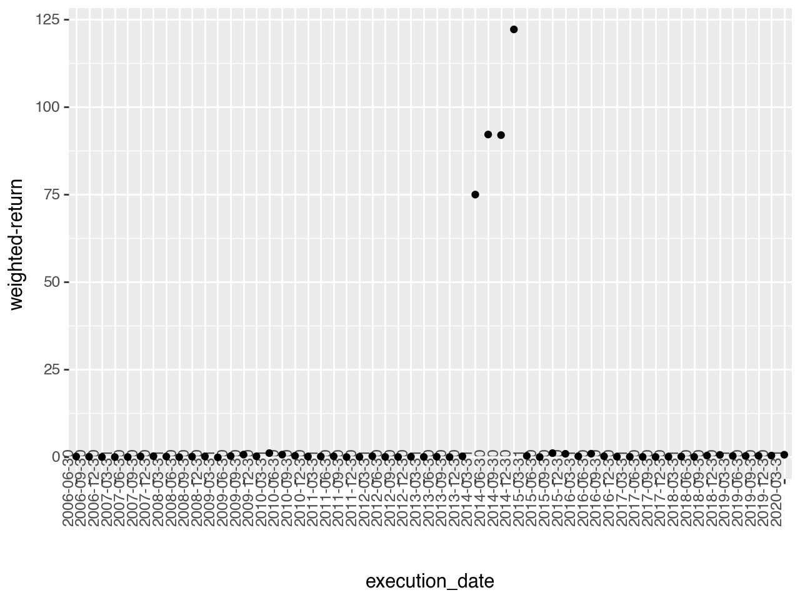
    


```python
ggplot(train_results_final_tree) + geom_point(aes(x = "execution_date", y = "weighted-return")) + theme(axis_text_x = element_text(angle = 90, vjust = 0.5, hjust=1))

```


    
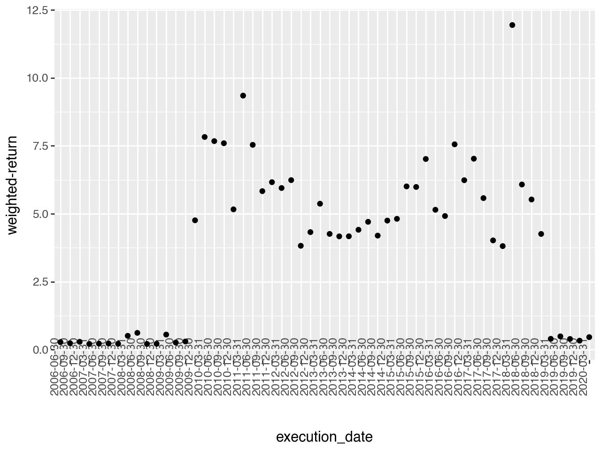
    


We have trained the first models for all the periods for you, but there are a lot of things which may be wrong or can be improved. Some ideas where you can start:
* Try to see if there is any kind of data leakage or suspicious features
* If the training part is very slow, try to see how you can modify it to execute faster tests
* Try to understand if the algorithm is learning correctly
* We are using a very high level metric to evaluate the algorithm so you maybe need to use some more low level ones
* Try to see if there is overfitting
* Try to see if there is a lot of noise between different trainings
* To simplify, why if you only keep the first tickers in terms of Market Cap?
* Change the number of quarters to train in the past

This function can be useful to compute the feature importance:

```python
def draw_feature_importance(model,top = 15):
    fi = model.feature_importance()
    fn = model.feature_name()
    feature_importance = pd.DataFrame([{"feature":fn[i],"imp":fi[i]} for i in range(len(fi))])
    feature_importance = feature_importance.sort_values("imp",ascending = False).head(top)
    feature_importance = feature_importance.sort_values("imp",ascending = True)
    plot = ggplot(feature_importance,aes(x = "feature",y  = "imp")) + geom_col(fill = "lightblue") + coord_flip() +  scale_x_discrete(limits = feature_importance["feature"])
    return plot

```

```python
from scipy.stats import lognorm
import matplotlib.pyplot as plt
```

# ***Part 2: Solution***

Una vez vista el código propuesto, el objetivo es encontrar donde esta fallando el modelo. Un weighted-return de 0,3, significa que nuestro portfolio mejora un 30% al SP500 en el proximo año, lo cual es ya un buen resultado, el problema es que nuestro modelo en train tiene muchos weighted-return muy altos, e.g. valores de 5 significarian mejorar un 500% lo cual hace sospechar que el modelo no es correcto

El primer paso en modelos de ML es definir un baseline sin ML que sirva de referencia, si no mejoramos ese baseline, no esta justificado el uso de ML.

### ***Baseline***

```python
test_results_final_tree.head()
```


<div>
<style scoped>
    .dataframe tbody tr th:only-of-type {
        vertical-align: middle;
    }

    .dataframe tbody tr th {
        vertical-align: top;
    }

    .dataframe thead th {
        text-align: right;
    }
</style>
<table border="1" class="dataframe">
  <thead>
    <tr style="text-align: right;">
      <th></th>
      <th>binary_logloss</th>
      <th>weighted-return</th>
      <th>n_trees</th>
      <th>execution_date</th>
    </tr>
  </thead>
  <tbody>
    <tr>
      <th>39</th>
      <td>0.759610</td>
      <td>0.099404</td>
      <td>39</td>
      <td>2006-06-30</td>
    </tr>
    <tr>
      <th>39</th>
      <td>0.730303</td>
      <td>0.035528</td>
      <td>39</td>
      <td>2006-09-30</td>
    </tr>
    <tr>
      <th>39</th>
      <td>0.715078</td>
      <td>-0.052195</td>
      <td>39</td>
      <td>2006-12-30</td>
    </tr>
    <tr>
      <th>39</th>
      <td>0.710833</td>
      <td>-0.067471</td>
      <td>39</td>
      <td>2007-03-31</td>
    </tr>
    <tr>
      <th>39</th>
      <td>0.711701</td>
      <td>-0.045395</td>
      <td>39</td>
      <td>2007-06-30</td>
    </tr>
  </tbody>
</table>
</div>


```python
def merge_against_benchmark(metrics_df, all_predicted_tickers, top_n_market_cap= 500):
    all_predicted_tickers = all_predicted_tickers.sort_values(["execution_date", "Market_cap"], ascending = False)
    all_predicted_tickers["rank"] = all_predicted_tickers.groupby(["execution_date"]).cumcount()
    all_predicted_tickers_top_mc = all_predicted_tickers[all_predicted_tickers["rank"] <= 500]
    baseline = all_predicted_tickers_top_mc.groupby("execution_date")["diff_ch_sp500"].mean().reset_index()
    baseline = baseline.rename(columns ={"diff_ch_sp500":"diff_ch_sp500_baseline"})
    baseline["execution_date"] = baseline["execution_date"].astype(str)
    metrics_df =pd.merge(metrics_df, baseline, on="execution_date")
    return metrics_df
```

```python
test_results_final_tree = merge_against_benchmark(test_results_final_tree, all_predicted_tickers)
```

```python
test_results_final_tree.head()
```


<div>
<style scoped>
    .dataframe tbody tr th:only-of-type {
        vertical-align: middle;
    }

    .dataframe tbody tr th {
        vertical-align: top;
    }

    .dataframe thead th {
        text-align: right;
    }
</style>
<table border="1" class="dataframe">
  <thead>
    <tr style="text-align: right;">
      <th></th>
      <th>binary_logloss</th>
      <th>weighted-return</th>
      <th>n_trees</th>
      <th>execution_date</th>
      <th>diff_ch_sp500_baseline</th>
    </tr>
  </thead>
  <tbody>
    <tr>
      <th>0</th>
      <td>0.759610</td>
      <td>0.099404</td>
      <td>39</td>
      <td>2006-06-30</td>
      <td>0.049213</td>
    </tr>
    <tr>
      <th>1</th>
      <td>0.730303</td>
      <td>0.035528</td>
      <td>39</td>
      <td>2006-09-30</td>
      <td>0.067796</td>
    </tr>
    <tr>
      <th>2</th>
      <td>0.715078</td>
      <td>-0.052195</td>
      <td>39</td>
      <td>2006-12-30</td>
      <td>0.068473</td>
    </tr>
    <tr>
      <th>3</th>
      <td>0.710833</td>
      <td>-0.067471</td>
      <td>39</td>
      <td>2007-03-31</td>
      <td>0.048029</td>
    </tr>
    <tr>
      <th>4</th>
      <td>0.711701</td>
      <td>-0.045395</td>
      <td>39</td>
      <td>2007-06-30</td>
      <td>0.077166</td>
    </tr>
  </tbody>
</table>
</div>


```python
(ggplot(test_results_final_tree[test_results_final_tree["weighted-return"]<2])
+ geom_point(aes(x = "execution_date", y = "weighted-return"), color='black')
+ geom_point(aes(x= "execution_date", y ="diff_ch_sp500_baseline"), color="red")
+ theme(axis_text_x = element_text(angle = 90, vjust = 0.5, hjust=1))
)
```


    
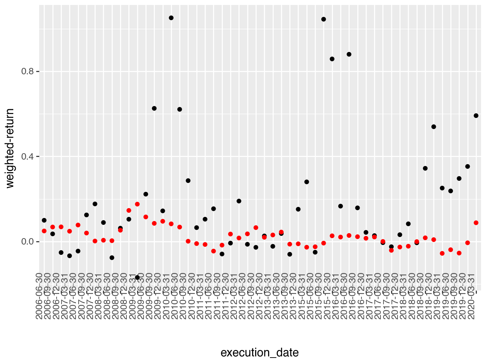
    


Baseline: Puntos rojos

La función `merge_against_benchmark` crea el baseline seleccionando para cada `execution_date`las 500 acciones con mayor capitalización de mercado (Market_cap)  y calculando el rendimiento promedio (`diff_ch_sp500` --> en 1 año) de las acciones seleccionadas vs S&P500

% de periodos en los que modelo es mejor que baseline:

```python
periods_better_than_baseline = len(test_results_final_tree[test_results_final_tree['weighted-return']>test_results_final_tree["diff_ch_sp500_baseline"]])/len(test_results_final_tree)
print(f"{periods_better_than_baseline *100:.2f}")
```

    69.64


Rendimiento de baseline vs modelo

```python
test_results_final_tree["weighted-return"].median()
```


    0.11454718271321802


```python
test_results_final_tree["diff_ch_sp500_baseline"].median()
```


    0.015525563344158869


```python
test_results_final_tree["weighted-return"].mean()
```


    6.979676945548215


```python
test_results_final_tree["diff_ch_sp500_baseline"].mean()
```


    0.022159133577893696


Comparando con el baseline, el rendimiento del modelo tiene una mediana x10, lo cual es una mejora brutal y nos tiene que hacer sospechar. Tenemos que averiguar si el modelo esta realmente **aprendiendo y generalizando** o esta haciendo overfitting. Una herramienta muy útil son las curvas de aprendizaje en train y test y ver como evoluciona la metrica que definamos con el aumento de arboles. En este caso, la metrica que nos interesa minimizar es binary_logloss.

```python
all_results
```


    {numpy.datetime64('2006-06-30T00:00:00.000000000'): {'training': OrderedDict([('binary_logloss',
                    [0.6575048389350276,
                     0.6391926602573644,
                     0.6197543667213141,
                     0.601840274608817,
                     0.585714957943413,
                     0.571106707445161,
                     0.5565466963983133,
                     0.5430953037630178,
                     0.529993683150423,
                     0.5167822949388327,
                     0.5042016849289719,
                     0.49205497695269174,
                     0.4805484638645873,
                     0.4695863565991426,
                     0.4593648306460457,
                     0.4484017609154625,
                     0.43751779349760506,
                     0.42775439637910617,
                     0.4186999665562555,
                     0.40963628883206277,
                     0.4021040918213104,
                     0.3944973628461127,
                     0.38639633391715733,
                     0.37847748863159597,
                     0.3710828934795538,
                     0.363997602992909,
                     0.3563431147686633,
                     0.348671623660378,
                     0.34174698178704405,
                     0.33496699523713547,
                     0.32860152989597585,
                     0.32240526482752213,
                     0.316097728168702,
                     0.31006889500337836,
                     0.3040961299422135,
                     0.2983006712576348,
                     0.2929478631054701,
                     0.287488433022364,
                     0.2821254698326596,
                     0.27679739102822765]),
                   ('weighted-return',
                    [0.26784464123082063,
                     0.4839397191315355,
                     0.21871584266055397,
                     0.24731585197648281,
                     0.2509482150970221,
                     0.18346524147660118,
                     0.3251424601328548,
                     0.27461352235034975,
                     0.15828300745171892,
                     0.1582830074517189,
                     0.245672391378771,
                     0.245672391378771,
                     0.245672391378771,
                     0.2295515138946639,
                     0.23644520247281747,
                     0.23644520247281747,
                     0.25359636145379605,
                     0.21854614182264748,
                     0.25350666640077013,
                     0.2620132949378531,
                     0.2123953378186354,
                     0.20334429723744157,
                     0.20334429723744155,
                     0.19105019376330895,
                     0.20810254512878112,
                     0.20810254512878112,
                     0.24765957001238523,
                     0.2103447347952364,
                     0.21378953160842765,
                     0.22463360779543418,
                     0.20871499844539929,
                     0.19787092225839276,
                     0.2160403845527272,
                     0.23661089004396255,
                     0.23675066769935374,
                     0.291426203594127,
                     0.3410441607133447,
                     0.3410441607133447,
                     0.30734481294416194,
                     0.27717197343798916])]),
      'valid_0': OrderedDict([('binary_logloss',
                    [0.7189618551873046,
                     0.7161953405215303,
                     0.7154886093937903,
                     0.7149786233329631,
                     0.7126280793795198,
                     0.7144132709822238,
                     0.7126093975773321,
                     0.7145286554805668,
                     0.7163246793418798,
                     0.7137870425361793,
                     0.7160447981380451,
                     0.7159580717095436,
                     0.7155697725621663,
                     0.7164315522836605,
                     0.716749407840755,
                     0.7181479860002112,
                     0.7188396779820723,
                     0.7215589019737468,
                     0.7228559177471763,
                     0.7223629533351138,
                     0.7233679471991987,
                     0.726690270537354,
                     0.7289754368462662,
                     0.7315986381822492,
                     0.7337981025678426,
                     0.7348604396620464,
                     0.7381076737837912,
                     0.7404880041505609,
                     0.7425744964085986,
                     0.7434342851384144,
                     0.7464177237064692,
                     0.7496908874602366,
                     0.7503644473575395,
                     0.7518655425751074,
                     0.7540333813936069,
                     0.7555546692233208,
                     0.754948244835981,
                     0.7555566930902639,
                     0.7587374599428085,
                     0.7596104208587451]),
                   ('weighted-return',
                    [0.19374233393052526,
                     0.24612303214623057,
                     0.2674593063805089,
                     0.21834544515653434,
                     0.01583406061758877,
                     0.06449246222403675,
                     0.06517598587220488,
                     0.06517598587220488,
                     -0.0071356380061166885,
                     0.06398492591021251,
                     0.06762001347397488,
                     0.08134058430690787,
                     0.06398492591021251,
                     0.07706918983585043,
                     0.10124719036574542,
                     0.11167716885917975,
                     0.08863974004743316,
                     0.10551855839716325,
                     0.07033675356175301,
                     0.06871965384984689,
                     0.09348464210319718,
                     0.10718616115303053,
                     0.10718616115303052,
                     0.07850583473175193,
                     0.05643658738967914,
                     0.08256483446140925,
                     0.0964733369868375,
                     0.08239837601386939,
                     0.09682508155982784,
                     0.09184216153629475,
                     0.09184216153629475,
                     0.08239837601386939,
                     0.085313783950782,
                     0.085313783950782,
                     0.10010680794455015,
                     0.08568304128563779,
                     0.06732334698953384,
                     0.10761578793032624,
                     0.06732334698953384,
                     0.09940361211857078])])},
     numpy.datetime64('2006-09-30T00:00:00.000000000'): {'training': OrderedDict([('binary_logloss',
                    [0.6717158396578442,
                     0.657922333803266,
                     0.6456401233073628,
                     0.6339008133298843,
                     0.6232343577926067,
                     0.6127309639992166,
                     0.6029028539924487,
                     0.5934453066315819,
                     0.5841088331044318,
                     0.5756610552429315,
                     0.5670133842521381,
                     0.5584039479408597,
                     0.5502862870833859,
                     0.5425899980479728,
                     0.5347881831810749,
                     0.5265573871794951,
                     0.5194012257734417,
                     0.5125662852652816,
                     0.5058706846457364,
                     0.49963681432249074,
                     0.49348786386811694,
                     0.48674289851647284,
                     0.48063816037684653,
                     0.4745337672676566,
                     0.4689350736089155,
                     0.4628138985231142,
                     0.457200345020362,
                     0.45164879956497184,
                     0.44618906282893517,
                     0.44135977885674144,
                     0.43570028818954165,
                     0.43062915485163233,
                     0.4259055292741335,
                     0.42112491040364414,
                     0.415900135635689,
                     0.411376599545472,
                     0.40679704453762805,
                     0.4022327106787361,
                     0.39739310061653565,
                     0.3930835249167881]),
                   ('weighted-return',
                    [0.1951245500621381,
                     0.09755123023948328,
                     0.19089882448888815,
                     0.22066993959668893,
                     0.15485758973930697,
                     0.1604208131032867,
                     0.20198863565804973,
                     0.20198863565804973,
                     0.20198863565804973,
                     0.2107434333467676,
                     0.17379259857584065,
                     0.17234108470870643,
                     0.19372687377088002,
                     0.19372687377088002,
                     0.2115061696539686,
                     0.20245000802686983,
                     0.18396848906961868,
                     0.18498800388803735,
                     0.22367337156360007,
                     0.23748520913374552,
                     0.2175075499200862,
                     0.22579621167615468,
                     0.22579621167615468,
                     0.24616881820208586,
                     0.24616881820208586,
                     0.24616881820208586,
                     0.24616881820208583,
                     0.24616881820208583,
                     0.21716394299858913,
                     0.21716394299858913,
                     0.21716394299858913,
                     0.23249830238976948,
                     0.23249830238976948,
                     0.2330581622657542,
                     0.23682802629993838,
                     0.22768729924483466,
                     0.21716394299858907,
                     0.23682802629993835,
                     0.23682802629993835,
                     0.23682802629993835])]),
      'valid_0': OrderedDict([('binary_logloss',
                    [0.7048461712320332,
                     0.7024812019051361,
                     0.7009342829122169,
                     0.7003129883202451,
                     0.6996765335202038,
                     0.6993631321213143,
                     0.6989697594432566,
                     0.6984123985964747,
                     0.6979799712517731,
                     0.6982355392656675,
                     0.6979267840404157,
                     0.6982557937221695,
                     0.6990555901734072,
                     0.699959756693488,
                     0.6992169907773806,
                     0.7015250374415485,
                     0.7012865689531445,
                     0.7008782344613896,
                     0.701015709345677,
                     0.7020571078778761,
                     0.7029124318589524,
                     0.7048966760391404,
                     0.7070218871259186,
                     0.7094117924912751,
                     0.7110216907918236,
                     0.7129631446792829,
                     0.7133864029224024,
                     0.714607468470155,
                     0.7170615508588746,
                     0.7176545200133643,
                     0.7174549184976882,
                     0.7177217929780938,
                     0.7195565802129392,
                     0.7227813310082665,
                     0.7246418766087998,
                     0.7264531439109709,
                     0.7265534955078197,
                     0.7274710883198637,
                     0.7297733125808159,
                     0.7303033943972174]),
                   ('weighted-return',
                    [0.6606020712423049,
                     0.0045374367655110475,
                     -0.10999965097329836,
                     -0.004079753405415646,
                     0.02113498814134183,
                     0.0247608884323579,
                     0.04862207442362614,
                     0.05791813177227576,
                     0.04846595516090184,
                     0.031188987875995,
                     0.02849325920418961,
                     0.027093200768968706,
                     0.0004851578298249448,
                     0.0004851578298249448,
                     0.022367297022778385,
                     0.022367297022778385,
                     0.0455996439741995,
                     0.022367297022778385,
                     0.038860371875412456,
                     0.05045894152640247,
                     0.03465219073282338,
                     0.057884537684244494,
                     0.05727345216297933,
                     0.014584868375367535,
                     0.03960433907919954,
                     0.03903264172103058,
                     0.03903264172103058,
                     0.03903264172103058,
                     0.03903264172103058,
                     0.039032641721030575,
                     0.039032641721030575,
                     0.05045894152640247,
                     0.05045894152640247,
                     0.05045894152640247,
                     0.05727345216297933,
                     0.05045894152640248,
                     0.05369399657701947,
                     0.03552842467286053,
                     0.03552842467286053,
                     0.03552842467286053])])},
     numpy.datetime64('2006-12-30T00:00:00.000000000'): {'training': OrderedDict([('binary_logloss',
                    [0.6752044630983427,
                     0.6638735988623976,
                     0.6533193226995752,
                     0.6433110294837251,
                     0.6340999544166276,
                     0.6253713471389236,
                     0.6168858582659464,
                     0.609079938332817,
                     0.6018392820858789,
                     0.5946238592716074,
                     0.5870506235026851,
                     0.5802318968865942,
                     0.5742384996847129,
                     0.5673360357615541,
                     0.5608856933504993,
                     0.5550956081693371,
                     0.5491257117270085,
                     0.5441935281613338,
                     0.5389001372284578,
                     0.5333817262552137,
                     0.5277876932893775,
                     0.5223774391721101,
                     0.5171710644637949,
                     0.5126058415836926,
                     0.508121004349202,
                     0.5033935579131705,
                     0.49845364759664756,
                     0.49417707675314254,
                     0.48932815913386285,
                     0.4849361848021967,
                     0.4808409372617313,
                     0.4768335192203672,
                     0.47253693585123024,
                     0.46849729851436983,
                     0.4645883754636633,
                     0.4609442523994269,
                     0.45685857478724334,
                     0.45371829651113704,
                     0.4501158223377829,
                     0.4462405310466186]),
                   ('weighted-return',
                    [0.06364626257539995,
                     0.2403379424684155,
                     0.17849791517284092,
                     0.20607483629416148,
                     0.11083133400935741,
                     0.17356971483999614,
                     0.23108846681589645,
                     0.19253999393102877,
                     0.14631462941728018,
                     0.16017376942415487,
                     0.181898887665968,
                     0.15925090411025428,
                     0.16829069910263592,
                     0.16829069910263592,
                     0.18135823882811822,
                     0.15885903333475487,
                     0.15885903333475487,
                     0.17405159335824236,
                     0.16947910899605348,
                     0.16947910899605348,
                     0.18997142875978046,
                     0.18997142875978046,
                     0.18997142875978046,
                     0.1953744373455861,
                     0.19203435774163885,
                     0.24600314354123184,
                     0.23766599970513913,
                     0.23633529261695985,
                     0.24020282039580967,
                     0.23672286196080689,
                     0.2367228619608069,
                     0.2178979242653876,
                     0.2178979242653876,
                     0.20524617071873627,
                     0.20524617071873627,
                     0.20524617071873627,
                     0.20413275428754646,
                     0.2655063066296326,
                     0.2655063066296326,
                     0.2885161593433937])]),
      'valid_0': OrderedDict([('binary_logloss',
                    [0.7111523547821894,
                     0.7076568623108227,
                     0.7052107389425898,
                     0.7029343493512329,
                     0.6998676214642118,
                     0.7015069165290067,
                     0.7007590605508011,
                     0.7010276768544311,
                     0.7020995504885039,
                     0.7020980669699364,
                     0.7030418457212296,
                     0.7021712932537671,
                     0.7008558092560527,
                     0.7029926887157651,
                     0.7036867865462578,
                     0.7035333589430925,
                     0.7042643470328046,
                     0.7046810665028861,
                     0.7051729060326869,
                     0.7057786264574517,
                     0.7059647470536035,
                     0.7065887517962486,
                     0.7069848329943682,
                     0.7083527784950351,
                     0.7080674608534356,
                     0.7092471936327565,
                     0.7091699055261589,
                     0.7086177160824583,
                     0.7113069151187363,
                     0.7113552989362767,
                     0.7114249625361821,
                     0.7114200611395618,
                     0.7119466986635705,
                     0.7132534332851217,
                     0.7136836284906669,
                     0.7146221863402802,
                     0.7153660052830273,
                     0.7155320184511613,
                     0.7153166102447022,
                     0.7150779464648489]),
                   ('weighted-return',
                    [-0.12732446108470913,
                     -0.018272408607208336,
                     -0.09980139681178425,
                     -0.1277274575951769,
                     -0.07067013997766307,
                     -0.09586521687115829,
                     -0.053786571728475584,
                     -0.011357636003268496,
                     -0.053786571728475584,
                     -0.05261280556033378,
                     -0.023949909881710592,
                     -0.01515715815796565,
                     -0.04456216879276535,
                     -0.04324378934010855,
                     -0.01515715815796565,
                     -0.041828939840986616,
                     -0.0720216252068681,
                     -0.09746374582182549,
                     -0.06122382869756054,
                     -0.07442662418270288,
                     -0.07574500363535969,
                     -0.050806208517234025,
                     -0.050806208517234025,
                     -0.050806208517234025,
                     -0.08704612564149897,
                     -0.08704612564149897,
                     -0.05552251197284785,
                     -0.05552251197284785,
                     -0.08836387582875395,
                     -0.05872425939597016,
                     -0.05872425939597016,
                     -0.05872425939597016,
                     -0.05872425939597016,
                     -0.0760333715049623,
                     -0.056562783791639704,
                     -0.056562783791639704,
                     -0.052194787771805605,
                     -0.052194787771805605,
                     -0.052194787771805605,
                     -0.05219478777180561])])},
     numpy.datetime64('2007-03-31T00:00:00.000000000'): {'training': OrderedDict([('binary_logloss',
                    [0.6793761362859856,
                     0.6688744220854563,
                     0.659292768248859,
                     0.650194102390755,
                     0.6420569580082578,
                     0.6345953382110521,
                     0.6270212134647911,
                     0.6196908399344797,
                     0.6132084267526344,
                     0.6067992105703821,
                     0.5999710191238937,
                     0.5943069901757311,
                     0.5885080624711548,
                     0.5830344704893037,
                     0.577772053975686,
                     0.5728635805191071,
                     0.5678139303654742,
                     0.5628833300075844,
                     0.5580876371214626,
                     0.553643429083676,
                     0.5486501870744904,
                     0.5442137103816831,
                     0.5402272199859711,
                     0.5360426336755781,
                     0.5319743788172817,
                     0.5279998106669517,
                     0.5235953952511693,
                     0.5197480609723706,
                     0.5160146265976575,
                     0.5122491236218474,
                     0.5091401756093628,
                     0.5054116284841869,
                     0.5015783133913649,
                     0.4983670230971806,
                     0.49500717148714224,
                     0.4915281077951417,
                     0.4882570495082448,
                     0.48511263974757535,
                     0.4820277572326472,
                     0.47921054691487314]),
                   ('weighted-return',
                    [0.06973040939895153,
                     0.06364142470753822,
                     0.049118228478877486,
                     0.23100488046789788,
                     0.18603562573832028,
                     0.22356819026855435,
                     0.22940558755079188,
                     0.17199275439261288,
                     0.1821077911001984,
                     0.20057682274800612,
                     0.20057682274800614,
                     0.17134856988151997,
                     0.17134856988151997,
                     0.167190190714604,
                     0.19354260207811988,
                     0.19354260207811988,
                     0.18684995698833112,
                     0.20571902125461908,
                     0.22174239688164185,
                     0.22174239688164185,
                     0.2236739618426877,
                     0.2637007174848057,
                     0.2246681973824,
                     0.2246681973824,
                     0.2246681973824,
                     0.2388106042280781,
                     0.23683351276591694,
                     0.2739676101596371,
                     0.2507647275223706,
                     0.27238616916476244,
                     0.24336383852403365,
                     0.21200424529531933,
                     0.21200424529531933,
                     0.24342351779566315,
                     0.21894487205975421,
                     0.23089899535404673,
                     0.27238616916476244,
                     0.20967868418735297,
                     0.24252985370567237,
                     0.20967868418735297])]),
      'valid_0': OrderedDict([('binary_logloss',
                    [0.7003924292630368,
                     0.6980647715705953,
                     0.6975854767007159,
                     0.6958635477667776,
                     0.6957609491746561,
                     0.6954333189794525,
                     0.6941392887242221,
                     0.6944902652848595,
                     0.6949256992664745,
                     0.695933537634474,
                     0.6957317525510881,
                     0.696436236058471,
                     0.6972077737476284,
                     0.6969168480331307,
                     0.6980053272109793,
                     0.6977661418253874,
                     0.6978926269594354,
                     0.699197493255898,
                     0.7008885778831542,
                     0.7014235364198899,
                     0.701595774235911,
                     0.7028850056541897,
                     0.7035098268948673,
                     0.7044317358029364,
                     0.7047073166132275,
                     0.704734016722253,
                     0.7058003511030795,
                     0.7069891711808808,
                     0.7068787591025728,
                     0.7078463891063683,
                     0.7083861134833311,
                     0.7087589402681593,
                     0.7094866451780506,
                     0.7096226491567966,
                     0.7102315391221031,
                     0.7106942663909241,
                     0.7104005767313318,
                     0.7107608828772274,
                     0.7106849849218027,
                     0.7108330104210288]),
                   ('weighted-return',
                    [0.04525087356954673,
                     -0.13226737391450727,
                     -0.06600225648572992,
                     -0.025530036983818866,
                     -0.06969902997131595,
                     -0.022182169102919504,
                     -0.07186601937269116,
                     -0.07186601937269117,
                     -0.06969902997131598,
                     -0.07186601937269117,
                     -0.07186601937269117,
                     -0.06594118438194048,
                     -0.06594118438194048,
                     -0.06594118438194048,
                     -0.09791672843869699,
                     -0.08727255779119192,
                     -0.08727255779119195,
                     -0.08619737781585854,
                     -0.08619737781585854,
                     -0.08619737781585854,
                     -0.08619737781585853,
                     -0.07508106846465018,
                     -0.07831215147408122,
                     -0.07831215147408122,
                     -0.07831215147408122,
                     -0.042415590021832934,
                     -0.04241559002183294,
                     -0.09140938852563407,
                     -0.0874456957160467,
                     -0.07615381118065229,
                     -0.08615399821818913,
                     -0.08615399821818913,
                     -0.08615399821818913,
                     -0.08615399821818913,
                     -0.08615399821818913,
                     -0.08615399821818913,
                     -0.08615399821818913,
                     -0.04716872457159344,
                     -0.055620962428580265,
                     -0.06747052543476635])])},
     numpy.datetime64('2007-06-30T00:00:00.000000000'): {'training': OrderedDict([('binary_logloss',
                    [0.6800149257824429,
                     0.6697556207309999,
                     0.6605304929965168,
                     0.651520865045533,
                     0.6438863760057305,
                     0.637533037372446,
                     0.6301733288555393,
                     0.6238068998369891,
                     0.6173663354966128,
                     0.6113664121650547,
                     0.6057994393080908,
                     0.6005336886193213,
                     0.5954226150057482,
                     0.5910876997838713,
                     0.58614894587462,
                     0.5816499856921299,
                     0.5767802929633029,
                     0.5723725826157098,
                     0.5679827743710973,
                     0.5636689392081884,
                     0.5598588184318987,
                     0.5557437906923189,
                     0.5520516379308932,
                     0.5482222742752583,
                     0.5443424225228738,
                     0.5409421018214519,
                     0.5377707949094427,
                     0.5342370956690308,
                     0.5309768349826848,
                     0.5272740694781531,
                     0.5239016388148027,
                     0.5205072056226647,
                     0.5174681017087933,
                     0.5142141469604585,
                     0.5111237187589267,
                     0.5083164092655432,
                     0.5052852245648887,
                     0.50237058149839,
                     0.499120668167075,
                     0.49636879822784286]),
                   ('weighted-return',
                    [0.09107613766761499,
                     0.13329498573499227,
                     0.11863131787890008,
                     0.1414775955986649,
                     0.18872711389002192,
                     0.1562245402599576,
                     0.15600003138445667,
                     0.2613134954427855,
                     0.2639887915138184,
                     0.2767540912712153,
                     0.2613134954427855,
                     0.2762791787525606,
                     0.2762791787525606,
                     0.26192811359865303,
                     0.27499565332413534,
                     0.2914949281410376,
                     0.28685301187961787,
                     0.25776364925345285,
                     0.2304349334160991,
                     0.23535856181639975,
                     0.23535856181639975,
                     0.23535856181639975,
                     0.23488110990018016,
                     0.2631622092900546,
                     0.2631622092900546,
                     0.25319798457910403,
                     0.25319798457910403,
                     0.2531979845791041,
                     0.2575405440512047,
                     0.25754054405120463,
                     0.2575405440512047,
                     0.2575405440512047,
                     0.2575405440512047,
                     0.26227284576402643,
                     0.2457735709471241,
                     0.2457735709471241,
                     0.2457735709471241,
                     0.2457735709471241,
                     0.2457735709471241,
                     0.22228076329504887])]),
      'valid_0': OrderedDict([('binary_logloss',
                    [0.6948370553243146,
                     0.6936683234616413,
                     0.6922279663136385,
                     0.6896792733061308,
                     0.6896129827579861,
                     0.6903840243624773,
                     0.6902891271506594,
                     0.6892302162549424,
                     0.6886811571516913,
                     0.6889706604126368,
                     0.6893875569175922,
                     0.6901237823567007,
                     0.6907647487950457,
                     0.6920768965443957,
                     0.6929633963777285,
                     0.6942723360334995,
                     0.6947896024395293,
                     0.6964148103685928,
                     0.6966185573363234,
                     0.697826606047196,
                     0.6975846363422413,
                     0.698291535524372,
                     0.6991793957853284,
                     0.6999339562457795,
                     0.7010960951515456,
                     0.7013688085741406,
                     0.7019620953596021,
                     0.7026895631998059,
                     0.7037449876154821,
                     0.7050692610329344,
                     0.705635368105854,
                     0.7065590368780653,
                     0.7074461380551885,
                     0.7082259880566233,
                     0.709020345186291,
                     0.7097871249928049,
                     0.7106272672772259,
                     0.7107951532511806,
                     0.7109942016984107,
                     0.7117011628639354]),
                   ('weighted-return',
                    [-0.009476879020165356,
                     -0.007649660656962123,
                     -0.10469709324274996,
                     -0.11732022410321023,
                     -0.046838687054192994,
                     -0.04301555568027471,
                     -0.046491362796617385,
                     -0.07239307083776016,
                     -0.05042313286339284,
                     0.21110069295441725,
                     0.00632946073893045,
                     -0.05926467582079615,
                     0.015582580282437614,
                     0.22378478753423514,
                     0.24230107701166756,
                     0.2568993233488133,
                     0.18029751662028706,
                     0.12869485273305234,
                     0.12869485273305234,
                     0.060097237296524615,
                     -0.006852606231167388,
                     -0.006852606231167388,
                     -0.006852606231167388,
                     -0.03850533461552242,
                     -0.0030601085737820208,
                     -0.00939540421908153,
                     -0.00939540421908152,
                     -0.00939540421908152,
                     -0.021763466111074294,
                     -0.0563335696001035,
                     0.013184204461801869,
                     0.013184204461801872,
                     0.013184204461801872,
                     0.013184204461801872,
                     0.013184204461801872,
                     -0.033027327422541455,
                     -0.03395292088463496,
                     -0.030517761288828923,
                     -0.04539538931453421,
                     -0.04539538931453421])])},
     numpy.datetime64('2007-09-30T00:00:00.000000000'): {'training': OrderedDict([('binary_logloss',
                    [0.6806274046482516,
                     0.6703129791656212,
                     0.6607766509736271,
                     0.6522782182461928,
                     0.6446416871089349,
                     0.6374318775771755,
                     0.6309176831334444,
                     0.624865190464773,
                     0.6193057557804106,
                     0.6138454066470531,
                     0.6085724205598289,
                     0.6037341449500757,
                     0.598993185323017,
                     0.5946308654019267,
                     0.590146703030076,
                     0.5856234037312845,
                     0.5815773296566993,
                     0.5774396367176741,
                     0.5736598704794043,
                     0.569720198641402,
                     0.5660434599161545,
                     0.5622849460509368,
                     0.5585247346760654,
                     0.5551668327705114,
                     0.5517781895773417,
                     0.5484786060895819,
                     0.5453067791386658,
                     0.542324424313297,
                     0.5394703423382008,
                     0.5364519727758,
                     0.5335019499448087,
                     0.5307261578522082,
                     0.5277131716231942,
                     0.5252890922493539,
                     0.5227554349181385,
                     0.5200499841517574,
                     0.5172045750748382,
                     0.5146475999231775,
                     0.5120306927886881,
                     0.5095134875988004]),
                   ('weighted-return',
                    [0.1507084219854202,
                     0.1903500500691643,
                     0.13164241211446653,
                     0.1324534789993304,
                     0.14846898070774228,
                     0.18655056386581234,
                     0.17203619870458342,
                     0.166868546689517,
                     0.11700832057613299,
                     0.16022176293971435,
                     0.17410255137483852,
                     0.1736076607924822,
                     0.18401510680140892,
                     0.15259722430033115,
                     0.20286456227728225,
                     0.18549766166826295,
                     0.2018774016685394,
                     0.19104756861909786,
                     0.18846446675761822,
                     0.20051046207642934,
                     0.18448516341017113,
                     0.2229515364504365,
                     0.20299208624581833,
                     0.19436493818421482,
                     0.1925956376879301,
                     0.2166925866505195,
                     0.18818614535265046,
                     0.22194046230911432,
                     0.23389885853918085,
                     0.23389885853918085,
                     0.23389885853918085,
                     0.23389885853918085,
                     0.23389885853918085,
                     0.21737957721367973,
                     0.21737957721367973,
                     0.21737957721367973,
                     0.24267918854645343,
                     0.21817397220484858,
                     0.2273033989400426,
                     0.22730339894004256])]),
      'valid_0': OrderedDict([('binary_logloss',
                    [0.693098008458823,
                     0.696652228691242,
                     0.700373774646778,
                     0.7059728376569355,
                     0.7107480799249636,
                     0.7162940077694689,
                     0.7224992561390632,
                     0.7262506428769593,
                     0.7312499091724166,
                     0.7365907280087148,
                     0.7422047912466867,
                     0.7483679230444042,
                     0.7541490010884951,
                     0.7604328611715325,
                     0.7635044233044844,
                     0.7695149332711336,
                     0.771945741292663,
                     0.7764876062161263,
                     0.7791090315422602,
                     0.781679452092365,
                     0.7863891429727299,
                     0.7894020560943548,
                     0.791354703224793,
                     0.7930977766664017,
                     0.7968269750024074,
                     0.7982665388780085,
                     0.8006407002921309,
                     0.8020168190920066,
                     0.8031427574272014,
                     0.8041595046826584,
                     0.8065895404113685,
                     0.8084486536312119,
                     0.8092753872403748,
                     0.8091312261208411,
                     0.8097650509994121,
                     0.8098413823831907,
                     0.8117857615283212,
                     0.8127196623119972,
                     0.8135849544637744,
                     0.813939305502785]),
                   ('weighted-return',
                    [0.0884272099809379,
                     0.08732931827247781,
                     -0.014606064742585642,
                     0.00494786986511354,
                     0.02217130334711303,
                     0.19369867124902662,
                     0.20255724211876047,
                     0.1193986556416636,
                     0.18407983212065393,
                     0.16733784523152592,
                     0.1660378138070777,
                     0.1845910453880107,
                     0.1845910453880107,
                     0.18459104538801072,
                     0.2108600261186359,
                     0.2056225548119944,
                     0.13508291323461705,
                     0.17846340752897705,
                     0.1404557073084594,
                     0.1143693858211581,
                     0.12610810531105052,
                     0.1492056330583852,
                     0.15237708604167577,
                     0.1571117892075884,
                     0.09990599315120965,
                     0.14311915049331986,
                     0.1869168843946219,
                     0.15208063715739487,
                     0.1783496178880201,
                     0.20059793059766362,
                     0.18196530340833916,
                     0.18196530340833916,
                     0.13796037355844606,
                     0.13796037355844606,
                     0.14601020354300281,
                     0.1486675288261763,
                     0.1486675288261763,
                     0.1486675288261763,
                     0.10662389843275957,
                     0.12454250679535137])])},
     numpy.datetime64('2007-12-30T00:00:00.000000000'): {'training': OrderedDict([('binary_logloss',
                    [0.680330881793367,
                     0.6697411444839798,
                     0.6602571562932985,
                     0.6521724815245545,
                     0.6443865332396732,
                     0.6373519535092732,
                     0.631339092676319,
                     0.6254819660621825,
                     0.6201974447133858,
                     0.6144689369311319,
                     0.6094647216288261,
                     0.6043389125797415,
                     0.6001518451481137,
                     0.5957285601460269,
                     0.5917298177668681,
                     0.5875725027424801,
                     0.5834576668616467,
                     0.5795751125996116,
                     0.5760718472781127,
                     0.5726226522676295,
                     0.5692064365547388,
                     0.5659042008932075,
                     0.5627563492975193,
                     0.5594371933154116,
                     0.5564294144947408,
                     0.5534196273670812,
                     0.5504182692432129,
                     0.5474533471637225,
                     0.5449529326689541,
                     0.5416616299918748,
                     0.5387661980282552,
                     0.536110555532908,
                     0.5335806578782942,
                     0.530845292116594,
                     0.5283906744423239,
                     0.5260569745781296,
                     0.5236963457214683,
                     0.5210369421666988,
                     0.5186180500645434,
                     0.5158964064338222]),
                   ('weighted-return',
                    [0.10150279421807457,
                     0.5426587782437878,
                     0.4465000989068925,
                     0.1734446037682648,
                     0.13980366136879194,
                     0.18871004149710477,
                     0.20925319613907803,
                     0.09706980442266284,
                     0.1632390682021397,
                     0.13969922941302898,
                     0.19668000425066423,
                     0.1762671404666428,
                     0.16806120799069704,
                     0.20218691183635482,
                     0.2260934365091056,
                     0.21984803265811423,
                     0.21984803265811426,
                     0.18651904998685384,
                     0.1837718492623936,
                     0.1837718492623936,
                     0.19001725311338488,
                     0.13931475229260665,
                     0.13931475229260665,
                     0.15882752774318415,
                     0.14678153242437306,
                     0.16256449459625621,
                     0.16256449459625621,
                     0.144924470508585,
                     0.13195369552191272,
                     0.1754834691212742,
                     0.21794657730734654,
                     0.22987336776205997,
                     0.22258849356876637,
                     0.21690259277538768,
                     0.21690259277538768,
                     0.19199743742082803,
                     0.18741025957598761,
                     0.24141343126418568,
                     0.21576808026618885,
                     0.21576808026618885])]),
      'valid_0': OrderedDict([('binary_logloss',
                    [0.6969201215283873,
                     0.7013049235324821,
                     0.7073387052620561,
                     0.7136154134770092,
                     0.719406125321431,
                     0.7259473453216215,
                     0.7326033654237167,
                     0.7387965550432968,
                     0.7450841674562924,
                     0.7513424581548347,
                     0.7582249291308686,
                     0.7646149509052316,
                     0.7689824719669741,
                     0.7760645798069508,
                     0.7823403348529746,
                     0.7885367355002353,
                     0.7960149887553173,
                     0.7989320578044748,
                     0.8018784497315181,
                     0.8044134928569497,
                     0.8101581125324748,
                     0.8149373881642727,
                     0.8168680399062407,
                     0.8210308046417698,
                     0.8229087677615594,
                     0.8240977023553722,
                     0.8257090095304285,
                     0.8262615746217411,
                     0.8277590414539494,
                     0.8338004406579229,
                     0.8345755850133345,
                     0.8354921982241637,
                     0.8383356121146669,
                     0.8376345705686254,
                     0.8386848184864925,
                     0.8378972627295859,
                     0.8386699152703824,
                     0.8387421896698191,
                     0.8391416725392594,
                     0.8414047151523089]),
                   ('weighted-return',
                    [-0.061908915801031486,
                     -0.024025687669784534,
                     -0.028408914183214354,
                     -0.015486524652754552,
                     0.12259146442403968,
                     -0.05925087715978139,
                     0.039535732948876995,
                     0.035465129736644306,
                     0.046925917370825146,
                     0.1196805841627103,
                     0.1018931960086417,
                     0.051026430394285394,
                     0.08235097524965375,
                     0.08235097524965375,
                     0.0900218495820638,
                     0.0900218495820638,
                     0.07129083932931911,
                     0.06556086976256781,
                     0.02581599218644388,
                     0.11278585993654983,
                     0.12581831304061747,
                     0.09621061823071846,
                     0.0339993655775819,
                     0.0339993655775819,
                     0.027907731805316097,
                     -0.03327105096418484,
                     -0.01660559738857107,
                     0.0470951206711677,
                     -0.009074247023335081,
                     0.016980839007113786,
                     0.01698083900711378,
                     0.11058357457512999,
                     0.17316863584855516,
                     0.1287632076382539,
                     0.1287632076382539,
                     0.08981654699351646,
                     0.12805894506070872,
                     0.1763479650373847,
                     0.1763479650373847,
                     0.17634796503738467])])},
     numpy.datetime64('2008-03-31T00:00:00.000000000'): {'training': OrderedDict([('binary_logloss',
                    [0.6811886219744127,
                     0.6714249194767345,
                     0.663099015239972,
                     0.6557106051727019,
                     0.649065439923965,
                     0.6427267848315622,
                     0.6368281104888406,
                     0.6309450283731632,
                     0.6257896067087342,
                     0.6209379623777721,
                     0.6164821842878168,
                     0.612027469214245,
                     0.6078700834540088,
                     0.6040923969361773,
                     0.6005499139464846,
                     0.597144619464479,
                     0.5934666369671161,
                     0.5901391465653151,
                     0.5869895657206583,
                     0.5836655323697697,
                     0.5807159142183203,
                     0.5777404352784447,
                     0.5746779970180154,
                     0.5714967449843658,
                     0.5685794558611345,
                     0.5660660350228972,
                     0.5633219724318022,
                     0.561051928516997,
                     0.5580275326401343,
                     0.5554740770255467,
                     0.5528326706016229,
                     0.5502809241659797,
                     0.5479849892094429,
                     0.5453426982712913,
                     0.5433579818652235,
                     0.541105466446063,
                     0.5387276968613145,
                     0.5363669065453808,
                     0.5342485114985961,
                     0.5321526725352297]),
                   ('weighted-return',
                    [0.1305392881980077,
                     0.11228310694069168,
                     0.17779163039621915,
                     0.17042989087128446,
                     0.19374703279049463,
                     0.15934311404957416,
                     0.12518022456749628,
                     0.13649649374346765,
                     0.153285252565803,
                     0.1683834002231673,
                     0.1250868430144348,
                     0.15580053759024076,
                     0.14329668657797107,
                     0.12614185102333755,
                     0.15580021864921711,
                     0.1948622898100531,
                     0.1619585061126574,
                     0.15168181129013103,
                     0.17393589168515228,
                     0.16336205855809502,
                     0.14844192487461158,
                     0.21172624866361447,
                     0.21172624866361445,
                     0.16336205855809507,
                     0.19435303588680966,
                     0.27426113732209245,
                     0.2742611373220925,
                     0.2742611373220925,
                     0.29058811341767443,
                     0.2905881134176744,
                     0.2905881134176744,
                     0.29058811341767443,
                     0.3054680372127251,
                     0.2948269619105219,
                     0.3054680372127251,
                     0.468482090709365,
                     0.5072145737755874,
                     0.46848209070936503,
                     0.46363214223989846,
                     0.5094514515348805])]),
      'valid_0': OrderedDict([('binary_logloss',
                    [0.6923729871821296,
                     0.6939475989982552,
                     0.6950467131834861,
                     0.6978067531298393,
                     0.7007957525673021,
                     0.705226438940391,
                     0.7083495338726848,
                     0.7114624624540687,
                     0.7138307779333298,
                     0.7171471892268778,
                     0.7206176406157593,
                     0.7243495303061133,
                     0.7278198215885131,
                     0.7322009884544175,
                     0.735719964798211,
                     0.7373017108672533,
                     0.7414541195115009,
                     0.7436121988222157,
                     0.7470695440501128,
                     0.7484502666474947,
                     0.7508144548143624,
                     0.7529147741350609,
                     0.7537663194415242,
                     0.7555009504358544,
                     0.7571081992432664,
                     0.7587145053672546,
                     0.760104606258041,
                     0.7623461300882467,
                     0.7640051650066765,
                     0.7653563044215729,
                     0.7669195478744048,
                     0.7687164957877048,
                     0.7695542544792295,
                     0.7697011460666251,
                     0.7707063709563557,
                     0.7706679499652839,
                     0.7713880653921549,
                     0.7723621856599974,
                     0.7730684060938121,
                     0.77392506342493]),
                   ('weighted-return',
                    [0.044891568006045844,
                     -0.06219799786913722,
                     0.04130763576404588,
                     0.016745940286917466,
                     0.014082040773975176,
                     -0.05442707588312806,
                     0.029969651047443258,
                     0.010513655753545372,
                     -0.008018246577079707,
                     -0.006551743158919224,
                     -0.003721321900336824,
                     0.030270799706708484,
                     0.024226336050942276,
                     0.0029443931015904166,
                     0.016590892261122606,
                     0.05077027398798532,
                     0.04567412226676338,
                     0.03127740863466884,
                     0.03127740863466884,
                     -0.016825835469425555,
                     0.09877363117833271,
                     0.07546229988011002,
                     0.07963026001506376,
                     0.06459424945146999,
                     0.07546229988011001,
                     0.07227985460013502,
                     -0.024845817342335284,
                     -0.01669872191130488,
                     0.08375988987956887,
                     0.0727144197941903,
                     0.02690474141107592,
                     0.026904741411075926,
                     0.07736247904447294,
                     0.08471288445940166,
                     0.07541273209726711,
                     0.09997696336701986,
                     0.08893149328164131,
                     0.08893149328164131,
                     0.11945117412288007,
                     0.08893149328164131])])},
     numpy.datetime64('2008-06-30T00:00:00.000000000'): {'training': OrderedDict([('binary_logloss',
                    [0.6821659122928823,
                     0.6735309204712768,
                     0.6659488469510171,
                     0.6587539739858945,
                     0.6523667873679208,
                     0.6467102348063954,
                     0.6406238145344824,
                     0.6357642786682923,
                     0.6312357502996692,
                     0.6266296936288683,
                     0.6223472221100427,
                     0.6184323675796646,
                     0.614472182032358,
                     0.6108809959373358,
                     0.6073859993136115,
                     0.6037154738042265,
                     0.6006159108153873,
                     0.5977280982563307,
                     0.5944261772290551,
                     0.5914983273413832,
                     0.588494476049806,
                     0.5854669393835836,
                     0.5825272658309288,
                     0.5797660559309589,
                     0.5771409125702965,
                     0.5746912322883054,
                     0.5719446210188481,
                     0.5695197573758628,
                     0.5670527450720629,
                     0.564707278218989,
                     0.5623069841446329,
                     0.5598013020145903,
                     0.5574798701066597,
                     0.5553778976165377,
                     0.5532443081424546,
                     0.5509251131844026,
                     0.5489580811526868,
                     0.5471339296589672,
                     0.544755307248614,
                     0.5429290019113182]),
                   ('weighted-return',
                    [0.12905220293250397,
                     0.13528215672354266,
                     0.196972562891311,
                     0.19028989424601464,
                     0.17248421337467157,
                     0.17572656606951598,
                     0.2058648023734377,
                     0.18531126757398303,
                     0.17351227318057816,
                     0.1686298056390006,
                     0.1686298056390006,
                     0.13888439132031807,
                     0.13888439132031807,
                     0.1686298056390006,
                     0.1686298056390006,
                     0.1686298056390006,
                     0.1686298056390006,
                     0.16862980563900062,
                     0.1810068209636404,
                     0.2157758929267818,
                     0.20016177118272407,
                     0.3161790696104678,
                     0.3716820563182011,
                     0.32115984662633246,
                     0.19264684780792737,
                     0.2763762148469509,
                     0.27564386156378395,
                     0.3731138321771158,
                     0.396571538548985,
                     0.4050757450399209,
                     0.35519717525346506,
                     0.4553684415000311,
                     0.45536844150003114,
                     0.6776998380236822,
                     0.6443178755545703,
                     0.6764613110380627,
                     0.6122158320945654,
                     0.6122158320945654,
                     0.6177201255953514,
                     0.6177201255953514])]),
      'valid_0': OrderedDict([('binary_logloss',
                    [0.7004339730431896,
                     0.7036592982444977,
                     0.7069280908402314,
                     0.7099739101165577,
                     0.7141259908296141,
                     0.7180518950122777,
                     0.7210574614231704,
                     0.7254074301656833,
                     0.7293052033906402,
                     0.7330669670933715,
                     0.7355908961424961,
                     0.7404209599366599,
                     0.7404178935751877,
                     0.7423849825505502,
                     0.746074104142015,
                     0.7481648795409114,
                     0.7494480550929244,
                     0.7500585057999686,
                     0.7496255145339292,
                     0.7513688178941403,
                     0.7535079083546334,
                     0.7544726867728329,
                     0.7557169635247387,
                     0.7589801646085623,
                     0.7597331405408023,
                     0.7619289427348469,
                     0.7633875880747475,
                     0.7638497459893169,
                     0.7653114615311251,
                     0.7653551500215233,
                     0.7676347647669175,
                     0.7691787598537128,
                     0.7692630333897793,
                     0.7683447669886369,
                     0.7688572585426092,
                     0.7688761191209368,
                     0.7673791961602251,
                     0.7686488882036335,
                     0.7686704833581021,
                     0.76884589652753]),
                   ('weighted-return',
                    [0.09772646677797137,
                     -0.022353810725018387,
                     0.01786655102359569,
                     0.07130351504236844,
                     0.03284235613980331,
                     0.03284235613980331,
                     -0.002301528307116267,
                     0.008109824046403551,
                     0.027686911488569044,
                     0.08203968241123455,
                     0.0005129750255219723,
                     -0.02026435084219904,
                     0.037826500735155574,
                     0.0789925773095931,
                     0.03533481387865477,
                     0.03533481387865477,
                     0.004748403617842158,
                     0.04812330056971566,
                     0.04812330056971566,
                     0.07042446696793489,
                     0.061288307904986294,
                     0.08133542828227788,
                     0.0814651405211821,
                     0.07582780719269665,
                     0.07582780719269666,
                     0.014654689646936909,
                     -0.003952294159857319,
                     -0.003952294159857322,
                     -0.017154010707557683,
                     -0.017154010707557683,
                     0.03194863659628225,
                     0.03194863659628224,
                     -0.015211130924476995,
                     -0.015211130924476995,
                     -0.009551001042135344,
                     -0.07638568352861519,
                     -0.07638568352861519,
                     -0.07638568352861519,
                     -0.07638568352861519,
                     -0.07638568352861519])])},
     numpy.datetime64('2008-09-30T00:00:00.000000000'): {'training': OrderedDict([('binary_logloss',
                    [0.6839374927607886,
                     0.6762573017370281,
                     0.6696717479999517,
                     0.6631480636893582,
                     0.6579022798455854,
                     0.6526864535320405,
                     0.6477565730640779,
                     0.6431473280027671,
                     0.638739801257244,
                     0.6342978571669171,
                     0.630517190496871,
                     0.6265206838215194,
                     0.6228299304097731,
                     0.6192261376742164,
                     0.6157988111568664,
                     0.612601475626211,
                     0.6094249490671233,
                     0.6062603107521284,
                     0.6031403184660892,
                     0.6001215272154925,
                     0.5974714586501995,
                     0.5940913070998053,
                     0.5913305098323528,
                     0.5885746387623186,
                     0.586139347755626,
                     0.5836262904410734,
                     0.5811722735047123,
                     0.5787249302590953,
                     0.5764515040650757,
                     0.574174109861256,
                     0.5719517493794596,
                     0.5695613583066141,
                     0.567464196251673,
                     0.5654308996856671,
                     0.5633459468605352,
                     0.561127649665679,
                     0.5590190303513244,
                     0.5571228323463773,
                     0.5550061538430711,
                     0.5529779719489353]),
                   ('weighted-return',
                    [0.037268137599006615,
                     0.18733168049250437,
                     0.21045001702335098,
                     0.1325505223888827,
                     0.16688632253650218,
                     0.14487582947185318,
                     0.18488038823403946,
                     0.1357517927061629,
                     0.14266635552689638,
                     0.1357517927061629,
                     0.1357517927061629,
                     0.1357517927061629,
                     0.1357517927061629,
                     0.1357517927061629,
                     0.1357517927061629,
                     0.1357517927061629,
                     0.1357517927061629,
                     0.1357517927061629,
                     0.1357517927061629,
                     0.15569150946913088,
                     0.13121673777677348,
                     0.13121673777677348,
                     0.13121673777677348,
                     0.133397660993842,
                     0.133397660993842,
                     0.133397660993842,
                     0.179722431417511,
                     0.21386712134086508,
                     0.21386712134086508,
                     0.179722431417511,
                     0.15162551008915423,
                     0.15162551008915423,
                     0.15162551008915423,
                     0.15162551008915423,
                     0.15162551008915423,
                     0.15162551008915423,
                     0.15644349094034027,
                     0.1767222371311195,
                     0.17672223713111954,
                     0.20948712883200463])]),
      'valid_0': OrderedDict([('binary_logloss',
                    [0.6904875841961744,
                     0.6900219404917841,
                     0.6869885710112158,
                     0.6865580757008969,
                     0.6857770471669129,
                     0.6846499966109946,
                     0.6833277211130071,
                     0.6828376601277402,
                     0.683190293957801,
                     0.6793041178421978,
                     0.6799404208374475,
                     0.678778807400309,
                     0.6786552964679959,
                     0.6789373670675739,
                     0.6785338734315278,
                     0.6792186409095283,
                     0.6787912596090352,
                     0.6785330379741236,
                     0.6785720550405185,
                     0.6803632293289626,
                     0.6798964184028665,
                     0.6793319528021041,
                     0.6790793746327214,
                     0.6788741773261134,
                     0.6793962304023105,
                     0.6792360536555694,
                     0.6792688024870354,
                     0.6797620359216168,
                     0.6800174347397744,
                     0.6810361083654424,
                     0.6814957382895264,
                     0.681067851634479,
                     0.6810325842795159,
                     0.6810815237784993,
                     0.6797823866453232,
                     0.6794559324807673,
                     0.6810366428202074,
                     0.6821614205974053,
                     0.683359734127572,
                     0.6831883964448473]),
                   ('weighted-return',
                    [-0.08803819918887999,
                     0.30900234953086914,
                     0.29303462924786366,
                     -0.019991951315012576,
                     0.10213235972103812,
                     0.13655350096810312,
                     0.022356233745479445,
                     0.033207923541968144,
                     0.034244318210715226,
                     -0.02916068789314715,
                     -0.013549592918870281,
                     -0.02181162739534412,
                     0.051495767819436836,
                     0.0933814609251393,
                     0.04076532487326974,
                     0.06128370000538455,
                     0.020936658286261067,
                     0.011337337989962745,
                     -0.0009748935078002854,
                     0.06887950731286531,
                     0.07709754702789498,
                     0.07709754702789498,
                     0.09697412156704333,
                     0.09697412156704333,
                     0.052823191797863295,
                     0.0528231917978633,
                     0.05521614558516151,
                     0.12943765078395877,
                     0.12101406043037319,
                     0.10887900094081654,
                     0.10887900094081654,
                     0.10887900094081654,
                     0.13315383491016902,
                     0.13072184982226256,
                     0.13072184982226256,
                     0.13072184982226256,
                     0.13315383491016902,
                     0.11933389755815235,
                     0.06223716287290627,
                     0.06223716287290627])])},
     numpy.datetime64('2008-12-30T00:00:00.000000000'): {'training': OrderedDict([('binary_logloss',
                    [0.6845873983496386,
                     0.6768395596005645,
                     0.6706499358279214,
                     0.6649616865387121,
                     0.6595265921419962,
                     0.6545362352631521,
                     0.6501150435100259,
                     0.6453888701933408,
                     0.6414904369749591,
                     0.6378310081519294,
                     0.6343396304419279,
                     0.6306028638868382,
                     0.6267680110156033,
                     0.6232847086605598,
                     0.6203364960376411,
                     0.6171813885172217,
                     0.6139513718653218,
                     0.61111469000182,
                     0.6075435134592302,
                     0.604831837640876,
                     0.602157197091581,
                     0.5990650703659229,
                     0.5964533424027003,
                     0.594018684612583,
                     0.5915034273771913,
                     0.5892122383757377,
                     0.5866041712614297,
                     0.5842408515730546,
                     0.5817345854220489,
                     0.5796091280265688,
                     0.5776037283681981,
                     0.5756864514815533,
                     0.5736235736321661,
                     0.5717450956297534,
                     0.5696704831354086,
                     0.5677849589907367,
                     0.566002331990524,
                     0.5643334733660152,
                     0.5628226133525088,
                     0.5609208790306823]),
                   ('weighted-return',
                    [0.28956317904111756,
                     0.3788989477106394,
                     0.3197870944039168,
                     0.24658464905141914,
                     0.26934844955037407,
                     0.10495891403384591,
                     0.09869570566835831,
                     0.13758700804664944,
                     0.161218200453454,
                     0.20411377829811808,
                     0.24717984771007023,
                     0.13475076717524084,
                     0.13475076717524087,
                     0.17521986210172774,
                     0.16517152082631836,
                     0.17258765859099884,
                     0.20969252208328715,
                     0.20449804078317463,
                     0.19929002339645147,
                     0.1591438344575234,
                     0.15710780037059674,
                     0.18988627313782128,
                     0.2041824390374555,
                     0.4562842283861893,
                     0.4732453483520455,
                     0.22983999653595522,
                     0.1672864107719339,
                     0.1689014865951565,
                     0.15252442744638056,
                     0.1575751699529373,
                     0.16872171811347117,
                     0.21549045554231205,
                     0.19145944245714938,
                     0.19145944245714938,
                     0.1952506110286028,
                     0.19525061102860283,
                     0.3938854342434469,
                     0.22318340425800454,
                     0.24567138485960188,
                     0.21503204379480814])]),
      'valid_0': OrderedDict([('binary_logloss',
                    [0.6904173206237953,
                     0.684895429179524,
                     0.6792054038190041,
                     0.6795254692432906,
                     0.682032008850566,
                     0.6784635256797305,
                     0.6773658491707345,
                     0.6763066488961357,
                     0.6763572279024705,
                     0.6760757220916567,
                     0.6725361840899882,
                     0.6709232597958554,
                     0.6730831738848146,
                     0.671577499288754,
                     0.6738164245815228,
                     0.6728629516920943,
                     0.6743593056204655,
                     0.6767545422639477,
                     0.6818052188209817,
                     0.681735226499364,
                     0.6820915712132242,
                     0.6834469211987303,
                     0.6899387544854676,
                     0.6912180463493772,
                     0.692668468959759,
                     0.6948137546608926,
                     0.6947793905717952,
                     0.6934978634803332,
                     0.6974034823482548,
                     0.7027150151442314,
                     0.7048627519362501,
                     0.7030356391731876,
                     0.7037229599402591,
                     0.7023291777369126,
                     0.7009999259838234,
                     0.7040607151065899,
                     0.7076798715633462,
                     0.7087154591847715,
                     0.7083165080671902,
                     0.7109805696150908]),
                   ('weighted-return',
                    [0.5707371723558647,
                     -0.06909190043321438,
                     -0.08034417306900007,
                     -0.09226511356835365,
                     0.4345852081329622,
                     0.44537448423529286,
                     0.48936700777078895,
                     0.5551494467719585,
                     0.6028107813166351,
                     0.5533947258859157,
                     0.5873149152812768,
                     0.5924627301446272,
                     0.538199859565645,
                     0.557695226901118,
                     -0.08141816216538739,
                     -0.017396496052637003,
                     -0.007785818810722014,
                     -0.007785818810722012,
                     -0.0077858188107220155,
                     -0.00778581881072201,
                     -0.0759471798864701,
                     -0.024744930441024028,
                     -0.06917497067166709,
                     -0.06767618771924469,
                     -0.11014534730300349,
                     -0.0011024258424954803,
                     0.0040282907119490105,
                     0.025933336729721767,
                     0.008637056609787287,
                     -0.003461866727583196,
                     -0.003461866727583196,
                     -0.0018078072406259998,
                     0.0001343828847503361,
                     0.07070367363216179,
                     0.1328199507722772,
                     0.12883428988055326,
                     0.1441883798751114,
                     0.1441883798751114,
                     0.0911069618774488,
                     0.10438553212045645])])},
     numpy.datetime64('2009-03-31T00:00:00.000000000'): {'training': OrderedDict([('binary_logloss',
                    [0.6843740682786132,
                     0.6777962516882595,
                     0.6715909886870116,
                     0.6656626774851361,
                     0.6607856024795656,
                     0.6558560652570936,
                     0.6512570508309976,
                     0.647195124725474,
                     0.6434586784060756,
                     0.6396540353294483,
                     0.6359107028630174,
                     0.632472188202929,
                     0.6286558421651295,
                     0.6255457384302389,
                     0.6221190383962119,
                     0.6192521856017573,
                     0.6166919271746494,
                     0.6140785496381078,
                     0.611437109748683,
                     0.6084022290929482,
                     0.6061355852333238,
                     0.6037864084268256,
                     0.6012995897007133,
                     0.5992201788674515,
                     0.5968209537830803,
                     0.5947487645166786,
                     0.5922393242900226,
                     0.5902078005908074,
                     0.5881675306286188,
                     0.5861513443602613,
                     0.5841199281529892,
                     0.5824466260636803,
                     0.5803285362277334,
                     0.5784470381592045,
                     0.5768218197494861,
                     0.575034239558454,
                     0.5733158131407015,
                     0.5715004420172197,
                     0.5698954338671074,
                     0.5682540468958751]),
                   ('weighted-return',
                    [0.16568493406672652,
                     0.1695446594311032,
                     0.24749573917839696,
                     0.1486766706481654,
                     0.18868589768126487,
                     0.16456923199036314,
                     0.1657925436574356,
                     0.2510393413356114,
                     0.30486335934203707,
                     0.17254951774406185,
                     0.19391294157049652,
                     0.21702998184938033,
                     0.18916856439886579,
                     0.20423985831094382,
                     0.23380667285332846,
                     0.23784588978527638,
                     0.25228402894366514,
                     0.3522706690167787,
                     0.3576277124606784,
                     0.33168255970880933,
                     0.33168255970880933,
                     0.20212169885180326,
                     0.25177510242868034,
                     0.28043274323167755,
                     0.258868362543399,
                     0.4042393034684938,
                     0.31853821570876584,
                     0.3608200541242494,
                     0.5473936350938272,
                     0.36683537871700034,
                     0.3456219176303741,
                     0.34562191763037403,
                     0.46256862787132785,
                     0.5761248647926105,
                     0.5761248647926105,
                     0.5250646254610282,
                     0.5761248647926104,
                     0.5250646254610282,
                     0.5250646254610282,
                     0.5544514826367135])]),
      'valid_0': OrderedDict([('binary_logloss',
                    [0.699397264754434,
                     0.6951189874166477,
                     0.6947306584197563,
                     0.6959907902905856,
                     0.693915247017136,
                     0.6932667360735522,
                     0.6926920163472473,
                     0.6964262203059505,
                     0.6985436829338716,
                     0.6998835310883473,
                     0.7014665526324307,
                     0.7016132752853097,
                     0.7078269521342966,
                     0.7060754420262442,
                     0.7122318592106225,
                     0.7139203998971816,
                     0.7152942950585979,
                     0.7183142678766542,
                     0.723143252666982,
                     0.7249557504340947,
                     0.7240800763974503,
                     0.7253227771711416,
                     0.7301746111624897,
                     0.7310063782906842,
                     0.7295938844992019,
                     0.7286883087680376,
                     0.7340569966241244,
                     0.7355638384898002,
                     0.739095942814073,
                     0.7374731838230919,
                     0.7390944989524408,
                     0.7379098045110161,
                     0.7399984857165075,
                     0.7435666330664774,
                     0.741371646215412,
                     0.7416514151703854,
                     0.7427478909168274,
                     0.7433449070831385,
                     0.7431921835064118,
                     0.7429072370065811]),
                   ('weighted-return',
                    [-0.40841622548347334,
                     -0.2734422820548564,
                     0.014427234040055761,
                     -0.16603533158679246,
                     0.056121355233046316,
                     -0.28182984369399333,
                     -0.29608218317505625,
                     -0.35073481709763266,
                     -0.3890275352449257,
                     -0.4036886387862594,
                     -0.3684805878245065,
                     -0.36784858787650465,
                     -0.36784858787650465,
                     -0.3455058812732173,
                     -0.3455058812732173,
                     -0.37735961095908044,
                     -0.37441318238765187,
                     -0.3771362277848776,
                     -0.3569980752136114,
                     -0.3825647339963297,
                     -0.3702765175605528,
                     -0.33588887539833334,
                     -0.34176343020640587,
                     -0.3163684130283277,
                     -0.3358888753983333,
                     -0.3231433186351919,
                     -0.3231433186351919,
                     -0.2713686599416698,
                     -0.3153914632390579,
                     -0.3153914632390579,
                     -0.3088198630095167,
                     -0.3088198630095167,
                     -0.23606967528574244,
                     -0.3044247525509573,
                     -0.3044247525509573,
                     -0.3044247525509573,
                     -0.1871650002888195,
                     -0.1871650002888195,
                     -0.18716500028881947,
                     -0.16953311335121057])])},
     numpy.datetime64('2009-06-30T00:00:00.000000000'): {'training': OrderedDict([('binary_logloss',
                    [0.6856133864403929,
                     0.6788343442305803,
                     0.6728704073430694,
                     0.6675023643968415,
                     0.6624379627046683,
                     0.6577065771112147,
                     0.6533134342610021,
                     0.6491566669431392,
                     0.6454484758383553,
                     0.6420745583158916,
                     0.638686484312114,
                     0.6353234094765117,
                     0.6322230844076925,
                     0.6292569041789411,
                     0.6261512202631898,
                     0.6233378983012102,
                     0.6206490288395112,
                     0.6174658199959563,
                     0.614873597260344,
                     0.6126243946759897,
                     0.6100057651241448,
                     0.6075000248605827,
                     0.604724338901955,
                     0.6026364856629949,
                     0.6002563607120565,
                     0.5982205717353368,
                     0.596006335828375,
                     0.59365938291608,
                     0.5916523562486357,
                     0.5894693493993245,
                     0.5876488996853649,
                     0.5858194364662958,
                     0.5839473108931371,
                     0.5819504963119402,
                     0.5801385496738487,
                     0.5784044359056663,
                     0.5767532745511189,
                     0.5749637784776853,
                     0.5732470099557143,
                     0.571595974085536]),
                   ('weighted-return',
                    [0.1403311974819252,
                     0.11477766876881268,
                     0.046992238731259725,
                     0.06336784790865851,
                     0.13816350095286387,
                     0.13708739382281424,
                     0.14240814775772748,
                     0.17343947661958747,
                     0.21911272429530562,
                     0.2077612975565085,
                     0.21117274116651313,
                     0.20547214689048293,
                     0.20330798268294054,
                     0.20330798268294054,
                     0.20330798268294054,
                     0.18882534122953448,
                     0.1937966202939565,
                     0.1989444683720617,
                     0.19894446837206173,
                     0.1786660460405695,
                     0.22914023226716404,
                     0.22325221563166917,
                     0.17245512320815426,
                     0.16401215030849564,
                     0.23057780390645066,
                     0.266368746058968,
                     0.2240278946742783,
                     0.22047475097039143,
                     0.21070398796455042,
                     0.26604485248359594,
                     0.27269791383418046,
                     0.27269791383418046,
                     0.30558563784158443,
                     0.280761347556223,
                     0.25788362418923927,
                     0.2779142775812635,
                     0.28853147041245103,
                     0.2925795241609263,
                     0.27559273816915064,
                     0.26046625047057026])]),
      'valid_0': OrderedDict([('binary_logloss',
                    [0.6933875611161087,
                     0.6940281834321508,
                     0.6917275358410777,
                     0.6907902786877563,
                     0.6909539625888473,
                     0.6929144870164641,
                     0.6942380134767102,
                     0.6928227706942872,
                     0.6948546233844141,
                     0.6921392358336862,
                     0.6968137074583314,
                     0.698052202511945,
                     0.702886014506538,
                     0.7022792832334382,
                     0.7043520085650947,
                     0.7041429731977346,
                     0.7040755329542367,
                     0.7053569341600711,
                     0.7055672011229511,
                     0.7040329982464185,
                     0.7076775687567778,
                     0.7117730050263628,
                     0.7126394727143597,
                     0.7133815055932949,
                     0.714814122846083,
                     0.7145476722089942,
                     0.7135175910981623,
                     0.7165835312740085,
                     0.7160258349259779,
                     0.7188429047112886,
                     0.7183728758286579,
                     0.7197331747129517,
                     0.7197438213736349,
                     0.7236280713893131,
                     0.7241590888220305,
                     0.7257939821779532,
                     0.7260006146634782,
                     0.7262611469895197,
                     0.7258134292391424,
                     0.7262448379907674]),
                   ('weighted-return',
                    [0.040265219965638394,
                     0.0993021281454033,
                     -0.05897667991083623,
                     0.021795107490532786,
                     0.3236117272968654,
                     0.39351042870332487,
                     0.45238781171190645,
                     0.5543404046194399,
                     0.5687047868166054,
                     0.5405719076120886,
                     0.48927366401623357,
                     0.2024129799820371,
                     0.2543184299953989,
                     0.27605858224226837,
                     0.22220227477179258,
                     0.15474674295180912,
                     0.23264503112558546,
                     0.23264503112558546,
                     0.20934973912878438,
                     0.24575068056977287,
                     0.49958489632487646,
                     0.447432237406855,
                     0.5702679382926135,
                     0.4899583827533799,
                     0.43970402824725524,
                     0.5243678144362778,
                     0.37421778423072993,
                     0.43836492963340334,
                     0.4383649296334034,
                     0.16056519313801393,
                     0.125470620703907,
                     0.15365352245200134,
                     0.15365352245200134,
                     0.1084659308176521,
                     0.08634586355532076,
                     0.19134813112901689,
                     0.19134813112901686,
                     0.1685429231154765,
                     0.23675571700496212,
                     0.222297787879589])])},
     numpy.datetime64('2009-09-30T00:00:00.000000000'): {'training': OrderedDict([('binary_logloss',
                    [0.6858992056166394,
                     0.6797213703601294,
                     0.6743516692230316,
                     0.6692150496844261,
                     0.6641366799624164,
                     0.6598553458176584,
                     0.6556423407243477,
                     0.6518312288610223,
                     0.6484558708786192,
                     0.6448029917662838,
                     0.6415682825027132,
                     0.6383879439947299,
                     0.6350210020733879,
                     0.6321681919448511,
                     0.6294568705157055,
                     0.6264973546181255,
                     0.624224436716045,
                     0.6217179732326241,
                     0.6188591718380874,
                     0.616624814672291,
                     0.6141729510185657,
                     0.6118652708644411,
                     0.6097187795371732,
                     0.6076613198504233,
                     0.6054459335898661,
                     0.6036292665314504,
                     0.6015542001889466,
                     0.5995459555356798,
                     0.5975063476944888,
                     0.5955734013194891,
                     0.5936071484655002,
                     0.5916678980393195,
                     0.589820438578475,
                     0.5881230138139784,
                     0.5863335290156032,
                     0.5846323341102811,
                     0.582992498079529,
                     0.5813626985168102,
                     0.5796840877342604,
                     0.5781010019758149]),
                   ('weighted-return',
                    [0.12371581606228597,
                     0.19800079965871106,
                     0.13777139595589435,
                     0.1526387425608219,
                     0.14832450673753478,
                     0.19887420089243737,
                     0.16967888758729416,
                     0.21262159748858228,
                     0.28149058597415255,
                     0.2822778392442102,
                     0.26745011576192523,
                     0.3003687776202052,
                     0.36966178205689654,
                     0.36680212506896814,
                     0.33446778390104653,
                     0.2974938394292874,
                     0.3119490309626414,
                     0.2866173788292238,
                     0.262738599444633,
                     0.2759145518141735,
                     0.27591455181417357,
                     0.3163303181363017,
                     0.33429007593983917,
                     0.3044317679257741,
                     0.3459903695760281,
                     0.3578092467530097,
                     0.31570170856571295,
                     0.3641336748228439,
                     0.3102184126380895,
                     0.30343179122068814,
                     0.29976613743472236,
                     0.3644556402630622,
                     0.32889699419140583,
                     0.2998671689605772,
                     0.3709572654596619,
                     0.33801054315386675,
                     0.33801054315386675,
                     0.31267338443417364,
                     0.29987103527947956,
                     0.29987103527947956])]),
      'valid_0': OrderedDict([('binary_logloss',
                    [0.6919412762171785,
                     0.6872583036602574,
                     0.6855874238401505,
                     0.6859596576399861,
                     0.6831810551108463,
                     0.6814072766298528,
                     0.6786960436891364,
                     0.6773309386015944,
                     0.6747058147320784,
                     0.6765117069542228,
                     0.6782303505957545,
                     0.6785221407989982,
                     0.6783937496778373,
                     0.67726100553397,
                     0.6772322522399079,
                     0.6771035322007878,
                     0.6769154819945244,
                     0.6768961442326784,
                     0.6786484167591345,
                     0.6790863058615203,
                     0.679245354826396,
                     0.6798125810006076,
                     0.6796167725579093,
                     0.680099226814195,
                     0.6804669696284326,
                     0.6855648426386431,
                     0.6865386339589186,
                     0.6885119529410731,
                     0.688439497748803,
                     0.6883754419321731,
                     0.6888653869043719,
                     0.6912993271650041,
                     0.6915438277400651,
                     0.6936139394746659,
                     0.694164341943381,
                     0.6941655287990215,
                     0.6937711810745808,
                     0.6951952121761423,
                     0.6953690400065986,
                     0.6959374424384113]),
                   ('weighted-return',
                    [-0.00044279302552833154,
                     0.35366803251478873,
                     0.24776875273183288,
                     0.28740298228523337,
                     0.5694086745402148,
                     0.47689092978805026,
                     0.47689092978805026,
                     0.3350138146632722,
                     0.1887520187255303,
                     0.18553409600160467,
                     0.2121677182044559,
                     0.17193636508603105,
                     0.20911584038965045,
                     0.20911584038965045,
                     0.20742226826613214,
                     0.23911650115570462,
                     0.23911650115570462,
                     0.2363142317682433,
                     0.2363142317682433,
                     0.21503001445867478,
                     0.21260502677213539,
                     0.18483820610205906,
                     0.2009522939024007,
                     0.2718634171521597,
                     0.2718634171521597,
                     0.297693955790274,
                     0.3126662234315808,
                     0.3176558264088039,
                     0.3265859192923852,
                     0.3265859192923851,
                     0.32641077454873907,
                     0.32641077454873907,
                     0.27763065326599345,
                     0.3098164113460943,
                     0.46982083898258986,
                     0.30981641134609433,
                     0.3098164113460943,
                     0.3098164113460943,
                     0.3098164113460943,
                     0.6256280227205019])])},
     numpy.datetime64('2009-12-30T00:00:00.000000000'): {'training': OrderedDict([('binary_logloss',
                    [0.68565285033896,
                     0.6792601137543827,
                     0.6731470173502403,
                     0.6677886863211747,
                     0.6629184662105968,
                     0.6584052425193649,
                     0.6544170867443774,
                     0.6509836289365334,
                     0.6466752931135415,
                     0.6432381633566888,
                     0.6400941422669402,
                     0.6367978529347329,
                     0.6336506151795038,
                     0.6307995142586368,
                     0.6278702580211594,
                     0.6253162018702371,
                     0.6226509147702125,
                     0.620137948804118,
                     0.6175672662409296,
                     0.6152765211267757,
                     0.6127721669934202,
                     0.6104516050047177,
                     0.60852183777806,
                     0.6065683771924731,
                     0.6046626283422893,
                     0.6026053033625003,
                     0.6006800650816599,
                     0.5985426930454134,
                     0.596785609261991,
                     0.5947275752605684,
                     0.593049569686688,
                     0.5912980569587173,
                     0.5896576256129479,
                     0.5878034941752399,
                     0.5861425221264431,
                     0.5843732373404827,
                     0.5828903897221921,
                     0.5812839180838012,
                     0.5796840918391604,
                     0.5781321273281343]),
                   ('weighted-return',
                    [0.13952448872611156,
                     0.22695069456768838,
                     0.17146583416244535,
                     0.8044268059720986,
                     0.16714585963197115,
                     0.24154198267725824,
                     0.2019294318026596,
                     0.21457967183583065,
                     0.14088223893291585,
                     0.20568664156163294,
                     0.20863674506065055,
                     1.8778360590110812,
                     1.8778360590110812,
                     2.15482839003468,
                     1.8104849014821816,
                     2.4728376239393075,
                     3.1427109290474364,
                     4.211572149098148,
                     3.2452255160591723,
                     2.691379732346915,
                     2.6913797323469146,
                     2.306119315680249,
                     2.7745646783623767,
                     2.825426609938748,
                     3.561519843762678,
                     4.938904135290829,
                     5.356011045598974,
                     4.752235945197367,
                     4.876862109428761,
                     4.789066009403266,
                     5.395340178289856,
                     5.092900455473627,
                     5.092900455473626,
                     6.940124447468605,
                     6.940124447468605,
                     7.697601924946083,
                     6.45811571384415,
                     6.940124447468605,
                     6.940124447468605,
                     4.76048780156097])]),
      'valid_0': OrderedDict([('binary_logloss',
                    [0.6891405256034291,
                     0.6869896357272832,
                     0.6860382363295303,
                     0.6888300491844056,
                     0.6903926585220974,
                     0.6903532441005098,
                     0.6912128128376992,
                     0.692872739478721,
                     0.6945334549972039,
                     0.6954426221176758,
                     0.6965839208053911,
                     0.698942326507167,
                     0.6999232952995167,
                     0.7000172501923404,
                     0.7025078346658573,
                     0.7036164743080482,
                     0.7081762991184024,
                     0.707881108499846,
                     0.7083148047055726,
                     0.7097386042346262,
                     0.7155650312405533,
                     0.716419605183381,
                     0.7175082017238191,
                     0.7191647576876345,
                     0.7191739664091195,
                     0.7227623392066315,
                     0.726037587323299,
                     0.7270428858200448,
                     0.7275747289495778,
                     0.7276802301715342,
                     0.7342492936016517,
                     0.733997760045174,
                     0.7351643892503751,
                     0.7400457881217108,
                     0.7403110066949902,
                     0.7403457072809346,
                     0.7400376377864158,
                     0.7422184055976021,
                     0.7419920594733851,
                     0.7452512049978127]),
                   ('weighted-return',
                    [0.6760600191647234,
                     0.5003322923464667,
                     0.27398737832393427,
                     0.2514686106133994,
                     0.22545033735914777,
                     0.3175967198285743,
                     0.22996748556782065,
                     0.1104993759451259,
                     -0.06214678223161047,
                     -0.05176098182768271,
                     -0.0894415051653487,
                     -0.1331055164839062,
                     -0.06358304875851606,
                     0.0051589263490645215,
                     0.005158926349064525,
                     0.20718951578589107,
                     0.03508505780334101,
                     0.013705277236281555,
                     0.017390397693946832,
                     -0.017437014286081846,
                     -0.004522097422180928,
                     0.1137314610570483,
                     0.011778645348425591,
                     0.21314034076794144,
                     0.11703959962053542,
                     0.13142615467031069,
                     0.14934795588110514,
                     0.11013251443921374,
                     0.11013251443921374,
                     0.10957290552692421,
                     -0.00047257382176001117,
                     0.06569585058881859,
                     0.07389914192613235,
                     0.0421229076687561,
                     -0.0156625098086199,
                     0.036261080894025036,
                     -0.011503954278495803,
                     0.03813529944721698,
                     0.14815673526452916,
                     0.1436746336670943])])},
     numpy.datetime64('2010-03-31T00:00:00.000000000'): {'training': OrderedDict([('binary_logloss',
                    [0.6850271337170868,
                     0.6778808646259146,
                     0.6710845316282937,
                     0.6647992769963877,
                     0.659596839900595,
                     0.6548135792563581,
                     0.6503019318005638,
                     0.646442134186768,
                     0.6429079606993627,
                     0.6396987290095567,
                     0.6361147887080983,
                     0.6323436221616513,
                     0.6295051094091071,
                     0.626957967231756,
                     0.624572802341832,
                     0.6218277625030824,
                     0.6192015926171289,
                     0.616938974942622,
                     0.6145979311763294,
                     0.6122402398005046,
                     0.6102223212975697,
                     0.6079997878095085,
                     0.6060424976059601,
                     0.6036513024815562,
                     0.601597270058674,
                     0.5994444505903832,
                     0.597398802653965,
                     0.5955989335602188,
                     0.5935729841210249,
                     0.5918970828886749,
                     0.5901046229726974,
                     0.5884655174133102,
                     0.586601473142792,
                     0.5851448506883872,
                     0.5836904321960418,
                     0.5820182978982607,
                     0.580533048626639,
                     0.579092687051108,
                     0.5776660683967128,
                     0.575772477677758]),
                   ('weighted-return',
                    [0.14142494456303892,
                     0.1259328472220585,
                     3.2817117235808357,
                     2.783596378906621,
                     1.8414767892961166,
                     1.3378390071502892,
                     3.0136331789582487,
                     4.838052400430893,
                     2.4308199113945452,
                     2.4926395705794135,
                     4.473467264319487,
                     4.571761695838347,
                     4.193556070527423,
                     5.055646040057086,
                     4.0169812562421825,
                     5.05223830743073,
                     5.056634265528367,
                     4.8655700542225375,
                     4.9826746045311765,
                     4.982674604531177,
                     7.058806642967516,
                     5.386994442326112,
                     7.784115597696599,
                     7.784115597696599,
                     7.784115597696599,
                     7.807559317705415,
                     7.7786876943117615,
                     6.568744356729664,
                     7.487836496889347,
                     7.2641079226725624,
                     7.2641079226725624,
                     7.288646822298273,
                     7.315619560726904,
                     5.985085500159002,
                     5.9643600705240924,
                     6.782590618828751,
                     6.270495336224576,
                     7.088725884529233,
                     5.518361323252317,
                     7.82684954576888])]),
      'valid_0': OrderedDict([('binary_logloss',
                    [0.6897338356578172,
                     0.6895644957532667,
                     0.6891308554851836,
                     0.6883136263507431,
                     0.6881562258240819,
                     0.6902426104799363,
                     0.6896528736867361,
                     0.6884319018616658,
                     0.691370525338227,
                     0.6917190913136774,
                     0.6900268258569423,
                     0.688509520346496,
                     0.6890825095189019,
                     0.6903856049731171,
                     0.6915279039861942,
                     0.6920439619815558,
                     0.6923716609183155,
                     0.6934783720926688,
                     0.6935103292679043,
                     0.6947748322431203,
                     0.696046321836743,
                     0.69684552319683,
                     0.6998818987425747,
                     0.7014210398886472,
                     0.703770921004283,
                     0.7047738745437959,
                     0.7062021186010377,
                     0.7074006460861972,
                     0.707475854443421,
                     0.7073789075107331,
                     0.7113913146926828,
                     0.7130093222553548,
                     0.7145882503435973,
                     0.7155402970945226,
                     0.7157384972846325,
                     0.7193919200353587,
                     0.7209805676387242,
                     0.721053001340262,
                     0.720723475010458,
                     0.7240968319627009]),
                   ('weighted-return',
                    [0.37812146139408287,
                     0.26599902608389864,
                     0.4821607841149847,
                     0.36063450846433914,
                     0.4962618251819732,
                     0.5007686582989475,
                     0.507746204872388,
                     0.28457474920883385,
                     0.23896417296504108,
                     0.2193708618370809,
                     0.27502354064893747,
                     0.24912506320609729,
                     0.2440333357692333,
                     0.24095962651130623,
                     0.2830757943622338,
                     0.3331663682170893,
                     0.19179015985538744,
                     0.23651220166080214,
                     0.2728117028047941,
                     0.2028161900937474,
                     0.2409709719261321,
                     0.21330116196951124,
                     0.21330116196951124,
                     0.20281619009374743,
                     0.1947799358260935,
                     0.19518784060945749,
                     0.1951878406094575,
                     0.19518784060945749,
                     0.19518784060945749,
                     0.18745699455707365,
                     0.17067005099981528,
                     0.4981880751860467,
                     0.20408095118571545,
                     0.19477993582609346,
                     0.5191743664955575,
                     0.19363441639992834,
                     0.19363441639992834,
                     0.19363441639992834,
                     0.19363441639992834,
                     1.051293845003367])])},
     numpy.datetime64('2010-06-30T00:00:00.000000000'): {'training': OrderedDict([('binary_logloss',
                    [0.6842122665596215,
                     0.676721108382618,
                     0.6707244371011719,
                     0.664786661555158,
                     0.6599533789361914,
                     0.6554776008701233,
                     0.6508586936148989,
                     0.6464248825373168,
                     0.6429171294163366,
                     0.6394831286010404,
                     0.636348242218479,
                     0.6333510426941263,
                     0.6303783071863175,
                     0.627853500754413,
                     0.6250305718822603,
                     0.6220772545495262,
                     0.6195908238335371,
                     0.6174206479964747,
                     0.615128879619011,
                     0.6128266662482192,
                     0.6108530106000476,
                     0.6089441029975678,
                     0.6070690600161205,
                     0.6052225819657332,
                     0.6030303093142811,
                     0.6012540082281456,
                     0.5991246845021753,
                     0.5970452658477544,
                     0.5952779844908065,
                     0.5929847176339137,
                     0.5913480178535871,
                     0.5895712743735891,
                     0.5880017288891749,
                     0.5861398010210779,
                     0.5844522871659991,
                     0.583009161376241,
                     0.5815800226263456,
                     0.5800803827147845,
                     0.5785938207596555,
                     0.5774735363169454]),
                   ('weighted-return',
                    [0.8787131334577443,
                     2.3632709898732935,
                     1.2820335001193819,
                     0.8561765400606324,
                     2.9372894663624,
                     1.3516617409277407,
                     3.435541279979826,
                     2.864542510197478,
                     1.7534488925783456,
                     2.283523945492296,
                     2.219411576449055,
                     2.820470405776043,
                     3.7123795662323293,
                     2.3193261130618206,
                     4.442254021139721,
                     5.736545628541375,
                     5.736545628541374,
                     5.551681635557456,
                     5.551681635557455,
                     5.318468402984965,
                     6.208648385469406,
                     5.318468402984965,
                     5.318468402984965,
                     5.318468402984965,
                     5.318468402984965,
                     5.843428341435086,
                     5.843428341435086,
                     6.422327172392785,
                     7.293684915235938,
                     7.293684915235938,
                     7.293684915235938,
                     7.293684915235938,
                     7.617643315468812,
                     7.617643315468812,
                     7.617643315468812,
                     8.721283699839045,
                     8.721283699839045,
                     7.193099864670349,
                     8.68551751023956,
                     7.674844621891093])]),
      'valid_0': OrderedDict([('binary_logloss',
                    [0.6922032197842554,
                     0.6916948748730392,
                     0.6894171972731932,
                     0.6857124671971714,
                     0.683803298664721,
                     0.6826993005914858,
                     0.6820400839215365,
                     0.6801550725697485,
                     0.6777092724344,
                     0.6769620985525892,
                     0.6764695525390888,
                     0.6776561039413813,
                     0.6769355507069877,
                     0.6770754160246054,
                     0.6769735312451977,
                     0.6756941460013347,
                     0.6755356598723007,
                     0.6752701936095248,
                     0.6754308446680461,
                     0.6746871429105764,
                     0.6746360064724699,
                     0.6742524417847134,
                     0.6735769185108152,
                     0.673490995269911,
                     0.6739758153901112,
                     0.673849156958617,
                     0.6742269404827022,
                     0.6743464826241048,
                     0.6742395192412257,
                     0.6740661831968291,
                     0.67414832872406,
                     0.6746658311878263,
                     0.6748561250000181,
                     0.6753642530889675,
                     0.6753184269577787,
                     0.674740332172207,
                     0.6751782991382504,
                     0.6752735684085036,
                     0.6757223927549286,
                     0.6748413135594904]),
                   ('weighted-return',
                    [-0.22369833372128145,
                     -0.23126224539032775,
                     -0.332314876969275,
                     -0.2312622453903277,
                     -0.2197026630399564,
                     -0.15641318110132932,
                     -0.12725296792527185,
                     -0.19851133893431067,
                     -0.19406257216495207,
                     -0.11570457524150406,
                     -0.12238837513876746,
                     0.16191217410371722,
                     0.30695207802088187,
                     0.21898025032665666,
                     0.21898025032665666,
                     0.18562633462195038,
                     0.12310548015019636,
                     0.09027247297688401,
                     0.1037834120191554,
                     0.10298182726603367,
                     0.10378341201915542,
                     0.10298182726603368,
                     0.22032700167570804,
                     0.7506806387963544,
                     0.7444204779586447,
                     0.7444204779586447,
                     0.6183833403809724,
                     0.6183833403809724,
                     0.6183833403809723,
                     0.7577891934071366,
                     0.6365214039541824,
                     0.7942401636040187,
                     0.7538665783638568,
                     0.7852471440802751,
                     0.7828820739688946,
                     0.7538665783638568,
                     0.7828820739688946,
                     0.7384342615520525,
                     0.6206628766534853,
                     0.6210890871423782])])},
     numpy.datetime64('2010-09-30T00:00:00.000000000'): {'training': OrderedDict([('binary_logloss',
                    [0.6835711043291806,
                     0.6763333152767022,
                     0.6704821703728754,
                     0.6653814875333215,
                     0.6603509383150982,
                     0.6561220192877745,
                     0.6517031495639181,
                     0.6477403710913546,
                     0.644319290013242,
                     0.6407134015804418,
                     0.637671768136065,
                     0.6347688694030759,
                     0.6315372189483353,
                     0.6290320985999621,
                     0.6264284266278086,
                     0.6237470151916413,
                     0.6212580894146069,
                     0.6191045186023437,
                     0.617060204519629,
                     0.614876662790248,
                     0.6127142821804153,
                     0.6109488841610756,
                     0.6087142500793613,
                     0.6064139993486718,
                     0.6044288758621625,
                     0.6026191317942204,
                     0.6010373737665822,
                     0.5995778752458707,
                     0.5976259243196653,
                     0.5960665323895048,
                     0.5942337607604976,
                     0.5926065790395953,
                     0.5912309914342725,
                     0.589835887448712,
                     0.588435783040774,
                     0.5869339098295439,
                     0.5853851769964021,
                     0.5839945357949999,
                     0.5823543460283119,
                     0.5811395199765969]),
                   ('weighted-return',
                    [0.12984954792867595,
                     1.2516094591791398,
                     1.8021929303433084,
                     1.4189597306934374,
                     1.4181899605467838,
                     1.1796609214973777,
                     1.329179806836912,
                     1.6842756669444046,
                     3.820814445251009,
                     2.869614965846229,
                     3.511823762771829,
                     2.0247664163278065,
                     4.240980504007012,
                     5.288136569347976,
                     5.0633141062801625,
                     2.863300117777221,
                     2.634099703960581,
                     2.6759112880516813,
                     3.0427707127006585,
                     3.706925354530546,
                     5.959244139521827,
                     6.871686143591328,
                     6.497288215590313,
                     6.034214508412022,
                     7.0475082767149795,
                     6.853789687850443,
                     6.853789687850443,
                     6.784182015005233,
                     7.387796974929111,
                     7.553973956711419,
                     7.553973956711419,
                     7.92131728961451,
                     8.052918588001228,
                     7.199875582335343,
                     7.154848500616605,
                     7.951213513232897,
                     6.8908549069334875,
                     6.8908549069334875,
                     6.849711199893122,
                     7.596799860125423])]),
      'valid_0': OrderedDict([('binary_logloss',
                    [0.6962276739632295,
                     0.6944884614257932,
                     0.6922040184598012,
                     0.6906856086444586,
                     0.6894764572381099,
                     0.6892278199151393,
                     0.6878474729431279,
                     0.6873614515489056,
                     0.68659534066987,
                     0.6860510533562867,
                     0.685833234725725,
                     0.6845944452078162,
                     0.6852510490746132,
                     0.6846541747530452,
                     0.6849152822380812,
                     0.6852409005145638,
                     0.6847733434599612,
                     0.6842016872782855,
                     0.6847085605545433,
                     0.6842112223549393,
                     0.6845037749205146,
                     0.6839838334997167,
                     0.6834641828622299,
                     0.6837251441673076,
                     0.6838242324214034,
                     0.6833348468715753,
                     0.6837099481329943,
                     0.6834937415886347,
                     0.684065635460443,
                     0.6837950497273678,
                     0.6829648667311865,
                     0.6824024946048249,
                     0.6825410591138942,
                     0.6834107254232453,
                     0.6828535553361211,
                     0.6832872999287931,
                     0.6834781986305392,
                     0.6835918240811171,
                     0.683507314462989,
                     0.6828016872253435]),
                   ('weighted-return',
                    [0.0412550186766284,
                     0.07227480679663138,
                     -0.09594068682497284,
                     0.09936101619850002,
                     0.05831729838488335,
                     0.08238984667279171,
                     0.1593658694522215,
                     0.17973479134887385,
                     0.20240492348579986,
                     0.19724132917738166,
                     0.2684525847341878,
                     0.304627218120504,
                     0.3046272181205041,
                     0.3090548378856744,
                     0.30905483788567445,
                     0.3183810761156372,
                     0.2920084247504788,
                     0.2920084247504788,
                     0.28186917211128903,
                     0.27694398308616336,
                     0.28743888002746115,
                     0.28743888002746115,
                     0.21049443558301673,
                     0.27699766409335036,
                     0.2104944355830167,
                     0.32633173575246716,
                     0.20194186583265025,
                     0.2218114902118334,
                     0.22181149021183344,
                     0.19517254265357736,
                     0.19999953864171896,
                     0.2218114902118334,
                     0.22181149021183338,
                     0.22181149021183338,
                     0.2218114902118334,
                     0.30447076420420516,
                     0.3230439344138063,
                     0.32304393441380636,
                     0.275349940949754,
                     0.2858664976010967])])},
     numpy.datetime64('2010-12-30T00:00:00.000000000'): {'training': OrderedDict([('binary_logloss',
                    [0.6832611869593804,
                     0.6759930180434177,
                     0.6701415992075425,
                     0.6651431149887521,
                     0.6603796106998366,
                     0.656181290311782,
                     0.6523232623845093,
                     0.648405880097121,
                     0.6446467713731971,
                     0.6417020983792603,
                     0.6386961970809871,
                     0.6359151921588772,
                     0.6328604671605645,
                     0.6305143502329099,
                     0.6276641236176499,
                     0.6253438952986575,
                     0.6232669729914335,
                     0.6212745256878818,
                     0.6192119760374143,
                     0.6173194498355058,
                     0.6153189471762053,
                     0.6134958044605823,
                     0.6118459149304855,
                     0.6095144210219826,
                     0.6077354295745929,
                     0.6061888428280767,
                     0.6042712829470357,
                     0.6024941215245732,
                     0.6005457002667041,
                     0.5991424755439544,
                     0.5976387029250539,
                     0.5960843295492642,
                     0.5943794528302788,
                     0.5930417714344836,
                     0.5914624357146213,
                     0.5898841694049031,
                     0.588390040862791,
                     0.5870949742890315,
                     0.5857480491510645,
                     0.5845431700083346]),
                   ('weighted-return',
                    [0.13205700401804937,
                     1.366463695724394,
                     1.5495589815429178,
                     3.3610539271471374,
                     1.4292965021989805,
                     2.374744193246487,
                     2.229561332887871,
                     2.5097098856418487,
                     2.6687319956676236,
                     2.377709280860901,
                     2.956764674392301,
                     1.89725455237532,
                     1.9477592763222553,
                     2.50771209751768,
                     2.984993596090463,
                     2.6603723424772627,
                     2.5615185309671533,
                     3.07935611462013,
                     3.07935611462013,
                     3.5241465215008585,
                     2.5920233807585067,
                     2.7560354474194617,
                     2.4370748639871596,
                     2.7178476838840533,
                     2.7178476838840533,
                     3.8828758818701474,
                     3.8828758818701474,
                     3.882875881870148,
                     3.939354231367013,
                     3.9503966547483413,
                     3.5754752100285923,
                     4.086980393411265,
                     4.086980393411265,
                     4.228346574892306,
                     4.0664181979194325,
                     4.196047941178982,
                     4.132188841088969,
                     5.385088294162665,
                     5.163778713468029,
                     5.163778713468029])]),
      'valid_0': OrderedDict([('binary_logloss',
                    [0.6966748591448402,
                     0.6946102598821453,
                     0.6935270784639174,
                     0.6920431677100286,
                     0.6908116702164387,
                     0.6902398332330221,
                     0.6897354773791835,
                     0.6902176548251006,
                     0.6897816857751099,
                     0.6894026769785611,
                     0.6891407763059263,
                     0.6889967704228374,
                     0.6895095224811241,
                     0.6893224712239943,
                     0.6890023365689548,
                     0.6876884961708275,
                     0.6877522956707217,
                     0.6879252384054876,
                     0.6872478765968392,
                     0.6875030203866289,
                     0.6871661771061336,
                     0.6876046924475984,
                     0.687626415688487,
                     0.6875199582301083,
                     0.6871130345155977,
                     0.6870593226901853,
                     0.6859743582412977,
                     0.686531572758282,
                     0.6868145870020769,
                     0.6865413828174587,
                     0.6863599223262219,
                     0.6861791260131243,
                     0.6856408903276029,
                     0.6857199264227711,
                     0.6862868731577229,
                     0.6859475832068903,
                     0.6853079466596891,
                     0.6852723775593378,
                     0.6852927593471114,
                     0.6849686945123309]),
                   ('weighted-return',
                    [0.10398163226273158,
                     0.07882947705820212,
                     0.1622380924841536,
                     0.11036593491639024,
                     0.13289438099439527,
                     0.18862617008148042,
                     0.16349785322258045,
                     0.24808448331469507,
                     0.18821620646885132,
                     0.1832480633646469,
                     0.18821620646885132,
                     0.1453983788224687,
                     0.18632238080402286,
                     0.12273054385313369,
                     0.12273054385313369,
                     0.12281764244907653,
                     0.12185712801576021,
                     0.09939980643298241,
                     0.05458355037779395,
                     0.05458355037779396,
                     0.11595593531503244,
                     0.11126072120923898,
                     0.09281698757489457,
                     0.11037570651390692,
                     0.11283245568461371,
                     0.12372368417220196,
                     0.11126072120923898,
                     0.111260721209239,
                     0.111260721209239,
                     0.11126072120923898,
                     0.11126072120923897,
                     0.11126072120923897,
                     0.11126072120923898,
                     0.11126072120923898,
                     0.0996118199000031,
                     0.0996118199000031,
                     0.10243405412419326,
                     0.10243405412419326,
                     0.12286483106804724,
                     0.06490659957675976])])},
     numpy.datetime64('2011-03-31T00:00:00.000000000'): {'training': OrderedDict([('binary_logloss',
                    [0.6829564093311549,
                     0.6760188662561346,
                     0.6702691442846471,
                     0.6648158984595035,
                     0.660412954788917,
                     0.6563798692112529,
                     0.6524024630223152,
                     0.6484630570231931,
                     0.6447908453779383,
                     0.6416188358599025,
                     0.6387776818172997,
                     0.6359961966084096,
                     0.6333908305219954,
                     0.6307273923021419,
                     0.6284069975654477,
                     0.6257375454850107,
                     0.623771274996975,
                     0.6216622271652544,
                     0.619811540814484,
                     0.6180070039975799,
                     0.6159784049247264,
                     0.6143941403075357,
                     0.6126860459220135,
                     0.6108202320444305,
                     0.6090693044272558,
                     0.6074206105366521,
                     0.6057359601554034,
                     0.6043642446987563,
                     0.6029409030359852,
                     0.6013357238396383,
                     0.5998216909549344,
                     0.5979903282020481,
                     0.5966697995930694,
                     0.5952874476201455,
                     0.5934923599902029,
                     0.5920303451307535,
                     0.5906818903803607,
                     0.5895633528405095,
                     0.5882710213788633,
                     0.5869835886912863]),
                   ('weighted-return',
                    [0.45845752736519907,
                     1.8021848461476666,
                     0.8686501019391949,
                     1.2658353042236925,
                     2.4888426945498265,
                     2.485996767687712,
                     2.473803505745528,
                     2.0003880138652175,
                     2.680626255913224,
                     3.005576236887171,
                     2.6352731569897165,
                     2.3126776469839863,
                     2.0440088801644367,
                     2.122760732935729,
                     2.5260357885857707,
                     2.5260357885857707,
                     2.4338208845760336,
                     2.26053202770034,
                     2.399188693073713,
                     2.6783539187676233,
                     2.511477082609431,
                     5.766293977143051,
                     5.678873903350869,
                     4.94519892045745,
                     5.953418138520987,
                     5.953418138520988,
                     5.953418138520987,
                     6.372373858277174,
                     7.280523344134248,
                     8.661967460032702,
                     10.535431724767182,
                     10.535431724767182,
                     9.14113311361476,
                     9.633868378865017,
                     9.633868378865019,
                     8.733652300731432,
                     9.376248919088919,
                     9.376248919088919,
                     8.564879281213571,
                     9.34952736973087])]),
      'valid_0': OrderedDict([('binary_logloss',
                    [0.7023092754031223,
                     0.6987729918381507,
                     0.6970892225038766,
                     0.6940689444438163,
                     0.6931273190679338,
                     0.6913787117627966,
                     0.689639043332449,
                     0.6881639055628901,
                     0.6879347222522937,
                     0.6877238017382278,
                     0.6869902604592928,
                     0.6868128820741825,
                     0.685955277928404,
                     0.6853987979197088,
                     0.6847940760367454,
                     0.6846101801400347,
                     0.6843304808201908,
                     0.684619133904737,
                     0.6847768360980295,
                     0.6846427643710815,
                     0.6839041340738468,
                     0.6838473558725763,
                     0.6836326535112806,
                     0.6841250654864406,
                     0.6832723001649372,
                     0.6833668232849539,
                     0.6836060760303487,
                     0.683298471102288,
                     0.6834622477689131,
                     0.6833194465306175,
                     0.6831503923624942,
                     0.6842257015715674,
                     0.6838204286855523,
                     0.6830405024730379,
                     0.6847765691116547,
                     0.6845872537660342,
                     0.6834132274079849,
                     0.6834885609053957,
                     0.6842212585907064,
                     0.6839644038860715]),
                   ('weighted-return',
                    [0.07264981275858212,
                     0.8370353157572765,
                     0.10504759214245564,
                     0.11363133957231122,
                     0.0010514772398084599,
                     0.08692574336877189,
                     0.07005511573778529,
                     0.05793952139140134,
                     0.07041071059235435,
                     0.06392579053924217,
                     0.12504368004249308,
                     0.0855486856349026,
                     0.08862649594738228,
                     0.0509960793268084,
                     0.054369173149168636,
                     0.054369173149168636,
                     0.0838639828057712,
                     0.06428887270251632,
                     0.048959294941675974,
                     0.048959294941675974,
                     0.10546212335834007,
                     0.12690382011260276,
                     0.12740574810008923,
                     0.13410718139929068,
                     0.10546212335834008,
                     0.07606347009945279,
                     0.07606347009945279,
                     0.11757484199981325,
                     0.08401780339858925,
                     0.09213221826309209,
                     0.07619598512528578,
                     0.06988772671778369,
                     0.06988772671778369,
                     0.0841286853908466,
                     0.04176945449555779,
                     0.04176945449555779,
                     0.10455185863108468,
                     0.10455185863108468,
                     0.10455185863108468,
                     0.10455185863108468])])},
     numpy.datetime64('2011-06-30T00:00:00.000000000'): {'training': OrderedDict([('binary_logloss',
                    [0.6834355624403137,
                     0.6765626394234893,
                     0.6709265496061151,
                     0.6657287965153991,
                     0.6613654495004037,
                     0.6572488975646131,
                     0.6534523755840074,
                     0.6498151044870704,
                     0.646551464490304,
                     0.6433450068097121,
                     0.6405052286027418,
                     0.6379546296402598,
                     0.6356391671863307,
                     0.6330483790370155,
                     0.6308187362309456,
                     0.6286111583432384,
                     0.6265338111271274,
                     0.6246840329175739,
                     0.6227269637621355,
                     0.6205529281313922,
                     0.6187427437313692,
                     0.6168873589625491,
                     0.6152714214204469,
                     0.6135303389315527,
                     0.6114657515280404,
                     0.6097854472824943,
                     0.6082060100469783,
                     0.6067541993998767,
                     0.6052884764202732,
                     0.603760533563761,
                     0.6022352227741422,
                     0.6008756985598577,
                     0.5994935604419858,
                     0.5981253614545892,
                     0.5966193109410414,
                     0.5952535992374487,
                     0.5940902622195465,
                     0.5928841085751453,
                     0.5916217829049629,
                     0.5904306955992954]),
                   ('weighted-return',
                    [0.8636543844041541,
                     0.14542831707329787,
                     0.9835355054390672,
                     0.5554418520718947,
                     2.6891099775969334,
                     1.0613619147966316,
                     3.6722663321298947,
                     1.570515128769288,
                     1.351018803267286,
                     3.6822926563992393,
                     1.93305148268331,
                     3.624334410540441,
                     7.425261689360467,
                     6.107952686171393,
                     6.411355935827954,
                     6.059859250729259,
                     6.153817802525086,
                     4.6241754403595445,
                     5.534759515378013,
                     5.296879557377829,
                     3.65589904698661,
                     4.538478177290302,
                     4.962356645545861,
                     3.552822690320192,
                     3.552822690320192,
                     6.858155822329752,
                     5.703236250189637,
                     7.649027277569208,
                     7.931660849187653,
                     6.438067152550016,
                     6.982193619206323,
                     6.982193619206323,
                     7.193177809683145,
                     7.220777242652123,
                     7.220777242652123,
                     7.220777242652123,
                     7.2470461857708095,
                     7.2470461857708095,
                     8.289680507488903,
                     7.537349627254758])]),
      'valid_0': OrderedDict([('binary_logloss',
                    [0.7003254724482268,
                     0.6974830999012337,
                     0.695921268537206,
                     0.6940759975002672,
                     0.692783812750821,
                     0.6921343734718333,
                     0.6931518720468479,
                     0.692481772029742,
                     0.6923154959911768,
                     0.6901862125116796,
                     0.6905664930981281,
                     0.690715903808867,
                     0.6905691894447943,
                     0.6896967781522948,
                     0.6904631750897012,
                     0.6898447884285492,
                     0.6887711119155833,
                     0.6891406612131677,
                     0.6892451756891397,
                     0.6883231986695183,
                     0.6876310654286294,
                     0.6884687449205141,
                     0.6874160599693696,
                     0.6874240054765511,
                     0.6874841252900874,
                     0.6871350400367463,
                     0.6873306537164482,
                     0.6870931983775974,
                     0.6868170854321454,
                     0.6874700507657494,
                     0.6871536095075271,
                     0.6867453210000518,
                     0.6869514291513361,
                     0.6867215600566097,
                     0.6862271237552103,
                     0.6860983150093166,
                     0.6859030281757557,
                     0.6852050729796776,
                     0.6848983550222568,
                     0.6855892066380946]),
                   ('weighted-return',
                    [-0.04219586153800525,
                     0.004358643717095074,
                     0.05505988697077907,
                     -0.0031512375396778383,
                     0.03052832752066673,
                     0.1575605936680306,
                     0.16717403327478975,
                     0.10715439233595409,
                     0.10342089439542558,
                     0.11469890209908022,
                     0.13192246280032044,
                     0.1485381684824337,
                     0.17916521337864505,
                     0.15807218517902932,
                     0.15285337085944853,
                     0.13721129891810363,
                     0.14920240073320956,
                     0.16484447267455443,
                     0.15367093740273022,
                     0.15491324956465835,
                     0.13725733217021593,
                     0.14815436672563403,
                     0.0924841968125779,
                     0.11825214938896156,
                     0.07466114223128764,
                     0.07466114223128766,
                     0.07466114223128764,
                     0.07466114223128764,
                     0.07466114223128766,
                     0.09303286122739454,
                     0.07466114223128766,
                     0.07466114223128766,
                     0.07466114223128766,
                     0.07466114223128766,
                     0.13766388405864635,
                     0.13766388405864635,
                     0.15373551738103602,
                     0.15373551738103602,
                     0.12686480444164414,
                     0.15373551738103602])])},
     numpy.datetime64('2011-09-30T00:00:00.000000000'): {'training': OrderedDict([('binary_logloss',
                    [0.6840588391434924,
                     0.6773943993459699,
                     0.6719124118963347,
                     0.6672456661599434,
                     0.6629138621301787,
                     0.658421126612718,
                     0.6547227194687614,
                     0.6512408506727996,
                     0.6479210066597534,
                     0.6453608713176996,
                     0.6424453559793836,
                     0.6400204650669354,
                     0.6376713396129096,
                     0.6351570190823265,
                     0.6325948585033174,
                     0.6306124968956174,
                     0.6285616234004726,
                     0.6265367755115443,
                     0.6245032455696022,
                     0.6227709258257383,
                     0.6210622342399991,
                     0.6194745257468404,
                     0.6177816132252019,
                     0.6162500178358682,
                     0.614614974780359,
                     0.6129975224429405,
                     0.6115815157156171,
                     0.6102517133744788,
                     0.608604319813321,
                     0.6071417647191294,
                     0.605685128322249,
                     0.604229832664791,
                     0.6025270235018456,
                     0.601257333654862,
                     0.6000425292831568,
                     0.5989382411378832,
                     0.597511574452698,
                     0.5964105873669012,
                     0.5952668335237872,
                     0.594100852902325]),
                   ('weighted-return',
                    [1.099998652242205,
                     1.252675500278124,
                     1.4061059486378809,
                     1.4288848865750206,
                     1.362196449700647,
                     3.182539005036925,
                     4.050697456287697,
                     1.681281752694483,
                     1.9561106955829768,
                     4.64224074578363,
                     5.042145111833354,
                     4.540231618482849,
                     4.175777016742633,
                     3.9739754933712645,
                     2.7600207160479067,
                     3.626515054107177,
                     3.5585529723032128,
                     3.587151235079197,
                     3.876832565619411,
                     4.608189655489515,
                     4.733955575704491,
                     3.9895808198403775,
                     3.9895808198403775,
                     4.434160130185206,
                     4.434160130185206,
                     4.434160130185205,
                     4.733955575704491,
                     4.854434421482053,
                     4.854434421482053,
                     5.27591150149716,
                     4.7942154773858725,
                     5.529365641209204,
                     5.529365641209204,
                     5.529365641209204,
                     5.179201258766984,
                     5.179201258766985,
                     4.883387808349333,
                     5.752559314184273,
                     5.781617289450749,
                     5.83360399557953])]),
      'valid_0': OrderedDict([('binary_logloss',
                    [0.6954117662196307,
                     0.695820931921357,
                     0.696689251448617,
                     0.6978950416695668,
                     0.6991624337336759,
                     0.7004816945181436,
                     0.7010103971580667,
                     0.7004149808065917,
                     0.7006367785508134,
                     0.701272989560365,
                     0.7020435199993503,
                     0.7026183843920458,
                     0.7034306094207164,
                     0.7028623933666797,
                     0.7045167953583537,
                     0.7049897214896418,
                     0.7051924136061474,
                     0.7053682902342141,
                     0.7060137911264743,
                     0.706320969128114,
                     0.7069698409634481,
                     0.7074555715680814,
                     0.7086059378700126,
                     0.7086538025630974,
                     0.710018306797531,
                     0.7104653474137742,
                     0.7109647225200724,
                     0.7106878633355577,
                     0.7111756622017461,
                     0.7119428310061194,
                     0.712460808061899,
                     0.7127491352425819,
                     0.7125819640035668,
                     0.7124931674686098,
                     0.7125214069042787,
                     0.7126178030144645,
                     0.71385583857795,
                     0.713832647056362,
                     0.7140788682913278,
                     0.7143203282173239]),
                   ('weighted-return',
                    [0.20406048279923042,
                     0.009217072399911864,
                     -0.08478401189735878,
                     -0.07692879100582024,
                     -0.10761271373373991,
                     -0.08753751577110915,
                     -0.06169506491998951,
                     -0.07092050313014546,
                     -0.07152307942275202,
                     -0.0803616016804965,
                     -0.048913634411300755,
                     -0.10762027143147941,
                     -0.09105025280473195,
                     -0.07373665408085074,
                     -0.08227331757539826,
                     -0.06571905497689594,
                     -0.06555338125312049,
                     -0.03640616682202549,
                     -0.034432797992703365,
                     -0.04334726108422233,
                     -0.03640616682202549,
                     -0.03570927402660838,
                     -0.02254197011462702,
                     -0.03570927402660838,
                     -0.034432797992703365,
                     -0.034432797992703365,
                     -0.03640616682202549,
                     -0.04356480075398395,
                     -0.04356480075398395,
                     -0.035921737554524054,
                     -0.035921737554524054,
                     -0.035921737554524054,
                     -0.03592173755452406,
                     -0.03592173755452406,
                     -0.035921737554524054,
                     -0.0628158024193889,
                     -0.043935884891333224,
                     -0.043935884891333224,
                     -0.043935884891333224,
                     -0.05910184698350166])])},
     numpy.datetime64('2011-12-30T00:00:00.000000000'): {'training': OrderedDict([('binary_logloss',
                    [0.6844821837609608,
                     0.6782135791534032,
                     0.6731911473860848,
                     0.6678378845922106,
                     0.6636434378185662,
                     0.6597151862377311,
                     0.6555814589531481,
                     0.652072734151829,
                     0.6491107494802891,
                     0.6460818095683379,
                     0.6431682952352815,
                     0.6408140909344392,
                     0.6382699864270269,
                     0.636105905456168,
                     0.6338393155198712,
                     0.6319557428015823,
                     0.6299726736460116,
                     0.6280703125704156,
                     0.6260306588117502,
                     0.624394674260134,
                     0.6225223239831825,
                     0.6208142770655789,
                     0.6193239820333639,
                     0.6178533268590444,
                     0.6162874892350695,
                     0.6148836754522057,
                     0.6134824501690211,
                     0.6121170902920473,
                     0.610723809098686,
                     0.609402239437541,
                     0.6080158932421871,
                     0.6065344469419799,
                     0.6052861662287415,
                     0.6040333814206456,
                     0.6026639716312319,
                     0.6015245359422459,
                     0.6002778619788903,
                     0.5988472266301306,
                     0.5976448964291989,
                     0.5964860393709345]),
                   ('weighted-return',
                    [1.6210423911759086,
                     1.9800650583233965,
                     1.2097451014875538,
                     3.5230656353736927,
                     0.9564523242878631,
                     2.2619046085173853,
                     3.697867943044434,
                     2.957163616112961,
                     2.2245713019103297,
                     2.384701357636443,
                     2.0073337342282596,
                     3.7052353816605357,
                     2.119393695757568,
                     1.5484445728435472,
                     1.396142750757111,
                     2.003473123470543,
                     3.6223329212981352,
                     4.373969169033353,
                     4.373969169033353,
                     4.401823717050462,
                     4.401823717050461,
                     4.72889604609244,
                     4.47399510127148,
                     5.444934294659407,
                     6.165933332231673,
                     6.165933332231673,
                     6.7985958340293156,
                     6.492126623744668,
                     7.0649030075424974,
                     7.0649030075424974,
                     5.336837218440402,
                     5.160787768678903,
                     5.051010887715515,
                     6.165402869762956,
                     6.179935867258055,
                     6.179935867258055,
                     6.662312034084743,
                     5.821206774785013,
                     6.1637372355152875,
                     6.1637372355152875])]),
      'valid_0': OrderedDict([('binary_logloss',
                    [0.6919964528664412,
                     0.6927200583721899,
                     0.6921069766776834,
                     0.6932405118029811,
                     0.6933828582939577,
                     0.6944313065259402,
                     0.6939348281571504,
                     0.6942781286962357,
                     0.6945545206410505,
                     0.6945873066759204,
                     0.6949584437124402,
                     0.6948447816684494,
                     0.6948957120306141,
                     0.6962058750127347,
                     0.6968483508890672,
                     0.697514366369191,
                     0.6975860828516478,
                     0.6982165271224885,
                     0.6992190273366463,
                     0.699838194231256,
                     0.7006458418500202,
                     0.7012009322691332,
                     0.7020191473839232,
                     0.7022703113414304,
                     0.7021407215491329,
                     0.7028318464496415,
                     0.7036213132405134,
                     0.7038454909437818,
                     0.7044860349993305,
                     0.7050425892043122,
                     0.7051771479392893,
                     0.7053356166865906,
                     0.7049068518153072,
                     0.7054565288711274,
                     0.7053051271031472,
                     0.7052590171476097,
                     0.7061922137746829,
                     0.7088092325809516,
                     0.7099039878537727,
                     0.7099738887715857]),
                   ('weighted-return',
                    [0.04375311789276212,
                     0.04862604197401229,
                     0.11363258065005986,
                     0.02027209444278464,
                     -0.039330999986298035,
                     -0.08318258092811963,
                     -0.013843458226312218,
                     -0.0634970859278744,
                     -0.021645349515620187,
                     -0.01566780619897821,
                     -0.04003524127910067,
                     -0.04003524127910067,
                     -0.0037823717131015393,
                     0.0029264566745060326,
                     0.025783149449908463,
                     0.02578314944990846,
                     0.02461265566174527,
                     0.02461265566174527,
                     0.03640526865785878,
                     0.02175695330300245,
                     0.02175695330300245,
                     0.02175695330300245,
                     0.02175695330300245,
                     0.03640526865785877,
                     0.03640526865785877,
                     0.03568513499700583,
                     0.019199563049235795,
                     0.03997222777110553,
                     0.04110208931043934,
                     0.009893025560202096,
                     0.024541340915058423,
                     0.02454134091505842,
                     0.02454134091505842,
                     0.02454134091505842,
                     0.017844895651148527,
                     0.017844895651148523,
                     0.024396435936280898,
                     0.0008729803561279541,
                     0.0008729803561279541,
                     -0.00789312234061195])])},
     numpy.datetime64('2012-03-31T00:00:00.000000000'): {'training': OrderedDict([('binary_logloss',
                    [0.6854928871392258,
                     0.6795535314601049,
                     0.6737500447562588,
                     0.668925398529752,
                     0.6644293216507849,
                     0.6606812904608653,
                     0.6568099116072335,
                     0.6531593419559557,
                     0.6503796559014859,
                     0.6474619844139022,
                     0.6445287392081847,
                     0.6421057268503676,
                     0.6398923096988829,
                     0.6375080202388204,
                     0.6357207742064837,
                     0.6335522185401546,
                     0.6316287624473446,
                     0.629616868659755,
                     0.6277021250127565,
                     0.6259435192731923,
                     0.6243920787725186,
                     0.62291309871975,
                     0.6213353871183946,
                     0.6197093139542655,
                     0.6179118746491606,
                     0.6166082304366173,
                     0.6152895825601677,
                     0.6140273940519545,
                     0.6126479773902799,
                     0.6114126685516593,
                     0.6101089935715025,
                     0.6088411125753835,
                     0.6075669660557468,
                     0.6063019364915702,
                     0.6051384132568699,
                     0.6039640829870899,
                     0.6027662447571867,
                     0.6015655873696302,
                     0.6004380224115956,
                     0.5993140186453628]),
                   ('weighted-return',
                    [1.6932268322085868,
                     0.6943974827427684,
                     1.3100361666083367,
                     0.9824859940030859,
                     1.5818998422161437,
                     1.6762717900670605,
                     1.238508024944819,
                     1.452751979810952,
                     2.2739978921878206,
                     4.165883580977591,
                     4.1756828010573015,
                     4.738584576461636,
                     4.446984348202464,
                     3.902573695389058,
                     3.8764839263967366,
                     3.5387689994116567,
                     3.9627638099852547,
                     3.725440236563489,
                     3.6402888068287647,
                     4.072658107897873,
                     3.1793600536504654,
                     2.5224769716028015,
                     2.5224769716028015,
                     2.76564578035352,
                     2.185999005269139,
                     2.185999005269139,
                     2.8638242970184757,
                     4.173457896058622,
                     4.317224999885393,
                     3.2375591098873167,
                     4.317224999885393,
                     4.317224999885393,
                     3.667398160124017,
                     3.6511696193514847,
                     4.120561393020472,
                     4.120561393020472,
                     4.317224999885393,
                     4.317224999885393,
                     4.317224999885393,
                     5.948463134475292])]),
      'valid_0': OrderedDict([('binary_logloss',
                    [0.6898110034986693,
                     0.689187662127833,
                     0.6892467301710311,
                     0.689047325290198,
                     0.6884263231282798,
                     0.6876614357138523,
                     0.6885699374854904,
                     0.6878679143854599,
                     0.6874176035358543,
                     0.686766041761426,
                     0.687657843880722,
                     0.6879774914082724,
                     0.6873756844131335,
                     0.6867865633933165,
                     0.6870154112528877,
                     0.6894912795662466,
                     0.6891389922228095,
                     0.6898831220273407,
                     0.6887553384448821,
                     0.688467904287562,
                     0.6891705782700231,
                     0.6905031319242622,
                     0.6909795038719456,
                     0.6907874703605096,
                     0.6902439499073904,
                     0.6903518946039285,
                     0.6906820952663435,
                     0.6902196038569095,
                     0.6915223282431819,
                     0.6919817575477107,
                     0.6934465597258221,
                     0.6937155217133034,
                     0.6938071348327328,
                     0.6937940930193314,
                     0.6942660814338127,
                     0.6945994385571415,
                     0.6946290038538805,
                     0.6950629666609394,
                     0.6957319989342498,
                     0.6964256451112216]),
                   ('weighted-return',
                    [0.12789987983810508,
                     0.03575449865014533,
                     0.0917364325908155,
                     0.09069570071430277,
                     0.11376985982203916,
                     0.06012850362075003,
                     0.11710658624293908,
                     0.13082599062115055,
                     0.14121953125836387,
                     0.10470130946613335,
                     0.13902063852576915,
                     0.1706085183646172,
                     0.1706085183646172,
                     0.18914963026685316,
                     0.18914963026685316,
                     0.20290973335028245,
                     0.20290973335028242,
                     0.18872977149461906,
                     0.18872977149461906,
                     0.20760777141301706,
                     0.2075129044083021,
                     0.2075129044083021,
                     0.2075129044083021,
                     0.18742445260907725,
                     0.17551870796363125,
                     0.17551870796363125,
                     0.17856548499285788,
                     0.17856548499285788,
                     0.17856548499285788,
                     0.17403226154091792,
                     0.17987080387839963,
                     0.20366238847989454,
                     0.20366238847989454,
                     0.20366238847989454,
                     0.20778534643738153,
                     0.20778534643738153,
                     0.18645754131485381,
                     0.192815394454601,
                     0.192815394454601,
                     0.1897686174253744])])},
     numpy.datetime64('2012-06-30T00:00:00.000000000'): {'training': OrderedDict([('binary_logloss',
                    [0.6858249603143278,
                     0.6798420446227382,
                     0.6748447660966436,
                     0.6695530233471064,
                     0.665012888390477,
                     0.6613292785729651,
                     0.6578861152356329,
                     0.6542730410508107,
                     0.6512869288140041,
                     0.6488158901722301,
                     0.6461366887882867,
                     0.643250306537469,
                     0.6409030589880504,
                     0.6385992236171012,
                     0.6363199306414,
                     0.6343341471859759,
                     0.6324212802397042,
                     0.6307305826769802,
                     0.628884662718997,
                     0.627233341287973,
                     0.6255094212660097,
                     0.6238167078744805,
                     0.6221997990306704,
                     0.6207193092054551,
                     0.6190137871163595,
                     0.617700928087766,
                     0.6164032688551833,
                     0.6150671165734983,
                     0.6137597864263616,
                     0.6126730372258954,
                     0.6114677783192396,
                     0.6101527864270131,
                     0.6087881363546818,
                     0.6074203461789619,
                     0.6062594178948468,
                     0.605089970478224,
                     0.603969152567928,
                     0.602743152538798,
                     0.6016536517184058,
                     0.6004647858685734]),
                   ('weighted-return',
                    [0.5483861066671121,
                     2.279872961358157,
                     0.7629500138937457,
                     0.9888249318386537,
                     0.8961142587698743,
                     2.043960678549416,
                     1.1944513533502632,
                     0.9614243652275561,
                     1.095661887150268,
                     2.1322050712752425,
                     3.3971557839308844,
                     2.9015324138869865,
                     3.906056615632322,
                     4.21855542859632,
                     4.21855542859632,
                     3.033018487934604,
                     2.9591755204395573,
                     2.335075040854855,
                     1.880263730840283,
                     2.669755101325328,
                     2.873786840261558,
                     2.873786840261558,
                     2.737346794195951,
                     2.8377239084092425,
                     2.892056968624565,
                     2.8882560370728227,
                     3.4615866902997285,
                     3.4615866902997285,
                     4.5557285665125455,
                     7.194407276957207,
                     7.194407276957207,
                     7.194407276957207,
                     7.003426093238002,
                     5.602838985801796,
                     4.942866731892915,
                     4.942866731892916,
                     4.914203121724468,
                     6.050206770625736,
                     6.333165351259036,
                     6.239032698197811])]),
      'valid_0': OrderedDict([('binary_logloss',
                    [0.6934696801159711,
                     0.6947847629613824,
                     0.6977736909109681,
                     0.6978696001380633,
                     0.6983462942102956,
                     0.6998558669547456,
                     0.7014130684906585,
                     0.7044359341300999,
                     0.7065057466981424,
                     0.7067716997172069,
                     0.707569155898344,
                     0.7098918967560593,
                     0.7100707723768753,
                     0.7122342684316273,
                     0.7157370379089754,
                     0.716201522687236,
                     0.7183670619215043,
                     0.7185339491334493,
                     0.722688531855241,
                     0.7229093771787121,
                     0.7238207702714413,
                     0.7268864593123813,
                     0.7277699476638096,
                     0.7282392041180294,
                     0.7302891853035669,
                     0.7305953579475171,
                     0.7308163940220291,
                     0.7342653923308551,
                     0.7352403244191605,
                     0.735488293735507,
                     0.7359838711703945,
                     0.7364645706869289,
                     0.7378077864997217,
                     0.7390625882143178,
                     0.7394201677461203,
                     0.7394491847006873,
                     0.739880725611673,
                     0.7413008103053644,
                     0.7418130304902689,
                     0.7434253809631942]),
                   ('weighted-return',
                    [0.017037813580515503,
                     -0.04964777261990223,
                     -0.010871420980309368,
                     -0.01746788200003112,
                     0.019446122912678748,
                     0.03184472152986752,
                     0.0054851665308558225,
                     0.004086936123206177,
                     0.004455161350613055,
                     -0.02600637421706917,
                     0.016162616225894426,
                     0.016162616225894426,
                     0.010786813276193052,
                     -0.03268469086126866,
                     -0.024195380975615965,
                     -0.021826055515556574,
                     -0.001239363966014373,
                     -0.008061201415158092,
                     -0.008061201415158092,
                     -0.008061201415158094,
                     -0.008061201415158094,
                     -0.008430265946693768,
                     -0.008430265946693764,
                     -0.005370989132020848,
                     -0.014973032658811149,
                     -0.014973032658811149,
                     -0.03504340931166025,
                     -0.03504340931166025,
                     -0.04705491504722262,
                     -0.004482113895088942,
                     -0.004482113895088943,
                     -0.004482113895088943,
                     -0.004482113895088943,
                     -0.004482113895088943,
                     -0.004482113895088943,
                     -0.013384436390769215,
                     -0.030840276846609657,
                     -0.013384436390769213,
                     -0.013384436390769213,
                     -0.013384436390769213])])},
     numpy.datetime64('2012-09-30T00:00:00.000000000'): {'training': OrderedDict([('binary_logloss',
                    [0.6866087929666531,
                     0.6812153210634065,
                     0.6756422555335612,
                     0.6711120159476769,
                     0.6670763181436707,
                     0.6632900166878812,
                     0.6598315804473428,
                     0.6566886236523005,
                     0.6533737784805688,
                     0.6503631773750743,
                     0.648009438659432,
                     0.6456022897320577,
                     0.642968292495059,
                     0.6411714245434044,
                     0.6388280875721682,
                     0.6371266571831674,
                     0.6349328158912889,
                     0.6331720600290167,
                     0.6314624136550353,
                     0.6299793937537804,
                     0.6284468925746299,
                     0.6265995840377407,
                     0.625315932844452,
                     0.623817789625779,
                     0.6224360566575359,
                     0.6208978709975234,
                     0.6194049987083172,
                     0.6182378907520011,
                     0.617008477729347,
                     0.6158665197222303,
                     0.614636605893727,
                     0.6134056994084981,
                     0.6123780692312905,
                     0.6112349390769816,
                     0.6100962678727625,
                     0.6086187673810032,
                     0.6074561315229172,
                     0.6064726375740948,
                     0.6054544808737825,
                     0.6042807465578008]),
                   ('weighted-return',
                    [0.7523245674109484,
                     1.1433143646092327,
                     0.9039206003590875,
                     1.3857923443558318,
                     1.1380259649187876,
                     1.280979563775381,
                     3.940175809157327,
                     3.686681832278812,
                     3.7356921123120976,
                     4.154812884982864,
                     2.4599119909999936,
                     2.3049446690504247,
                     2.528468004607083,
                     2.4364659585040394,
                     2.6519360090160564,
                     2.988336598514318,
                     3.202453835106281,
                     3.230141713059958,
                     2.618005734138744,
                     3.0952784063481027,
                     2.4751301392383094,
                     2.321567165753461,
                     2.7415177095481633,
                     2.8702270731933837,
                     2.637781066748667,
                     2.489830212902357,
                     2.596304184610956,
                     2.4325485641920985,
                     2.8061353082323732,
                     3.1154520732440223,
                     3.1154520732440223,
                     3.609643257799092,
                     3.86842141080463,
                     3.5004513949841805,
                     3.327920857847249,
                     3.280856658715944,
                     3.5231090698381093,
                     3.5231090698381093,
                     3.5231090698381093,
                     3.8228777880259193])]),
      'valid_0': OrderedDict([('binary_logloss',
                    [0.6892815933655548,
                     0.6901079795746601,
                     0.6911563663087723,
                     0.6918813438327316,
                     0.6919098290976269,
                     0.6923129651372327,
                     0.6929750248534072,
                     0.6938633899822907,
                     0.6903756824914423,
                     0.6924463926490859,
                     0.6909979726843926,
                     0.6908712038109676,
                     0.6912235787599258,
                     0.6916384124490962,
                     0.6903553261323874,
                     0.6900975820076043,
                     0.6924311622668531,
                     0.693856549189367,
                     0.6927434263003406,
                     0.693020707575088,
                     0.693373592672072,
                     0.6921025262231687,
                     0.6929053482732543,
                     0.6938166802451294,
                     0.6941996174744088,
                     0.6948050339105643,
                     0.6963754869447654,
                     0.6959724623725703,
                     0.6948623609758176,
                     0.6952529935302362,
                     0.6958090494133263,
                     0.6941169956314489,
                     0.6948649944089847,
                     0.6949546004767325,
                     0.6950808955370754,
                     0.6961123471547225,
                     0.6970375791915198,
                     0.6974549051637237,
                     0.6978819974896773,
                     0.6988370706874684]),
                   ('weighted-return',
                    [-0.022209147493880865,
                     0.025456713277610073,
                     0.09836630137219513,
                     -0.04173781826563219,
                     -0.0461596782461442,
                     -0.046159678246144205,
                     -0.0461596782461442,
                     -0.03688360014141982,
                     -0.004267454772060272,
                     -0.0034508087237274544,
                     -0.00892331768117321,
                     0.0006333809964343357,
                     -0.019010325405476536,
                     -0.001791241635691004,
                     -0.004879973590678481,
                     -0.0017912416356910058,
                     -0.024668212945670967,
                     -0.01229204678002747,
                     -0.013414418831006445,
                     -0.013414418831006449,
                     -0.01129951952369514,
                     -0.0191529501324127,
                     -0.0191529501324127,
                     -0.024744242222066535,
                     -0.02819277451404023,
                     -0.02819277451404023,
                     -0.042481301812410076,
                     -0.03356300674987074,
                     -0.027762357455025515,
                     -0.027762357455025515,
                     -0.027762357455025515,
                     -0.027762357455025515,
                     -0.027762357455025515,
                     -0.00655939970330531,
                     -0.02776235745502552,
                     -0.02776235745502552,
                     -0.02776235745502552,
                     -0.04027969036576599,
                     -0.027762357455025515,
                     -0.027762357455025515])])},
     numpy.datetime64('2012-12-30T00:00:00.000000000'): {'training': OrderedDict([('binary_logloss',
                    [0.6868206552653583,
                     0.6808799267905649,
                     0.6759709607345274,
                     0.6718016527523332,
                     0.6682180741790034,
                     0.6645377768885421,
                     0.6613608529564384,
                     0.6585310335225515,
                     0.6552368717815821,
                     0.6524955334961038,
                     0.6500188966233444,
                     0.6476180656798395,
                     0.6452316192883787,
                     0.6428363064834648,
                     0.6409989290926724,
                     0.6388170519686919,
                     0.6371038966841623,
                     0.6354186501734235,
                     0.633939584443908,
                     0.6323833350737219,
                     0.6309413281626178,
                     0.6295402255082055,
                     0.6278095253832291,
                     0.6261711018412566,
                     0.6247575801505377,
                     0.6233050699251118,
                     0.6221835839127144,
                     0.6208792653280047,
                     0.6193620434460219,
                     0.6182174629345083,
                     0.6169108895629006,
                     0.6157300162014849,
                     0.6145058746255251,
                     0.6134508582351469,
                     0.6124413908614081,
                     0.6114986403436533,
                     0.610488567561537,
                     0.6093697935930341,
                     0.608387329476814,
                     0.6074988556078554]),
                   ('weighted-return',
                    [0.7279820618505782,
                     0.9777516936543609,
                     1.8795350815682792,
                     1.643795946333028,
                     4.1423133054852945,
                     0.8875973158539993,
                     2.0855359739604937,
                     1.3406728213028352,
                     1.4960728116731334,
                     1.6745562932469442,
                     2.1884610733547563,
                     2.2283621054090608,
                     2.5014332229707437,
                     2.5014332229707437,
                     2.2446022531452128,
                     2.0641218718096854,
                     3.2869513024917403,
                     3.514562051782746,
                     3.5206732717599323,
                     3.4717518342615925,
                     2.4184825463550728,
                     3.2970281779939405,
                     3.2905667966357695,
                     3.29056679663577,
                     3.29056679663577,
                     2.591018142597427,
                     1.8760337387485564,
                     1.8760337387485564,
                     3.308745168958033,
                     3.8561183643014623,
                     3.475692507333943,
                     4.819755532209153,
                     4.819755532209152,
                     4.472089510225745,
                     5.026241753731833,
                     5.205227090336764,
                     4.464345326656186,
                     4.464345326656186,
                     4.32516434140426,
                     4.32516434140426])]),
      'valid_0': OrderedDict([('binary_logloss',
                    [0.6907016219398594,
                     0.6904492790164454,
                     0.6927796420395259,
                     0.6930924617997998,
                     0.6947430268331306,
                     0.6961781928898981,
                     0.6978946869581453,
                     0.6988311076567132,
                     0.7003469620374263,
                     0.701598067556517,
                     0.7019487865560383,
                     0.7027803590630278,
                     0.7030609169225512,
                     0.7021378381354068,
                     0.7038436581325452,
                     0.7052346562528595,
                     0.7053454994029613,
                     0.705755947931369,
                     0.7062748188193857,
                     0.7069150612949805,
                     0.7070512491227855,
                     0.7076737442379781,
                     0.7092792128717882,
                     0.7097260639216844,
                     0.7100231002314418,
                     0.7101145770348183,
                     0.7102874868609719,
                     0.7106899746144555,
                     0.7110885098874185,
                     0.712052008701805,
                     0.7119956931786207,
                     0.7124231388799763,
                     0.71273693276792,
                     0.7127364400977126,
                     0.7130833592580376,
                     0.7134815843906306,
                     0.7137645249922037,
                     0.7142484752122944,
                     0.7152039719365356,
                     0.7155934102027873]),
                   ('weighted-return',
                    [0.02596737017556538,
                     0.1420923033832436,
                     -0.06488068498770412,
                     0.15233330596957084,
                     0.03855592062207899,
                     0.07317787242189626,
                     0.054422668687686096,
                     0.08206059744695289,
                     0.028070227151694403,
                     0.03243869313656883,
                     0.03243869313656883,
                     0.0934994320459891,
                     0.060189318288812764,
                     0.08888136972921866,
                     0.08888136972921866,
                     0.048608628364394675,
                     0.04522968420560075,
                     0.0613897167112993,
                     0.03342882971122665,
                     0.040447697635754905,
                     0.009845333625372307,
                     0.018433466496388943,
                     0.0028264657008440393,
                     0.0028264657008440393,
                     0.0028264657008440393,
                     0.005810703635233564,
                     0.018917117757442314,
                     0.04200787978261475,
                     0.018917117757442318,
                     0.018917117757442314,
                     0.02223188255906798,
                     0.02223188255906798,
                     0.02223188255906798,
                     0.025847847276916185,
                     0.025847847276916185,
                     0.02584784727691619,
                     0.025847847276916185,
                     0.02584784727691618,
                     0.02584784727691618,
                     0.025847847276916188])])},
     numpy.datetime64('2013-03-31T00:00:00.000000000'): {'training': OrderedDict([('binary_logloss',
                    [0.6866387002634498,
                     0.6813734295753697,
                     0.676613177026638,
                     0.6724201829616849,
                     0.6685342708335738,
                     0.6651387039653153,
                     0.6619073518724493,
                     0.6591612359772444,
                     0.6566198642548536,
                     0.6543141932515143,
                     0.6517676284049987,
                     0.6496284807030575,
                     0.6475516434012952,
                     0.6448245282195091,
                     0.6432392771446213,
                     0.6416104170970552,
                     0.6395886853458126,
                     0.6379156891442932,
                     0.6363379301439505,
                     0.6345525602630552,
                     0.6331200267277017,
                     0.6317984373736172,
                     0.6304223786144894,
                     0.628508930748011,
                     0.626941316926559,
                     0.6257540961289273,
                     0.6244310335845383,
                     0.6230778541674333,
                     0.6217235184510067,
                     0.6206062382971526,
                     0.619471344431222,
                     0.6183459997722305,
                     0.6171022788880471,
                     0.6157623603177902,
                     0.614444348291975,
                     0.6134260383040049,
                     0.6123791841045423,
                     0.6113026247103838,
                     0.6102045301168666,
                     0.6092707774515924]),
                   ('weighted-return',
                    [0.7279972801298877,
                     0.6041403538919776,
                     2.3091893455203674,
                     1.2565526135959555,
                     3.068921271718745,
                     1.5483355005982458,
                     1.1324001974809463,
                     1.3204763861811366,
                     2.4804868627418153,
                     2.4766119783647507,
                     2.1292143871677465,
                     2.0817915207207807,
                     1.92272587702467,
                     1.92272587702467,
                     2.392110013071456,
                     2.3921100130714565,
                     2.392110013071456,
                     4.505809187546674,
                     2.74090122405454,
                     2.74090122405454,
                     2.625097443953518,
                     2.318097356611528,
                     2.638500099725726,
                     2.745187939378354,
                     2.6464135432069615,
                     2.5442720683678615,
                     3.398716284982308,
                     3.5023645199958224,
                     4.671236403186058,
                     4.671236403186058,
                     4.5946283375935515,
                     4.537666501303703,
                     4.854422124635766,
                     5.191896197515615,
                     4.995788306116808,
                     4.812256243781064,
                     4.812256243781064,
                     4.751854695127104,
                     5.154819966961476,
                     5.37080603805261])]),
      'valid_0': OrderedDict([('binary_logloss',
                    [0.6911545818407145,
                     0.6927341252173567,
                     0.6935390187845438,
                     0.6957657562775591,
                     0.6980790724267301,
                     0.6997646398556883,
                     0.7018091777448899,
                     0.7008778335857585,
                     0.7013280052081936,
                     0.7036316310933357,
                     0.7045264154622932,
                     0.7065764004614078,
                     0.7076109123896128,
                     0.7103283673130051,
                     0.7103291764747115,
                     0.7140095176126167,
                     0.7143897674624746,
                     0.7139957110241381,
                     0.7151577250057164,
                     0.7154176430075376,
                     0.7181932843992201,
                     0.7186268461523739,
                     0.719298835495928,
                     0.7200114128048722,
                     0.7222406879148785,
                     0.7227078837107023,
                     0.723927944874354,
                     0.7247093064076611,
                     0.7253429424506119,
                     0.7258054613514557,
                     0.7263254978525522,
                     0.726804171726355,
                     0.7279114098551372,
                     0.7281877955659121,
                     0.7291850785623013,
                     0.7294963647247092,
                     0.7301078998553634,
                     0.7313222607646406,
                     0.73226248317049,
                     0.7320139174489506]),
                   ('weighted-return',
                    [-0.015509973772410462,
                     -0.07305835655361953,
                     -0.08302974286691281,
                     -0.01312791128451812,
                     -0.14419183314417006,
                     -0.05407003282692154,
                     -0.07799621701773113,
                     -0.10590194318925715,
                     -0.09055259731400811,
                     -0.08571901331047663,
                     -0.08377589995141647,
                     -0.07041442079413475,
                     -0.07041442079413474,
                     -0.07041442079413475,
                     -0.07041442079413474,
                     -0.058092227066308476,
                     -0.058092227066308476,
                     -0.09764652661616513,
                     -0.09764652661616513,
                     -0.07264919369898508,
                     -0.06005345325879259,
                     -0.052931559136401185,
                     -0.047839128339463965,
                     -0.047839128339463965,
                     -0.07170765528700175,
                     -0.07170765528700175,
                     -0.0674020732413027,
                     -0.0674020732413027,
                     -0.0674020732413027,
                     -0.05240899900891288,
                     -0.05240899900891288,
                     -0.05240899900891288,
                     -0.025482547343181818,
                     -0.04047562157557164,
                     -0.03259971399130494,
                     -0.06788396860237716,
                     -0.00714351826315297,
                     -0.00714351826315297,
                     -0.022960669895694875,
                     -0.022960669895694882])])},
     numpy.datetime64('2013-06-30T00:00:00.000000000'): {'training': OrderedDict([('binary_logloss',
                    [0.6867206067637625,
                     0.6815561526970575,
                     0.676780930287823,
                     0.672673269345177,
                     0.6691376288249591,
                     0.6660260243344994,
                     0.6631423417759268,
                     0.6604507020663103,
                     0.658067049383596,
                     0.6555206176587869,
                     0.6533950785381977,
                     0.6511380030372531,
                     0.6490237545312235,
                     0.6464802632238176,
                     0.6448665066903121,
                     0.6430479597440312,
                     0.6412597540726961,
                     0.6397665180605748,
                     0.6380028383401398,
                     0.6366800074561754,
                     0.6351590419469741,
                     0.6337130196506582,
                     0.6323178702302283,
                     0.6308739867208737,
                     0.6294409940694148,
                     0.6281790029566088,
                     0.6270020157870159,
                     0.6257920282292542,
                     0.6246184970365845,
                     0.6236173453820204,
                     0.6220868639286649,
                     0.6209333970686373,
                     0.6195682181115072,
                     0.6184979088946856,
                     0.617454317650293,
                     0.6163970756632928,
                     0.6154179255288137,
                     0.6144483389721089,
                     0.6132326611783384,
                     0.6123136516427004]),
                   ('weighted-return',
                    [1.0967121864831098,
                     2.3729728929748046,
                     1.7867521367809762,
                     2.0497192053518725,
                     1.8300574295055678,
                     1.6771177048100947,
                     2.134857528507391,
                     1.497094305469944,
                     1.908457901033744,
                     1.4443980320700023,
                     1.4344048527663897,
                     1.5480480899493116,
                     3.1035250203542244,
                     1.7489886929826184,
                     2.8022877094936276,
                     2.482985919409013,
                     2.2564714637658714,
                     2.31004981312768,
                     1.9300493277597983,
                     4.648806226981279,
                     4.971828681240007,
                     4.971828681240006,
                     5.157568522751875,
                     5.157568522751875,
                     5.229605551885606,
                     5.229605551885606,
                     5.229605551885606,
                     4.193627835222465,
                     4.36003020177279,
                     4.36003020177279,
                     4.36003020177279,
                     4.431430874176344,
                     4.431430874176344,
                     4.427922066524182,
                     4.370506797454028,
                     4.1434343640160565,
                     4.143434364016056,
                     4.143434364016056,
                     4.401069984150001,
                     4.259745028721032])]),
      'valid_0': OrderedDict([('binary_logloss',
                    [0.6933942615000604,
                     0.6932348959205025,
                     0.6933439275899698,
                     0.6960859079698438,
                     0.6962788705830918,
                     0.697703617681904,
                     0.6984270576192023,
                     0.7001843117040029,
                     0.6998599487073695,
                     0.7006458661245759,
                     0.7011706606331761,
                     0.7019769962637556,
                     0.7031023253975439,
                     0.7032820008638534,
                     0.7047652148073532,
                     0.7061025173510027,
                     0.7075029278932149,
                     0.7089878832955081,
                     0.7106481355892571,
                     0.7110664597100895,
                     0.7120070767997152,
                     0.7120909457973573,
                     0.7139008743062367,
                     0.7138965460336069,
                     0.7142746338337748,
                     0.7182390399859259,
                     0.7180903810693534,
                     0.723128222460099,
                     0.7240095929329442,
                     0.724418588859854,
                     0.7250618948381355,
                     0.725298736438636,
                     0.7296574132557155,
                     0.7299288634032293,
                     0.7303603700660433,
                     0.7360713247658593,
                     0.7360430283345789,
                     0.7358769009547528,
                     0.7367470318064149,
                     0.7372351391685078]),
                   ('weighted-return',
                    [0.4001571098633554,
                     0.02972926334842324,
                     0.14646562619400327,
                     0.10296821077352689,
                     0.08378186520035337,
                     0.05839133517434841,
                     -0.011336904073540613,
                     0.02527737261579198,
                     -0.021292022939669676,
                     -0.08633851925105712,
                     0.05091444175805571,
                     -0.058880359458506115,
                     -0.07624158329739195,
                     -0.04351985491260298,
                     -0.06186792308368944,
                     -0.040555827515967015,
                     0.009066705642341005,
                     0.0010182607102383117,
                     -0.05754541734772986,
                     -0.019274628319200043,
                     -0.002143380754887666,
                     0.023821992718654268,
                     0.023821992718654268,
                     0.012128002304614395,
                     0.003449181060025,
                     0.003449181060025,
                     -0.01067572970380156,
                     0.015662193112881865,
                     0.052116955286723006,
                     0.052116955286723006,
                     0.052116955286723,
                     0.06764506634517686,
                     0.06764506634517686,
                     0.04095121905088478,
                     0.03367559810092269,
                     0.03367559810092269,
                     -0.0022810542929394915,
                     0.012417883855600161,
                     0.012417883855600161,
                     0.03720278948922853])])},
     numpy.datetime64('2013-09-30T00:00:00.000000000'): {'training': OrderedDict([('binary_logloss',
                    [0.6866684781956292,
                     0.681790294661143,
                     0.6775023497201337,
                     0.6738133716271124,
                     0.6702470762668297,
                     0.6673688604867296,
                     0.6645553962423708,
                     0.6610365547214134,
                     0.658670490168414,
                     0.6563562111588418,
                     0.6538165984013521,
                     0.6519838836688562,
                     0.6496083473905409,
                     0.6479591233756843,
                     0.6458220680738879,
                     0.6440129548688288,
                     0.6424527084862852,
                     0.6409798340646572,
                     0.6390163208618619,
                     0.6375471708665341,
                     0.6361480406327221,
                     0.6343999632300588,
                     0.6332122982786704,
                     0.6319505462145658,
                     0.6306965342520515,
                     0.6291363003577138,
                     0.6280638846795903,
                     0.6269983446437689,
                     0.6257525131108782,
                     0.6245406361819374,
                     0.623229810338477,
                     0.6220002946406589,
                     0.6210181114759996,
                     0.6200463142335908,
                     0.61871479653961,
                     0.6177452378984937,
                     0.6167717835242372,
                     0.615851042186321,
                     0.6149063738831488,
                     0.6140113782510386]),
                   ('weighted-return',
                    [1.6127226014050668,
                     1.7097584332050417,
                     0.5744435986836588,
                     1.6517106568494726,
                     1.3128671334043707,
                     2.3865668305714802,
                     1.7035441213811282,
                     0.8290637944321065,
                     1.7522653677064313,
                     1.923218213268201,
                     1.845121950267419,
                     1.311408675039235,
                     1.549167790645968,
                     1.7126011700136885,
                     1.6046100797824323,
                     2.3238027646799555,
                     4.592277492759831,
                     4.590520987805305,
                     4.590520987805305,
                     2.5842581008393264,
                     3.557294260082382,
                     3.557294260082382,
                     3.9155132532917274,
                     4.039755677534151,
                     4.039755677534151,
                     3.9353619243770983,
                     4.030973915466138,
                     4.198775510436344,
                     3.1136508546083896,
                     4.77360301036225,
                     4.115130598849811,
                     5.393866357001021,
                     5.523144558367135,
                     4.590298942414325,
                     4.408370377658121,
                     5.072269023423996,
                     5.057148410188278,
                     3.9058709394986804,
                     3.905870939498681,
                     4.1691774139012265])]),
      'valid_0': OrderedDict([('binary_logloss',
                    [0.702822469284116,
                     0.7081535468726655,
                     0.7078002475870406,
                     0.7070631336332625,
                     0.7063228093707392,
                     0.7050862187796811,
                     0.7069857463277086,
                     0.7034936849164422,
                     0.7015035257626379,
                     0.7080020198319874,
                     0.7073260992042893,
                     0.7077927079236036,
                     0.7069693430630506,
                     0.7095089027159907,
                     0.708603251714466,
                     0.7076519031859375,
                     0.7098310096171229,
                     0.7089691157351284,
                     0.7111442424550929,
                     0.7117672288338239,
                     0.7122853665877392,
                     0.7125612657380439,
                     0.7126128126203192,
                     0.7130084538770024,
                     0.7140082614716337,
                     0.7142168232324615,
                     0.7149270603351378,
                     0.7155585683137965,
                     0.7142915604849159,
                     0.7145658707240453,
                     0.7136381810630424,
                     0.7148584813081027,
                     0.7157811723630135,
                     0.7152503945464652,
                     0.7148965708720356,
                     0.7183007983310916,
                     0.7180798847110357,
                     0.7179142294529923,
                     0.722622840841848,
                     0.722998370928079]),
                   ('weighted-return',
                    [-0.08478356148886315,
                     -0.037926307830279664,
                     -0.019390877365468257,
                     -0.008745476694914192,
                     -0.0371981102017789,
                     0.03395072412538696,
                     -0.04025768307156893,
                     0.00030607625412524056,
                     -0.030678067148637,
                     0.010545192468508538,
                     -0.0067722964801261495,
                     0.0006534119854234854,
                     -0.02360677530040319,
                     -0.023606775300403185,
                     -0.023606775300403185,
                     -0.011510809189661622,
                     0.026686947887317018,
                     0.026686947887317018,
                     0.026686947887317018,
                     0.026686947887317018,
                     0.026686947887317018,
                     -0.02945469170726419,
                     0.020440202571215944,
                     0.02989801149781642,
                     0.024132974849120116,
                     0.029092727731979955,
                     0.0005098967918537381,
                     -0.02148079942122925,
                     0.000509896791853745,
                     0.000509896791853745,
                     -0.027781604766829452,
                     -0.010514239986997534,
                     -0.032095258059243674,
                     -0.032095258059243674,
                     -0.038748164201061176,
                     -0.046728377651638946,
                     -0.03437376883896741,
                     -0.038748164201061176,
                     -0.0603291822733073,
                     -0.0603291822733073])])},
     numpy.datetime64('2013-12-30T00:00:00.000000000'): {'training': OrderedDict([('binary_logloss',
                    [0.6868597939864418,
                     0.682069781791444,
                     0.6781796328779117,
                     0.6744700283957334,
                     0.6714242277296126,
                     0.6684665133850768,
                     0.6653977959888381,
                     0.6629934228426383,
                     0.660362149060512,
                     0.6581443848671057,
                     0.6557002593481482,
                     0.6538434938252896,
                     0.6522122116059809,
                     0.6500034717952229,
                     0.6483341076647451,
                     0.646711930250167,
                     0.6451206326688311,
                     0.6431378205275139,
                     0.6416458804961094,
                     0.6398022946328604,
                     0.6384422019775872,
                     0.637252467590058,
                     0.6359380799576196,
                     0.6342319937019992,
                     0.6330544939512089,
                     0.6317394577064619,
                     0.6306253210886362,
                     0.6291443223811307,
                     0.6280733515822675,
                     0.6269100667980433,
                     0.6258446546091907,
                     0.6247884956432684,
                     0.623590099427336,
                     0.6226530389630329,
                     0.6217142810362865,
                     0.62076669107397,
                     0.6197057849935843,
                     0.6187413367163987,
                     0.6178108141675258,
                     0.6167993504122756]),
                   ('weighted-return',
                    [1.6805642684176312,
                     2.597691164367006,
                     0.7597260935627724,
                     1.2282774284625269,
                     1.4336157429456247,
                     1.0692393521643984,
                     1.1179818096200282,
                     2.5546186536066466,
                     1.3656946963911412,
                     1.1039762531246329,
                     1.6525862230628208,
                     1.344292692729305,
                     1.0616440208546665,
                     1.6655041049600163,
                     2.1623729130762754,
                     1.3977541425713014,
                     2.4038034423816312,
                     2.0866432165241857,
                     2.8051739865886827,
                     2.525113983647415,
                     3.1311406595511713,
                     2.808420620031134,
                     2.6363088396705705,
                     2.6363088396705705,
                     2.6047087185533155,
                     2.6047087185533155,
                     2.0384779722126294,
                     2.135748160964566,
                     2.6927308923803253,
                     3.501223811015151,
                     3.827836420104916,
                     5.218538322715675,
                     4.612054096990479,
                     4.698409847767761,
                     4.688415875222468,
                     4.688415875222468,
                     3.164952179764482,
                     3.164952179764482,
                     4.1721190627286955,
                     4.1721190627286955])]),
      'valid_0': OrderedDict([('binary_logloss',
                    [0.7000706622763796,
                     0.6995767448814649,
                     0.6974040820042419,
                     0.6959951170593578,
                     0.6940762754555755,
                     0.6914757844838589,
                     0.6888720732866228,
                     0.6889301247772219,
                     0.6862231507855641,
                     0.6856001606697344,
                     0.6834630595080471,
                     0.6856192831589766,
                     0.6857833275886106,
                     0.6854889235104686,
                     0.684841384724008,
                     0.6848411414549564,
                     0.6859696486805252,
                     0.6847465923348248,
                     0.6829562248170908,
                     0.683166851190138,
                     0.6837221286457259,
                     0.6836699149834009,
                     0.6838393468302231,
                     0.6842411634149751,
                     0.6842280414174647,
                     0.6855162539694739,
                     0.6850035163746566,
                     0.6847026212432565,
                     0.6871940154364385,
                     0.6882877337163625,
                     0.6883037564853701,
                     0.688408467367203,
                     0.6895801698463759,
                     0.6882493150163382,
                     0.6879604696123027,
                     0.6872631627007741,
                     0.6875054121749111,
                     0.6876162434149705,
                     0.6877966365694158,
                     0.687965038663484]),
                   ('weighted-return',
                    [-0.06383757358279188,
                     0.011517384902622703,
                     -0.025698048966258623,
                     0.19960843333593511,
                     0.15231289986381472,
                     0.1997177822955263,
                     0.1457053673480733,
                     0.12133689734957324,
                     0.12133689734957324,
                     0.10958105889343416,
                     0.15011021768893126,
                     0.0959922085975627,
                     0.13558971147974103,
                     0.1727703101973368,
                     0.1586006773610373,
                     0.15487650493071,
                     0.12136979944401217,
                     0.17143173743954798,
                     0.17143173743954798,
                     0.17143173743954798,
                     0.1526767033879639,
                     0.16695950301301762,
                     0.15310518977036283,
                     0.13422488003092664,
                     0.13422488003092664,
                     0.13142324871379388,
                     0.1404094972905122,
                     0.1314232487137939,
                     0.1314232487137939,
                     0.1314232487137939,
                     0.1314232487137939,
                     0.12530077545864907,
                     0.1720343091822717,
                     0.14910212198074355,
                     0.14910212198074355,
                     0.15137995498810183,
                     0.15137995498810183,
                     0.15137995498810183,
                     0.15615876003534804,
                     0.1513799549881018])])},
     numpy.datetime64('2014-03-31T00:00:00.000000000'): {'training': OrderedDict([('binary_logloss',
                    [0.6868675208465896,
                     0.6824162988593991,
                     0.6786098256179905,
                     0.675170839450192,
                     0.6721064111476323,
                     0.6694320960703781,
                     0.666869551461648,
                     0.6640701463574888,
                     0.6618027218254101,
                     0.6597660617455201,
                     0.6571220338363616,
                     0.6551541405625049,
                     0.6533201024844398,
                     0.6512100989561954,
                     0.6496203347084005,
                     0.6476299450571058,
                     0.6462039806150509,
                     0.6447710821302253,
                     0.6431038339181444,
                     0.6415751988831524,
                     0.6403463001099986,
                     0.6391086625785191,
                     0.6375197355186296,
                     0.6364037702457986,
                     0.6352536024230316,
                     0.6337015373586246,
                     0.6325583208793526,
                     0.6315220244582895,
                     0.6300812731014612,
                     0.6288901289314351,
                     0.6277654491089925,
                     0.6268530746014745,
                     0.6259165540012988,
                     0.6250133992267447,
                     0.6239552073049928,
                     0.6230194242832903,
                     0.6217011828946898,
                     0.6208767085734116,
                     0.6200126339010036,
                     0.6188367294575341]),
                   ('weighted-return',
                    [1.601043994823963,
                     0.6793668722222156,
                     2.203322036448185,
                     0.8305962144593598,
                     2.07753878772809,
                     0.9688500159318627,
                     1.782908203580344,
                     1.2902948889090866,
                     2.153794004300709,
                     1.4015917148468306,
                     1.5197701952101186,
                     1.5761815858650547,
                     1.7954519695838997,
                     2.2411327146116213,
                     2.3025104773832945,
                     2.3025104773832945,
                     2.1106010777712294,
                     1.913243256085955,
                     1.9132432560859551,
                     2.200895847186703,
                     2.5439692925749178,
                     3.36807405026578,
                     3.3680740502657796,
                     2.59345912139882,
                     2.7841199227153592,
                     2.7841199227153592,
                     2.5069166453060734,
                     2.523943377602958,
                     2.523943377602958,
                     2.523943377602958,
                     3.881015763769886,
                     3.2784687607616574,
                     4.499970661536879,
                     4.4776444544870095,
                     4.256539702252261,
                     4.256539702252261,
                     4.256539702252261,
                     5.730576234235425,
                     4.938744910860761,
                     4.411957171914603])]),
      'valid_0': OrderedDict([('binary_logloss',
                    [0.6982964034498649,
                     0.6963281053078556,
                     0.6957833646598877,
                     0.6946288641535701,
                     0.6938970347240057,
                     0.6930954764271856,
                     0.6926257377928995,
                     0.6927126520396522,
                     0.6928991759843797,
                     0.6927295072793201,
                     0.6921792261252818,
                     0.6908104710865026,
                     0.6915396246712124,
                     0.6906957996896842,
                     0.690461516813228,
                     0.6869751522709686,
                     0.6863916266209082,
                     0.6863657133091741,
                     0.6881228235565588,
                     0.6876287010835547,
                     0.6872142016437922,
                     0.6874111911983158,
                     0.6871986881303562,
                     0.6868376949738857,
                     0.6870872025131108,
                     0.6878405813849067,
                     0.6876114680579462,
                     0.6872191095623855,
                     0.6881590673010906,
                     0.6882919798990297,
                     0.6878533463550002,
                     0.6879779772638525,
                     0.6879867504857978,
                     0.6864416048512163,
                     0.6871243610447958,
                     0.6870496239376325,
                     0.6880071175959115,
                     0.6879492016408878,
                     0.6874828791892542,
                     0.6871968792477796]),
                   ('weighted-return',
                    [0.07650929876157644,
                     0.11878261115465456,
                     0.11638764430049776,
                     0.020456561650447395,
                     -0.030453335309470142,
                     74.66262890199542,
                     74.68193732660136,
                     74.6744132257106,
                     74.65930225636673,
                     74.74797479515894,
                     74.77832349984342,
                     74.79370596994634,
                     74.79370596994634,
                     74.77811276065952,
                     74.77811276065952,
                     0.11466066416732183,
                     74.71368902659742,
                     74.79285287461342,
                     74.73244719077653,
                     74.73244719077653,
                     74.8222995955402,
                     74.79285287461342,
                     74.79285287461342,
                     74.79285287461342,
                     74.8222995955402,
                     74.84964219768571,
                     74.84964219768571,
                     74.80508450741506,
                     74.93410436519191,
                     74.86505122997012,
                     74.90676176304642,
                     74.71349447066444,
                     74.9663201669982,
                     74.95788530515287,
                     74.9798989753509,
                     0.19166314699907722,
                     0.18002232792346765,
                     74.82773141934373,
                     74.83937223841934,
                     74.91153093141996])])},
     numpy.datetime64('2014-06-30T00:00:00.000000000'): {'training': OrderedDict([('binary_logloss',
                    [0.6872976512397105,
                     0.6829979443219614,
                     0.6793136052157493,
                     0.6759636488853948,
                     0.6728416752570737,
                     0.6698802462169493,
                     0.6673194236438957,
                     0.6651234946098931,
                     0.6625414462085527,
                     0.6604757389374322,
                     0.6581662019054472,
                     0.6563983573833304,
                     0.6539424908468355,
                     0.6523445389806097,
                     0.6507566014673225,
                     0.648810177875657,
                     0.6472954427573286,
                     0.6457707351974235,
                     0.6444897564593078,
                     0.6430181270042883,
                     0.6417934505418836,
                     0.6405864492680817,
                     0.6388565195224605,
                     0.6378155936841777,
                     0.6366895144524596,
                     0.635574483877345,
                     0.6344249687985155,
                     0.6334120661767378,
                     0.6321497703243841,
                     0.631159292681536,
                     0.6299251108411461,
                     0.6289693178390141,
                     0.6277620072605106,
                     0.6266620023732162,
                     0.6257481227956825,
                     0.6248557685958557,
                     0.6239801691665005,
                     0.6231327051971766,
                     0.6221284328662148,
                     0.6213241111878548]),
                   ('weighted-return',
                    [0.4635203159907456,
                     1.875762038363193,
                     0.8190950250872557,
                     1.0232403026827503,
                     1.9566828851754483,
                     0.5871169340691502,
                     1.0529160262186865,
                     3.275088382787859,
                     1.6345706553490171,
                     1.0354313911975348,
                     1.5132487798686827,
                     1.7905047153572287,
                     2.2236755201197513,
                     2.1159323649194492,
                     2.1744675463061496,
                     2.0579422107565413,
                     2.3011842669417497,
                     2.1677538396682676,
                     1.7825668551494964,
                     1.804789208069915,
                     1.821080825419856,
                     1.821080825419856,
                     1.821080825419856,
                     1.821080825419856,
                     1.821080825419856,
                     2.10953453785511,
                     3.4956910780737602,
                     3.664338411358311,
                     3.4766499436276352,
                     3.592455114820178,
                     3.5924551148201784,
                     3.874225803038404,
                     4.134452375729269,
                     4.00277462366079,
                     4.323087264183442,
                     3.839262281540277,
                     4.214659137047986,
                     4.704186556968349,
                     4.704186556968348,
                     4.704186556968348])]),
      'valid_0': OrderedDict([('binary_logloss',
                    [0.6944356581353425,
                     0.6928170937763484,
                     0.6925571452811642,
                     0.6911545081178225,
                     0.6901991265681897,
                     0.6901150372825995,
                     0.6890366869254285,
                     0.6885437544857215,
                     0.6875597657408056,
                     0.6867243757428457,
                     0.6852775094426229,
                     0.6848157663154472,
                     0.6839204672101153,
                     0.6847391295644094,
                     0.6840000004223812,
                     0.6843365515101142,
                     0.6844731669119777,
                     0.6838414286756005,
                     0.6838240997499503,
                     0.6835816138141243,
                     0.6829647900028459,
                     0.6827045725989526,
                     0.6827984700004531,
                     0.6827818707802744,
                     0.682645930785047,
                     0.6826327233136559,
                     0.682416303275182,
                     0.6820711394215621,
                     0.68181013187957,
                     0.6818022247448887,
                     0.6822799841115901,
                     0.6828277397135653,
                     0.6829902991347242,
                     0.6828325243437198,
                     0.6820874138002021,
                     0.6822653700052995,
                     0.6821120914660868,
                     0.6822457905597651,
                     0.6815684050367107,
                     0.6815249535288607]),
                   ('weighted-return',
                    [-0.06408104276765882,
                     0.023393712200785472,
                     -0.01321254301566822,
                     0.2234347380162593,
                     0.19243613547760904,
                     0.2242254410110378,
                     0.09782322335484644,
                     0.11222415810321319,
                     92.03678847507467,
                     91.99794154657516,
                     91.96274965033959,
                     92.01536929187438,
                     92.01000036907669,
                     91.9768449549647,
                     92.02953841482773,
                     92.03225676749318,
                     92.03571734569036,
                     92.04985215276521,
                     92.04985215276521,
                     0.058061071450464824,
                     0.07447946253783064,
                     92.07025510356354,
                     92.07025510356354,
                     0.13365400099418182,
                     0.09044569762287753,
                     0.09044569762287753,
                     92.07025510356354,
                     92.07025510356354,
                     92.07025510356354,
                     92.07793328386035,
                     0.09044569762287753,
                     0.09044569762287753,
                     92.07413154447227,
                     92.07795367851301,
                     92.07014698476131,
                     92.08470315798507,
                     92.08470315798507,
                     92.08470315798506,
                     92.07653051408568,
                     92.07653051408568])])},
     numpy.datetime64('2014-09-30T00:00:00.000000000'): {'training': OrderedDict([('binary_logloss',
                    [0.6877559066616161,
                     0.6827878717159661,
                     0.6788228253923975,
                     0.675209545235249,
                     0.6721797463893545,
                     0.6688935566461597,
                     0.6663467386287429,
                     0.6639824930605108,
                     0.6616540806249362,
                     0.6596202656107574,
                     0.6575583605804428,
                     0.6557469012509162,
                     0.6539659271850194,
                     0.6524372083842574,
                     0.6509288595820095,
                     0.6490561268776629,
                     0.6476663065578021,
                     0.6464149751551976,
                     0.6448618079401561,
                     0.6435538839720398,
                     0.642003412203598,
                     0.6407272317262974,
                     0.6396140789875213,
                     0.6384554502642982,
                     0.6372698108826214,
                     0.6361485326695174,
                     0.6348235207308418,
                     0.6337255152474799,
                     0.6327727846579407,
                     0.6317936136147515,
                     0.6306540549685321,
                     0.629715571331506,
                     0.6288207826265636,
                     0.6277067738608729,
                     0.6267606829408461,
                     0.6258448820263767,
                     0.6248668223142134,
                     0.6240660243035637,
                     0.6232407480525776,
                     0.6225241327814803]),
                   ('weighted-return',
                    [1.085250791175234,
                     0.957784523566235,
                     1.080915348233449,
                     1.3067956130436573,
                     5.610858579685741,
                     6.9197717675865364,
                     7.22673451756888,
                     5.00250228347804,
                     3.3845879547642186,
                     3.963545908754537,
                     2.9955555820097612,
                     3.3436165694198388,
                     3.025382922709634,
                     3.47447799399918,
                     3.160259495460111,
                     3.2264581604558,
                     3.141837804980948,
                     2.770625390226749,
                     2.88887870545944,
                     3.255630914295692,
                     3.0171958281808777,
                     3.202840857661993,
                     3.1474828110739277,
                     2.294308618753883,
                     2.6904451682445107,
                     3.3148229031999428,
                     3.3148229031999428,
                     3.3148229031999428,
                     3.3148229031999428,
                     3.4853609860980024,
                     3.3148229031999428,
                     4.288777240590344,
                     5.035735540144612,
                     5.035735540144613,
                     4.294853776464036,
                     3.8207515774856473,
                     3.8207515774856473,
                     3.9823107098526207,
                     3.7414146168791516,
                     4.197271335847354])]),
      'valid_0': OrderedDict([('binary_logloss',
                    [0.6918436383265841,
                     0.6915578572039603,
                     0.6920733996730806,
                     0.6913762835096343,
                     0.6912259865423933,
                     0.6928939897245525,
                     0.6929661228302073,
                     0.6934703948608577,
                     0.6924629346012505,
                     0.6932683263162143,
                     0.6954265846016912,
                     0.6961310090964841,
                     0.6952038384904856,
                     0.697140446894883,
                     0.6979442963505674,
                     0.6994361160008075,
                     0.7013975196114374,
                     0.7026138143830838,
                     0.702258669664917,
                     0.7042681092212763,
                     0.7033070465683032,
                     0.7039709005230999,
                     0.7049944248122478,
                     0.7046459197146342,
                     0.7063658406038957,
                     0.706539010050033,
                     0.7079011351285103,
                     0.7087848082446847,
                     0.7089261510537039,
                     0.708329022901399,
                     0.7109547354374463,
                     0.7109956939318149,
                     0.711268283698201,
                     0.7112205396390937,
                     0.7104850319761592,
                     0.7106016098018297,
                     0.7109114651849578,
                     0.7118851634924471,
                     0.711676807113193,
                     0.711386319928013]),
                   ('weighted-return',
                    [-0.032851448263546815,
                     -0.027119118735943432,
                     -0.0004896918668376854,
                     0.010953026292595215,
                     0.032611347771755575,
                     0.01724877241294644,
                     0.032111800390209604,
                     91.94433999494188,
                     92.05667274599054,
                     92.1066650112444,
                     92.26381874819047,
                     92.36615860228986,
                     92.29860797681113,
                     92.34218200415191,
                     92.40973262963062,
                     92.40973262963064,
                     92.43507396065952,
                     92.39881190441842,
                     92.42491864382438,
                     92.0916540342628,
                     92.07506325146213,
                     91.98400359059947,
                     92.07506325146213,
                     92.02286758636482,
                     92.09360882248686,
                     92.05581553380902,
                     92.02359027365941,
                     92.02359027365941,
                     92.02359027365941,
                     91.97536091243416,
                     91.97536091243416,
                     91.97536091243416,
                     91.97536091243416,
                     91.97536091243416,
                     91.97536091243416,
                     91.97536091243414,
                     91.97536091243414,
                     91.97536091243416,
                     91.95567429223016,
                     91.91023976073812])])},
     numpy.datetime64('2014-12-30T00:00:00.000000000'): {'training': OrderedDict([('binary_logloss',
                    [0.6876753182916884,
                     0.6827807989327161,
                     0.6787717903472965,
                     0.6751770675944395,
                     0.6716577755675869,
                     0.6688429782483423,
                     0.6663208230489673,
                     0.6638496766684652,
                     0.661574048023972,
                     0.6596799495470838,
                     0.6573355373867759,
                     0.6554600252870605,
                     0.6537698705997229,
                     0.6521161678872889,
                     0.65061046236124,
                     0.6492750572704321,
                     0.647786757208911,
                     0.6464704875000304,
                     0.6451762126227656,
                     0.6437007982425762,
                     0.6425251583395272,
                     0.6413453008906005,
                     0.6402041447748009,
                     0.6390418793722937,
                     0.6380148543812006,
                     0.6368051525794707,
                     0.6357422994193693,
                     0.6342338304775773,
                     0.6332343883922293,
                     0.6320588555720829,
                     0.6310789859070977,
                     0.6299424466916811,
                     0.6287701187870562,
                     0.6279256458385298,
                     0.6269934526027398,
                     0.625913359933938,
                     0.6248869281542385,
                     0.6239854399962138,
                     0.6232481975028528,
                     0.6225620977683464]),
                   ('weighted-return',
                    [1.3178014866344765,
                     0.6651249557108375,
                     1.2549489353553072,
                     1.5077190468536774,
                     2.274033544428473,
                     1.1568897463008943,
                     2.3244503166639565,
                     2.3655887620265275,
                     2.1485441320927268,
                     2.4633616061882533,
                     3.2400444680028655,
                     2.639235157172298,
                     2.162698437592989,
                     1.825413021979295,
                     2.221597707990244,
                     5.278985915578319,
                     2.763046478145309,
                     2.7630464781453092,
                     2.7821670819425868,
                     2.7821670819425868,
                     3.531142997726034,
                     3.6454324245154606,
                     3.6454324245154606,
                     3.9284307850327687,
                     3.2872612583270158,
                     3.278163816533397,
                     2.8898200686032296,
                     2.8492216198250957,
                     3.1150777030152317,
                     3.1041068635714035,
                     2.89524457384902,
                     2.867690272521187,
                     2.867690272521187,
                     3.0245227752151345,
                     3.0307260477262434,
                     3.0307260477262434,
                     2.673019744746962,
                     2.66544823407606,
                     4.057087129135891,
                     4.749632504429879])]),
      'valid_0': OrderedDict([('binary_logloss',
                    [0.6923865485058132,
                     0.6909170547135751,
                     0.6899842527701742,
                     0.6895543870030248,
                     0.6900856217748318,
                     0.6891197747916104,
                     0.6902810626642861,
                     0.6896455112378476,
                     0.691340458033382,
                     0.6914875796243904,
                     0.6909817616777452,
                     0.6922818733192675,
                     0.6946138232541255,
                     0.6964933042733158,
                     0.6959820149263467,
                     0.6970223242583705,
                     0.6979362653365538,
                     0.6997520688818583,
                     0.7003062493097377,
                     0.7002779507931547,
                     0.6999607438008125,
                     0.7012070929143104,
                     0.7019084220813244,
                     0.702907173557218,
                     0.7032202897838589,
                     0.7031756610153825,
                     0.7027482619978143,
                     0.704829366212633,
                     0.7049652734330787,
                     0.7044873859579699,
                     0.7061162195150321,
                     0.7067149705424589,
                     0.7073546154786612,
                     0.7078932230620026,
                     0.7080334430472992,
                     0.708288122840574,
                     0.7093569421984685,
                     0.7095521109625152,
                     0.709827109650061,
                     0.709723005446839]),
                   ('weighted-return',
                    [0.04364321352884032,
                     0.056029660852049266,
                     -0.053461225883991166,
                     -0.003198854373018389,
                     1.0722520707161187,
                     -0.0334601656766619,
                     0.055094112238492435,
                     0.1030669443948713,
                     0.10210414640641415,
                     0.8765530669322665,
                     0.9469458445423454,
                     0.0702807071077017,
                     1.1979312172080414,
                     0.9763819602683438,
                     0.17098059926690706,
                     0.16930060294741192,
                     -0.043834248658903965,
                     0.763094922622634,
                     0.7682864305659118,
                     -0.04991771279524114,
                     0.5455122815037345,
                     0.6061503834727474,
                     0.6061503834727474,
                     0.6061503834727474,
                     0.6061503834727475,
                     0.8420706222139303,
                     0.8420706222139303,
                     0.8420706222139303,
                     0.320424819562973,
                     0.320424819562973,
                     0.20696207178443576,
                     121.80380747989744,
                     121.80380747989744,
                     0.33414988904331905,
                     121.95847182826124,
                     121.95847182826124,
                     122.22043216522158,
                     122.11386426191454,
                     122.71988265308137,
                     122.10298484942523])])},
     numpy.datetime64('2015-03-31T00:00:00.000000000'): {'training': OrderedDict([('binary_logloss',
                    [0.6879892338551732,
                     0.683120696080666,
                     0.6792239098178828,
                     0.6755492112994611,
                     0.672543976223818,
                     0.669547510836885,
                     0.6671341267148493,
                     0.6646110191345684,
                     0.6623991977915439,
                     0.660218667166487,
                     0.658295214689335,
                     0.6564424018885023,
                     0.6547428269273944,
                     0.6532344433962911,
                     0.6516238688499822,
                     0.650258042955994,
                     0.6484884955430213,
                     0.6471134630919204,
                     0.6456169961454665,
                     0.6443898873115464,
                     0.6431259485691954,
                     0.6419954702501781,
                     0.6407558717138179,
                     0.6396122342112273,
                     0.638498251331217,
                     0.6374114372000622,
                     0.6362764888831293,
                     0.6351930278562129,
                     0.634253970345316,
                     0.6332950883475561,
                     0.6323970928631775,
                     0.6311665513494976,
                     0.6301688242207761,
                     0.6293364963825248,
                     0.6282087305102634,
                     0.6274534857704007,
                     0.6265608488498198,
                     0.6257328702668703,
                     0.625009678229076,
                     0.6242086011489765]),
                   ('weighted-return',
                    [0.7679573481748452,
                     2.7260186402446016,
                     1.430394648437068,
                     1.254547455562848,
                     1.9941303132299482,
                     1.3957043002061802,
                     2.32552542386052,
                     1.9164669279254252,
                     2.364613162132224,
                     1.9723147585222431,
                     1.2369991833021023,
                     2.438497049726248,
                     1.779756045154119,
                     1.0331417365608246,
                     2.4924653471568505,
                     2.5741554461807707,
                     2.662878763008605,
                     2.4512232606162603,
                     2.362499943788426,
                     1.7122526274380607,
                     2.4246235736365667,
                     3.3803631979949844,
                     3.424503423259021,
                     3.424503423259021,
                     4.379942907762246,
                     3.6110312734651355,
                     4.477003958926639,
                     3.720982336994622,
                     4.204603026649794,
                     5.233004203395913,
                     5.9125325741311805,
                     5.9125325741311805,
                     5.9125325741311805,
                     5.491490887359646,
                     5.601805572674332,
                     5.907364231628001,
                     5.907364231628001,
                     5.698426275268019,
                     5.698426275268019,
                     4.815186985821833])]),
      'valid_0': OrderedDict([('binary_logloss',
                    [0.695303075878154,
                     0.6952654908767759,
                     0.6955908004415743,
                     0.6958891018512086,
                     0.6960239810702757,
                     0.6975645252960422,
                     0.6981227392264754,
                     0.697808881644107,
                     0.6968616834931598,
                     0.6951797837113722,
                     0.6951022319651242,
                     0.6944211218439083,
                     0.6946368434889181,
                     0.6937177594752202,
                     0.6930512589682952,
                     0.6928271881881651,
                     0.6927174655818198,
                     0.6918208031613879,
                     0.6909023689302662,
                     0.6906637345352361,
                     0.6893140214100312,
                     0.6892327386100415,
                     0.6884399541571227,
                     0.688843421666854,
                     0.688891078736554,
                     0.6883089904725107,
                     0.6882938798626186,
                     0.6873200963912419,
                     0.6872793608354345,
                     0.6865039218390055,
                     0.6863848487870872,
                     0.6861372857711993,
                     0.6857934676248841,
                     0.6858700133579835,
                     0.6858263837368433,
                     0.6854591849263969,
                     0.6849445672125581,
                     0.6851982876075459,
                     0.6852621827794245,
                     0.6853136140289456]),
                   ('weighted-return',
                    [-0.13466127040003004,
                     -0.08353261949226742,
                     -0.0034975734317557287,
                     0.053437669707647656,
                     0.05820389544702349,
                     0.3416869880859699,
                     0.3107515034259368,
                     0.751331192276704,
                     0.6791890238444921,
                     0.18974136849103482,
                     0.19342276591894916,
                     0.654461190068955,
                     0.6641134903619551,
                     0.7451679238190076,
                     0.7451679238190076,
                     0.784483054026101,
                     0.7426038212549051,
                     0.784483054026101,
                     0.7889878153037073,
                     0.7681009676794378,
                     0.7558153110669693,
                     0.7915168047767158,
                     0.7003739387157897,
                     0.5710631983305268,
                     0.7003739387157897,
                     0.7003739387157897,
                     0.7003739387157897,
                     0.7003739387157897,
                     0.7003739387157897,
                     0.7964423175700275,
                     0.7821121467920389,
                     0.6745766861062058,
                     0.7821121467920388,
                     0.2871651349210106,
                     0.3013936292341678,
                     0.3013936292341678,
                     0.3013936292341678,
                     0.3013936292341678,
                     0.28001149304274103,
                     0.28001149304274103])])},
     numpy.datetime64('2015-06-30T00:00:00.000000000'): {'training': OrderedDict([('binary_logloss',
                    [0.6880427976235212,
                     0.6833311408069352,
                     0.679577567108339,
                     0.6758890871315607,
                     0.6727865605871406,
                     0.6696152432247585,
                     0.6671242382783761,
                     0.6648208911522903,
                     0.6626379959567851,
                     0.660567369618077,
                     0.6587245772683222,
                     0.6568543585697275,
                     0.6547594111956917,
                     0.6532430098694435,
                     0.6519109326847631,
                     0.6503792942846927,
                     0.6488683175170333,
                     0.6472547847714812,
                     0.6458937234298602,
                     0.6446267305571569,
                     0.6434462083121505,
                     0.6420563922176701,
                     0.6410576391311573,
                     0.6398177317145683,
                     0.6388515011617031,
                     0.6378333389434161,
                     0.6366574973844785,
                     0.6355500175069627,
                     0.6345959459294921,
                     0.6336854886164723,
                     0.6327789056934411,
                     0.6318959528416679,
                     0.6310635398822955,
                     0.6299738828329624,
                     0.6291782258688449,
                     0.6284096286707511,
                     0.6276458734228749,
                     0.6269138397097135,
                     0.6258800284988235,
                     0.6250247121584743]),
                   ('weighted-return',
                    [1.697325911693495,
                     2.258043381632556,
                     1.233108706562929,
                     1.0074692886599734,
                     1.1589804617935722,
                     1.9104935927553501,
                     1.0807300442087802,
                     1.7303307472331562,
                     1.9257876467714192,
                     2.6853275213133383,
                     2.21356496651183,
                     1.48002372340649,
                     1.7799974885299403,
                     1.7415062289851853,
                     3.0750334152900836,
                     4.079258804906412,
                     4.079258804906412,
                     4.079258804906413,
                     5.0932400372091875,
                     5.0932400372091875,
                     4.067297371301515,
                     4.067297371301515,
                     5.298939394840197,
                     5.342627568175132,
                     4.875749966151085,
                     5.119180925435703,
                     5.440926091358993,
                     5.1924677332013776,
                     5.440926091358994,
                     4.951485756650191,
                     6.416636451792981,
                     6.416636451792982,
                     6.353972440613925,
                     6.449863288375507,
                     6.449863288375507,
                     7.889824933306561,
                     8.28150156154821,
                     6.710769346936884,
                     6.710769346936884,
                     6.007979480483478])]),
      'valid_0': OrderedDict([('binary_logloss',
                    [0.6946671480464748,
                     0.6949504345626111,
                     0.6952162945686923,
                     0.6952232209107926,
                     0.6946844312808422,
                     0.6950684790232804,
                     0.6941300515554338,
                     0.6940991763710728,
                     0.6938553351356732,
                     0.6934214350943528,
                     0.6929886272078689,
                     0.6930714250683727,
                     0.6926908298301878,
                     0.6919886711933412,
                     0.6919258646746923,
                     0.692423805591812,
                     0.6915717243837024,
                     0.6911741101840153,
                     0.6925066711753888,
                     0.6919840345704532,
                     0.6916468836081696,
                     0.6925486604241634,
                     0.692592563155413,
                     0.6925308728686342,
                     0.6919872207236369,
                     0.6923255933880391,
                     0.6913376831954211,
                     0.6905577113253815,
                     0.6908759056264848,
                     0.6908177116386486,
                     0.6904492373635102,
                     0.6905465257661911,
                     0.6899373074055452,
                     0.6911506164822574,
                     0.6911683550928371,
                     0.6910290558545462,
                     0.6916368016059351,
                     0.6915060568444731,
                     0.6918049607156989,
                     0.6914167461580605]),
                   ('weighted-return',
                    [-0.10961979836330474,
                     -0.048456942184457924,
                     0.144334858207346,
                     0.009327605651808683,
                     0.00024198029450705344,
                     -0.047700113618744856,
                     0.014429876752887996,
                     -0.0010710328913587017,
                     -0.0319756525052064,
                     0.1806621674843878,
                     0.1806621674843878,
                     -0.12116395306718708,
                     -0.12116395306718708,
                     -0.08795666183785772,
                     0.1934439055943231,
                     -0.11338268677864721,
                     -0.032097744223731156,
                     -0.05688777960958343,
                     -0.0764919148489035,
                     -0.05688777960958343,
                     -0.07795325131977515,
                     -0.07795325131977515,
                     -0.07795325131977518,
                     -0.08733509577305282,
                     -0.08733509577305282,
                     -0.04049689677789055,
                     -0.06155414451482799,
                     -0.019431425067698817,
                     -0.019431425067698817,
                     -0.01943142506769882,
                     -0.04621299381332222,
                     -0.04621299381332221,
                     -0.04621299381332221,
                     -0.01840807586602137,
                     -0.018408075866021372,
                     -0.01840807586602137,
                     0.015628525136426492,
                     -0.0384431233171558,
                     -0.05071096359067864,
                     -0.05071096359067866])])},
     numpy.datetime64('2015-09-30T00:00:00.000000000'): {'training': OrderedDict([('binary_logloss',
                    [0.6878431525498322,
                     0.6837019478181027,
                     0.6795342268598884,
                     0.6758169364845971,
                     0.6726418717321883,
                     0.6695889513023952,
                     0.6668812062508492,
                     0.6646491078667504,
                     0.6624963180186485,
                     0.6600913809877065,
                     0.6582056707375512,
                     0.6565080411619074,
                     0.654340652653352,
                     0.6525620655898735,
                     0.6511423574779021,
                     0.6495939113148942,
                     0.6478756908683567,
                     0.6465927879465125,
                     0.6450275513251784,
                     0.643590510803973,
                     0.6424068542453797,
                     0.6412843152313283,
                     0.6401533399101809,
                     0.6390311939970861,
                     0.6379214197647928,
                     0.6369167447194927,
                     0.6356021776963112,
                     0.6345805837027687,
                     0.6336625565582487,
                     0.6321328359474512,
                     0.6311724169540013,
                     0.630357030968796,
                     0.629090446106285,
                     0.6282258977086008,
                     0.6273477302265392,
                     0.6264935722432685,
                     0.6254662925241463,
                     0.6247657016733696,
                     0.6237416980033634,
                     0.6229750505013077]),
                   ('weighted-return',
                    [0.9222422051668625,
                     0.45336266796727964,
                     1.0810333829392174,
                     1.7712472025347872,
                     2.0785770878825227,
                     3.231928859790904,
                     1.3447083171722647,
                     2.629062378498711,
                     3.137034189328855,
                     2.710407404520841,
                     2.486071749828458,
                     3.3256123789163454,
                     2.84984399073532,
                     2.6021891325231423,
                     2.657080408414764,
                     2.657080408414764,
                     3.6343856277872977,
                     2.657080408414765,
                     2.58069104650651,
                     2.58069104650651,
                     2.5806910465065096,
                     2.5806910465065096,
                     3.603522860864624,
                     2.395898670725511,
                     2.395898670725511,
                     4.005222102667059,
                     4.005222102667059,
                     3.022846070552208,
                     3.9274182940268334,
                     2.950839954109993,
                     5.555114818326766,
                     5.235547344614366,
                     5.549609236240461,
                     5.986960155848776,
                     5.804551769372041,
                     5.060542846527748,
                     4.754066332478837,
                     6.268917302949444,
                     6.268917302949444,
                     5.987434842398635])]),
      'valid_0': OrderedDict([('binary_logloss',
                    [0.6912075014521947,
                     0.6897289048358736,
                     0.6887902290657717,
                     0.6873677999001557,
                     0.6862598526631315,
                     0.6856484496995343,
                     0.6853812914579034,
                     0.6846383789176201,
                     0.6842751534774687,
                     0.6842455804220738,
                     0.6837231829657101,
                     0.6828100395031094,
                     0.6828975089843626,
                     0.6829577621772032,
                     0.6826500309455378,
                     0.6824498981734007,
                     0.6822719075752957,
                     0.6819363406981068,
                     0.6821146087957038,
                     0.6827220826880637,
                     0.6827529665466641,
                     0.6826920071850687,
                     0.6825514999555262,
                     0.6830502391019803,
                     0.683192479771759,
                     0.6826188143754053,
                     0.6830431944924611,
                     0.6830791096919699,
                     0.6829678237257307,
                     0.6829794450627361,
                     0.683341093808634,
                     0.6836148979305673,
                     0.6841176312401972,
                     0.6840761610335829,
                     0.6846782390439781,
                     0.6846784668455886,
                     0.6853752034072775,
                     0.6857616716751872,
                     0.6857651494718673,
                     0.6859357475319721]),
                   ('weighted-return',
                    [0.0008276914988963463,
                     0.03625955429499563,
                     -0.00800555447730653,
                     -0.06948975208773668,
                     0.18300901096289104,
                     -0.036847374406953834,
                     -0.036847374406953834,
                     0.017495450814148005,
                     -0.022802210136793736,
                     -0.05920980743496869,
                     0.06589421413723034,
                     0.1358779840682677,
                     0.013318717390969872,
                     0.15161547150926286,
                     0.09822693943462035,
                     0.2936330779176298,
                     0.2936330779176298,
                     0.2936330779176299,
                     0.25389375294593874,
                     0.2936330779176298,
                     0.29030135024411374,
                     0.20589179194094984,
                     0.3081700733776258,
                     0.3081700733776258,
                     0.30817007337762575,
                     0.3177280874046213,
                     0.31512093457894125,
                     0.29942750070218094,
                     0.29511089764051246,
                     0.29511089764051246,
                     0.44396313135157406,
                     0.44396313135157406,
                     0.5840497954604459,
                     0.5840497954604459,
                     0.5594460785213754,
                     1.0410631865297209,
                     1.0249753259667371,
                     1.0249753259667371,
                     1.0249753259667373,
                     1.0448099292427333])])},
     numpy.datetime64('2015-12-30T00:00:00.000000000'): {'training': OrderedDict([('binary_logloss',
                    [0.6877594980956516,
                     0.6832054861884226,
                     0.6791193976668526,
                     0.6750023439847749,
                     0.6714067526024022,
                     0.6686414651497328,
                     0.6658717537792639,
                     0.6636836504077318,
                     0.6612782724159258,
                     0.6591904435934438,
                     0.657232314598218,
                     0.6555227848347107,
                     0.653536074297166,
                     0.6519008884740611,
                     0.6503816589652847,
                     0.6490734927212973,
                     0.647420418960018,
                     0.6460765696515123,
                     0.6446673253837324,
                     0.6434059385502893,
                     0.6422611186924535,
                     0.6408249353080822,
                     0.6397412574223714,
                     0.6387008386796343,
                     0.6376344066335088,
                     0.6365279674231802,
                     0.6353593758232937,
                     0.6342796138185989,
                     0.6332225227747618,
                     0.6322209833154564,
                     0.6312295721510524,
                     0.6300119669976489,
                     0.62917433875601,
                     0.6283170199423962,
                     0.6274512704281074,
                     0.6266947157679735,
                     0.6259239409206193,
                     0.6247567690099806,
                     0.6239898491865771,
                     0.6231404038715421]),
                   ('weighted-return',
                    [2.4555307394205603,
                     2.4696946503713066,
                     3.0946017254122022,
                     2.3543253028008024,
                     1.5009574387757958,
                     1.9773691176526234,
                     2.502678274024426,
                     2.8968671997595483,
                     2.078798931057529,
                     2.039556280756133,
                     1.694404961692357,
                     2.0978450623625653,
                     1.9538807768511264,
                     3.669459582627247,
                     2.907113468177116,
                     2.420386772921768,
                     2.420386772921768,
                     4.003489767923561,
                     3.1992897712267525,
                     3.279629114532786,
                     3.279629114532786,
                     4.81962064510287,
                     4.81962064510287,
                     4.81962064510287,
                     4.392164164601335,
                     4.977628617018571,
                     5.711257248168718,
                     5.406950973213643,
                     5.382124508528199,
                     6.939397395586209,
                     6.711745332128695,
                     6.7462764876035894,
                     6.866076301259669,
                     6.06092702803024,
                     6.06092702803024,
                     4.233277408382596,
                     3.961374380699889,
                     5.032784776422831,
                     5.923105728520943,
                     7.017521788783055])]),
      'valid_0': OrderedDict([('binary_logloss',
                    [0.6890610982796198,
                     0.6871245556421988,
                     0.685458936382891,
                     0.6838130303831887,
                     0.6821367793270355,
                     0.6791103145755362,
                     0.6780690032429226,
                     0.6772755410350453,
                     0.6749774556952537,
                     0.6735952605876393,
                     0.6730814514408963,
                     0.6708813717765988,
                     0.6703898087461821,
                     0.6671534548214483,
                     0.6675300033862456,
                     0.6676751748249015,
                     0.6652295393778059,
                     0.6627686586206883,
                     0.66102310545735,
                     0.6598588514022654,
                     0.6597483093200507,
                     0.659359812231598,
                     0.6598458245271464,
                     0.6581098053507948,
                     0.6585013965676527,
                     0.658257544250602,
                     0.6581322901831227,
                     0.6593135005558162,
                     0.6614112127702306,
                     0.6616166491841288,
                     0.6612865438494134,
                     0.6615947830699708,
                     0.6620428379191455,
                     0.6614975623965603,
                     0.6610216524923886,
                     0.6618238133650282,
                     0.6620220288483527,
                     0.6604919349400905,
                     0.6619634352762335,
                     0.6620171781043548]),
                   ('weighted-return',
                    [0.19705146932361728,
                     0.19252650977688113,
                     0.05059689146376588,
                     0.16501331466683594,
                     0.0586828380307575,
                     0.0762221551421683,
                     0.0762221551421683,
                     1.1202415117653792,
                     1.08675027450857,
                     1.0361590676885133,
                     0.9342615767773672,
                     0.06379466340634733,
                     -0.01595986215677256,
                     0.0737504791069805,
                     -0.009615679152753635,
                     -0.0041922364167007444,
                     -0.004192236416700746,
                     -0.00419223641670075,
                     0.057724704361717866,
                     0.061890815576741504,
                     0.06189081557674149,
                     0.06189081557674149,
                     0.08484059019709159,
                     0.09032918517402379,
                     0.17195454106149574,
                     0.12288033897293402,
                     0.12288033897293403,
                     0.08151924450638767,
                     0.17590933271772333,
                     0.12653034459807494,
                     0.1265303445980749,
                     0.12653034459807494,
                     0.12653034459807494,
                     0.12653034459807494,
                     0.12653034459807494,
                     0.18494877033861978,
                     0.18494877033861978,
                     0.8085079760856534,
                     0.8976679220230103,
                     0.8580183863339121])])},
     numpy.datetime64('2016-03-31T00:00:00.000000000'): {'training': OrderedDict([('binary_logloss',
                    [0.6878569143841076,
                     0.6829878580273987,
                     0.6790493825416388,
                     0.674955474351768,
                     0.6715199605650887,
                     0.6688260975716217,
                     0.666070114890967,
                     0.6635160891263767,
                     0.6615128520777077,
                     0.6596308098290907,
                     0.6574994626045501,
                     0.6556090856162912,
                     0.6539529613807863,
                     0.6522115556706228,
                     0.6502552824950217,
                     0.6488314862070359,
                     0.6474502306708658,
                     0.6458432097167471,
                     0.6447368994491962,
                     0.6435896180853797,
                     0.6422750481766258,
                     0.6412803427790248,
                     0.6401591812153903,
                     0.638897224373651,
                     0.6377546061228908,
                     0.636255449233144,
                     0.6353045859354105,
                     0.6342793653552814,
                     0.6333814486175466,
                     0.6324649441453923,
                     0.6315472453429928,
                     0.6303848932947697,
                     0.629564005557795,
                     0.6286741685395465,
                     0.6278154005213368,
                     0.6266892923936407,
                     0.625802091708808,
                     0.6250347981895759,
                     0.6241139892639104,
                     0.6231224849969892]),
                   ('weighted-return',
                    [1.0862674243668584,
                     0.9970843290351301,
                     2.6585957749943447,
                     1.1005166553479577,
                     1.2275483473161861,
                     2.478080668220979,
                     1.7165447554487778,
                     1.5520397542042732,
                     2.1810832898031443,
                     1.8477946791621083,
                     1.666443313008107,
                     1.3228696331674805,
                     1.8793945582716172,
                     1.879394558271617,
                     1.8234385330454397,
                     1.9611215727849514,
                     2.3827520482036944,
                     2.3827520482036944,
                     2.6869004343714913,
                     3.620558580584829,
                     3.620558580584829,
                     3.2815586766895137,
                     3.664476695746148,
                     3.964431412496145,
                     3.9112465634527194,
                     3.8689911072757597,
                     2.7992324743525367,
                     3.3286670270492333,
                     3.6084813662222177,
                     3.8111761950312326,
                     3.533770671879496,
                     3.533770671879496,
                     3.5337706718794957,
                     3.873822219655156,
                     3.6444466208227246,
                     3.644446620822724,
                     3.4151617914189867,
                     3.4832675481672246,
                     5.148300370658577,
                     5.148300370658577])]),
      'valid_0': OrderedDict([('binary_logloss',
                    [0.6915495789130088,
                     0.6895084819184292,
                     0.6888073323954004,
                     0.6868506193490748,
                     0.6858191010643832,
                     0.6850293144040577,
                     0.6850457383264844,
                     0.683757851194896,
                     0.682701803517047,
                     0.6820628593535896,
                     0.6827664558487628,
                     0.6833366210428916,
                     0.6821609079790316,
                     0.6808175460336119,
                     0.6832791465621654,
                     0.6832560722937719,
                     0.6837051633333187,
                     0.6811322239605271,
                     0.6825062501541825,
                     0.6838690935403853,
                     0.6847464767336785,
                     0.6843557744764089,
                     0.684757299795312,
                     0.6827213472594249,
                     0.6823757980563928,
                     0.6816597323644817,
                     0.6819534790398117,
                     0.6814271220807512,
                     0.6818359176439347,
                     0.6817938743362709,
                     0.6820028494354761,
                     0.681164770537559,
                     0.6814577345672469,
                     0.6810012990527159,
                     0.681603561344175,
                     0.6817584356607822,
                     0.6815044731826642,
                     0.6818762702496097,
                     0.6813735500603721,
                     0.6809701315443871]),
                   ('weighted-return',
                    [0.2912362055976836,
                     0.25381425298695864,
                     0.8045581306404244,
                     -0.006952985920074272,
                     0.12734707119606928,
                     0.2140364892049875,
                     0.19559622371826163,
                     0.19559622371826163,
                     1.304056516311215,
                     1.3292987017004902,
                     1.336621676101665,
                     0.22356822703420748,
                     1.3316070336379637,
                     0.37391531167025416,
                     0.2912688152087716,
                     0.24218213864338017,
                     0.24218213864338017,
                     0.2675012639625055,
                     0.3517322883116746,
                     0.3517322883116746,
                     0.3517322883116746,
                     0.18245071831454024,
                     0.19411615134292454,
                     0.2873471714427683,
                     0.2873471714427683,
                     0.24631013440573118,
                     0.24631013440573118,
                     0.3833643808582668,
                     0.3319803652637249,
                     0.3319803652637248,
                     0.2933517854567136,
                     0.2523147484196765,
                     0.3403033265644537,
                     0.24279036220306238,
                     0.24279036220306238,
                     0.24279036220306238,
                     0.19567821975777697,
                     0.19567821975777694,
                     0.19567821975777694,
                     0.16594591993767832])])},
     numpy.datetime64('2016-06-30T00:00:00.000000000'): {'training': OrderedDict([('binary_logloss',
                    [0.6878742779232787,
                     0.6832752966269047,
                     0.6789543392449616,
                     0.6755092363219983,
                     0.6722233640709415,
                     0.6694487550997952,
                     0.6665637752344042,
                     0.6643153994954253,
                     0.6620025646303112,
                     0.6598005797873028,
                     0.6573236723655299,
                     0.6554040386681882,
                     0.6533839103138188,
                     0.6517403833620935,
                     0.6503452918164628,
                     0.6489563826295878,
                     0.6474373588205901,
                     0.6458336277167567,
                     0.6443021992652511,
                     0.643063890895859,
                     0.642046785065258,
                     0.6407127086259212,
                     0.6394489366143745,
                     0.6384492531808033,
                     0.6373916188984012,
                     0.6363798057840844,
                     0.6353310144940796,
                     0.6340124338446271,
                     0.6330115567996476,
                     0.6321847041543347,
                     0.6313793793708138,
                     0.6304191291428086,
                     0.6295206488599678,
                     0.6286782174094349,
                     0.6276808537461919,
                     0.6266267704094556,
                     0.6255444794036749,
                     0.6247981963997331,
                     0.6240831027466925,
                     0.6232794648309835]),
                   ('weighted-return',
                    [1.0657582225310747,
                     0.78943746329177,
                     0.32142556921559434,
                     2.2936456603495987,
                     1.498464285108033,
                     2.762432200189416,
                     2.2225102958838443,
                     1.1829963445955247,
                     1.1479930982949644,
                     1.8582102401094327,
                     2.1316101643254384,
                     2.1727279884731243,
                     2.0287986639844484,
                     3.4847317612756865,
                     3.983816708210076,
                     3.6809745229586768,
                     5.575750510594535,
                     4.788393864871496,
                     5.481082528306492,
                     5.281078823445055,
                     5.985844465680051,
                     4.674163926432145,
                     5.049148173701513,
                     5.107503112734967,
                     5.227070129962749,
                     5.025600323547559,
                     5.025600323547559,
                     4.49098105139844,
                     4.84204834997664,
                     5.010589280547172,
                     4.98315706364127,
                     5.010589280547172,
                     4.946014642836173,
                     4.946014642836173,
                     5.468596354128984,
                     5.230826176506702,
                     5.230826176506702,
                     5.230826176506702,
                     5.063878838130792,
                     4.917774251296358])]),
      'valid_0': OrderedDict([('binary_logloss',
                    [0.6931420076167939,
                     0.6923441939900976,
                     0.6910657049989581,
                     0.6912096663240014,
                     0.6909061096320811,
                     0.6895202496676384,
                     0.6892757527813426,
                     0.6887116124343545,
                     0.689410355324751,
                     0.6886318712331378,
                     0.6880414922160827,
                     0.6881759892682286,
                     0.6900508425076215,
                     0.6895902100411285,
                     0.6896762274655968,
                     0.6894739674082,
                     0.689335485825371,
                     0.6897397819997072,
                     0.6869509022857392,
                     0.6871821584161,
                     0.6868567413318961,
                     0.6866109920127906,
                     0.6866076095545339,
                     0.6863731322630248,
                     0.686081570361958,
                     0.6862573037552776,
                     0.6853658170783404,
                     0.6829445286126083,
                     0.6815492785801236,
                     0.6817776445694008,
                     0.6816829197059457,
                     0.6828053047548522,
                     0.6824741342137856,
                     0.6821671654840782,
                     0.6834660909321248,
                     0.6833312773835425,
                     0.6824630921732401,
                     0.6829126537430594,
                     0.6828784692469595,
                     0.6831271550631198]),
                   ('weighted-return',
                    [0.2122738840438405,
                     0.21737345442660905,
                     0.3252331125814729,
                     0.524916975635382,
                     0.2986429805602615,
                     0.39124902015826324,
                     0.38102085950816167,
                     0.3479364339007423,
                     0.039325319613321204,
                     0.3029766141807855,
                     -0.052978231925112716,
                     0.09006531524959352,
                     0.015063640432148648,
                     0.11238364263867998,
                     0.34746508947887533,
                     -0.053118177749669565,
                     0.30450558869525945,
                     0.09651003329910013,
                     0.10783687843010575,
                     0.12365303058467828,
                     0.2344729595619393,
                     0.20289573167636507,
                     0.7202830724650424,
                     0.8103143504398498,
                     0.8174128220847761,
                     0.8716098528243692,
                     0.9491516232052242,
                     0.7421259714227519,
                     0.6084753676535161,
                     0.7307839390820875,
                     0.7476965347161209,
                     0.7476965347161207,
                     0.9302304713677045,
                     0.7106828269480903,
                     0.7550941415127636,
                     0.9302304713677045,
                     0.9302304713677045,
                     0.7219867349940672,
                     0.8798931070266194,
                     0.8798931070266194])])},
     numpy.datetime64('2016-09-30T00:00:00.000000000'): {'training': OrderedDict([('binary_logloss',
                    [0.6879898405781112,
                     0.6835764262648705,
                     0.6793717125220222,
                     0.6757729643690558,
                     0.6729051388823403,
                     0.6703117558804467,
                     0.6676847326517692,
                     0.6653922607154722,
                     0.6630795283296893,
                     0.6612163437578245,
                     0.6587591100043785,
                     0.656960218488843,
                     0.655221416141892,
                     0.653414494321014,
                     0.6518105300050374,
                     0.6502400034516723,
                     0.6488264494532539,
                     0.6474906956270409,
                     0.6459583295216699,
                     0.6444618945904872,
                     0.6433445184484304,
                     0.6422856302777747,
                     0.640872141457842,
                     0.63982942197382,
                     0.6383275461789597,
                     0.6373655806547706,
                     0.6361998747858388,
                     0.6352975477560766,
                     0.6343397274424406,
                     0.6335239714992013,
                     0.632229080253804,
                     0.6312617388418968,
                     0.6303344408465653,
                     0.6294741443212354,
                     0.6285486694759213,
                     0.6277663724936525,
                     0.6268461803328027,
                     0.626119386964396,
                     0.6253065381930241,
                     0.6243804899983444]),
                   ('weighted-return',
                    [1.2592891385781422,
                     0.5886623572190701,
                     1.0317383442261343,
                     1.5807618717898022,
                     1.2014910276927546,
                     2.2077470836883197,
                     2.0294731179377026,
                     2.4814765362458826,
                     3.46276910687563,
                     3.5734347436229537,
                     2.6959320634880597,
                     2.2010917557165697,
                     4.505728219907982,
                     3.8520966644861314,
                     3.8520966644861314,
                     3.852096664486131,
                     3.8520966644861314,
                     4.837737594128537,
                     7.185594765836876,
                     7.185594765836876,
                     7.479856673299969,
                     7.5137966172036155,
                     5.5147986921708325,
                     6.028132025504166,
                     6.680452617674904,
                     6.468132025504165,
                     6.4455967552718025,
                     6.014187879221384,
                     5.732705418670576,
                     5.97731666122585,
                     5.97731666122585,
                     6.732620396190229,
                     7.216129135512921,
                     7.216129135512921,
                     7.216129135512921,
                     7.216129135512921,
                     7.622197349787318,
                     7.5567805436272915,
                     7.5567805436272915,
                     7.5567805436272915])]),
      'valid_0': OrderedDict([('binary_logloss',
                    [0.6929415449228187,
                     0.692487110025891,
                     0.691763346491025,
                     0.6907219111793685,
                     0.6905780152982031,
                     0.6898859624381115,
                     0.6893738066486605,
                     0.6880487111985696,
                     0.6885553674949438,
                     0.6878578140962324,
                     0.6865587992379961,
                     0.6857761926529868,
                     0.6856765401977362,
                     0.685583398693476,
                     0.6842383446225563,
                     0.6841855213936062,
                     0.6835342903009425,
                     0.6827413290583936,
                     0.6829762016771981,
                     0.681967117066146,
                     0.6812007126462449,
                     0.6812948101533293,
                     0.6798508915247136,
                     0.6800723121440108,
                     0.6800467034642226,
                     0.6799970082678262,
                     0.6796456086317952,
                     0.6796817445617177,
                     0.679528421459439,
                     0.6794048979164332,
                     0.678875723890071,
                     0.6785375454273669,
                     0.6787624972674478,
                     0.6787386219328492,
                     0.6783810691205627,
                     0.6782664879246736,
                     0.677849454950197,
                     0.6777194263836291,
                     0.6775480464381862,
                     0.6768551656743396]),
                   ('weighted-return',
                    [0.42511914423896435,
                     0.7593719403008746,
                     0.9620916814300104,
                     0.7590798015821396,
                     0.8812184290747171,
                     0.4311548284442305,
                     0.6423437066725353,
                     0.4186442495903467,
                     0.35338069466329,
                     -0.006885319954215666,
                     -0.08090554135354286,
                     0.0620536859546903,
                     0.0526037463610777,
                     0.06548733612474655,
                     0.6136915040021801,
                     0.5274534089456957,
                     0.027520693347248958,
                     0.070485040640027,
                     0.016227137603215112,
                     0.07360328527189751,
                     0.07360328527189751,
                     0.031026606612495605,
                     0.03102660661249559,
                     0.09230878136977719,
                     0.12000354869004469,
                     0.13715501218917497,
                     0.13715501218917497,
                     0.14457271444140385,
                     0.13129710443407855,
                     0.13129710443407855,
                     0.17120301221618958,
                     0.2214623632799109,
                     0.2575530627921171,
                     0.2726112368078167,
                     0.20117812157699155,
                     0.17770434616495678,
                     0.2794693960822255,
                     0.24946784189953128,
                     0.24946784189953125,
                     0.1578449140385217])])},
     numpy.datetime64('2016-12-30T00:00:00.000000000'): {'training': OrderedDict([('binary_logloss',
                    [0.6876157301207512,
                     0.6830096134735613,
                     0.6788370191530647,
                     0.675221302390682,
                     0.6721518096226785,
                     0.6693865858630279,
                     0.6668991711842058,
                     0.664466158746007,
                     0.6622823773782519,
                     0.6601065411699066,
                     0.6579375730606893,
                     0.6556967543772552,
                     0.6540933287931996,
                     0.6523742786858239,
                     0.6503966966062977,
                     0.6487336226368833,
                     0.6472588647979339,
                     0.6458250676698133,
                     0.6445855223064191,
                     0.6433783741146759,
                     0.6422915189562766,
                     0.6410721504949222,
                     0.640025337581565,
                     0.638297004260213,
                     0.6373568436327947,
                     0.6363294171920797,
                     0.6353698623228555,
                     0.634288587585744,
                     0.6332879936610405,
                     0.6322978495502052,
                     0.6313811205805007,
                     0.6305134790706852,
                     0.6294730629004405,
                     0.6282624853067397,
                     0.6274934430271034,
                     0.6266653917121502,
                     0.6259017267329745,
                     0.6249023854918229,
                     0.6239295552559556,
                     0.6231256324927696]),
                   ('weighted-return',
                    [0.2968317246527038,
                     1.9947106816674203,
                     1.1527318737599686,
                     2.498882899814402,
                     2.3224751768771577,
                     1.5099788958013574,
                     2.6458554919201474,
                     2.1949804593942446,
                     3.0163333259084197,
                     2.538927773441548,
                     4.940038127570782,
                     4.843816567440771,
                     5.553469580800092,
                     4.554713893983251,
                     5.735286224404805,
                     5.735286224404805,
                     4.93159400853286,
                     6.118568258338844,
                     5.506964696024381,
                     5.506964696024381,
                     5.167496075419879,
                     5.167496075419879,
                     4.383755138201109,
                     4.383755138201109,
                     4.383755138201109,
                     4.383755138201109,
                     4.383755138201109,
                     4.383755138201109,
                     6.3569783422911845,
                     6.1106752372819395,
                     6.1106752372819395,
                     5.982580414290169,
                     6.985558693293047,
                     6.985558693293047,
                     6.235655805949701,
                     6.14292828153613,
                     6.235655805949701,
                     6.235655805949701,
                     6.235655805949701,
                     6.235655805949701])]),
      'valid_0': OrderedDict([('binary_logloss',
                    [0.6986100439143708,
                     0.7005633256737169,
                     0.703437796918171,
                     0.7035835478278767,
                     0.7036726297060594,
                     0.7055116045184278,
                     0.7052607343073696,
                     0.7056441870274356,
                     0.7060308598590634,
                     0.704285040847298,
                     0.7038617504430645,
                     0.7096746326463382,
                     0.7094598536136586,
                     0.7111697862341115,
                     0.7136956238497077,
                     0.7125263249377735,
                     0.7126278876152562,
                     0.712674222107888,
                     0.7128952246588163,
                     0.7139529971315249,
                     0.7143621128980361,
                     0.7138331655131944,
                     0.7137211392543739,
                     0.7110836782371265,
                     0.7127900348345777,
                     0.7148091353952867,
                     0.7144967951987984,
                     0.7147786438442499,
                     0.7143198222162777,
                     0.71492817697408,
                     0.7154145939915507,
                     0.7142619522255786,
                     0.7138234014735471,
                     0.7150394261907145,
                     0.7149438013632204,
                     0.7152206051947216,
                     0.714917870557591,
                     0.7151858128102432,
                     0.7154577023121774,
                     0.7150149868947581]),
                   ('weighted-return',
                    [-0.12903351029649676,
                     -0.10014396970035402,
                     -0.059428304114984766,
                     -0.1056846079856856,
                     0.011665859733268405,
                     -0.08675086227095818,
                     0.014853338692062103,
                     0.03274260056801352,
                     0.04504377615554465,
                     0.05033365607107908,
                     0.008281201667093731,
                     0.0359309840305156,
                     0.035930984030515596,
                     0.025641872687723666,
                     0.025641872687723666,
                     0.025641872687723666,
                     0.06458843461261009,
                     0.059563090419448454,
                     0.059563090419448454,
                     0.04480003403748524,
                     0.06303049699582065,
                     0.06303049699582065,
                     0.06303049699582065,
                     0.06303049699582065,
                     0.05956309041944845,
                     0.0889142159979268,
                     0.06028965987118792,
                     0.06028965987118792,
                     0.06028965987118792,
                     0.06028965987118792,
                     0.06028965987118794,
                     0.07852012282952332,
                     0.07865819014296921,
                     0.06496631486212791,
                     0.06496631486212791,
                     0.0432861209518788,
                     0.0432861209518788,
                     0.04255955150013933,
                     0.04255955150013933,
                     0.04255955150013932])])},
     numpy.datetime64('2017-03-31T00:00:00.000000000'): {'training': OrderedDict([('binary_logloss',
                    [0.6875402593320666,
                     0.6829127154835068,
                     0.6789322859353442,
                     0.6753623568590178,
                     0.672289242715502,
                     0.6694404608480856,
                     0.666706054729535,
                     0.6643651383332866,
                     0.6621975308341386,
                     0.6601323743252939,
                     0.6583022015671737,
                     0.6561453126308675,
                     0.654220668110143,
                     0.6528004731411894,
                     0.650845883207538,
                     0.6488242454093842,
                     0.6475960070158087,
                     0.645746133866424,
                     0.6445105565011219,
                     0.6431704784082019,
                     0.6420287285127283,
                     0.6407764499075019,
                     0.6396103890812083,
                     0.6384922166291745,
                     0.6375284108085142,
                     0.6365417896324044,
                     0.6354764371862966,
                     0.6345371719956381,
                     0.6333388013487774,
                     0.6323879481268249,
                     0.6315302917280107,
                     0.6304737862930901,
                     0.6294439362751889,
                     0.6284590365021627,
                     0.6276728567111053,
                     0.6269865256902393,
                     0.6259513764787977,
                     0.624933369646051,
                     0.6242328584344773,
                     0.6233379306202343]),
                   ('weighted-return',
                    [0.8139290588095004,
                     1.693591554051969,
                     1.222926154409137,
                     2.2388531565868246,
                     2.7543496786923396,
                     2.048787190652593,
                     2.508606787801471,
                     2.358175588598535,
                     2.567677683109116,
                     3.853067407490403,
                     3.4850212802272447,
                     3.4850212802272447,
                     2.1316701151523945,
                     4.123751177396527,
                     3.621383989317799,
                     0.5161486361230055,
                     0.3646929241638374,
                     0.36469292416383736,
                     0.34106010582324897,
                     0.34106010582324897,
                     0.8212323721699522,
                     3.3968802530354174,
                     3.0593130806096376,
                     7.177623819891345,
                     7.263675343057178,
                     7.127142909972736,
                     7.127142909972736,
                     7.1761173087190615,
                     7.105637445592974,
                     6.985630754391904,
                     6.4561222826964055,
                     6.4561222826964055,
                     6.4561222826964055,
                     7.74771844445072,
                     7.74771844445072,
                     7.914665782826629,
                     7.853264140990205,
                     7.027964544209014,
                     7.027964544209014,
                     7.027964544209014])]),
      'valid_0': OrderedDict([('binary_logloss',
                    [0.6962709247685901,
                     0.6984774762017206,
                     0.6997354923774094,
                     0.7022038686781246,
                     0.7027199694274538,
                     0.7046082059353698,
                     0.705878549417773,
                     0.7066568004504004,
                     0.7094381176495241,
                     0.7101819187424177,
                     0.710575207327264,
                     0.7073372008385136,
                     0.7082637720424675,
                     0.708149091379037,
                     0.7122478640488594,
                     0.7135609652045906,
                     0.7140175691784042,
                     0.7177946614135873,
                     0.7181277086884672,
                     0.7190824016050189,
                     0.7190117979340308,
                     0.7192306092196826,
                     0.72017702312877,
                     0.7210732761351091,
                     0.7211669529095942,
                     0.7211432377957121,
                     0.7220412064704103,
                     0.7222528198993897,
                     0.7231227342350494,
                     0.7230026745487386,
                     0.7230160405801058,
                     0.7234139084544009,
                     0.7239088808212385,
                     0.7247177100297325,
                     0.7240962643587189,
                     0.7239440363824131,
                     0.7244629774610809,
                     0.7246557616220194,
                     0.7245222242251145,
                     0.7255879778460865]),
                   ('weighted-return',
                    [-0.10390861204619277,
                     -0.07704327053724785,
                     0.042508982011544,
                     -0.012422607763982973,
                     -0.007208776062583649,
                     -0.015529243153878762,
                     -0.002902684092983693,
                     0.014217883282902842,
                     0.015565288605450325,
                     0.016491469881860288,
                     0.044024539114080635,
                     0.020597633860470446,
                     0.055928976711892266,
                     0.055928976711892266,
                     0.055928976711892266,
                     0.055928976711892266,
                     0.0596183811145045,
                     0.0596183811145045,
                     0.03168624951762654,
                     0.03168624951762654,
                     0.03168624951762654,
                     0.03168624951762654,
                     0.02489311152938702,
                     0.0467978594057092,
                     0.0467978594057092,
                     0.0467978594057092,
                     0.020786947550776876,
                     0.020786947550776876,
                     0.020786947550776876,
                     0.020786947550776876,
                     0.020786947550776872,
                     0.020786947550776872,
                     0.020786947550776876,
                     0.020786947550776876,
                     0.02078694755077688,
                     0.02078694755077688,
                     0.015973598585044997,
                     0.015973598585044997,
                     0.015973598585044997,
                     0.027397358004258847])])},
     numpy.datetime64('2017-06-30T00:00:00.000000000'): {'training': OrderedDict([('binary_logloss',
                    [0.6873603702569172,
                     0.6825060393070774,
                     0.6785686112900428,
                     0.6748375515953383,
                     0.6717484838614504,
                     0.6689140532724904,
                     0.6664264366917918,
                     0.6637280725290614,
                     0.6617276192014533,
                     0.6598309165363996,
                     0.6578471533264044,
                     0.65602357370846,
                     0.6542072564692846,
                     0.652330121670188,
                     0.6501221562007082,
                     0.64859261420221,
                     0.6469960131818131,
                     0.6455852453649031,
                     0.6442429126901013,
                     0.642886964349713,
                     0.6415242243714729,
                     0.6402435861888275,
                     0.6391173294395366,
                     0.6379229331151659,
                     0.6365948808410599,
                     0.6355865883347176,
                     0.6344838740627331,
                     0.6336238319219383,
                     0.6323725381240678,
                     0.6314350778669224,
                     0.6303473699947428,
                     0.6293086617462738,
                     0.6285004802509706,
                     0.627567250618039,
                     0.6267559486072094,
                     0.6259999582223723,
                     0.625147081173278,
                     0.6243167863704936,
                     0.6234990064955827,
                     0.6226427305215447]),
                   ('weighted-return',
                    [0.3295825682922148,
                     0.26184841617432053,
                     0.27203344636280585,
                     0.21882841889839985,
                     1.2967726925324603,
                     0.5329932627511607,
                     1.5803263412176727,
                     2.1048757857227316,
                     2.106783532568614,
                     1.3666247999763739,
                     0.36088465228466626,
                     2.7829096129383526,
                     3.179311496768807,
                     4.086548683244818,
                     3.553328112166024,
                     1.6989952055583866,
                     0.3846223117735919,
                     0.9845537400442925,
                     0.9576482254787133,
                     0.9576482254787133,
                     0.9624195949609018,
                     0.9624195949609016,
                     0.9624195949609016,
                     0.99334156083251,
                     1.7742551499786021,
                     2.9683400593926805,
                     1.7574414622317223,
                     2.331056838354462,
                     3.34518863467153,
                     3.9546109887665595,
                     4.529355529039248,
                     4.776494922978641,
                     4.650326470167868,
                     4.650326470167868,
                     6.307659803501201,
                     6.420792551519449,
                     6.420792551519449,
                     6.420792551519449,
                     6.42079255151945,
                     5.577688430885481])]),
      'valid_0': OrderedDict([('binary_logloss',
                    [0.6960605849310444,
                     0.6959824909512973,
                     0.6967180810332892,
                     0.6971976415601752,
                     0.6969126161342785,
                     0.6980139342040037,
                     0.6985160575800529,
                     0.7001291575731416,
                     0.7006398027172411,
                     0.701206251500115,
                     0.701589272960572,
                     0.7025132301660648,
                     0.7028582088878818,
                     0.7033304546844387,
                     0.7053082569807794,
                     0.7054724181302916,
                     0.7054241886967768,
                     0.7058755495872946,
                     0.7054889729086876,
                     0.7055527918652991,
                     0.7062132202818261,
                     0.7064188985457185,
                     0.7061045330950008,
                     0.7068067806209416,
                     0.7076646025154053,
                     0.7077743154577412,
                     0.7089198278498796,
                     0.7090240322718077,
                     0.7073446385936601,
                     0.7070619013493599,
                     0.7074635227713059,
                     0.7073272458689462,
                     0.7076520651713541,
                     0.707046452078857,
                     0.7074880075538911,
                     0.7076742349352884,
                     0.7089748635234284,
                     0.7088444953515091,
                     0.7086875635587742,
                     0.7082753646113648]),
                   ('weighted-return',
                    [0.1075168161089096,
                     -0.03784117710307329,
                     0.05594802210988487,
                     0.055628002593793774,
                     0.047474282639442436,
                     0.053722754292111846,
                     0.1773316296300365,
                     0.15697115286004595,
                     0.07488070136102958,
                     0.06207148753598849,
                     0.017458917669210098,
                     0.002714769275278585,
                     0.028358044996908853,
                     0.024062356796816804,
                     0.028358044996908853,
                     -0.0032814630928507185,
                     -0.0032814630928507203,
                     0.014582420428215564,
                     0.04125348080246527,
                     0.029315574620172154,
                     0.04103068794053545,
                     0.04103068794053545,
                     0.0016918885494967596,
                     0.007887881943097775,
                     0.03110967118455673,
                     0.009370353719687204,
                     0.022579885020227376,
                     0.022579885020227376,
                     0.022579885020227376,
                     0.038265596086262996,
                     0.009370353719687205,
                     -0.0016511739541695998,
                     -0.0016511739541695994,
                     -0.001651173954169601,
                     -0.001651173954169601,
                     -0.0016511739541695994,
                     -0.005778907124694295,
                     -0.005778907124694296,
                     -0.0057789071246943,
                     -0.0057789071246943])])},
     numpy.datetime64('2017-09-30T00:00:00.000000000'): {'training': OrderedDict([('binary_logloss',
                    [0.6874794785137323,
                     0.6827735181649709,
                     0.6786223922921123,
                     0.6750999496363668,
                     0.6719544050611411,
                     0.6686511302014242,
                     0.6661062381189257,
                     0.6639248410450765,
                     0.6614774494491532,
                     0.6594950279171348,
                     0.6576940295568191,
                     0.6559709549700566,
                     0.6536430549913572,
                     0.6520918546780357,
                     0.6505398785627565,
                     0.6492764587529024,
                     0.6476997573976622,
                     0.6460246481118608,
                     0.6445951925389897,
                     0.6429518109837056,
                     0.641865485551113,
                     0.6406857490257791,
                     0.6393941343351472,
                     0.638250755535962,
                     0.6371515182998279,
                     0.6362189265335847,
                     0.6351390504460311,
                     0.6340573124788885,
                     0.6330488768596988,
                     0.6321874138066199,
                     0.6311796981171915,
                     0.6301991124896278,
                     0.6293388879464976,
                     0.6284831786092987,
                     0.627669550828885,
                     0.6268434127503444,
                     0.6258469786242434,
                     0.6247475650396973,
                     0.6237746690371866,
                     0.6230335912566954]),
                   ('weighted-return',
                    [0.27026969434057746,
                     0.146859030027886,
                     0.16689009789334924,
                     0.32781367624635893,
                     0.17903470715720035,
                     0.21673878378752617,
                     0.2723831857470211,
                     0.18256473957616587,
                     0.2375832049241396,
                     1.0828046985373012,
                     1.850713757173508,
                     2.951170549798131,
                     1.7523224162547453,
                     0.2376990317138557,
                     0.31059388600866356,
                     3.7355006471444145,
                     3.802787182751296,
                     1.9428855212684017,
                     1.0099680909243127,
                     1.0099680909243127,
                     3.618366899483297,
                     5.481217061826698,
                     1.876107899300638,
                     6.095486290644696,
                     5.110279829500552,
                     5.115749723911884,
                     4.718396183911007,
                     2.6725382218939937,
                     3.1479771030047297,
                     3.579106966403409,
                     1.9958116474357674,
                     4.462053937853726,
                     4.79678895679211,
                     4.796788956792111,
                     5.079977410422938,
                     4.6770221213183385,
                     4.4190011210203295,
                     4.750168037284896,
                     4.750168037284896,
                     4.020691160608763])]),
      'valid_0': OrderedDict([('binary_logloss',
                    [0.6967331483767382,
                     0.6929769733346212,
                     0.6914260201014564,
                     0.692350042086926,
                     0.6910171976966908,
                     0.691396181248719,
                     0.6910297934565494,
                     0.6913827916877773,
                     0.6908277693659235,
                     0.6909602739221768,
                     0.6917015464713188,
                     0.6916893319933106,
                     0.6930150674970637,
                     0.6930671798053236,
                     0.6935061253500107,
                     0.6936391208581181,
                     0.6928716970742635,
                     0.6932616747295827,
                     0.6935094359731917,
                     0.6923489957658653,
                     0.6922573796973718,
                     0.692559804270759,
                     0.6940899682311271,
                     0.6943943998368126,
                     0.6943556837585934,
                     0.6955186979453352,
                     0.6950420679418176,
                     0.695744075655804,
                     0.6960472688339907,
                     0.6961979170462199,
                     0.6962187897039682,
                     0.6956784308318503,
                     0.695516035482026,
                     0.6947584399944634,
                     0.6949397802424568,
                     0.6971099236417759,
                     0.6978595903708978,
                     0.697815465228603,
                     0.6983834181796346,
                     0.6987060649141589]),
                   ('weighted-return',
                    [-0.12747279442236747,
                     -0.1216215511615659,
                     -0.14348276023978662,
                     -0.1337679686406342,
                     -0.044615879351258186,
                     -0.045742781582459875,
                     -0.043520167599577775,
                     -0.045718871312933236,
                     -0.054887211237344705,
                     -0.08724536117855632,
                     -0.08713241852376118,
                     -0.05493055059367253,
                     -0.0021549308042449616,
                     -0.021608658200351585,
                     -0.008540973825366708,
                     -0.008540973825366708,
                     -0.008540973825366708,
                     -0.008540973825366708,
                     -0.01290685885251938,
                     -0.008540973825366708,
                     -0.018202679271876528,
                     -0.018202679271876528,
                     -0.018202679271876528,
                     -0.018202679271876528,
                     -0.018202679271876528,
                     -0.01820267927187653,
                     -0.02097445526658246,
                     -0.018202679271876528,
                     -0.018202679271876528,
                     -0.024932643419892556,
                     -0.024932643419892556,
                     -0.024932643419892563,
                     -0.024932643419892563,
                     -0.024932643419892556,
                     -0.024932643419892563,
                     -0.024932643419892556,
                     -0.024932643419892556,
                     -0.024932643419892556,
                     -0.024932643419892556,
                     -0.024932643419892556])])},
     numpy.datetime64('2017-12-30T00:00:00.000000000'): {'training': OrderedDict([('binary_logloss',
                    [0.6874796387498469,
                     0.6827540202034743,
                     0.6789908113212724,
                     0.6752505686088344,
                     0.6721557507490985,
                     0.6690488272911309,
                     0.6664859274644855,
                     0.663987472561139,
                     0.6618002949150401,
                     0.6592421349287874,
                     0.6572701996836058,
                     0.6553751717210212,
                     0.6535743521060717,
                     0.6516903996327131,
                     0.6500030973320248,
                     0.6484943215630463,
                     0.6471841899863984,
                     0.6459227781264427,
                     0.6442821687377752,
                     0.642910904966579,
                     0.6415446645856582,
                     0.640305609497654,
                     0.6392121027282907,
                     0.6381971658292825,
                     0.6371488194222226,
                     0.6361535459430666,
                     0.6351210999817988,
                     0.6338823956268645,
                     0.6327956239364555,
                     0.6318409251003209,
                     0.6304431015449595,
                     0.6296136181141913,
                     0.6288961167293332,
                     0.6279886729220309,
                     0.6271948790911767,
                     0.6260843578360803,
                     0.6252272717821871,
                     0.6244858727055848,
                     0.6235343996084429,
                     0.6228042218000185]),
                   ('weighted-return',
                    [0.3109976829496904,
                     0.2723325828570632,
                     3.1037657658527253,
                     3.4815559538641905,
                     2.3133301257787835,
                     0.21569479101615596,
                     0.215694791016156,
                     0.21569479101615602,
                     1.8147208664955639,
                     0.21569479101615602,
                     0.20412363466717762,
                     0.27847534874571367,
                     0.3105340608961171,
                     0.2632963783965485,
                     0.5040730865777664,
                     0.3514633700868362,
                     0.7123886597495525,
                     1.6722829411371842,
                     0.5937254273197743,
                     0.9951645657096576,
                     0.35710446011334485,
                     0.3797868792348281,
                     1.4818702168592632,
                     4.617116225495925,
                     3.699501922372303,
                     4.126231920492918,
                     4.9357193114637266,
                     4.935719311463726,
                     3.870386500205183,
                     3.8703865002051825,
                     3.2730098693361613,
                     3.2730098693361613,
                     3.8703865002051825,
                     4.357530974930764,
                     4.930428038370983,
                     3.510191509240469,
                     1.979814167960702,
                     3.802315764633018,
                     4.597016209577161,
                     3.811114492735985])]),
      'valid_0': OrderedDict([('binary_logloss',
                    [0.6903679727859976,
                     0.6859615250013058,
                     0.6824419859162377,
                     0.6804872897993147,
                     0.6778563899019497,
                     0.6760736936069524,
                     0.6742361868956039,
                     0.6732313923761778,
                     0.6733853917953857,
                     0.6725676169876323,
                     0.6727743903369234,
                     0.6725397283524643,
                     0.6718158603832483,
                     0.6709462162906811,
                     0.6704810515989681,
                     0.6703264290880471,
                     0.6701212634486653,
                     0.669483659096318,
                     0.6684153273963097,
                     0.6691332105210069,
                     0.6697349624514838,
                     0.6676069912523385,
                     0.6669059349917682,
                     0.6672191965718414,
                     0.6669694150465246,
                     0.6670110616901108,
                     0.66688078563988,
                     0.6673752023515482,
                     0.6678347610625401,
                     0.6680968447916734,
                     0.6673696616528366,
                     0.6671410019981733,
                     0.6672191578127388,
                     0.666842928069007,
                     0.6668009401871712,
                     0.6672488918123882,
                     0.6674629490725953,
                     0.6671504826228862,
                     0.6674157469338858,
                     0.667800508769467]),
                   ('weighted-return',
                    [-0.002198945414273682,
                     0.08469823575985304,
                     0.01910356308293838,
                     0.02186081757252984,
                     0.045006790427181705,
                     -0.04115081090923808,
                     0.04165109887544868,
                     0.1192791504861977,
                     0.06990270834085109,
                     0.048676230756386385,
                     0.04851100071384472,
                     0.019680218673549167,
                     0.032073072381149446,
                     0.06643684599011204,
                     0.050763444138670843,
                     0.051078542707537006,
                     0.041572741686305315,
                     0.041572741686305315,
                     0.05810270968502015,
                     0.03819585672427499,
                     0.02718583039871366,
                     0.04411786491433497,
                     0.04411786491433497,
                     0.04411786491433497,
                     0.04411786491433497,
                     0.019670355818001826,
                     0.019670355818001826,
                     0.026193345889687046,
                     0.019670355818001826,
                     0.01967035581800182,
                     0.023962481802253785,
                     0.030906855740023033,
                     0.020492514284709384,
                     0.020492514284709384,
                     0.02049251428470938,
                     0.02049251428470938,
                     0.031626380326089686,
                     0.03162638032608968,
                     0.03162638032608968,
                     0.03162638032608968])])},
     numpy.datetime64('2018-03-31T00:00:00.000000000'): {'training': OrderedDict([('binary_logloss',
                    [0.6875191029608296,
                     0.682816750546224,
                     0.678573707939841,
                     0.6748701026683818,
                     0.671657266662931,
                     0.6685525539764301,
                     0.6660824088879288,
                     0.6637837042870155,
                     0.6610997934781287,
                     0.6592269447427384,
                     0.657006064906077,
                     0.6552081902517576,
                     0.6532658986384638,
                     0.6514672947468516,
                     0.6498068986625314,
                     0.6482310914527922,
                     0.6470037873584871,
                     0.6454572505767768,
                     0.6437214746101008,
                     0.6424087806518791,
                     0.641317330810132,
                     0.64018949964862,
                     0.6387364410818704,
                     0.6376248388100602,
                     0.6364151312126001,
                     0.6351043582197161,
                     0.6341100693219022,
                     0.6330953563549756,
                     0.6319640977451344,
                     0.6309406300633486,
                     0.6298509420229976,
                     0.6288067537500646,
                     0.6279040800100802,
                     0.6270995046723817,
                     0.6262229749575392,
                     0.6255370026348585,
                     0.6247286539828463,
                     0.623781995170981,
                     0.6230797570661254,
                     0.6223557500206451]),
                   ('weighted-return',
                    [0.34742259017130817,
                     0.16449092902061813,
                     0.3422570633484805,
                     0.2542521625045152,
                     0.22531437905739898,
                     0.23910259295281225,
                     0.276508103586929,
                     4.280902482532723,
                     3.114254142150143,
                     0.38493961729005227,
                     0.24137764674734588,
                     3.115163326522558,
                     5.19287546517358,
                     7.257241032252748,
                     8.2321951992154,
                     8.232195199215402,
                     7.640794024325384,
                     6.760081610915805,
                     8.19552359922792,
                     7.198806764034266,
                     7.59130541282341,
                     7.17101745949739,
                     8.244470137127852,
                     7.171017459497389,
                     8.24447013712785,
                     7.17101745949739,
                     7.946344777623521,
                     7.123275322340545,
                     7.123275322340544,
                     7.123275322340544,
                     10.849247817212596,
                     9.220351937846566,
                     10.401527571813824,
                     10.401527571813824,
                     10.401527571813824,
                     10.77416136834743,
                     12.022886275123971,
                     11.321496055841353,
                     11.03166659484726,
                     11.947228488073042])]),
      'valid_0': OrderedDict([('binary_logloss',
                    [0.6922337176712717,
                     0.6880536223120756,
                     0.6855022944118138,
                     0.6837048250504504,
                     0.6807591236073328,
                     0.6787723558182364,
                     0.6772989558628684,
                     0.6777629441091733,
                     0.6766007074606284,
                     0.6750780699523691,
                     0.6746152406341638,
                     0.6740341883273888,
                     0.6734463969931165,
                     0.6738291165727092,
                     0.6734919205513237,
                     0.6745969026818408,
                     0.6738389487281929,
                     0.6748332781369014,
                     0.6737870416924191,
                     0.6718760711266616,
                     0.6714581685894314,
                     0.6715789603676379,
                     0.6698648077198958,
                     0.6712734467744593,
                     0.672277865312112,
                     0.6731830653352936,
                     0.6726257533488805,
                     0.6716297362762679,
                     0.6699619148292477,
                     0.670730023756927,
                     0.6711504606301643,
                     0.6712874857572049,
                     0.6699510290641086,
                     0.6700156506134731,
                     0.6694957095660837,
                     0.6694227987014342,
                     0.6690761639564561,
                     0.6693583846982942,
                     0.6692968863295209,
                     0.6684219838182599]),
                   ('weighted-return',
                    [-0.10392660124856241,
                     -0.16215179705584565,
                     -0.1723040450762413,
                     -0.20259403065982198,
                     0.03951250823060802,
                     0.00435763266404289,
                     0.06803208189730893,
                     -0.06474685621699834,
                     0.020116169305581463,
                     -0.003723591102709295,
                     0.17003770650668604,
                     0.09764269388269062,
                     0.07021096106999972,
                     0.042672222736494375,
                     -0.020893312817274405,
                     0.013607573780148968,
                     0.0030338328958361745,
                     0.003033832895836178,
                     -0.053931217493119576,
                     0.01303362525004198,
                     -0.04233397469070043,
                     -0.046623335527948666,
                     -0.046623335527948666,
                     -0.0469532163837112,
                     -0.07634708504563664,
                     -0.05393121749311958,
                     -0.0469532163837112,
                     -0.04695321638371121,
                     0.04243432659420836,
                     0.025926689604950547,
                     0.07474614905456901,
                     0.09631525570842599,
                     0.096315255708426,
                     0.09631525570842599,
                     0.15818730325197938,
                     0.11408120314912273,
                     0.11671728896741078,
                     0.05177296705608858,
                     0.08279227827809606,
                     0.08279227827809606])])},
     numpy.datetime64('2018-06-30T00:00:00.000000000'): {'training': OrderedDict([('binary_logloss',
                    [0.6876438993748931,
                     0.6827355648271498,
                     0.6785766438757153,
                     0.6751861379609445,
                     0.6716638038501076,
                     0.6687036355154845,
                     0.6659208801298648,
                     0.6637068639749378,
                     0.6616427015184098,
                     0.6597338525525291,
                     0.6577103232705067,
                     0.655624705285136,
                     0.6534944900893599,
                     0.651933939950937,
                     0.6500423523930011,
                     0.6487515733128139,
                     0.6469494232575774,
                     0.6454271581498614,
                     0.6439838223665836,
                     0.6425743221148937,
                     0.6412956868526365,
                     0.6402184823301751,
                     0.6388290694612792,
                     0.6376894462413603,
                     0.6367293538789085,
                     0.6356781905549725,
                     0.6344332369338986,
                     0.6333592883024061,
                     0.6324489667901992,
                     0.6315453012806469,
                     0.6308357311489777,
                     0.6297533660747365,
                     0.6287398423599979,
                     0.627857600335077,
                     0.6267061056896742,
                     0.6258110223275293,
                     0.6247673431129301,
                     0.6240056753780963,
                     0.6231553490391185,
                     0.6222900469066366]),
                   ('weighted-return',
                    [0.27398862212531727,
                     0.31114119878415475,
                     0.2066815486607274,
                     0.27849310559090285,
                     0.33347123075108137,
                     0.3930159009532618,
                     0.2896931367453256,
                     0.32195493441472034,
                     0.37927875808028433,
                     0.3194248809682267,
                     0.3625811538745504,
                     0.33065522823809773,
                     0.35826275446469114,
                     0.3565632218914007,
                     0.3490296189279033,
                     0.3595031782956859,
                     0.3565632218914008,
                     0.3565632218914007,
                     0.35950317829568595,
                     0.3470235065331896,
                     1.8970389805680805,
                     4.006443108787419,
                     1.8970389805680807,
                     1.8970389805680807,
                     3.140026236891076,
                     3.553077450776777,
                     5.269380024814612,
                     5.2627032822826045,
                     5.310856906952323,
                     5.269380024814612,
                     5.080609045455324,
                     5.384452630950013,
                     6.0783925771824165,
                     6.078392577182416,
                     6.078392577182416,
                     6.078392577182416,
                     5.727814733972995,
                     5.911445238806507,
                     5.911445238806507,
                     6.0783925771824165])]),
      'valid_0': OrderedDict([('binary_logloss',
                    [0.6901298989234196,
                     0.6824162482683153,
                     0.6758687625527763,
                     0.6725281796758514,
                     0.668098986411076,
                     0.6645973838440811,
                     0.6629102249952128,
                     0.6630958689142787,
                     0.6606882712141832,
                     0.6606705183196814,
                     0.6599092496978686,
                     0.6583616785974351,
                     0.655725544263833,
                     0.6556011869131615,
                     0.6540334417547032,
                     0.6535000723890354,
                     0.6500191309574521,
                     0.6494385031408954,
                     0.6508619710754351,
                     0.6495750731675781,
                     0.6497751002304367,
                     0.6492467378496373,
                     0.6453376970880393,
                     0.6458616271354888,
                     0.64590360297554,
                     0.646450428307686,
                     0.6459638832805148,
                     0.6461529779249788,
                     0.6466052205474888,
                     0.646378348510421,
                     0.645783799514977,
                     0.6425661531356369,
                     0.6415506600924751,
                     0.6411336964043519,
                     0.6408027826605237,
                     0.6415773631428512,
                     0.6411915551831592,
                     0.6408203897965746,
                     0.6411458044542631,
                     0.6410083625188379]),
                   ('weighted-return',
                    [-0.07575924848304727,
                     0.09143754146523786,
                     0.039221857877134406,
                     0.0645322433868808,
                     0.11082671725339945,
                     0.08292068125418245,
                     0.06671147557617806,
                     -0.1333200994505395,
                     -0.1333200994505395,
                     -0.07629874319014188,
                     -0.09323367922134881,
                     -0.09661985908787897,
                     -0.09661985908787897,
                     -0.10532036813578265,
                     -0.10633967500711015,
                     -0.1183623185404418,
                     -0.11988881623629433,
                     -0.11988881623629433,
                     -0.10770241350790152,
                     -0.10770241350790152,
                     -0.10499051873410238,
                     -0.10499051873410238,
                     -0.060252338534308,
                     -0.11303763168981174,
                     -0.0502061736909862,
                     -0.10147986468358502,
                     -0.06253976714100046,
                     -0.08969808812346453,
                     -0.07574578073952831,
                     -0.014085564931807506,
                     0.008825629782322805,
                     -0.006786660663710124,
                     0.005343251332409851,
                     -0.0069947512835135265,
                     -0.014085564931807503,
                     -0.006060074515285868,
                     0.006113735008523667,
                     0.0061137350085236665,
                     0.0061137350085236665,
                     -0.006430543598441505])])},
     numpy.datetime64('2018-09-30T00:00:00.000000000'): {'training': OrderedDict([('binary_logloss',
                    [0.687826773521789,
                     0.6831889139606959,
                     0.6789338587467901,
                     0.6752604067277825,
                     0.6718873267970341,
                     0.6689442760033844,
                     0.6662473313856555,
                     0.6638974548012018,
                     0.6618046015323306,
                     0.6595048147258655,
                     0.6575249317789114,
                     0.6557513891577793,
                     0.6536767385950787,
                     0.651958567482016,
                     0.6503290684444452,
                     0.6486298834082619,
                     0.6473892797649065,
                     0.6456742923617433,
                     0.6444600174346315,
                     0.6430793839422316,
                     0.6418649502705506,
                     0.6405785710202806,
                     0.6393990103198857,
                     0.6381539344073419,
                     0.636943464830626,
                     0.6357072858197363,
                     0.6347154678318351,
                     0.6336670688557071,
                     0.6327149021602794,
                     0.6318318139463115,
                     0.6310901116790009,
                     0.6299721448875603,
                     0.6288423393997533,
                     0.6278911936447075,
                     0.627073708769364,
                     0.6261651500132956,
                     0.6254097283059952,
                     0.6245467221782123,
                     0.6237121895756385,
                     0.6228870383156625]),
                   ('weighted-return',
                    [0.1933744366759314,
                     0.1410950215817705,
                     0.20212145380819577,
                     0.24843846235072128,
                     0.08936426135912484,
                     0.29583558176646324,
                     0.2023585566651947,
                     0.16983978425156085,
                     0.2544204722291898,
                     0.24611113721581265,
                     0.2696361991388671,
                     0.2696361991388671,
                     0.26963619913886705,
                     0.27983460876904726,
                     0.36279252077560525,
                     0.37827660807527,
                     0.3733565887021886,
                     0.3378509340946741,
                     1.2816672258750323,
                     1.6759433008141171,
                     1.9024701549455982,
                     2.5974512766370217,
                     3.5463481828093313,
                     4.398180030098576,
                     3.097161925605,
                     5.132029640647186,
                     5.390845325767827,
                     5.182474073802952,
                     5.580224695722724,
                     5.104819237642496,
                     5.104819237642496,
                     3.2665539152064897,
                     6.589619729306273,
                     6.589619729306275,
                     6.589619729306274,
                     7.41203085889914,
                     7.41203085889914,
                     7.493736848009847,
                     4.022341686617684,
                     5.526470553139096])]),
      'valid_0': OrderedDict([('binary_logloss',
                    [0.6896392458453869,
                     0.6851578170399958,
                     0.6812724385067364,
                     0.6793643358713649,
                     0.6782476114735185,
                     0.6771781946226347,
                     0.6745939205507689,
                     0.6737135074083475,
                     0.6735548508982543,
                     0.6715796311822756,
                     0.6709423299683437,
                     0.6706198455399844,
                     0.6698919511188265,
                     0.66869442594459,
                     0.6681369836104292,
                     0.6678688786339344,
                     0.6680357225753633,
                     0.6684299825429721,
                     0.6689109024445127,
                     0.6689164410573849,
                     0.6693972608296854,
                     0.6694325846631295,
                     0.6692397598457861,
                     0.6700244212337204,
                     0.669865049331575,
                     0.6689116551399734,
                     0.6693192026759202,
                     0.6685288723778624,
                     0.6684778319550553,
                     0.6688532925861438,
                     0.6682740749381438,
                     0.6689603786959613,
                     0.6697582181161964,
                     0.6698372272262768,
                     0.6706763246016247,
                     0.6708462675920378,
                     0.671073551947948,
                     0.6713183275050785,
                     0.6710795604990724,
                     0.6706228552173411]),
                   ('weighted-return',
                    [0.25728514472417163,
                     -0.023510363337759507,
                     0.6539305738296979,
                     0.15757921952413978,
                     0.17954538566405726,
                     0.17954538566405726,
                     0.17954538566405723,
                     0.13537636161879557,
                     0.049212448624091534,
                     0.5656828366988269,
                     0.15757921952413975,
                     0.317868381589562,
                     0.317868381589562,
                     0.30696690821691286,
                     0.34484003923642637,
                     0.3448400392364263,
                     0.3721102506242847,
                     0.3448400392364263,
                     0.3208539579238173,
                     0.38924795008889046,
                     0.3735573012694073,
                     0.37355730126940734,
                     0.3746801345861253,
                     0.2992816568458937,
                     0.4143568647182175,
                     0.30179519953938694,
                     0.32861345765572864,
                     0.3314765674914132,
                     0.30718828969702006,
                     0.30718828969702006,
                     0.30718828969702006,
                     0.3591208089277477,
                     0.3591208089277478,
                     0.3591208089277478,
                     0.3591208089277478,
                     0.3591208089277478,
                     0.3591208089277478,
                     0.34377124527850295,
                     0.34377124527850295,
                     0.3437712452785029])])},
     numpy.datetime64('2018-12-30T00:00:00.000000000'): {'training': OrderedDict([('binary_logloss',
                    [0.6879231744496516,
                     0.6834761486330848,
                     0.6795931059317897,
                     0.6762332293057511,
                     0.6730205871254065,
                     0.6700778178849662,
                     0.6673435912813862,
                     0.6649971986405272,
                     0.662823228907651,
                     0.6607223540766336,
                     0.658976419470321,
                     0.6568795663951926,
                     0.6550520922395505,
                     0.6534119469591239,
                     0.6520199735754071,
                     0.6502143409883107,
                     0.6486481338622843,
                     0.647288775195609,
                     0.6461154159826866,
                     0.6445467745730541,
                     0.6433526408434159,
                     0.642337747876904,
                     0.6411863458126517,
                     0.6398238121587421,
                     0.6386891625066973,
                     0.6375674063347243,
                     0.6362785259805407,
                     0.6353915634931723,
                     0.6344615520651008,
                     0.6336216738299653,
                     0.6327484728915834,
                     0.6315971038239031,
                     0.6308428477906005,
                     0.6297708720456464,
                     0.6288289798739419,
                     0.628005714673936,
                     0.6270274906237652,
                     0.6262655476696131,
                     0.6252092483947106,
                     0.6243742228581028]),
                   ('weighted-return',
                    [0.17204929120094056,
                     0.16538229466403642,
                     0.2814351570407202,
                     0.23696698246884645,
                     0.2147266298512793,
                     0.2887305870090914,
                     0.3307281554857031,
                     0.23370056016122723,
                     0.31079018788950924,
                     0.2954125038418463,
                     0.28176223281736407,
                     0.2604327466601704,
                     0.2570866969771623,
                     0.3756218915983882,
                     0.417037740847493,
                     0.417037740847493,
                     0.417037740847493,
                     0.417037740847493,
                     0.4305920004675361,
                     0.42458106460594147,
                     0.40894113717606717,
                     0.39261844024499815,
                     0.4418281962414331,
                     0.4418281962414331,
                     0.4247877820516643,
                     0.37570174137851303,
                     0.9832509820625539,
                     0.9832509820625538,
                     2.9849631468040703,
                     2.985463336269778,
                     3.8229114168939304,
                     2.4983188615441962,
                     0.9941899950227853,
                     0.3431166875250473,
                     0.3431166875250473,
                     1.8835774801463612,
                     1.8835774801463612,
                     3.816079722395364,
                     3.816079722395364,
                     4.258086753351149])]),
      'valid_0': OrderedDict([('binary_logloss',
                    [0.6886435648583964,
                     0.6863468293305868,
                     0.684373637968631,
                     0.6826700451358733,
                     0.6813710643608687,
                     0.6802082208596661,
                     0.681237227424019,
                     0.681877795391768,
                     0.6818972707919865,
                     0.6829710668113814,
                     0.6827757544099309,
                     0.685190094070673,
                     0.6840599884345893,
                     0.6829586432024048,
                     0.6821372271562132,
                     0.6815374267148923,
                     0.6817075225432867,
                     0.6817729270759866,
                     0.6814399234334239,
                     0.6797858086698139,
                     0.6791981438472736,
                     0.678937078460785,
                     0.6786656089370733,
                     0.6780646832469006,
                     0.6774523611394371,
                     0.6768807455245964,
                     0.6762476267945083,
                     0.6760205174433286,
                     0.6763790994776617,
                     0.6764266741496934,
                     0.6768375762607436,
                     0.6754730249604244,
                     0.6756830090362238,
                     0.6749917947751878,
                     0.6751361510601229,
                     0.6749861450342957,
                     0.6747005425982955,
                     0.6746506783594385,
                     0.6755779045080976,
                     0.6763430104002882]),
                   ('weighted-return',
                    [-0.11751894079244612,
                     -0.11751894079244612,
                     -0.19602354182399395,
                     -0.13361773705268515,
                     0.4364489124430935,
                     0.25720855711783847,
                     1.001591709602247,
                     0.22736444833115488,
                     -0.023813521761308243,
                     0.05528624192783041,
                     0.08806269767856534,
                     0.15792639697522345,
                     0.40341980533202226,
                     0.40341980533202226,
                     0.5912247304041309,
                     0.2724695572572728,
                     0.374394025750746,
                     0.46218440044146514,
                     0.6258105077556095,
                     0.6625225018322254,
                     0.7197248587361108,
                     0.6319433236887605,
                     0.6319433236887605,
                     0.6319433236887605,
                     0.4931469022239588,
                     0.49314690222395874,
                     0.49314690222395874,
                     0.6319433236887605,
                     0.5492451254234538,
                     0.5924290656662174,
                     0.5243438771089708,
                     0.2915934566720892,
                     0.2915934566720892,
                     0.5393473518624455,
                     0.5511947382183408,
                     0.5511947382183408,
                     0.5393473518624455,
                     0.5393473518624455,
                     0.5393473518624455,
                     0.5393473518624455])])},
     numpy.datetime64('2019-03-31T00:00:00.000000000'): {'training': OrderedDict([('binary_logloss',
                    [0.6877107987817781,
                     0.6834326559752051,
                     0.6793336681470629,
                     0.6761733166323607,
                     0.6731091665186745,
                     0.6703686375677834,
                     0.6675957646105439,
                     0.665007033473906,
                     0.6625116142750912,
                     0.6601597839693993,
                     0.6584042726048623,
                     0.6566251964152223,
                     0.6548049000716059,
                     0.6531278794728739,
                     0.6516121720676566,
                     0.6500759228525547,
                     0.6487881700193465,
                     0.6474556654198956,
                     0.6460563787504741,
                     0.6449788217498517,
                     0.6438311356338198,
                     0.6427242603992213,
                     0.6416538099470215,
                     0.6405093254987343,
                     0.6395608367554,
                     0.6385007642824285,
                     0.6375048823572025,
                     0.6363806941008585,
                     0.6354257563559828,
                     0.6343911614905942,
                     0.6334117214957334,
                     0.6326803703323017,
                     0.6318574792731246,
                     0.6310479966566137,
                     0.6300783833785549,
                     0.6293009531274829,
                     0.6284926568516954,
                     0.6274875717807415,
                     0.6267216347776292,
                     0.62600124762563]),
                   ('weighted-return',
                    [0.29183977556653873,
                     0.2504091542976751,
                     0.17202207478514733,
                     0.2884006126264458,
                     0.27706554951294005,
                     0.16877824922270515,
                     0.28912173399386676,
                     0.32683261263375807,
                     0.24914443338141554,
                     0.3452537351403504,
                     0.23643902420862128,
                     0.28460345109548146,
                     0.3128853510464841,
                     0.2987981889558259,
                     0.2987981889558259,
                     0.36969568215368254,
                     0.3061747481718451,
                     0.3026882977307982,
                     0.3174985067188927,
                     0.3129988850194181,
                     0.3129988850194181,
                     0.3065812796582227,
                     0.3029208161750764,
                     0.3065812796582227,
                     0.3030108860604086,
                     0.3049619301735666,
                     0.3049619301735666,
                     0.3049619301735666,
                     0.3049619301735666,
                     0.3048718602882342,
                     0.33127644877134466,
                     0.33127644877134466,
                     0.3325752607807998,
                     0.3325752607807998,
                     0.3325752607807998,
                     0.4218737658499414,
                     0.42187376584994135,
                     0.41002160033101703,
                     0.41002160033101703,
                     0.3978684854191322])]),
      'valid_0': OrderedDict([('binary_logloss',
                    [0.6768564370031935,
                     0.6724210957738895,
                     0.6685734644110195,
                     0.6646901170946423,
                     0.6616778541193953,
                     0.6620350756940017,
                     0.6617596585466354,
                     0.6622603081381174,
                     0.6583647816944335,
                     0.6544778288311777,
                     0.6511478144528136,
                     0.6503897419972935,
                     0.6473667285380929,
                     0.6449384518600549,
                     0.642771452232384,
                     0.6415903925246685,
                     0.6400983671561697,
                     0.6412518105231877,
                     0.6394771694579996,
                     0.6392855005779976,
                     0.6381141478257096,
                     0.6378002197693674,
                     0.6377816972538226,
                     0.638025293562277,
                     0.6373649384171217,
                     0.6354307995953609,
                     0.6340467292046643,
                     0.6329237783997441,
                     0.6330047620771918,
                     0.6323662081839722,
                     0.6317602449892439,
                     0.6317529389471266,
                     0.631200063665768,
                     0.6300287000963014,
                     0.6294383888226905,
                     0.6293326460743436,
                     0.6298455100772644,
                     0.6287214642296827,
                     0.6277827118676831,
                     0.6278297177815503]),
                   ('weighted-return',
                    [0.16493980124690963,
                     0.30436232341077724,
                     0.3236338507088802,
                     0.06789792352441373,
                     0.013804920733487467,
                     0.07746699478341013,
                     0.4972939068408517,
                     0.4953586398689697,
                     0.6140682208013752,
                     0.3289325549604032,
                     0.632791923348032,
                     0.7894882111398422,
                     0.7011745219621763,
                     0.6939575710938661,
                     0.558227668815323,
                     0.5582276688153232,
                     0.6864133534294714,
                     0.5637998022377461,
                     0.5637998022377461,
                     0.5425983662482999,
                     0.5425983662482999,
                     0.5696819526182948,
                     0.25789714795537766,
                     0.25789714795537766,
                     0.663350649355938,
                     0.663350649355938,
                     0.6633506493559379,
                     0.007014601751043861,
                     0.02996417082718897,
                     0.43541767222774924,
                     0.09196511934938756,
                     0.09196511934938756,
                     0.024104599433512813,
                     0.02410459943351281,
                     0.02410459943351281,
                     0.1741511719313014,
                     -0.05670284028301331,
                     -0.008479193051956657,
                     -0.006550134797849507,
                     0.25086242570757106])])},
     numpy.datetime64('2019-06-30T00:00:00.000000000'): {'training': OrderedDict([('binary_logloss',
                    [0.6866989481112649,
                     0.6819485436499192,
                     0.6780725329343011,
                     0.6746079911011461,
                     0.6712183122603768,
                     0.6686910291320993,
                     0.6662919198034947,
                     0.6635440712809179,
                     0.6615135488739784,
                     0.6596564388002127,
                     0.6572707195972921,
                     0.6555706295582718,
                     0.6535945284615391,
                     0.6519806373305727,
                     0.6503585236262244,
                     0.6488043474145178,
                     0.6473292797134474,
                     0.6460827308355622,
                     0.6448820415489063,
                     0.6434516155136119,
                     0.6422003873124021,
                     0.6411522794120458,
                     0.640028101019631,
                     0.6389827859038484,
                     0.6379377290415137,
                     0.6366939463724641,
                     0.6358944159945238,
                     0.6349926704130339,
                     0.6340285787582953,
                     0.6331039431801195,
                     0.6321041411413877,
                     0.6310035522359638,
                     0.6300995611412351,
                     0.6293959535927733,
                     0.6286031844862212,
                     0.627744362329856,
                     0.6269031886872483,
                     0.6258469908947606,
                     0.6249840803181916,
                     0.624192373471597]),
                   ('weighted-return',
                    [0.27003499612721027,
                     0.2698088363330073,
                     0.3347849729286181,
                     0.17662514418372688,
                     0.15194522983174163,
                     0.27802544915992033,
                     0.24474562549032886,
                     0.28473739754992916,
                     0.2899448979961453,
                     0.3276902526113578,
                     0.30721919364737005,
                     0.28451139439361384,
                     0.40039969289979593,
                     0.3436587996421751,
                     0.3704063429281684,
                     0.4097076264534474,
                     0.3226261793431081,
                     0.32941310912768174,
                     0.33040802427342364,
                     0.3304080242734237,
                     0.3500403703912113,
                     0.3533889998760368,
                     0.3533889998760368,
                     0.3533889998760368,
                     0.4018958321638551,
                     0.40189583216385516,
                     0.4018958321638551,
                     0.4018958321638551,
                     0.4018958321638551,
                     0.38658128785560797,
                     0.42760046907979643,
                     0.40778934596396715,
                     0.40778934596396715,
                     0.40778934596396715,
                     0.40778934596396715,
                     0.40778934596396715,
                     0.41052936642037113,
                     0.41052936642037113,
                     0.41052936642037113,
                     0.489071457535202])]),
      'valid_0': OrderedDict([('binary_logloss',
                    [0.6722253389129524,
                     0.6673056032730802,
                     0.6623618257307385,
                     0.6626597377202962,
                     0.6628023717143022,
                     0.6588487106828795,
                     0.660468912341892,
                     0.6568802329849494,
                     0.6580061543703073,
                     0.6572322101065048,
                     0.6527882528255337,
                     0.6502098372360957,
                     0.651363602177827,
                     0.6486321029891218,
                     0.6486413741036491,
                     0.641881418349849,
                     0.6400766217142306,
                     0.6405107725321287,
                     0.6392036603608324,
                     0.6324847471398752,
                     0.6258253091748469,
                     0.6247704106297027,
                     0.6243745432632547,
                     0.6244656838138797,
                     0.6227310864099033,
                     0.621553592172979,
                     0.6183101142122461,
                     0.6174650016271322,
                     0.6172389250309701,
                     0.6171635381492518,
                     0.6157722717070678,
                     0.6150590985284119,
                     0.6113647836227579,
                     0.6112315330839951,
                     0.6117459973227843,
                     0.6117206549797058,
                     0.611746635932984,
                     0.6102334111201467,
                     0.6094260384362515,
                     0.6077663921964683]),
                   ('weighted-return',
                    [0.1580771292583592,
                     0.25180823599055313,
                     0.15801038773321902,
                     0.207103875657614,
                     0.27047296626596784,
                     0.10388042046755136,
                     0.2340541884207705,
                     0.4165726865350551,
                     0.40713071886177343,
                     0.9659924709742784,
                     1.0539650164040264,
                     0.003569158790499705,
                     0.7692072668112147,
                     0.7801366762330666,
                     0.02748846568113944,
                     0.37169426033914305,
                     0.4746301933073275,
                     0.7297336150876043,
                     0.7735891126678623,
                     0.7998626913239434,
                     0.7787271475440676,
                     0.7208172376341575,
                     0.7208172376341575,
                     0.6475784286922579,
                     0.2421542960008971,
                     0.20759051639675374,
                     0.20759051639675374,
                     0.18169590406705635,
                     0.21611505755652494,
                     0.18452343072747113,
                     0.23521371026042692,
                     0.08934985703582607,
                     0.09049738759316078,
                     0.13215257355159538,
                     0.27902500391838053,
                     0.23736981795994588,
                     0.14286078873807465,
                     0.2487088506338176,
                     0.2508741824435409,
                     0.23736981795994588])])},
     numpy.datetime64('2019-09-30T00:00:00.000000000'): {'training': OrderedDict([('binary_logloss',
                    [0.685952882520138,
                     0.6810494759163621,
                     0.6772171311222088,
                     0.6735537927903774,
                     0.6700389095132713,
                     0.6673365584736061,
                     0.6647714831865754,
                     0.6624576229005779,
                     0.6603658135772694,
                     0.6580788921087543,
                     0.6560962384162552,
                     0.6541382128245906,
                     0.6525051128824516,
                     0.6507197522415865,
                     0.6491806973262273,
                     0.6476982859828778,
                     0.6463663906795759,
                     0.6446897340339189,
                     0.6433724740144177,
                     0.6423003884387147,
                     0.641182064342446,
                     0.6400386433040007,
                     0.6386127189967133,
                     0.6375347831363724,
                     0.6364027837774013,
                     0.6352290595592391,
                     0.634296163786041,
                     0.6331685773547552,
                     0.6324729012652325,
                     0.6314087062960181,
                     0.6305197228785079,
                     0.6296679950509676,
                     0.6286606721988908,
                     0.6278320934770828,
                     0.6268492940027933,
                     0.6261164214452813,
                     0.6252837858239129,
                     0.6245900379984172,
                     0.6238700569506505,
                     0.6231579503629666]),
                   ('weighted-return',
                    [0.25612610633789795,
                     0.25874717488683974,
                     0.22307937810908893,
                     0.432530418477624,
                     0.33792012106072294,
                     0.44016546472213597,
                     0.3826559333791876,
                     0.4771795770471923,
                     0.4011760181997147,
                     0.29970447374811005,
                     0.2997707661859142,
                     0.34059018492414145,
                     0.28400902847976867,
                     0.24814090624758192,
                     0.32261191813891327,
                     0.3408548229911061,
                     0.38170349295727557,
                     0.3119669345745585,
                     0.33075749043720165,
                     0.30276360729619106,
                     0.34228489999550915,
                     0.30276360729619106,
                     0.36467834496394025,
                     0.42233141300712046,
                     0.4223314130071204,
                     0.4016372934605937,
                     0.40138945814260085,
                     0.41920498397337186,
                     0.4095047510347498,
                     0.4149259402684747,
                     0.4149259402684746,
                     0.40934242842612767,
                     0.40934242842612767,
                     0.4182089841697798,
                     0.4876216534825351,
                     0.42879010923843336,
                     0.42879010923843336,
                     0.40230382211062593,
                     0.40230382211062593,
                     0.3933860235484091])]),
      'valid_0': OrderedDict([('binary_logloss',
                    [0.6683008703733434,
                     0.6631029933691726,
                     0.6591507437258687,
                     0.6624362705726716,
                     0.6703294409727448,
                     0.6684355590212245,
                     0.6696933215920466,
                     0.6656525987209565,
                     0.6676539093570536,
                     0.6600852446688166,
                     0.6577290291617293,
                     0.6602229802673387,
                     0.6559366021083661,
                     0.6568162088113426,
                     0.6559947807108534,
                     0.6541974053156427,
                     0.6556538598539409,
                     0.6500750675578308,
                     0.6486285411774975,
                     0.6497432065715899,
                     0.6506384939617557,
                     0.6511536789533816,
                     0.6487635368378203,
                     0.6462981782277749,
                     0.6470672537853982,
                     0.6474357014435776,
                     0.6494930847300356,
                     0.6525034360928487,
                     0.6527565224746104,
                     0.6520554012360354,
                     0.6524391141135125,
                     0.6520451089676018,
                     0.6538458880706405,
                     0.6540223550845604,
                     0.6550305658349865,
                     0.6529657931089722,
                     0.65510891181724,
                     0.6557752530594234,
                     0.6547033023622334,
                     0.6549942080430826]),
                   ('weighted-return',
                    [-0.16195065075494366,
                     -0.03748250966240376,
                     0.003286540908526007,
                     0.5784848493105338,
                     1.4747879770683139,
                     0.23943444171477896,
                     0.20870229104715712,
                     0.19440264816797193,
                     0.2577771382766262,
                     0.14782300842936294,
                     0.19029319611150833,
                     1.0210119559858601,
                     0.10982877759433787,
                     0.13556934786352676,
                     0.16551108431178413,
                     0.16551108431178413,
                     0.011615976969048609,
                     0.12129329936121779,
                     0.14677572234253936,
                     0.09187719598494562,
                     0.12313433772056798,
                     0.06982892918889846,
                     0.06673480148894359,
                     0.10846059948518287,
                     0.14425705170781047,
                     0.08812110388464003,
                     0.09897558161707484,
                     0.24393771933724204,
                     0.20897342932577634,
                     0.24798663289746287,
                     0.22379915901288142,
                     0.21767409492543582,
                     0.157313576711732,
                     0.1935331888035942,
                     0.19833336225617096,
                     0.19553977077634663,
                     0.2391114882843273,
                     0.20289187619246507,
                     0.20289187619246507,
                     0.29600091670361656])])},
     numpy.datetime64('2019-12-30T00:00:00.000000000'): {'training': OrderedDict([('binary_logloss',
                    [0.6854262043667495,
                     0.680714809025842,
                     0.6768845189609901,
                     0.6730345807673399,
                     0.6696235180654699,
                     0.6666879630734784,
                     0.6641561125313469,
                     0.6618258140532525,
                     0.6595295093256696,
                     0.6575601204796296,
                     0.6557699745619482,
                     0.6540993429033123,
                     0.6522015464027724,
                     0.6507289468261795,
                     0.649328417788007,
                     0.647770755358838,
                     0.6462975294190396,
                     0.6449936422231197,
                     0.6437714926765166,
                     0.642581319235731,
                     0.6415334692402423,
                     0.6402583048904146,
                     0.6389648330663755,
                     0.6379099615536877,
                     0.6369594773841851,
                     0.6358251413075768,
                     0.634941628447531,
                     0.6339877207599096,
                     0.6330667423996138,
                     0.6320085336505327,
                     0.6311070306933495,
                     0.6303020538449053,
                     0.6296070519236374,
                     0.6287674946073242,
                     0.6279497671420684,
                     0.6269085562979219,
                     0.6262234065288228,
                     0.6251645309051143,
                     0.6244577222304957,
                     0.623773871847839]),
                   ('weighted-return',
                    [0.299639090642127,
                     0.334051236907178,
                     0.21553497445378023,
                     0.25700847124896053,
                     0.3057167741221656,
                     0.24860567839456932,
                     0.2180266191603481,
                     0.24923022565954447,
                     0.2603907891985764,
                     0.3018923154283423,
                     0.3018923154283423,
                     0.28124024442491113,
                     0.3195121861052701,
                     0.2611319745896483,
                     0.2507773607361812,
                     0.2317666077069994,
                     0.3461152125335776,
                     0.3325111887823156,
                     0.3369779613681927,
                     0.34138019577789863,
                     0.3633262849670291,
                     0.367808751626427,
                     0.3391386855348621,
                     0.38541634173178024,
                     0.3978382250340898,
                     0.3978382250340898,
                     0.3978382250340898,
                     0.3854163417317803,
                     0.39868443470025927,
                     0.3946186813716672,
                     0.39868443470025927,
                     0.36296534590530777,
                     0.371956413112965,
                     0.371956413112965,
                     0.371956413112965,
                     0.371956413112965,
                     0.3700606536493558,
                     0.37105074035677815,
                     0.37105074035677815,
                     0.3310796457216157])]),
      'valid_0': OrderedDict([('binary_logloss',
                    [0.672370651260458,
                     0.6688542266613361,
                     0.6644830469247005,
                     0.6614162074650601,
                     0.659364110777694,
                     0.656345203446466,
                     0.6533335381236808,
                     0.6506835635186662,
                     0.6487977224570488,
                     0.6492386528118332,
                     0.6467563883173322,
                     0.6443347012877179,
                     0.642943435433124,
                     0.6426178719282294,
                     0.6409799064032567,
                     0.6404189511072187,
                     0.6384590802741523,
                     0.6381167046121059,
                     0.6368809521864641,
                     0.635798990741459,
                     0.6362572792711993,
                     0.6341390814206543,
                     0.6324196941509485,
                     0.6322533645061493,
                     0.6301742621898941,
                     0.6302934970676877,
                     0.629858855353282,
                     0.6289749901928634,
                     0.6293790241933733,
                     0.629476288249471,
                     0.6284003554648341,
                     0.6281450702275498,
                     0.6275089385259132,
                     0.6275956858016098,
                     0.6274808178121984,
                     0.6261887073959257,
                     0.6258350211303102,
                     0.6242880348383223,
                     0.6240123428058453,
                     0.6239850118850397]),
                   ('weighted-return',
                    [0.3920780033275853,
                     2.650186447725412,
                     0.24349909997596558,
                     0.054798448692137555,
                     -0.021497728104181543,
                     -0.05182526169738604,
                     0.019397868390345546,
                     0.019397868390345567,
                     0.013625887553234024,
                     0.06396419473151473,
                     0.02585022010354333,
                     0.00154703449044599,
                     0.05849660792240437,
                     0.05673090298771727,
                     0.0790530397040353,
                     0.15260092441051132,
                     0.13659481177927693,
                     0.16570819833675884,
                     0.17838296767207296,
                     0.13807685841193956,
                     0.1661709759653691,
                     0.1661709759653691,
                     0.16793668090005617,
                     0.1661709759653691,
                     0.27737065707330627,
                     0.28962366006408424,
                     0.2529728006650717,
                     0.27489209343502247,
                     0.27489209343502247,
                     0.2748920934350224,
                     0.2932253566062911,
                     0.31432197831076714,
                     0.3419289214559653,
                     0.3419289214559653,
                     0.3419289214559653,
                     0.3419289214559653,
                     0.3419289214559653,
                     0.35253488678398076,
                     0.35253488678398076,
                     0.35253488678398076])])},
     numpy.datetime64('2020-03-31T00:00:00.000000000'): {'training': OrderedDict([('binary_logloss',
                    [0.6834761712640934,
                     0.678513736034398,
                     0.6740921568016542,
                     0.6699605330710293,
                     0.6666300293698366,
                     0.6633401405656405,
                     0.6605052796417646,
                     0.6578486810845044,
                     0.6556832590338769,
                     0.6534718049576973,
                     0.651512793273598,
                     0.6497420619559872,
                     0.6479314803086208,
                     0.6462234077214719,
                     0.6447538827576427,
                     0.6430288178352795,
                     0.64167089325369,
                     0.640108204759969,
                     0.6387795221538592,
                     0.637697042479023,
                     0.6365067106786239,
                     0.6350586971183123,
                     0.633818199249256,
                     0.6326755562689352,
                     0.6316118883496148,
                     0.630699389531749,
                     0.6296324696026183,
                     0.6288368714710038,
                     0.6278904566477951,
                     0.6269668081742066,
                     0.6261500330098869,
                     0.6253417254728553,
                     0.6246750724311334,
                     0.6238233797674498,
                     0.6230424383935994,
                     0.6222800680486987,
                     0.6216302141851011,
                     0.6207993618394941,
                     0.6198070455200995,
                     0.618925771289568]),
                   ('weighted-return',
                    [0.28611562186328005,
                     0.34620466778131614,
                     0.24129567515518532,
                     0.2619143924784071,
                     0.3809073782536532,
                     0.3138322709823956,
                     0.38669494733588006,
                     0.2841263995737399,
                     0.2480867703243619,
                     0.33478094728628727,
                     0.38883526575216615,
                     0.3984673032258344,
                     0.2921147072581121,
                     0.3985881899317512,
                     0.38766881923361934,
                     0.301522645803769,
                     0.31035065341671103,
                     0.31035065341671103,
                     0.31245805309196034,
                     0.3733813292820009,
                     0.4226147154098254,
                     0.4226147154098254,
                     0.4164304493999513,
                     0.45734092211616956,
                     0.45734092211616956,
                     0.45734092211616956,
                     0.45734092211616956,
                     0.453246123061796,
                     0.453246123061796,
                     0.453246123061796,
                     0.453246123061796,
                     0.453246123061796,
                     0.453246123061796,
                     0.45511419236201567,
                     0.45511419236201567,
                     0.4613163910916386,
                     0.4613163910916386,
                     0.45511419236201567,
                     0.4613163910916386,
                     0.4604576786669666])]),
      'valid_0': OrderedDict([('binary_logloss',
                    [0.73188797762455,
                     0.74099929755482,
                     0.7483292895410506,
                     0.7558613901295369,
                     0.7616609788116253,
                     0.7726603662617871,
                     0.7752149876471324,
                     0.780660893514824,
                     0.7919158360786958,
                     0.7928771782275629,
                     0.7898838769587079,
                     0.7942750960958821,
                     0.7962311552144572,
                     0.79983294007639,
                     0.8030474755455793,
                     0.7997931698340343,
                     0.7954390469926139,
                     0.7957531273602408,
                     0.7962687815830357,
                     0.7946516938229332,
                     0.7940837341068684,
                     0.7923118781627699,
                     0.7903725797445297,
                     0.7931390170869406,
                     0.7920938264518664,
                     0.7904903772249325,
                     0.79487644340976,
                     0.7944409475786683,
                     0.7932873921678275,
                     0.7957462262365094,
                     0.7950742655289815,
                     0.7927766708108012,
                     0.7917848046859475,
                     0.7903262514814459,
                     0.7885697893405224,
                     0.7882752585211484,
                     0.787960935753379,
                     0.787556654310242,
                     0.7879985779027168,
                     0.7910749687460511]),
                   ('weighted-return',
                    [-0.24289721027469668,
                     -0.26647715488371915,
                     0.02194930122225691,
                     -0.03472447232472641,
                     -0.2399643413397289,
                     -0.33575143012870345,
                     -0.2398419822438523,
                     -0.2310288077692368,
                     -0.2560340032155176,
                     -0.2212769238264666,
                     -0.11072041333350287,
                     -0.20227821431093126,
                     -0.12385613728545795,
                     -0.06370320333328787,
                     -0.06370320333328786,
                     -0.06370320333328786,
                     -0.06370320333328784,
                     0.028960328576578646,
                     -0.025580494484036695,
                     -0.027482239119671147,
                     -0.06792333276402684,
                     -0.06792333276402684,
                     0.058664461476502984,
                     0.11034356119905833,
                     0.27315841631259863,
                     0.1428979469956324,
                     0.3112342298949856,
                     0.22099813715368258,
                     0.895755333413921,
                     0.26110033222551543,
                     0.634307177117976,
                     0.3874769204398857,
                     0.378441505276561,
                     0.378441505276561,
                     0.7201841310102752,
                     0.7201841310102752,
                     0.42671980354103645,
                     0.7527994842984439,
                     0.6449645622735573,
                     0.5914813497960715])])}}


```python
import matplotlib.pyplot as plt
import seaborn as sns
def plot_learning_curves(on_execution_date):
    if on_execution_date not in all_results:
        raise ValueError("No hay datos para execution_date: {on_execution_date}")
    
    eval_result = all_results[on_execution_date]

    n_trees =range(len(eval_result["training"]["binary_logloss"]))
    logloss_train = eval_result["training"]["binary_logloss"]
    logloss_test = eval_result["valid_0"]["binary_logloss"]

    sns.set_style("whitegrid")
    plt.figure(figsize=(12,6))

    plt.plot(n_trees, logloss_train,
             color="#1f77b4",
             marker="o",
             linestyle="-",
             linewidth = 1,
             markersize=3,
              label="train")
    
    plt.plot(n_trees, logloss_test,
             color="#ff7f0e",
             marker="s",
             linestyle="-",
             linewidth=1,
             markersize=3,
             label="validation")
    
    plt.title(f"Learning curves on {on_execution_date}")
    plt.xlabel("Number of trees")
    plt.ylabel("Binary LogLoss")

    
    plt.legend(loc="upper right", frameon= True)
    #plt.ylim(min(min(logloss_train), min(logloss_test)) * 0,95,
    #        max(max(logloss_train), max(logloss_test)) *1.05)
    
    plt.ylim(min(min(logloss_train), min(logloss_test)) * 0.95, 
            max(max(logloss_train), max(logloss_test)) * 1.05)
    plt.tight_layout()
    plt.show()
```

```python
example=execution_dates[4]
plot_learning_curves(example)
```


    
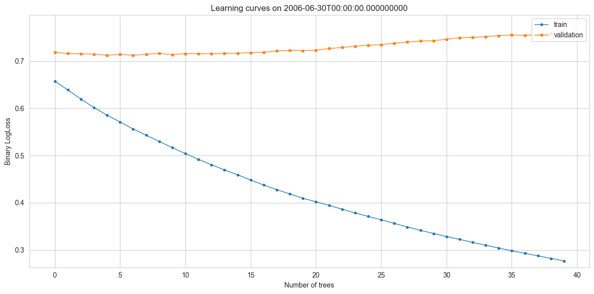
    


```python
example2=execution_dates[14]
plot_learning_curves(example)
```


    

    


Esta función nos da una idea de lo que esta pasando, el error en train disminuye a medida que aumentan los arboles, comportamiento que no se ve en test. La brecha entre train y test es enorme, indicativo claro de overfitting. Como primer paso esta bien, pero lo suyo seria ver el rendimiento de todos los `execution_date` en una misma visualización, ya que tenemos 1 modelo por cada execution_date. Guille nos propuso en la solución un plot muy interesante

```python
def plot_learning_curves_box(data, ylim=None):
    plt.style.use('ggplot')
    fig, ax = plt.subplots(figsize=(12,6))

    box_data = [
        data[data['n_trees_cat'] == tree]['norm_binary_logloss'].values
        for tree in sorted(data['n_trees_cat'].unique())
    ]

    box = ax.boxplot(
        box_data,
        patch_artist=True,
        widths=0.6,
        medianprops={'color':'white'}
    )

    for patch in box['boxes']:
        patch.set_facecolor('#1f77b4')

    ax.set_xticks(range(1, len(box_data) + 1))
    ax.set_xticklabels(sorted(data['n_trees_cat'].unique()))
    ax.set_title("Normalized metric evolution per iteration")
    ax.set_xlabel("Number of trees")
    ax.set_ylabel("norm_binary_logloss")
    ax.axhline(0, color='black', linestyle='--', linewidth=1)

    if ylim is not None:
        ax.set_ylim(ylim)

    plt.tight_layout()
    plt.show()
```

```python
def return_learning_curve(set_name):
    lc = pd.concat([
        pd.DataFrame({
            'n_trees':range(len(results[set_name]['binary_logloss'])),
            'binary_logloss': results[set_name]['binary_logloss'],
            'execution_date':date
        }) for date, results in all_results.items() if set_name in results
    ])

    lc['norm_binary_logloss'] = lc.groupby('execution_date')['binary_logloss'].transform(lambda x: (x - x.iloc[0])/x.iloc[0])


    lc['n_trees_cat'] = pd.Categorical(lc['n_trees'], categories=sorted(lc['n_trees'].unique()))

    return lc
```

```python
train_lc = return_learning_curve('training')
test_lc = return_learning_curve('valid_0')
print(train_lc)
plot_learning_curves_box(train_lc)
```

        n_trees  binary_logloss execution_date  norm_binary_logloss n_trees_cat
    0         0        0.657505     2006-06-30             0.000000           0
    1         1        0.639193     2006-06-30            -0.027851           1
    2         2        0.619754     2006-06-30            -0.057415           2
    3         3        0.601840     2006-06-30            -0.084660           3
    4         4        0.585715     2006-06-30            -0.109185           4
    ..      ...             ...            ...                  ...         ...
    35       35        0.622280     2020-03-31            -0.089537          35
    36       36        0.621630     2020-03-31            -0.090487          36
    37       37        0.620799     2020-03-31            -0.091703          37
    38       38        0.619807     2020-03-31            -0.093155          38
    39       39        0.618926     2020-03-31            -0.094444          39
    
    [2240 rows x 5 columns]


    
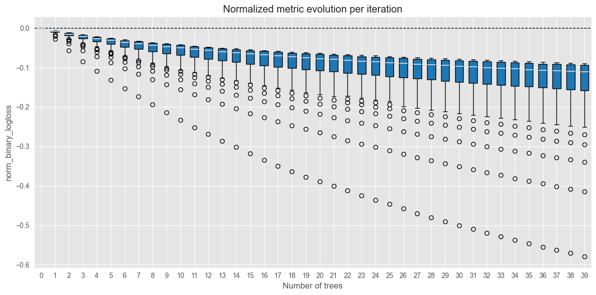
    


En train vemos que al aumentar el número de árboles, la función de perdida es baja, la mediana baja moderadamente, pero hay outliers que bajan muchisimo

```python
plot_learning_curves_box(test_lc)
```


    
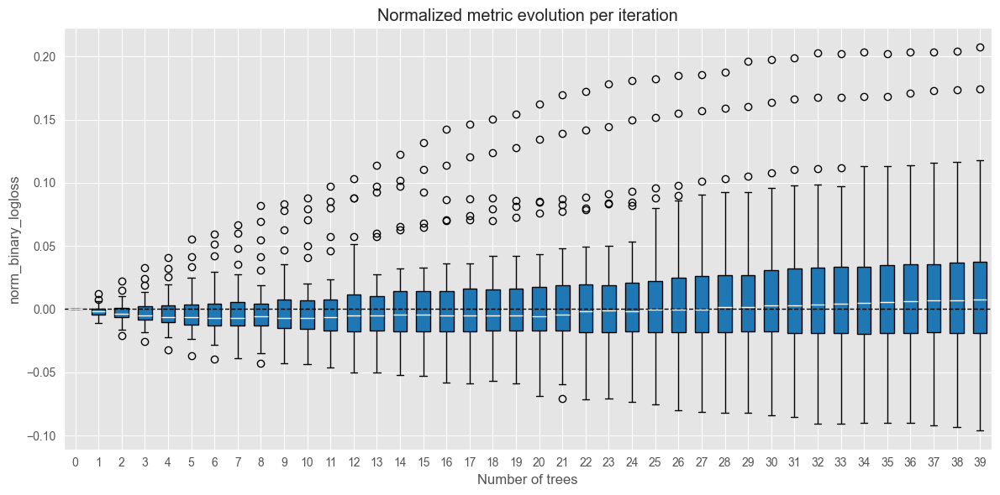
    


En test, la mediana de la logloss normalizada se mantiene constante, lo cual es malo porque no esta aprendiendo. Además hay outliers que mejoran bastante, pero hay otros outliers que empeoran mucho más, seguramente porque estamos haciendo overfitting. Vamos a hacer zoom en las learning curves de test

```python
test_lc_filtered = test_lc[test_lc["n_trees"] <= 19]
plot_learning_curves(test_lc_filtered, ylim=(-0.03, 0.03))
```


    
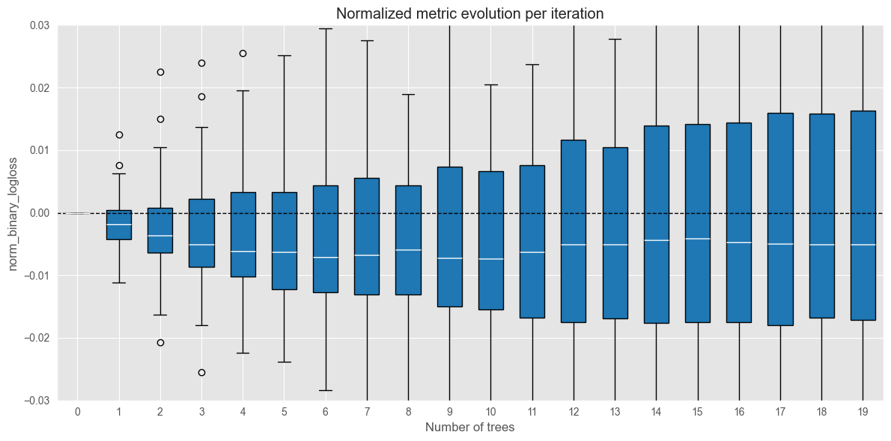
    


Se puede ver que hasta el arbol 10, la mediana baja un poco y despues vuelve a subir

Cuando vemos que un modelo es tan complejo y tiene tanto overfitting, hay que intentar simplificar mucho el modelo y apartir de ahi añadir capas de complejidad.

En particular vamos a probar a modificar estos 4 hiperparametros:

* learning_rate: controla la contribución de un arbol al siguiente

* n_estimators : numero de arboles

* path_smooth: suaviza las predicciones en los nodos terminales para evitar el sobreajuste, especialmente en hojas con pocas muestras.

* num_leaves: cuantas hojas tiene cada arbol

```python
params = {
    "random_state":1,
    "verbosity": -1,
    "n_jobs":10,
    "objective": "binary",
    "metric": "binary_logloss",
    "learning_rate": 10e-3,
    "path_smooth":0.2,
    "n_estimators":20
}

all_results = {}
all_predicted_tickers_list = []
all_models = {}

for execution_date in execution_dates:
    print(execution_date)
    all_results,all_predicted_tickers_list,all_models,model,X_train,X_test = run_model_for_execution_date(execution_date,all_results,all_predicted_tickers_list,all_models,n_trees,False)
all_predicted_tickers = pd.concat(all_predicted_tickers_list) 
```

    2005-06-30T00:00:00.000000000
    2005-09-30T00:00:00.000000000
    2005-12-30T00:00:00.000000000
    2006-03-31T00:00:00.000000000
    2006-06-30T00:00:00.000000000
    2006-09-30T00:00:00.000000000
    2006-12-30T00:00:00.000000000
    2007-03-31T00:00:00.000000000
    2007-06-30T00:00:00.000000000
    2007-09-30T00:00:00.000000000
    2007-12-30T00:00:00.000000000
    2008-03-31T00:00:00.000000000
    2008-06-30T00:00:00.000000000
    2008-09-30T00:00:00.000000000
    2008-12-30T00:00:00.000000000
    2009-03-31T00:00:00.000000000
    2009-06-30T00:00:00.000000000
    2009-09-30T00:00:00.000000000
    2009-12-30T00:00:00.000000000
    2010-03-31T00:00:00.000000000
    2010-06-30T00:00:00.000000000
    2010-09-30T00:00:00.000000000
    2010-12-30T00:00:00.000000000
    2011-03-31T00:00:00.000000000
    2011-06-30T00:00:00.000000000
    2011-09-30T00:00:00.000000000
    2011-12-30T00:00:00.000000000
    2012-03-31T00:00:00.000000000
    2012-06-30T00:00:00.000000000
    2012-09-30T00:00:00.000000000
    2012-12-30T00:00:00.000000000
    2013-03-31T00:00:00.000000000
    2013-06-30T00:00:00.000000000
    2013-09-30T00:00:00.000000000
    2013-12-30T00:00:00.000000000
    2014-03-31T00:00:00.000000000
    2014-06-30T00:00:00.000000000
    2014-09-30T00:00:00.000000000
    2014-12-30T00:00:00.000000000
    2015-03-31T00:00:00.000000000
    2015-06-30T00:00:00.000000000
    2015-09-30T00:00:00.000000000
    2015-12-30T00:00:00.000000000
    2016-03-31T00:00:00.000000000
    2016-06-30T00:00:00.000000000
    2016-09-30T00:00:00.000000000
    2016-12-30T00:00:00.000000000
    2017-03-31T00:00:00.000000000
    2017-06-30T00:00:00.000000000
    2017-09-30T00:00:00.000000000
    2017-12-30T00:00:00.000000000
    2018-03-31T00:00:00.000000000
    2018-06-30T00:00:00.000000000
    2018-09-30T00:00:00.000000000
    2018-12-30T00:00:00.000000000
    2019-03-31T00:00:00.000000000
    2019-06-30T00:00:00.000000000
    2019-09-30T00:00:00.000000000
    2019-12-30T00:00:00.000000000
    2020-03-31T00:00:00.000000000
    2020-06-30T00:00:00.000000000
    2020-09-30T00:00:00.000000000
    2020-12-30T00:00:00.000000000
    2021-03-27T00:00:00.000000000


```python
train_lc2 = return_learning_curve('training')
test_lc2 = return_learning_curve('valid_0')
plot_learning_curves_box(train_lc2)
```


    
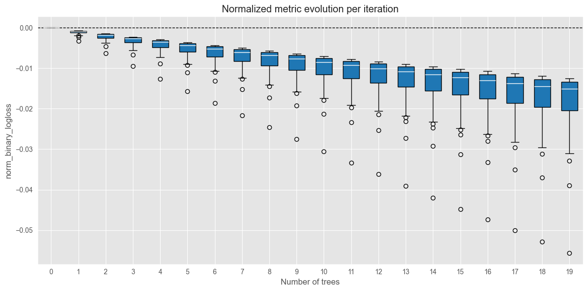
    


```python
plot_learning_curves_box(test_lc2)
```


    
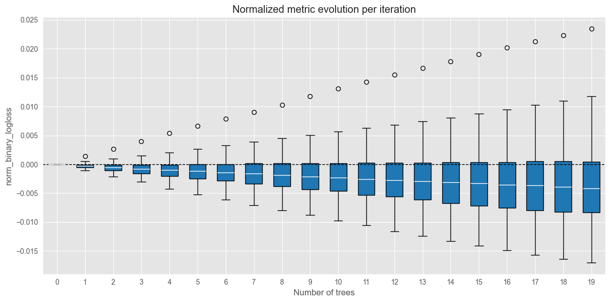
    


Pese a seguir haciendo overfitting, en el test set la logloss disminuye a medida que aumenta el numero de arboles, a diferencia del anterior entrenamiento que a partir del 10º arbol volvia a aumentar. Llegados a este punto, aunque el modelo siga haciendo overfitting, vamos a considerar que está más o menos "generalizando" y continuaremos con el paso de Feature Importance, uno de los objetivos principales de este modulo

### ***Feature importance***

Feature importance nos srive para: 

* Diagnosticar si alguna de las features tiene una importancia extremadamente alta --> sintoma de data leakage

* Detectar las features más importantes y reentrenar solo con esas (modelo menos complejo, menos computo, predicciones más rapidas)

* Entender los factores que hacen que el modelo prediga lo que esta prediciendo

Función para calcular la media de Feature importance de todos los modelos entrenados 

```python
def plot_average_feature_importance(all_models, top=15):
    all_dfs = []
    
    for execution_date in all_models:
        model = all_models[execution_date]
        fi = model.feature_importance(importance_type="gain")
        fn = [str(f) for f in model.feature_name()]
        df = pd.DataFrame({"feature": fn, "imp": fi})
        all_dfs.append(df)
    

    combined = pd.concat(all_dfs)
    avg_imp = combined.groupby("feature")["imp"].mean().reset_index()
    avg_imp["imp_pct"] = (avg_imp["imp"] / avg_imp["imp"].sum()) * 100  # Porcentaje
    

    avg_imp = avg_imp.sort_values("imp_pct", ascending=False).head(top)
    
    fig, ax = plt.subplots(figsize=(12, 7))
    bars = ax.barh(avg_imp["feature"], avg_imp["imp_pct"], color="skyblue")
    ax.invert_yaxis()
    ax.set_title("Average Feature Importance (All Dates)")
    ax.set_xlabel("Average Importance (%)")
    plt.show()
```

```python
plot_average_feature_importance(all_models, top=15)
```


    
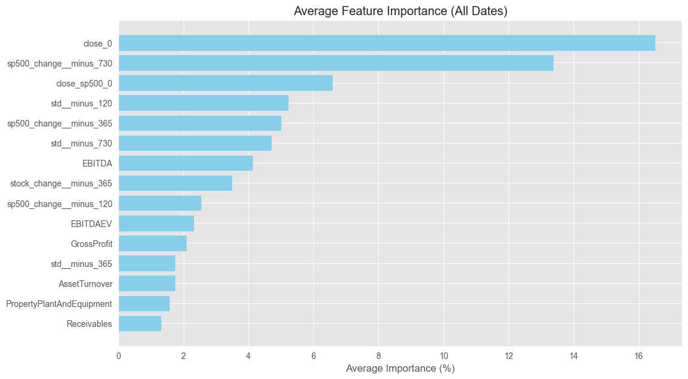
    


Las features más importantes son: 

* close_0 : precio de la acción en la execution_date

* sp500_change_minus_730 : % change of the SP500 in the last 2 years

* close_sp500_o : precio de SP500 en execution_date

Normalmente, el feature importance para arboles no se usa mucho ya que se basan en el numero de veces que se ha utilizado una variable para hacer splits en el arbol, lo cual tiene un sesgo muy alto a variables con cardinalidad alta (aunque no sea importante esa feature tiene mas probabilidad de ser escogida para hacer un split simplemente por su cardinalidad.)

Son mucho más interesantes otros metodos que son agnosticos al modelo que utilicemos como:

* Feature permutation: En el conjunto de test, hago una permutacion aleatoria de los valores de una feature concreta y veo la diferencia entre la predicción con la feature randomizada y sin randomizar, calculando esa diferencia.

    Diferencia grande --> Feature ***importante***

    Diferencia pequeña --> Feature no es importante

    Problema: No nos dice la dirección de la importancia

    

* SHAP: Para cada sample, mide cuanto ha contribuido cada feature a la predicción comparando con la predicción media del modelo.

Primero, vamos a utilizar feature permutation

```python
import sklearn
from sklearn.inspection import permutation_importance

def train_model(train_set, test_set, compute_importance = False):
    global params
    columns_to_remove = get_columns_to_remove()

    X_train = train_set.drop(columns=columns_to_remove, errors="ignore")
    X_test = test_set.drop(columns=columns_to_remove, errors="ignore")

    y_train = train_set["target"]
    y_test = test_set["target"]

    model = lgb.LGBMClassifier(**params)
    lgb_train = lgb.Dataset(X_train, label=y_train)
    lgb_test = lgb.Dataset(X_test, label=y_test, reference=lgb_train)

    eval_result={}
    model.fit(X_train, y_train, eval_set=[(X_test, y_test), (X_train, y_train)],
              eval_metric=top_wt_performance, callbacks=[lgb.record_evaluation(eval_result)])
    if compute_importance:
        r = permutation_importance(model, X_test, y_test, n_repeats=30, random_state=0)
        feature_names = X_test.columns
        df_permutation_importance = pd.DataFrame({'importance': r.importances_mean, 'feature': feature_names})
    else:
        df_permutation_importance = pd.DataFrame()
    
    return model, eval_result, X_train, X_test, df_permutation_importance

```

```python
def run_model_for_execution_date(execution_date, all_results, all_predicted_tickers_list, all_models, include_nulls_in_test = False, compute_importance = False):
    global train_set
    global test_set
    global all_permutation_importances

    train_set, test_set = split_train_test_by_period(data_set, execution_date, include_nulls_in_test = include_nulls_in_test)
    train_size, _ = train_set.shape
    test_size, _ = test_set.shape
    model = None
    X_train = None
    X_test = None

    if train_size > 0 and test_size>0:
        model, evals_result, X_train, X_test, df_permutation_importance = train_model(train_set, test_set, compute_importance)
        if type(model)==lgb.sklearn.LGBMClassifier:
            model = model.booster_
        test_set['prob'] = model.predict(X_test)
        predicted_tickers = test_set.sort_values('prob', ascending=False)
        predicted_tickers["execution_date"] = execution_date
        all_results[(execution_date)] = evals_result
        all_models[(execution_date)] = model
        all_predicted_tickers_list.append(predicted_tickers)
        df_permutation_importance["execution_date"]= execution_date
        all_permutation_importances = pd.concat([all_permutation_importances, df_permutation_importance])


    return all_results, all_predicted_tickers_list, all_models, model, X_train, X_test 


```

El cálculo de la permutation importance es un poco lento. No tiene sentido calcularlo en cualquier periodo y por eso modificamos la función train_model_accross_periods para permitir el entrenamiento sólo en un subconjunto.

```python
def train_model_accross_periods(train_period_frequency = 1, compute_importance = False):
    global all_results
    global all_predicted_tickers_list
    global all_models
    global all_predicted_tickers
    for i, execution_date in enumerate(execution_dates):
        if i%train_period_frequency==0:
            print(execution_date)
            all_results, all_predicted_tickers_list, all_models, model, X_train, X_test = run_model_for_execution_date(execution_date, all_results, all_predicted_tickers_list, all_models, False,compute_importance)

    all_predicted_tickers = pd.concat(all_predicted_tickers_list)
```

```python
params = {
    "random_state":1,
    "verbosity": -1,
    "n_jobs":10,
    "objective": "binary",
    "metric": "binary_logloss",
    "learning_rate": 10e-3,
    "path_smooth":0.2,
    "n_estimators":20
}

all_results = {}
all_predicted_tickers_list = []
all_models = {}
all_permutation_importances = pd.DataFrame()

train_model_accross_periods(train_period_frequency=2, compute_importance=True)

```

    2005-06-30T00:00:00.000000000
    2005-12-30T00:00:00.000000000
    2006-06-30T00:00:00.000000000
    2006-12-30T00:00:00.000000000
    2007-06-30T00:00:00.000000000
    2007-12-30T00:00:00.000000000
    2008-06-30T00:00:00.000000000
    2008-12-30T00:00:00.000000000
    2009-06-30T00:00:00.000000000
    2009-12-30T00:00:00.000000000
    2010-06-30T00:00:00.000000000
    2010-12-30T00:00:00.000000000
    2011-06-30T00:00:00.000000000
    2011-12-30T00:00:00.000000000
    2012-06-30T00:00:00.000000000
    2012-12-30T00:00:00.000000000
    2013-06-30T00:00:00.000000000
    2013-12-30T00:00:00.000000000
    2014-06-30T00:00:00.000000000
    2014-12-30T00:00:00.000000000
    2015-06-30T00:00:00.000000000
    2015-12-30T00:00:00.000000000
    2016-06-30T00:00:00.000000000
    2016-12-30T00:00:00.000000000
    2017-06-30T00:00:00.000000000
    2017-12-30T00:00:00.000000000
    2018-06-30T00:00:00.000000000
    2018-12-30T00:00:00.000000000
    2019-06-30T00:00:00.000000000
    2019-12-30T00:00:00.000000000
    2020-06-30T00:00:00.000000000
    2020-12-30T00:00:00.000000000


Se define una función para visualizar las features más importantes

```python
def plot_top_features(all_permutation_importances, top_n=10, figsize=(10, 6), title="Top 10 Características Más Importantes (Feature Importance)"):
 

    all_permutation_importances = all_permutation_importances.sort_values(["execution_date", "importance"], ascending=False)
    all_permutation_importances_sum = all_permutation_importances.groupby(["feature"])["importance"].mean().reset_index()
    all_permutation_importances_sum = all_permutation_importances_sum.sort_values("importance", ascending=False)
    all_permutation_importances_sum = all_permutation_importances_sum.head(top_n)


    plt.figure(figsize=figsize)
    sns.barplot(
        x="importance",
        y="feature",
        data=all_permutation_importances_sum,
        orient="h"
    )


    plt.title(title, fontsize=14)
    plt.xlabel("Importancia Media", fontsize=12)
    plt.ylabel("Característica", fontsize=12)
    plt.grid(axis="x", linestyle="--", alpha=0.4)


    for i, v in enumerate(all_permutation_importances_sum["importance"]):
        plt.text(v + 0.001, i, f"{v:.4f}", color='black', va="center")


    plt.tight_layout()
    plt.show()
```

```python
all_permutation_importances = all_permutation_importances.sort_values(["execution_date", "importance"], ascending=False)

```

```python
plot_top_features(all_permutation_importances, top_n=10, figsize=(10, 6), title="Top 10 important features")
```


    
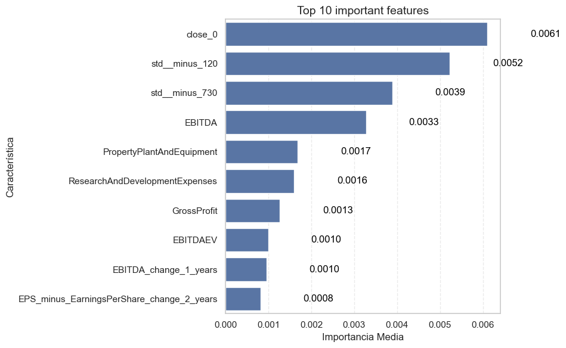
    


Es curioso que `close_0` es la feature mas importante global, cuando lo unico que representa es el precio de la acción en el momento de la predicción. 

Se puede visualizar también para varios periodos, las 2 features más importantes, para asegurarnos de que close_0 se encuentra en muchos periodos y su valor tan alto no se debe solo a que en unos pocos periodos tiene un valor elevadisimo.

```python
all_permutation_importances["rank"] = all_permutation_importances.groupby(["execution_date"]).cumcount()
r_all_permutation_importances = all_permutation_importances[all_permutation_importances["rank"] < 2]
```

```python
r_all_permutation_importances = r_all_permutation_importances.sort_values("execution_date")
```

```python
def plot_top_2_features(input_data):

    plt.figure(figsize=(20, 10)) 
    sns.set_theme(style="whitegrid")


    ax = sns.barplot(
        data=input_data,
        x="execution_date",
        y="importance",
        hue="feature",
        palette="bright",  
        saturation=0.9,
        dodge=False     
    )


    ax.xaxis.set_major_locator(plt.MaxNLocator(8))
    plt.xticks(
        rotation=45,
        ha="right",
        fontsize=12,        # Texto más grande
        fontweight="bold"   # Negrita para legibilidad
    )

    # Personalizar grosor y estilo
    plt.title("Top 2 Features por fecha (importance)", fontsize=16, pad=20, fontweight="bold")
    plt.xlabel("Date", fontsize=14, labelpad=15)
    plt.ylabel("Importance", fontsize=14, labelpad=15)


    plt.legend(
        bbox_to_anchor=(1.15, 1),
        loc="upper left",
        title="Características",
        title_fontsize=12,
        fontsize=12,
        frameon=True
    )


    ax.spines[["top", "right"]].set_visible(False)
    plt.grid(axis="y", linestyle="--", alpha=0.5, linewidth=1)

    plt.tight_layout()
    plt.show()
```

```python
plot_top_2_features(r_all_permutation_importances)
```


    
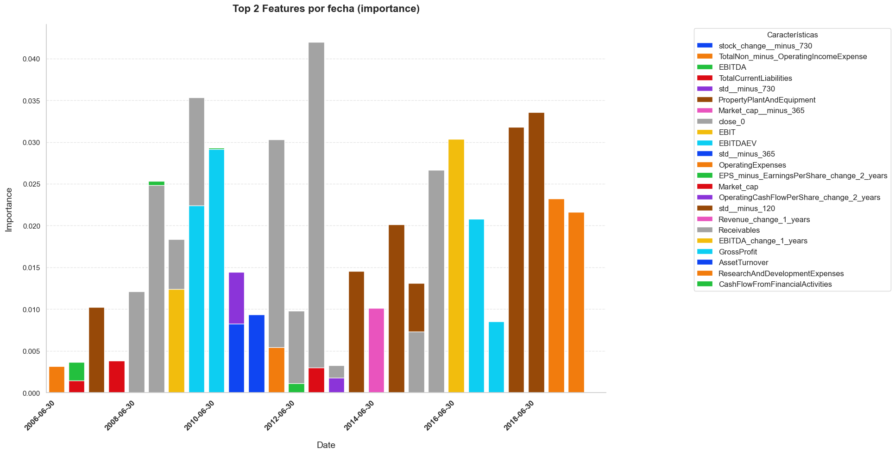
    


`close_0` aparece en muchos periodos y en los periodos en los que esta, es muy importante. Vamos a analizar por ejemplo `2015-12-30`, para entender mejor de donde puede venir esa importancia tan alta

```python
all_permutation_importances[all_permutation_importances["execution_date"] == "2009-06-30" ]
```


<div>
<style scoped>
    .dataframe tbody tr th:only-of-type {
        vertical-align: middle;
    }

    .dataframe tbody tr th {
        vertical-align: top;
    }

    .dataframe thead th {
        text-align: right;
    }
</style>
<table border="1" class="dataframe">
  <thead>
    <tr style="text-align: right;">
      <th></th>
      <th>importance</th>
      <th>feature</th>
      <th>execution_date</th>
      <th>rank</th>
    </tr>
  </thead>
  <tbody>
    <tr>
      <th>87</th>
      <td>0.018389</td>
      <td>close_0</td>
      <td>2009-06-30</td>
      <td>0</td>
    </tr>
    <tr>
      <th>17</th>
      <td>0.012394</td>
      <td>EBIT</td>
      <td>2009-06-30</td>
      <td>1</td>
    </tr>
    <tr>
      <th>105</th>
      <td>0.006383</td>
      <td>EBITEV</td>
      <td>2009-06-30</td>
      <td>2</td>
    </tr>
    <tr>
      <th>98</th>
      <td>0.004385</td>
      <td>std__minus_120</td>
      <td>2009-06-30</td>
      <td>3</td>
    </tr>
    <tr>
      <th>116</th>
      <td>0.003281</td>
      <td>EPS_minus_EarningsPerShare_change_2_years</td>
      <td>2009-06-30</td>
      <td>4</td>
    </tr>
    <tr>
      <th>...</th>
      <td>...</td>
      <td>...</td>
      <td>...</td>
      <td>...</td>
    </tr>
    <tr>
      <th>122</th>
      <td>-0.006831</td>
      <td>EBITDA_change_2_years</td>
      <td>2009-06-30</td>
      <td>128</td>
    </tr>
    <tr>
      <th>113</th>
      <td>-0.007442</td>
      <td>ROC</td>
      <td>2009-06-30</td>
      <td>129</td>
    </tr>
    <tr>
      <th>69</th>
      <td>-0.008934</td>
      <td>RetainedEarningsAccumulatedDeficit</td>
      <td>2009-06-30</td>
      <td>130</td>
    </tr>
    <tr>
      <th>19</th>
      <td>-0.010887</td>
      <td>EBITDA</td>
      <td>2009-06-30</td>
      <td>131</td>
    </tr>
    <tr>
      <th>104</th>
      <td>-0.021342</td>
      <td>EBITDAEV</td>
      <td>2009-06-30</td>
      <td>132</td>
    </tr>
  </tbody>
</table>
<p>133 rows × 4 columns</p>
</div>


Los tickers con mayor probabilidad en esta fecha son:

```python
tickers = all_predicted_tickers[all_predicted_tickers["execution_date"] == "2009-06-30"].sort_values("prob", ascending=False)
tickers[["Ticker", "close_0", "prob"]].head(10)
```


<div>
<style scoped>
    .dataframe tbody tr th:only-of-type {
        vertical-align: middle;
    }

    .dataframe tbody tr th {
        vertical-align: top;
    }

    .dataframe thead th {
        text-align: right;
    }
</style>
<table border="1" class="dataframe">
  <thead>
    <tr style="text-align: right;">
      <th></th>
      <th>Ticker</th>
      <th>close_0</th>
      <th>prob</th>
    </tr>
  </thead>
  <tbody>
    <tr>
      <th>34343</th>
      <td>PNC</td>
      <td>38.810000</td>
      <td>0.527120</td>
    </tr>
    <tr>
      <th>33980</th>
      <td>CM</td>
      <td>50.208809</td>
      <td>0.527120</td>
    </tr>
    <tr>
      <th>36064</th>
      <td>TM</td>
      <td>75.530000</td>
      <td>0.526818</td>
    </tr>
    <tr>
      <th>35500</th>
      <td>GS</td>
      <td>147.440000</td>
      <td>0.525329</td>
    </tr>
    <tr>
      <th>34183</th>
      <td>MBI</td>
      <td>4.330000</td>
      <td>0.524725</td>
    </tr>
    <tr>
      <th>35930</th>
      <td>EGY</td>
      <td>4.230000</td>
      <td>0.524725</td>
    </tr>
    <tr>
      <th>35901</th>
      <td>ROL</td>
      <td>3.419259</td>
      <td>0.524725</td>
    </tr>
    <tr>
      <th>35957</th>
      <td>INFY</td>
      <td>4.597500</td>
      <td>0.524725</td>
    </tr>
    <tr>
      <th>35542</th>
      <td>EW</td>
      <td>5.669167</td>
      <td>0.524725</td>
    </tr>
    <tr>
      <th>34472</th>
      <td>AAPL</td>
      <td>5.086786</td>
      <td>0.524725</td>
    </tr>
  </tbody>
</table>
</div>


Y los tickers con menor probabilidad en esta fecha son:

```python
tickers = all_predicted_tickers[all_predicted_tickers["execution_date"] == "2009-06-30"].sort_values("prob", ascending=True)
tickers[["Ticker", "close_0", "prob"]].head(10)
```


<div>
<style scoped>
    .dataframe tbody tr th:only-of-type {
        vertical-align: middle;
    }

    .dataframe tbody tr th {
        vertical-align: top;
    }

    .dataframe thead th {
        text-align: right;
    }
</style>
<table border="1" class="dataframe">
  <thead>
    <tr style="text-align: right;">
      <th></th>
      <th>Ticker</th>
      <th>close_0</th>
      <th>prob</th>
    </tr>
  </thead>
  <tbody>
    <tr>
      <th>35083</th>
      <td>CYCC</td>
      <td>1900.080000</td>
      <td>0.453509</td>
    </tr>
    <tr>
      <th>35952</th>
      <td>VBFC</td>
      <td>75.200000</td>
      <td>0.453509</td>
    </tr>
    <tr>
      <th>35096</th>
      <td>USEG</td>
      <td>120.000000</td>
      <td>0.453509</td>
    </tr>
    <tr>
      <th>35909</th>
      <td>TOWN</td>
      <td>13.592233</td>
      <td>0.454130</td>
    </tr>
    <tr>
      <th>34237</th>
      <td>PNFP</td>
      <td>13.320000</td>
      <td>0.454760</td>
    </tr>
    <tr>
      <th>36056</th>
      <td>SEED</td>
      <td>46.400000</td>
      <td>0.456984</td>
    </tr>
    <tr>
      <th>33961</th>
      <td>OPTT</td>
      <td>1168.000000</td>
      <td>0.456984</td>
    </tr>
    <tr>
      <th>35706</th>
      <td>MA</td>
      <td>16.731000</td>
      <td>0.457387</td>
    </tr>
    <tr>
      <th>35747</th>
      <td>TT</td>
      <td>12.941984</td>
      <td>0.458346</td>
    </tr>
    <tr>
      <th>34760</th>
      <td>ARNA</td>
      <td>49.900000</td>
      <td>0.458412</td>
    </tr>
  </tbody>
</table>
</div>


Algunos de los tickers con menor probabilidad tienen un `close_0`muy alto, como CYCC o OPTT

Vamos ahora a utilizar SHAP, podemos ver el feature importance de cada sample, en este caso de cada ticker

```python
#!poetry add shap
```

```python
import shap
def get_shap_values_for_ticker_execution_date(execution_date, ticker = None):
    
    date = np.datetime64(execution_date)
    model_ = all_models[date]
    fn = model_.feature_name()
    X_test = all_predicted_tickers[(all_predicted_tickers["execution_date"] == date)]
    if ticker is not None:
        X_test = X_test[X_test["Ticker"] == ticker]
    X_test["Ticker"] = X_test["Ticker"].astype("category")
    X_test = X_test.sort_values("Ticker")
    if ticker is not None:
        explainer = shap.Explainer(model_)
        shap_values = explainer(X_test[fn])
        

        if len(shap_values.shape) == 3:
            shap_values = shap_values[:, :, 1]
        else:
            shap_values = shap_values
    else:
        explainer = shap.Explainer(model_,X_test[fn])
        shap_values = explainer(X_test[fn])
    return shap_values
```

```python
sv = get_shap_values_for_ticker_execution_date("2009-06-30T00:00:00.000000000")
shap.plots.bar(sv, max_display=8)
```


    
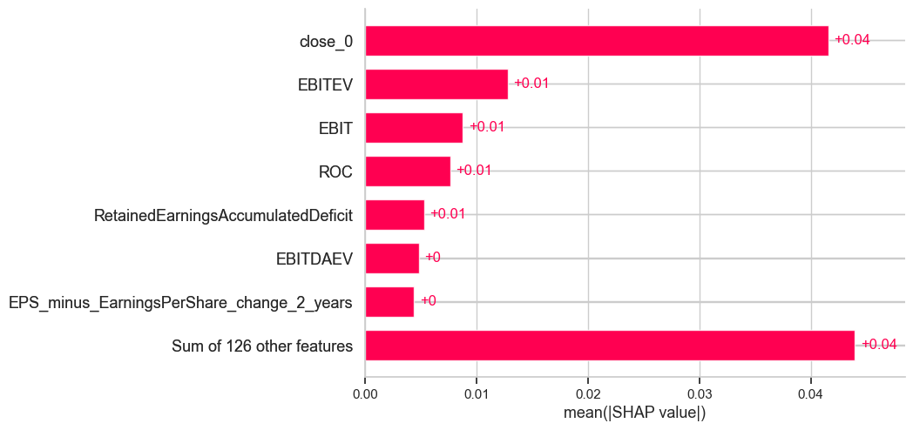
    


```python
shap.plots.beeswarm(sv)
```


    
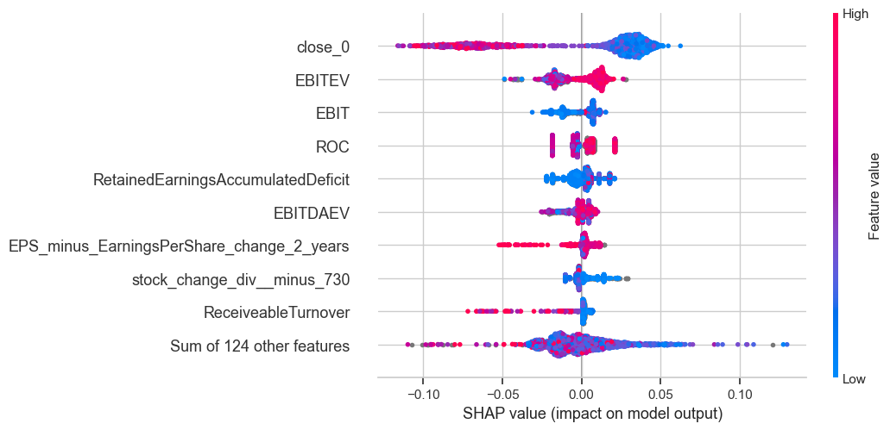
    


El modelo asigna mayor probabilidad a los tickers con menor valor en `close_0`(puntos azules) y menor probabilidad a los puntos con mayor valor en `close_0`.
Acciones con precio bajo tienen mayor probabilidad de ser elegidas por el modelo.

```python
sv = get_shap_values_for_ticker_execution_date("2009-06-30T00:00:00.000000000", ticker = "PNC")
shap.plots.waterfall(sv[0])
```


    
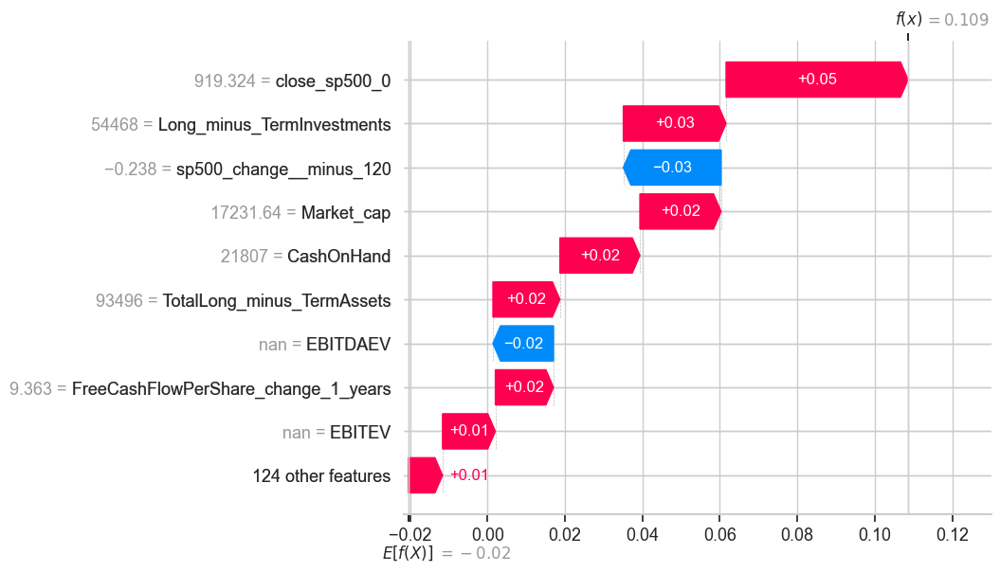
    


Analizando el ticker "PNC" de los tickers con mayor probabilidad de esta fecha, vemos que close_0 da lugar a una mayor predicción y `close_0` es 38.8 en este caso

```python
sv = get_shap_values_for_ticker_execution_date("2009-06-30T00:00:00.000000000", ticker = "CYCC")
shap.plots.waterfall(sv[0])
```


    
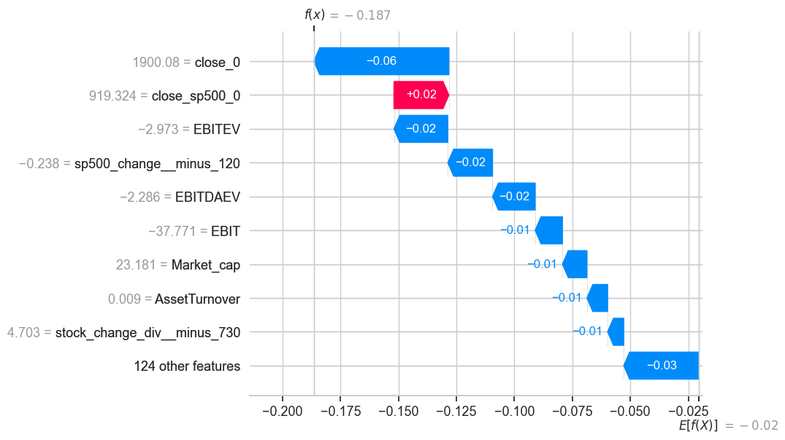
    


```python
sv = get_shap_values_for_ticker_execution_date("2009-06-30T00:00:00.000000000", ticker = "OPTT")
shap.plots.waterfall(sv[0])
```


    
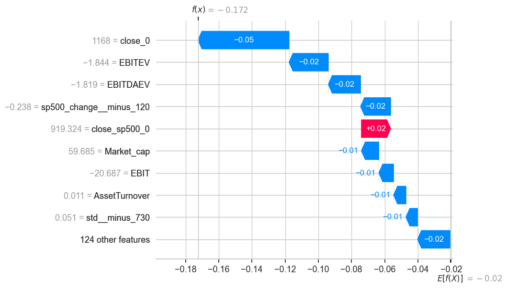
    


Sin embargo, analizando el ticker "CYCC" y "OPTT", dos de los ticker con probabilidad de esta fecha y con mayor close_0, vemos que close_0 da lugar a una menor predicción y `close_0` es 1900 y 1168 en este caso (lo vemos en tickers[["Ticker", "close_0", "prob"]].head(10), unas celdas más arriba). Hay un patron claro, cuanto mayor es el precio de la accion, menor es la probabilidad que asigna el modelo , pero, ¿porque ocurre esto? al final es solo un numero, no deberia influir.

En estos casos, el conocimiento sobre la materia es clave, ya que si buscamos en google la accion CYCC

```python
from IPython.display import Image
Image(filename="CYCC_stock.png")
```


    
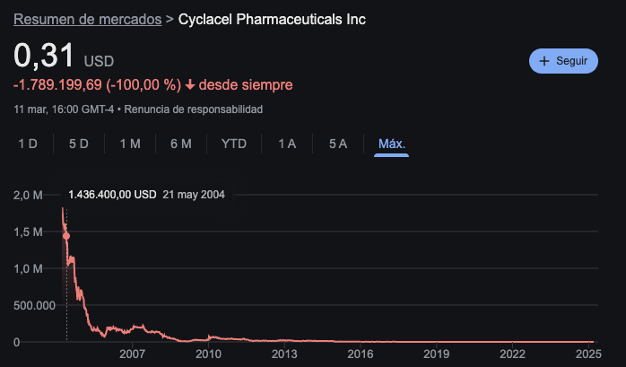
    


Vemos que una acción de esta empresa valia 1.436.400 USD en 2004, esto es un precio altisimo para una acción, ¿es posible?

Este concepto esta relacionado con los splits, un concepto en el que empresas dividen sus acciones para tener mas, pero de menos valor. Es como si tengo un billete de 10€ y lo cambio por 2 billetes de 5€.

Un counter split es lo contrario, reducir el número de acciones y aumentar el precio por acción.

Por tanto, el valor de 1.436.400 USD en 2004, es el valor que tenia en su momento pero aplicando todos los counter splits posteriores. La serie se expresa en función del precio actual.


El modelo esta aprendiendo que las acciones con un precio muy alto en el pasado tienen en la actualidad un precio mucho más bajo.

Lo más sensato es eliminar esta feature y reentreanr, incluso podemos eliminar todas las technical features.

```python
def get_columns_to_remove():
    columns_to_remove = [
                        "date",
                        "improve_sp500",
                        "Ticker",
                        "freq",
                        "set",
                        "close_sp500_365",
                        "close_365",
                        "stock_change_365",
                        "stock_change_div_365",
                        "stock_change_730",
                        "stock_change_div_730",
                        "sp500_change_365",
                        "sp500_change_730",
                        "diff_ch_sp500",
                        "diff_ch_avg_500",
                        "execution_date",
                        "target",
                        "index",
                        "quarter",
                        "std_730",
                        "count",
                        "stock_change_div__minus_365"
                        
    ]
    columns_to_remove += technical_features
    return columns_to_remove
```

```python
params = {
    "random_state":1,
    "verbosity": -1,
    "n_jobs":10,
    "objective": "binary",
    "metric": "binary_logloss",
    "learning_rate": 10e-3,
    "path_smooth":0.2,
    "n_estimators":20
}

all_results = {}
all_predicted_tickers_list = []
all_models = {}
all_permutation_importances = pd.DataFrame()

train_model_accross_periods(train_period_frequency=1, compute_importance=False)
```

    2005-06-30T00:00:00.000000000
    2005-09-30T00:00:00.000000000
    2005-12-30T00:00:00.000000000
    2006-03-31T00:00:00.000000000
    2006-06-30T00:00:00.000000000
    2006-09-30T00:00:00.000000000
    2006-12-30T00:00:00.000000000
    2007-03-31T00:00:00.000000000
    2007-06-30T00:00:00.000000000
    2007-09-30T00:00:00.000000000
    2007-12-30T00:00:00.000000000
    2008-03-31T00:00:00.000000000
    2008-06-30T00:00:00.000000000
    2008-09-30T00:00:00.000000000
    2008-12-30T00:00:00.000000000
    2009-03-31T00:00:00.000000000
    2009-06-30T00:00:00.000000000
    2009-09-30T00:00:00.000000000
    2009-12-30T00:00:00.000000000
    2010-03-31T00:00:00.000000000
    2010-06-30T00:00:00.000000000
    2010-09-30T00:00:00.000000000
    2010-12-30T00:00:00.000000000
    2011-03-31T00:00:00.000000000
    2011-06-30T00:00:00.000000000
    2011-09-30T00:00:00.000000000
    2011-12-30T00:00:00.000000000
    2012-03-31T00:00:00.000000000
    2012-06-30T00:00:00.000000000
    2012-09-30T00:00:00.000000000
    2012-12-30T00:00:00.000000000
    2013-03-31T00:00:00.000000000
    2013-06-30T00:00:00.000000000
    2013-09-30T00:00:00.000000000
    2013-12-30T00:00:00.000000000
    2014-03-31T00:00:00.000000000
    2014-06-30T00:00:00.000000000
    2014-09-30T00:00:00.000000000
    2014-12-30T00:00:00.000000000
    2015-03-31T00:00:00.000000000
    2015-06-30T00:00:00.000000000
    2015-09-30T00:00:00.000000000
    2015-12-30T00:00:00.000000000
    2016-03-31T00:00:00.000000000
    2016-06-30T00:00:00.000000000
    2016-09-30T00:00:00.000000000
    2016-12-30T00:00:00.000000000
    2017-03-31T00:00:00.000000000
    2017-06-30T00:00:00.000000000
    2017-09-30T00:00:00.000000000
    2017-12-30T00:00:00.000000000
    2018-03-31T00:00:00.000000000
    2018-06-30T00:00:00.000000000
    2018-09-30T00:00:00.000000000
    2018-12-30T00:00:00.000000000
    2019-03-31T00:00:00.000000000
    2019-06-30T00:00:00.000000000
    2019-09-30T00:00:00.000000000
    2019-12-30T00:00:00.000000000
    2020-03-31T00:00:00.000000000
    2020-06-30T00:00:00.000000000
    2020-09-30T00:00:00.000000000
    2020-12-30T00:00:00.000000000
    2021-03-27T00:00:00.000000000


```python
train_lc3 = return_learning_curve('training')
test_lc3 = return_learning_curve('valid_0')
plot_learning_curves_box(train_lc3)
```


    
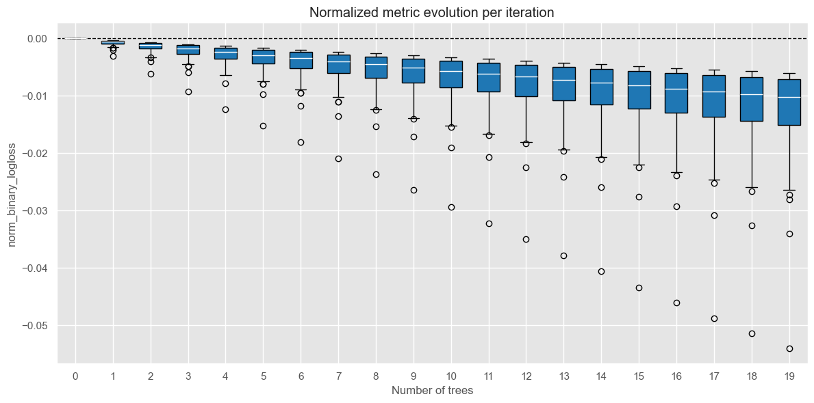
    


```python
plot_learning_curves_box(test_lc3)
```


    
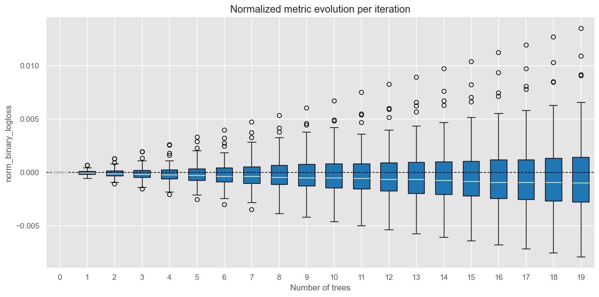
    


El modelo ahora es un poco peor, pero tiene sentido, ahora no estamos haciendo data leakage

Vamos a comprobar feature importance con este nuevo modelo

```python
params = {
    "random_state":1,
    "verbosity": -1,
    "n_jobs":10,
    "objective": "binary",
    "metric": "binary_logloss",
    "learning_rate": 10e-3,
    "path_smooth":0.2,
    "n_estimators":20
}

all_results = {}
all_predicted_tickers_list = []
all_models = {}
all_permutation_importances = pd.DataFrame()

train_model_accross_periods(train_period_frequency=2, compute_importance=True)
```

    2005-06-30T00:00:00.000000000
    2005-12-30T00:00:00.000000000
    2006-06-30T00:00:00.000000000
    2006-12-30T00:00:00.000000000
    2007-06-30T00:00:00.000000000
    2007-12-30T00:00:00.000000000
    2008-06-30T00:00:00.000000000
    2008-12-30T00:00:00.000000000
    2009-06-30T00:00:00.000000000
    2009-12-30T00:00:00.000000000
    2010-06-30T00:00:00.000000000
    2010-12-30T00:00:00.000000000
    2011-06-30T00:00:00.000000000
    2011-12-30T00:00:00.000000000
    2012-06-30T00:00:00.000000000
    2012-12-30T00:00:00.000000000
    2013-06-30T00:00:00.000000000
    2013-12-30T00:00:00.000000000
    2014-06-30T00:00:00.000000000
    2014-12-30T00:00:00.000000000
    2015-06-30T00:00:00.000000000
    2015-12-30T00:00:00.000000000
    2016-06-30T00:00:00.000000000
    2016-12-30T00:00:00.000000000
    2017-06-30T00:00:00.000000000
    2017-12-30T00:00:00.000000000
    2018-06-30T00:00:00.000000000
    2018-12-30T00:00:00.000000000
    2019-06-30T00:00:00.000000000
    2019-12-30T00:00:00.000000000
    2020-06-30T00:00:00.000000000
    2020-12-30T00:00:00.000000000


```python
all_permutation_importances = all_permutation_importances.sort_values(["execution_date", "importance"], ascending=False)
```

```python
plot_top_features(all_permutation_importances, top_n=10, figsize=(10, 6), title="Top 10 Características Más Importantes")
```


    
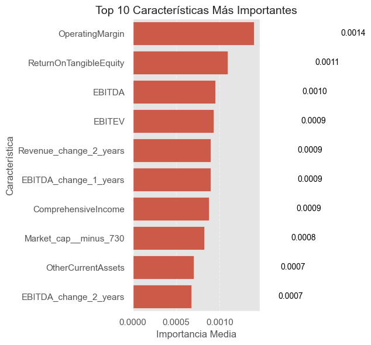
    


Estas features tienen más sentido, son features que determinan el valor de una empresa y es normal que el modelo aprenda de ellas

```python
all_permutation_importances["rank"] = all_permutation_importances.groupby(["execution_date"]).cumcount()
r_all_permutation_importances = all_permutation_importances[all_permutation_importances["rank"] < 2]


```

```python
r_all_permutation_importances = r_all_permutation_importances.sort_values("execution_date")
```

```python
plot_top_2_features(r_all_permutation_importances)
```


    
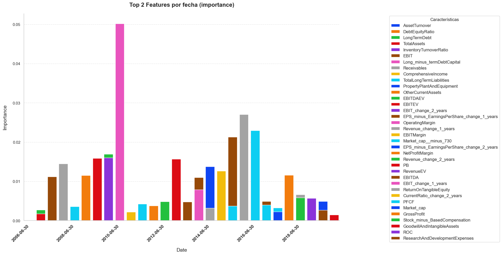
    


Vemos como en cada periodo hay distintas features con importancia, no hay ninguna que este en muchos periodos con mucha importancia como ocurria antes con close__0

Ahora que ya hemos logrado un modelo sin data leakage y que generaliza, podemos ver como son los resultados en funcion de la metrica de negocio "weighted-return" 

```python
'''def train_model_accross_periods(train_period_frequency = 1, compute_importance = False):
    global all_results
    global all_predicted_tickers_list
    global all_models
    global all_predicted_tickers
    for i, execution_date in enumerate(execution_dates):
        if i%train_period_frequency==0:
            print(execution_date)
            all_results, all_predicted_tickers_list, all_models, model, X_train, X_test = run_model_for_execution_date(execution_date, all_results, all_predicted_tickers_list, all_models, False,compute_importance)

    all_predicted_tickers = pd.concat(all_predicted_tickers_list)'''
```


    'def train_model_accross_periods(train_period_frequency = 1, compute_importance = False):\n    global all_results\n    global all_predicted_tickers_list\n    global all_models\n    global all_predicted_tickers\n    for i, execution_date in enumerate(execution_dates):\n        if i%train_period_frequency==0:\n            print(execution_date)\n            all_results, all_predicted_tickers_list, all_models, model, X_train, X_test = run_model_for_execution_date(execution_date, all_results, all_predicted_tickers_list, all_models, False,compute_importance)\n\n    all_predicted_tickers = pd.concat(all_predicted_tickers_list)'


Hay que adaptar las funciones para poder comparar con el benchmark

```python
def train_model(train_set,test_set, compute_importance=False):

    global params 
    global model

    columns_to_remove = get_columns_to_remove()
    
    X_train = train_set.drop(columns = columns_to_remove, errors = "ignore")
    X_test = test_set.drop(columns = columns_to_remove, errors = "ignore")
    
    
    y_train = train_set["target"]
    y_test = test_set["target"]

    lgb_train = lgb.Dataset(X_train,y_train)
    lgb_test = lgb.Dataset(X_test, y_test, reference=lgb_train)
    
    eval_result = {}
    
 
    
    model = lgb.train(params = params,train_set = lgb_train,
                      valid_sets = [lgb_test,lgb_train],
                      feval = [top_wt_performance],
                      callbacks = [lgb.record_evaluation(eval_result = eval_result)])
    return model,eval_result,X_train,X_test, pd.DataFrame()
```

```python
params = {
    "random_state":1,
    "verbosity": -1,
    "n_jobs":10,
    "objective": "binary",
    "metric": "binary_logloss",
    "learning_rate": 10e-3,
    "path_smooth":0.2,
    "n_estimators":30
}

all_results = {}
all_predicted_tickers_list = []
all_models = {}
all_permutation_importances = pd.DataFrame()

train_model_accross_periods(train_period_frequency=1, compute_importance=False)
```

    2005-06-30T00:00:00.000000000
    2005-09-30T00:00:00.000000000
    2005-12-30T00:00:00.000000000
    2006-03-31T00:00:00.000000000
    2006-06-30T00:00:00.000000000
    2006-09-30T00:00:00.000000000
    2006-12-30T00:00:00.000000000
    2007-03-31T00:00:00.000000000
    2007-06-30T00:00:00.000000000
    2007-09-30T00:00:00.000000000
    2007-12-30T00:00:00.000000000
    2008-03-31T00:00:00.000000000
    2008-06-30T00:00:00.000000000
    2008-09-30T00:00:00.000000000
    2008-12-30T00:00:00.000000000
    2009-03-31T00:00:00.000000000
    2009-06-30T00:00:00.000000000
    2009-09-30T00:00:00.000000000
    2009-12-30T00:00:00.000000000
    2010-03-31T00:00:00.000000000
    2010-06-30T00:00:00.000000000
    2010-09-30T00:00:00.000000000
    2010-12-30T00:00:00.000000000
    2011-03-31T00:00:00.000000000
    2011-06-30T00:00:00.000000000
    2011-09-30T00:00:00.000000000
    2011-12-30T00:00:00.000000000
    2012-03-31T00:00:00.000000000
    2012-06-30T00:00:00.000000000
    2012-09-30T00:00:00.000000000
    2012-12-30T00:00:00.000000000
    2013-03-31T00:00:00.000000000
    2013-06-30T00:00:00.000000000
    2013-09-30T00:00:00.000000000
    2013-12-30T00:00:00.000000000
    2014-03-31T00:00:00.000000000
    2014-06-30T00:00:00.000000000
    2014-09-30T00:00:00.000000000
    2014-12-30T00:00:00.000000000
    2015-03-31T00:00:00.000000000
    2015-06-30T00:00:00.000000000
    2015-09-30T00:00:00.000000000
    2015-12-30T00:00:00.000000000
    2016-03-31T00:00:00.000000000
    2016-06-30T00:00:00.000000000
    2016-09-30T00:00:00.000000000
    2016-12-30T00:00:00.000000000
    2017-03-31T00:00:00.000000000
    2017-06-30T00:00:00.000000000
    2017-09-30T00:00:00.000000000
    2017-12-30T00:00:00.000000000
    2018-03-31T00:00:00.000000000
    2018-06-30T00:00:00.000000000
    2018-09-30T00:00:00.000000000
    2018-12-30T00:00:00.000000000
    2019-03-31T00:00:00.000000000
    2019-06-30T00:00:00.000000000
    2019-09-30T00:00:00.000000000
    2019-12-30T00:00:00.000000000
    2020-03-31T00:00:00.000000000
    2020-06-30T00:00:00.000000000
    2020-09-30T00:00:00.000000000
    2020-12-30T00:00:00.000000000
    2021-03-27T00:00:00.000000000


```python
test_results = parse_results_into_df("valid_0")
train_results = parse_results_into_df("training")
```

```python
test_results_final_tree = test_results.sort_values(["execution_date", "n_trees"]).drop_duplicates("execution_date", keep = "last")
train_results_final_tree = train_results.sort_values(["execution_date", "n_trees"]).drop_duplicates("execution_date", keep = "last")
```

```python
test_results_final_tree = merge_against_benchmark(test_results_final_tree, all_predicted_tickers)
```

```python
(ggplot(test_results_final_tree[test_results_final_tree["weighted-return"]<2])
+ geom_point(aes(x = "execution_date", y = "weighted-return"), color='black')
+ geom_point(aes(x= "execution_date", y ="diff_ch_sp500_baseline"), color="red")
+ theme(axis_text_x = element_text(angle = 90, vjust = 0.5, hjust=1))
)
```


    
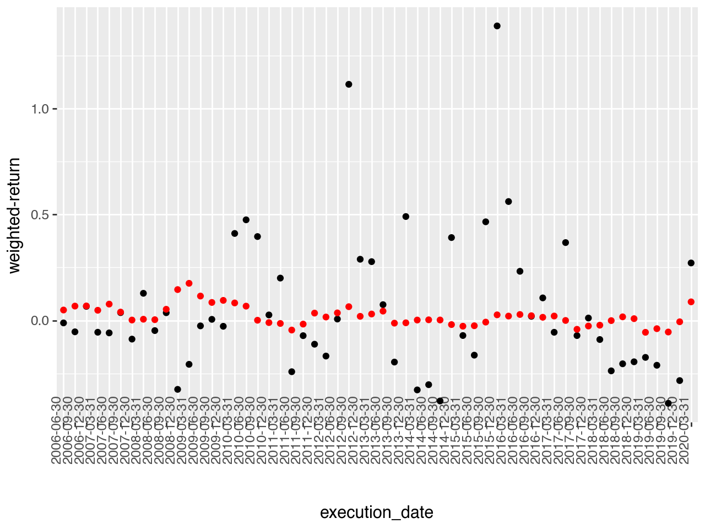
    


% de periodos en los que modelo es mejor que baseline:

```python
periods_better_than_baseline = len(test_results_final_tree[test_results_final_tree['weighted-return']>test_results_final_tree["diff_ch_sp500_baseline"]])/len(test_results_final_tree)
print(f"{periods_better_than_baseline *100:.2f}")
```

    35.71


El primer modelo tenia un % del 70%. Este valor se acerca mucho más a la realidad

Rendimiento de baseline vs modelo

```python
test_results_final_tree["weighted-return"].median()
```


    -0.026677532389133746


```python
test_results_final_tree["diff_ch_sp500_baseline"].median()
```


    0.015525563344158869


```python
test_results_final_tree["weighted-return"].mean()
```


    0.053507209868450825


```python
test_results_final_tree["diff_ch_sp500_baseline"].mean()
```


    0.022159133577893696


Modelo actual:

* Media del retorno es superior al baseline (0.05 vs 0.02). Es decir que el modelo obtiene un 5% de retorno.

* Sin embargo la mediana es menor, de hecho es negativa (-0.02 vs 0.01), esto nos indica que en al menos la mitad de los periodos vamos a perder dinero. Podemos interpretar estos resultados como que el modelo hace apuestas de empresas que van a mejorar al sp500 y normalmente no acierta, pero cuando acierta, obtiene mucho retorno, logrando que la media a lo largo de todos los periodos sea positiva y del 5%.

## Conclusiones

* Feature importance es útil para conocer que está utilizando el modelo para hacer sus predicciones, si las predicciones son malas nos da igual lo que este utilizando, hay que lograr primero un buen modelo.

* En modelos como este, que son complejos y hacen overfitting inicialmnete, hay que simplificar y a partir de ahi añadir capas de complejidad. Hay que probar hiperparametros, especialmente learning_rate, que controla la contribución de un arbol al siguiente.

* Metodos como feature permutation o SHAP son muy valiosos, ya que son agnosticos al modelo que utilicemos


